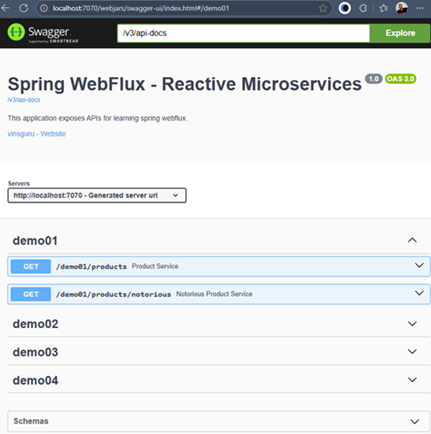
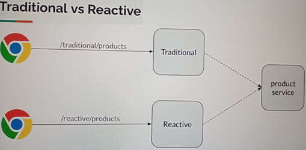

# ⚖️ Sección 02: Traditional vs Reactive APIs

---

## 🛠️ Creación del proyecto

Creamos el proyecto desde
[Spring Initializr](https://start.spring.io/#!type=maven-project&language=java&platformVersion=4.0.3&packaging=jar&configurationFileFormat=yaml&jvmVersion=25&groupId=dev.magadiflo&artifactId=webflux-playground&name=webflux-playground&description=Demo%20project%20for%20Spring%20Boot&packageName=dev.magadiflo.app&dependencies=webflux,data-r2dbc,h2,lombok)
con las siguientes dependencias:

````xml
<!--Spring Boot 4.0.3-->
<!--Java 25-->
<dependencies>
    <dependency>
        <groupId>org.springframework.boot</groupId>
        <artifactId>spring-boot-h2console</artifactId>
    </dependency>
    <dependency>
        <groupId>org.springframework.boot</groupId>
        <artifactId>spring-boot-starter-data-r2dbc</artifactId>
    </dependency>
    <dependency>
        <groupId>org.springframework.boot</groupId>
        <artifactId>spring-boot-starter-webflux</artifactId>
    </dependency>

    <dependency>
        <groupId>com.h2database</groupId>
        <artifactId>h2</artifactId>
        <scope>runtime</scope>
    </dependency>
    <dependency>
        <groupId>io.r2dbc</groupId>
        <artifactId>r2dbc-h2</artifactId>
        <scope>runtime</scope>
    </dependency>
    <dependency>
        <groupId>org.projectlombok</groupId>
        <artifactId>lombok</artifactId>
        <optional>true</optional>
    </dependency>
    <dependency>
        <groupId>org.springframework.boot</groupId>
        <artifactId>spring-boot-starter-data-r2dbc-test</artifactId>
        <scope>test</scope>
    </dependency>
    <dependency>
        <groupId>org.springframework.boot</groupId>
        <artifactId>spring-boot-starter-webflux-test</artifactId>
        <scope>test</scope>
    </dependency>
</dependencies>
````

## 🌍 Servicios externos

En esta sección vamos a entender la diferencia entre una `web tradicional` y una `web reactiva`.  
Para ello utilizaremos un servicio externo llamado `product-service`, empaquetado en un archivo `JAR` ubicado en
el path: `servers/external-services.jar`

Este servicio nos proporcionará una serie de **endpoints** que consumiremos desde nuestra aplicación.

### ▶️ Ejecución del servicio externo

Para ejecutar el servicio, nos posicionamos en la raíz del proyecto y ejecutamos:

````bash
D:\programming\spring\01.udemy\03.vinoth_selvaraj\spring-webflux-masterclass (feature/section-2)
$ java -jar .\servers\external-services.jar

  .   ____          _            __ _ _
 /\\ / ___'_ __ _ _(_)_ __  __ _ \ \ \ \
( ( )\___ | '_ | '_| | '_ \/ _` | \ \ \ \
 \\/  ___)| |_)| | | | | || (_| |  ) ) ) )
  '  |____| .__|_| |_|_| |_\__, | / / / /
 =========|_|==============|___/=/_/_/_/
 :: Spring Boot ::                (v3.2.0)

2026-03-12T11:13:19.615-05:00  INFO 3136 --- [           main] c.v.e.ExternalServicesApplication        : Starting ExternalServicesApplication v0.0.1-SNAPSHOT using Java 25.0.2 with PID 3136 (D:\programming\spring\01.udemy\03.vinoth_selvaraj\spring-webflux-masterclass\servers\external-services.jar started by magadiflo in D:\programming\spring\01.udemy\03.vinoth_selvaraj\spring-webflux-masterclass)
2026-03-12T11:13:19.620-05:00  INFO 3136 --- [           main] c.v.e.ExternalServicesApplication        : No active profile set, falling back to 1 default profile: "default"
WARNING: A terminally deprecated method in sun.misc.Unsafe has been called
WARNING: sun.misc.Unsafe::objectFieldOffset has been called by io.netty.util.internal.PlatformDependent0$4 (jar:nested:/D:/programming/spring/01.udemy/03.vinoth_selvaraj/spring-webflux-masterclass/servers/external-services.jar/!BOOT-INF/lib/netty-common-4.1.101.Final.jar!/)
WARNING: Please consider reporting this to the maintainers of class io.netty.util.internal.PlatformDependent0$4
WARNING: sun.misc.Unsafe::objectFieldOffset will be removed in a future release
2026-03-12T11:13:21.443-05:00  INFO 3136 --- [           main] o.s.b.web.embedded.netty.NettyWebServer  : Netty started on port 7070
2026-03-12T11:13:21.475-05:00  INFO 3136 --- [           main] c.v.e.ExternalServicesApplication        : Started ExternalServicesApplication in 2.269 seconds (process running for 2.731)
````

👉 Esto indica que el servicio externo está corriendo en el puerto `7070`.

### 🌐 Acceso al servicio

Una vez iniciado, podemos acceder desde el navegador a: http://localhost:7070



### ⚖️ Comparación: Web tradicional vs Web reactiva

Para visualizar la diferencia, desarrollaremos una aplicación sencilla con dos controladores:

- 🧩 `Controlador tradicional` → expone endpoints que consumen el `product-service` de manera `bloqueante`.
- ⚡ `Controlador reactivo` → expone endpoints que consumen el `product-service` de manera `no bloqueante`.



### 🔄 Flujo de ejecución

#### Petición tradicional

1. El cliente invoca el endpoint tradicional.
2. El controlador llama al servicio externo `product-service`.
3. El hilo queda bloqueado esperando la respuesta.
4. Una vez recibida, se devuelve al cliente.

#### Petición reactiva

1. El cliente invoca el endpoint reactivo.
2. El controlador llama al servicio externo `product-service` de forma no bloqueante.
3. El hilo se libera y puede atender otras peticiones mientras llega la respuesta.
4. Cuando la respuesta está lista, se envía al cliente de manera eficiente 🚀.

## ⚖️ API Tradicional vs API Reactivo

### 📦 Definición del modelo `Product`

Lo primero que haremos será definir un **record** en Java para representar los datos con los que trabajaremos:

````java
public record Product(Integer id,
                      String description,
                      Integer price) {
}
````

### 🧩 Controlador Tradicional

El controlador tradicional utiliza el nuevo cliente `RestClient` de Spring para consumir el servicio externo:
`http://localhost:7070/demo01/products`.

````java

@Slf4j
@RestController
@RequestMapping(path = "/traditional")
public class TraditionalWebController {

    private final RestClient restClient = RestClient.builder()
            .requestFactory(new JdkClientHttpRequestFactory()) // recomendado desde Spring Boot 3.4.x
            .baseUrl("http://localhost:7070")
            .build();

    @GetMapping(path = "/products")
    public ResponseEntity<List<Product>> getProducts() {
        List<Product> products = this.restClient.get()
                .uri("/demo01/products")
                .retrieve()
                .body(new ParameterizedTypeReference<>() {
                });

        log.info("respuesta recibida: {}", products);
        return ResponseEntity.ok(products);
    }
}
````

#### ✅ Puntos clave del controlador tradicional

- Uso de `RestClient` → reemplazo moderno de `RestTemplate`.
- `JdkClientHttpRequestFactory` → asegura el uso del cliente HTTP nativo de Java (`java.net.http.HttpClient`).
- `ParameterizedTypeReference` → necesario para deserializar listas genéricas (`List<Product>`).
- Logging con `@Slf4j` → útil para monitorear respuestas.

#### ✅ ¿Por qué usamos la configuración [.requestFactory(new JdkClientHttpRequestFactory())](https://docs.spring.io/spring-framework/reference/integration/rest-clients.html#rest-request-factories)?

El uso explícito de `JdkClientHttpRequestFactory` te asegura que estás usando el `cliente HTTP moderno de Java`, sin
depender de bibliotecas externas.

> A partir de `Spring Boot 3.4.x`, puedes configurar qué tecnología se usará para hacer las peticiones `HTTP` detrás del
> `RestClient`, usando `ClientRequestFactory`.
>
> Al definir explícitamente: `.requestFactory(new JdkClientHttpRequestFactory())`
> estamos indicando que se utilice el `HttpClient nativo de Java` (`java.net.http.HttpClient`), introducido desde
> `Java 11`. Con solo tener `Java 11` o superior (como en tu caso, `Java 25`), ya tienes disponible el módulo
> `java.net.http`, que incluye el `JDK HttpClient` moderno.
>
>🔍 Beneficios de usar `JdkClientHttpRequestFactory`
>
>- Cliente moderno, es no bloqueante a nivel de red (aunque RestClient sigue siendo de uso bloqueante en la lógica de
   negocio) y mantenido por el JDK.
>- Compatible con `Java 25` y versiones futuras.
>- Evita depender de clientes externos como Apache o Jetty.
>- Mejora la consistencia y el control sobre el comportamiento del cliente HTTP.
>- Evita que Spring use el `SimpleClientHttpRequestFactory` (fallback limitado) si no encuentra otras librerías en el
   classpath.
>
>🔁 ¿Qué pasa si no lo configuras `.requestFactory(...)`? Spring intenta seleccionar automáticamente un cliente en este
> orden:
>
>- `Apache HttpClient` o `Jetty` (si están en el `classpath`).
>- `JDK HttpClient` (`JdkClientHttpRequestFactory`) si el módulo `java.net.http` está presente.
>- `SimpleClientHttpRequestFactory` como último recurso (limitado y problemático en errores HTTP).

✅ Lo que estamos haciendo correctamente en nuestro controlador `TraditionalWebController`

- `Uso de RestClient`: Este nuevo cliente es más moderno y fluido que `RestTemplate`.
- `JdkClientHttpRequestFactory()`: Correctamente, estás usando el nuevo stack de HTTP de Java (`HttpClient` de Java 11+)
  como es recomendado desde `Spring Boot 3.4.x` en adelante.
- Manejo de genéricos con `ParameterizedTypeReference`: Necesario para poder deserializar correctamente listas de
  objetos `(List<Product>`).
- Uso de `@Slf4j` para logging: Muy útil para monitorear la ejecución y comparar con el controlador reactivo.

🔄 Qué esperar de este enfoque `tradicional`

- `Bloqueo de hilos`: Esta llamada bloquea el hilo mientras espera la respuesta del servidor externo.
- `Escalabilidad limitada`: Si haces muchas llamadas simultáneas, podrías saturar los hilos del pool del servidor.
- `Predecible y fácil de debuggear`: Es directo y más familiar para muchos desarrolladores.

### ⚡ Controlador Reactivo

Este controlador `ReactiveWebController` expone un endpoint reactivo `/reactive/products` que consume un servicio
externo ubicado en `http://localhost:7070/demo01/products`. Para ello utiliza el cliente `WebClient` de
`Spring WebFlux`, que es `no bloqueante` y está basado en `programación reactiva`.

El método `getProducts` realiza una llamada `GET` al servicio externo y obtiene un flujo reactivo (`Flux<Product>`)
con la lista de productos. Luego, este flujo se envuelve en un `Mono<ResponseEntity<Flux<Product>>>` para devolver
una respuesta `HTTP` con `status 200 OK` y el cuerpo reactivo.

El uso de `Mono.fromSupplier` asegura que la construcción del `ResponseEntity` se realice de `forma perezosa`,
es decir, solo cuando se suscriban al `Mono`, manteniendo la naturaleza reactiva del endpoint.

````java

@Slf4j
@RestController
@RequestMapping(path = "/reactive")
public class ReactiveWebController {

    private final WebClient webClient = WebClient.builder()
            .baseUrl("http://localhost:7070")
            .build();

    @GetMapping(path = "/products")
    public Mono<ResponseEntity<Flux<Product>>> getProducts() {
        Flux<Product> productFlux = this.webClient.get()
                .uri("/demo01/products")
                .retrieve()
                .bodyToFlux(Product.class)
                .doOnNext(product -> log.info("recibido: {}", product));

        return Mono.fromSupplier(() -> ResponseEntity.ok(productFlux));
    }
}
````

#### ✅ Puntos clave del controlador reactivo

- Uso de `WebClient` → cliente HTTP no bloqueante.
- `Flux<Product>` → flujo reactivo que representa múltiples elementos.
- `Mono<ResponseEntity<Flux<Product>>>` → respuesta HTTP con cuerpo reactivo.
- `Mono.fromSupplier` → construcción perezosa del ResponseEntity, ejecutada solo al suscribirse.
- `Logging` con `doOnNext` → permite inspeccionar cada elemento recibido.

### 📊 Comparación visual

| Aspecto         | Tradicional (RestClient)        | Reactivo (WebClient)                  |
|-----------------|---------------------------------|---------------------------------------|
| Cliente HTTP    | Bloqueante (`RestClient`)       | No bloqueante (`WebClient`)           |
| Tipo de retorno | `ResponseEntity<List<Product>>` | `Mono<ResponseEntity<Flux<Product>>>` |
| Escalabilidad   | Limitada por hilos              | Altamente escalable 🚀                |
| Naturaleza      | Síncrona                        | Asíncrona / Reactiva                  |

## 📦 Spring Scan Base Packages

Este apartado es un paréntesis antes de continuar con la ejecución y comprobación de resultados entre una
`API tradicional` y una `API reactiva`.

### 🗂️ Organización de paquetes

En nuestro proyecto `webflux-playground` organizaremos los paquetes siguiendo una secuencia basada en las secciones del
curso:

- `sec01`
- `sec02`
- `sec03`
- ...

Sin embargo, este enfoque puede generar **problemas de duplicidad de beans**. Por ejemplo:

- Cuando lleguemos a la `sec03` definiremos la entidad `Customer` y su repositorio `CustomerRepository`.
- Más adelante, en `sec05`, volvemos a definir otro `CustomerRepository`.
- Resultado: Spring detectará **múltiples definiciones del mismo bean** y la aplicación fallará al arrancar.

### 🛡️ Solución: Scan Base Packages

Para evitar conflictos, utilizaremos `Spring Scan Base Packages`, indicando explícitamente qué paquete debe escanear
Spring en cada ejecución.

````java

@EnableR2dbcRepositories(basePackages = "dev.magadiflo.app.${section}")
@SpringBootApplication(scanBasePackages = "dev.magadiflo.app.${section}")
public class WebfluxPlaygroundApplication {

    public static void main(String[] args) {
        SpringApplication.run(WebfluxPlaygroundApplication.class, args);
    }

}
````

#### 📒 `@SpringBootApplication(scanBasePackages = {...})`

La anotación `@SpringBootApplication` es una anotación compuesta que incluye:

- `@Configuration` → marca esta clase como clase de configuración de Spring.
- `@EnableAutoConfiguration` → habilita la configuración automática basada en dependencias presentes
- `@ComponentScan` → escanea los paquetes indicados en `scanBasePackages` para registrar componentes (`@Component`,
  `@Service`, `@Controller`, etc.).

👉 En lugar de escanear todos los paquetes del proyecto (lo cual es el comportamiento por defecto si no se especifica
nada), estamos limitando el escaneo solo a:

````bash
dev.magadiflo.app.${section}
````

De esta manera:

- Evitamos conflictos por definiciones duplicadas.
- Cargamos únicamente los beans de la sección activa definida en `application.yml`.

#### 📒 `@EnableR2dbcRepositories(basePackages = "...")`

Activa el escaneo de interfaces que extienden `ReactiveCrudRepository` o `R2dbcRepository`.
Esto permite que Spring registre los repositorios reactivos de la sección actual.

👉 Usando `${section}` como placeholder, delegamos al `application.yml` la definición dinámica del paquete a escanear.

#### 📝 Ejemplo en `application.yml`

````yml
section: sec02
````

Con esta configuración:

- Spring escaneará únicamente `dev.magadiflo.app.sec02`.
- Los repositorios y entidades de otras secciones no serán cargados.
- Podemos cambiar la sección activa sin modificar código Java, solo ajustando el `application.yml`.

### 💡 Beneficios de este enfoque

- ✅ `Modularidad`: cada sección del curso tiene sus propios beans.
- ✅ `Flexibilidad`: cambiar de sección es tan simple como modificar una propiedad en `application.yml`.
- ✅ `Robustez`: evitamos errores por duplicidad de repositorios o entidades.
- ✅ `Escalabilidad`: el proyecto se mantiene limpio y organizado a medida que avanzamos en el curso.

## ⚖️ API Tradicional vs API Reactivo - Demo

### 🚀 Preparación

Antes de ejecutar la demo debemos tener en cuenta dos puntos:

1. Definir en `application.yml` la sección activa:
   ```yml
   section: sec02
   ```
2. Levantar el servidor externo `product-service`, ya que nuestras pruebas consumirán sus endpoints.

### 🧱 Controlador tradicional

### 🔁 Escenario 01: Solicitud y espera de respuesta completa

En este escenario, realizamos una petición HTTP al controlador tradicional usando `RestClient`.
Este cliente `bloqueante` envía la solicitud y `espera recibir toda la respuesta` antes de continuar.

````bash
$ curl -v http://localhost:8080/traditional/products | jq
>
< HTTP/1.1 200 OK
< Content-Type: application/json
< Content-Length: 454
< 00:10   00:10
[
  {
    "id": 1,
    "description": "product-1",
    "price": 1
  },
  {...},
  {
    "id": 10,
    "description": "product-10",
    "price": 10
  }
]
````

📌 Resultado:

- El cliente recibe la lista completa de productos `después de 10 segundos`.
- En los logs de `webflux-playground`, la respuesta aparece toda junta:
    ````bash
    2026-03-12T12:52:50.832-05:00  INFO 14612 --- [webflux-playground] [ctor-http-nio-2] d.m.app.sec02.TraditionalWebController   : respuesta recibida: [Product[id=1, description=product-1, price=1], Product[id=2, description=product-2, price=2], Product[id=3, description=product-3, price=3], Product[id=4, description=product-4, price=4], Product[id=5, description=product-5, price=5], Product[id=6, description=product-6, price=6], Product[id=7, description=product-7, price=7], Product[id=8, description=product-8, price=8], Product[id=9, description=product-9, price=9], Product[id=10, description=product-10, price=10]]
    ````
- En los logs del servicio externo `product-service`, se observa que la operación tomó exactamente 10 segundos,
  desde que se recibió (`12:52:40`) hasta que se completó (`12:52:50`):
    ````bash
    2026-03-12T12:52:40.810-05:00  INFO 3136 --- [ctor-http-nio-8] c.v.e.sec01.controller.Transformer       : received /demo01/products
    2026-03-12T12:52:50.825-05:00  INFO 3136 --- [     parallel-4] c.v.e.sec01.controller.Transformer       : completed: /demo01/products
    ````

#### ✅ Conclusión

> - El controlador tradicional bloquea el hilo durante toda la duración de la solicitud.
> - El cliente no recibe nada hasta que todos los datos han sido recuperados, lo que puede generar `cuellos de botella`
    en escenarios de alta concurrencia.

### 🔁 Escenario 02: Cancelación de la petición tras cierto tiempo de espera

En este escenario, realizamos la misma petición pero cancelamos manualmente con `Ctrl+C` tras esperar `~5 segundos`:

````bash
$ curl -v http://localhost:8080/traditional/products | jq
* Host localhost:8080 was resolved.
* IPv6: ::1
* IPv4: 127.0.0.1
  % Total    % Received % Xferd  Average Speed  Time    Time    Time   Current
                                 Dload  Upload  Total   Spent   Left   Speed
  0      0   0      0   0      0      0      0                              0*   Trying [::1]:8080...
* Established connection to localhost (::1 port 8080) from ::1 port 60976
* using HTTP/1.x
> GET /traditional/products HTTP/1.1
> Host: localhost:8080
> User-Agent: curl/8.18.0
> Accept: */*
> 00:05              0^C^C
````

#### 📌 Observaciones:

- Aunque el cliente canceló la solicitud, el servicio externo continuó procesando durante los 10 segundos completos.
- Los logs del servicio externo muestran que la operación se completó normalmente, desde el inicio de la petición
  (`12:57:39`) hasta su finalización (`12:57:49`):
    ````bash
    2026-03-12T12:57:39.653-05:00  INFO 3136 --- [ctor-http-nio-1] c.v.e.sec01.controller.Transformer       : received /demo01/products
    2026-03-12T12:57:49.666-05:00  INFO 3136 --- [     parallel-2] c.v.e.sec01.controller.Transformer       : completed: /demo01/products
    ````
- En los logs del controlador tradicional `(webflux-playground)`, la respuesta se registró **a pesar de que el cliente
  ya no estaba esperando.**
    ````bash
    2026-03-12T12:57:49.669-05:00  INFO 14612 --- [webflux-playground] [ctor-http-nio-5] d.m.app.sec02.TraditionalWebController   : respuesta recibida: [Product[id=1, description=product-1, price=1], Product[id=2, description=product-2, price=2], Product[id=3, description=product-3, price=3], Product[id=4, description=product-4, price=4], Product[id=5, description=product-5, price=5], Product[id=6, description=product-6, price=6], Product[id=7, description=product-7, price=7], Product[id=8, description=product-8, price=8], Product[id=9, description=product-9, price=9], Product[id=10, description=product-10, price=10]]
    ````

#### ✅ Conclusión

> - En una arquitectura tradicional, el servidor continúa procesando la solicitud incluso si el cliente cancela la
    conexión.
> - Esto implica un `uso innecesario de recursos` si las operaciones no son cancelables o si no se implementa lógica de
    interrupción.

#### 📊 Comparación visual

````
Escenario 01 (Tradicional)
Cliente ----> Solicitud ----> Espera bloqueante ----> Respuesta completa (10s)

Escenario 02 (Tradicional con cancelación)
Cliente ----> Solicitud ----> Cancelación (5s)
Servidor ----> Sigue procesando ----> Respuesta generada (10s) 
````
