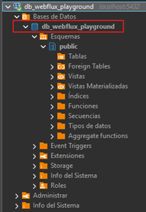
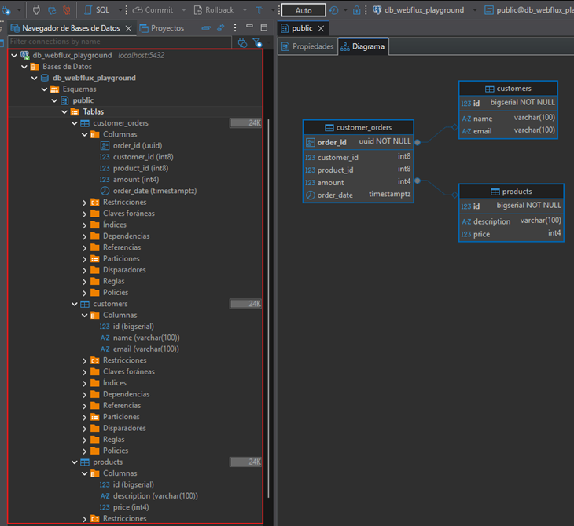

# 📂 Sección 03: Spring Data R2DBC

---

## ⚙️ Configuración inicial

- Creamos el directorio correspondiente a la sección `/sec03` en `webflux-playground`.
- En el archivo `application.yml` definimos la sección activa:
  ````yml
  section: sec03
  ````

---

## 📖 Introducción

`Spring Data R2DBC` forma parte de la familia `Spring Data` y facilita la implementación de repositorios basados
en `R2DBC`.

👉 `R2DBC` significa `Reactive Relational Database Connectivity`, una especificación para integrar bases de datos SQL
mediante drivers reactivos.

Con `Spring Data R2DBC` podemos aplicar las mismas abstracciones comunes de `Spring` (`repositorios`, `plantillas`,
`consultas derivadas`) pero en un contexto reactivo, lo que permite construir aplicaciones que combinan bases de datos
relacionales con la `programación reactiva`.

| Aspecto                        | JPA (Tradicional)                | R2DBC (Reactivo)                          |
|--------------------------------|----------------------------------|-------------------------------------------|
| Naturaleza                     | Bloqueante                       | No bloqueante 🚀                          |
| Especificación                 | Java Persistence API             | Reactive Relational Database Connectivity |
| Compatibilidad                 | Programación síncrona            | Programación reactiva                     |
| Relaciones complejas           | Sí (`@OneToMany`, `@ManyToMany`) | ❌ No soportadas                           |
| Streaming de datos             | Limitado                         | ✅ Nativo                                  |
| Contrapresión (*backpressure*) | No aplica                        | ✅ Soportada                               |
| Rendimiento y escalabilidad    | Limitada por hilos               | Alta eficiencia en concurrencia           |

### 📌 Conclusión:

- `JPA` y `R2DBC` no son compatibles ni intercambiables.
- `R2DBC` sí admite el `mapeo básico` de entidades, pero no es compatible con todas las características avanzadas
  que Hibernate proporciona en el contexto de JPA.
- `R2DBC` prioriza `rendimiento`, `escalabilidad` y `streaming`, sacrificando algunas características avanzadas de
  JPA (como relaciones complejas).

### ✨ Características de Spring Data R2DBC

- API funcional y reactiva.
- API de plantillas mediante `R2dbcEntityTemplate`.
- Compatibilidad con múltiples bases de datos:
    - `H2`, `MariaDB`, `Microsoft SQL Server`, `MySQL`, `jasync-sql MySQL`, `Postgres` y `Oracle`.
- Ejecución de sentencias para entidades mapeadas mediante la `API Criteria`, construida sobre `DatabaseClient`.
- Enlace de parámetros con sintaxis nativa.
- Consumo de resultados:
    - Conteo de actualizaciones.
    - Mapas `(Map<String,Object>)`.
    - Entidades mapeadas.
    - Funciones de extracción.
- Repositorios reactivos con soporte para:
    - Métodos anotados con `@Query`.
    - Derivación automática de consultas.

### ✅ Conclusión de la introducción

- `Spring Data R2DBC` nos permite trabajar con bases de datos relacionales en un entorno `reactivo`.
- Es ideal para aplicaciones que requieren `alta concurrencia` y `flujo de datos en tiempo real`.
- Aunque no reemplaza a `JPA`, se convierte en la opción adecuada cuando buscamos eficiencia y escalabilidad en
  arquitecturas modernas.

## 🔗 Cadena de conexión en R2DBC

En la primera versión de nuestra aplicación `webflux-playground` utilizamos la base de datos **H2 en memoria**.  
Gracias a la **autoconfiguración de Spring Boot**, no fue necesario definir parámetros de conexión: al detectar `H2`,
Spring crea automáticamente una base de datos embebida.

👉 Ahora reemplazaremos **H2** por `PostgreSQL`, lo que implica configurar explícitamente la conexión.

### ⚙️ Dependencias en `pom.xml`

Para trabajar con `PostgreSQL` en modo reactivo, debemos agregar la dependencia `r2dbc-postgresql` y eliminar la de
`H2`. Esto lo hicimos desde
[Spring Initializr](https://start.spring.io/#!type=maven-project&language=java&platformVersion=4.0.3&packaging=jar&configurationFileFormat=yaml&jvmVersion=25&groupId=dev.magadiflo&artifactId=webflux-playground&packageName=dev.magadiflo.app&dependencies=webflux,data-r2dbc,lombok,postgresql),
seleccionando `PostgreSQL` y quitando `H2`.

Así queda nuestro `pom.xml`:

````xml

<!--Spring Boot 4.0.3-->
<!--Java 25-->
<dependencies>
    <dependency>
        <groupId>org.springframework.boot</groupId>
        <artifactId>spring-boot-starter-data-r2dbc</artifactId>
    </dependency>
    <dependency>
        <groupId>org.springframework.boot</groupId>
        <artifactId>spring-boot-starter-webflux</artifactId>
    </dependency>

    <dependency>
        <groupId>org.postgresql</groupId>
        <artifactId>postgresql</artifactId>
        <scope>runtime</scope>
    </dependency>
    <dependency>
        <groupId>org.postgresql</groupId>
        <artifactId>r2dbc-postgresql</artifactId>
        <scope>runtime</scope>
    </dependency>
    <dependency>
        <groupId>org.projectlombok</groupId>
        <artifactId>lombok</artifactId>
        <optional>true</optional>
    </dependency>
    <dependency>
        <groupId>org.springframework.boot</groupId>
        <artifactId>spring-boot-starter-data-r2dbc-test</artifactId>
        <scope>test</scope>
    </dependency>
    <dependency>
        <groupId>org.springframework.boot</groupId>
        <artifactId>spring-boot-starter-webflux-test</artifactId>
        <scope>test</scope>
    </dependency>
</dependencies>
````

### ⚠️ Error esperado sin configuración

A diferencia de `H2`, `PostgreSQL` `sí requiere parámetros de conexión`. Si no configuramos la cadena de conexión,
al ejecutar la aplicación obtendremos un error como este:

````bash
Error starting ApplicationContext. To display the condition evaluation report re-run your application with 'debug' enabled.
2026-03-16T11:03:52.720-05:00 ERROR 12148 --- [webflux-playground] [           main] o.s.b.d.LoggingFailureAnalysisReporter   : 

***************************
APPLICATION FAILED TO START
***************************

Description:

Failed to configure a ConnectionFactory: 'url' attribute is not specified and no embedded database could be configured.

Reason: Failed to determine a suitable R2DBC Connection URL


Action:

Consider the following:
	If you want an embedded database (H2), please put it on the classpath.
	If you have database settings to be loaded from a particular profile you may need to activate it (no profiles are currently active).
````

📌 Conclusión parcial:

- Con `H2`, Spring Boot aplica autoconfiguración automática.
- Con `PostgreSQL`, debemos definir explícitamente la `cadena de conexión R2DBC` en `application.yml`.

### 🔗 Configuración de la cadena de conexión R2DBC

Para que nuestra aplicación funcione correctamente con `PostgreSQL` (u otras bases de datos distintas a H2),
debemos definir explícitamente la cadena de conexión en `application.yml`:

````yml
spring:
  r2dbc:
    url: r2dbc:postgresql://localhost:5432/db_webflux_playground
    username: postgres
    password: magadiflo
````

### 📒 Configuración completa

Además de la cadena de conexión, podemos complementar con ajustes adicionales como el puerto de la aplicación, mensajes
de error y logging de consultas SQL:

````yml
server:
  port: 8080
  error:
    include-message: always

spring:
  application:
    name: webflux-playground
  r2dbc:
    url: r2dbc:postgresql://localhost:5432/db_webflux_playground
    username: postgres
    password: magadiflo

logging:
  level:
    io.r2dbc.postgresql.QUERY: debug
    io.r2dbc.postgresql.PARAM: debug

section: sec03
````

### 🗄️ Creación de la base de datos

Antes de ejecutar la aplicación, debemos crear la base de datos `db_webflux_playground` en `PostgreSQL`:



### ▶️ Ejecución

Con la base de datos creada y la configuración aplicada, al iniciar la aplicación ya no veremos el error de conexión.
Los logs mostrarán el arranque exitoso de Spring Boot y la inicialización de los repositorios `R2DBC`:

````bash
  .   ____          _            __ _ _
 /\\ / ___'_ __ _ _(_)_ __  __ _ \ \ \ \
( ( )\___ | '_ | '_| | '_ \/ _` | \ \ \ \
 \\/  ___)| |_)| | | | | || (_| |  ) ) ) )
  '  |____| .__|_| |_|_| |_\__, | / / / /
 =========|_|==============|___/=/_/_/_/

 :: Spring Boot ::                (v4.0.3)

2026-03-16T11:12:10.871-05:00  INFO 9116 --- [webflux-playground] [           main] d.m.app.WebfluxPlaygroundApplication     : Starting WebfluxPlaygroundApplication using Java 25.0.2 with PID 9116 (D:\programming\spring\01.udemy\03.vinoth_selvaraj\spring-webflux-masterclass\projects\webflux-playground\target\classes started by magadiflo in D:\programming\spring\01.udemy\03.vinoth_selvaraj\spring-webflux-masterclass)
2026-03-16T11:12:10.879-05:00  INFO 9116 --- [webflux-playground] [           main] d.m.app.WebfluxPlaygroundApplication     : No active profile set, falling back to 1 default profile: "default"
2026-03-16T11:12:11.298-05:00  INFO 9116 --- [webflux-playground] [           main] .s.d.r.c.RepositoryConfigurationDelegate : Bootstrapping Spring Data R2DBC repositories in DEFAULT mode.
2026-03-16T11:12:11.310-05:00  INFO 9116 --- [webflux-playground] [           main] .s.d.r.c.RepositoryConfigurationDelegate : Finished Spring Data repository scanning in 4 ms. Found 0 R2DBC repository interfaces.
2026-03-16T11:12:11.459-05:00  INFO 9116 --- [webflux-playground] [           main] .s.d.r.c.RepositoryConfigurationDelegate : Bootstrapping Spring Data R2DBC repositories in DEFAULT mode.
2026-03-16T11:12:11.504-05:00  INFO 9116 --- [webflux-playground] [           main] .s.d.r.c.RepositoryConfigurationDelegate : Finished Spring Data repository scanning in 42 ms. Found 0 R2DBC repository interfaces.
2026-03-16T11:12:12.699-05:00  INFO 9116 --- [webflux-playground] [           main] o.s.boot.reactor.netty.NettyWebServer    : Netty started on port 8080 (http)
2026-03-16T11:12:12.704-05:00  INFO 9116 --- [webflux-playground] [           main] d.m.app.WebfluxPlaygroundApplication     : Started WebfluxPlaygroundApplication in 2.502 seconds (process running for 3.398)
````

### ⚠️ Nota: URLs de conexión para otras bases de datos

- **H2 (memoria, autoconfigurado):** `r2dbc:h2:mem:///db_webflux_playground`
- **PostgreSQL:** `r2dbc:postgresql://localhost:5432/db_webflux_playground`
- **MySQL:** `r2dbc:mysql://localhost:3306/db_webflux_playground`

### ✅ Conclusión

- Con H2, Spring Boot aplica autoconfiguración automática.
- Con PostgreSQL (y otras bases externas), debemos definir explícitamente la cadena de conexión R2DBC.
- El logging adicional nos permite visualizar las consultas SQL y sus parámetros, lo cual es muy útil para depuración y
  aprendizaje.

## 🗄️ Scripts de inicialización de bases de datos

### 📂 Ubicación del archivo

Creamos el archivo `schema.sql` en la ruta: `src/main/resources/sql/schema.sql`. Este archivo contendrá las
instrucciones SQL necesarias para crear las tablas y cargar datos iniciales.

### 🧹 Reinicio limpio

Como la aplicación `webflux-playground` se reiniciará constantemente durante el desarrollo, incluimos sentencias `DROP`
para eliminar las tablas si existen.

👉 Esto garantiza que siempre iniciemos desde cero y evita conflictos por estructuras previas.

### 🧩 Definición de tablas

````sql
DROP TABLE IF EXISTS customer_orders;
DROP TABLE IF EXISTS customers;
DROP TABLE IF EXISTS products;

CREATE TABLE customers
(
    id    BIGSERIAL PRIMARY KEY,
    name  VARCHAR(100),
    email VARCHAR(100)
);

CREATE TABLE products
(
    id          BIGSERIAL PRIMARY KEY,
    description VARCHAR(100),
    price       INTEGER
);

CREATE TABLE customer_orders
(
    order_id    UUID                     DEFAULT GEN_RANDOM_UUID() PRIMARY KEY,
    customer_id BIGINT,
    product_id  BIGINT,
    amount      INTEGER,
    order_date  TIMESTAMP WITH TIME ZONE DEFAULT CURRENT_TIMESTAMP,
    FOREIGN KEY (customer_id) REFERENCES customers (id) ON DELETE CASCADE,
    FOREIGN KEY (product_id) REFERENCES products (id)
);
````

📌 Notas:

- `BIGSERIAL` `genera automáticamente` valores `incrementales` para las `claves primarias`.
- `UUID` con `GEN_RANDOM_UUID()` asegura identificadores únicos para las órdenes.
- La relación `ON DELETE CASCADE` en `customer_orders` elimina automáticamente las órdenes si se borra el cliente.

### 📥 Datos iniciales

````sql
INSERT INTO customers(name, email)
VALUES ('sam', 'sam@gmail.com'),
       ('mike', 'mike@gmail.com'),
       ('jake', 'jake@gmail.com'),
       ('emily', 'emily@example.com'),
       ('sophia', 'sophia@example.com'),
       ('liam', 'liam@example.com'),
       ('olivia', 'olivia@example.com'),
       ('noah', 'noah@example.com'),
       ('ava', 'ava@example.com'),
       ('ethan', 'ethan@example.com');

INSERT INTO products(description, price)
VALUES ('iphone 20', 1000),
       ('iphone 18', 750),
       ('ipad', 800),
       ('mac pro', 3000),
       ('apple watch', 400),
       ('macbook air', 1200),
       ('airpods pro', 250),
       ('imac', 2000),
       ('apple tv', 200),
       ('homepod', 300);

-- Order 1: sam buys an iphone 20 & iphone 18
INSERT INTO customer_orders(customer_id, product_id, amount, order_date)
VALUES (1, 1, 950, CURRENT_TIMESTAMP),
       (1, 2, 850, CURRENT_TIMESTAMP);

-- Order 2: mike buys an iphone 20 and mac pro
INSERT INTO customer_orders(customer_id, product_id, amount, order_date)
VALUES (2, 1, 975, CURRENT_TIMESTAMP),
       (2, 4, 2999, CURRENT_TIMESTAMP);

-- Order 3: jake buys an iphone 18 & ipad
INSERT INTO customer_orders(customer_id, product_id, amount, order_date)
VALUES (3, 2, 750, CURRENT_TIMESTAMP),
       (3, 2, 775, CURRENT_TIMESTAMP);
````

### ✅ Conclusión

- Con este script, cada reinicio de la aplicación asegura un esquema limpio y datos consistentes.
- Nos permite probar consultas y repositorios reactivos sin depender de datos externos.
- Es una práctica recomendada en entornos de desarrollo y aprendizaje para mantener control sobre el estado de la base.

## ⚙️ Inicialización de la base de datos en aplicaciones Spring WebFlux con R2DBC

En aplicaciones que utilizan **Spring WebFlux con R2DBC**, los archivos `schema.sql` y `data.sql` **no se ejecutan
automáticamente**, a diferencia de las aplicaciones basadas en JDBC.

👉 Para solventar esto, debemos definir manualmente una configuración que ejecute estos scripts al iniciar
la aplicación.

### 🧩 Configuración con `ConnectionFactoryInitializer`

Creamos una clase de configuración llamada `DatabaseInitConfig` que define un **bean** `ConnectionFactoryInitializer`.  
Este bean se encarga de ejecutar los archivos SQL de creación de tablas (`schema.sql`) y de inserción de datos
(`data.sql`) al iniciar la aplicación:

````java

@Configuration
public class DatabaseInitConfig {
    @Bean
    public ConnectionFactoryInitializer initializer(ConnectionFactory connectionFactory) {
        Resource shema = new ClassPathResource("sql/schema.sql");
        Resource data = new ClassPathResource("sql/data.sql");
        DatabasePopulator databasePopulator = new ResourceDatabasePopulator(shema, data);

        ConnectionFactoryInitializer initializer = new ConnectionFactoryInitializer();
        initializer.setConnectionFactory(connectionFactory);
        initializer.setDatabasePopulator(databasePopulator);

        return initializer;
    }
}
````

### 📂 Escaneo de paquetes

Para que Spring detecte esta configuración, debemos incluir el paquete donde se encuentra `DatabaseInitConfig` en el
`scanBasePackages` de nuestra aplicación principal:

````java

@EnableR2dbcRepositories(basePackages = "dev.magadiflo.app.${section}")
@SpringBootApplication(scanBasePackages = {"dev.magadiflo.app.config", "dev.magadiflo.app.${section}"})
public class WebfluxPlaygroundApplication {

    public static void main(String[] args) {
        SpringApplication.run(WebfluxPlaygroundApplication.class, args);
    }

}
````

### ✅ Conclusión

- Con `JDBC`, Spring Boot ejecuta automáticamente `schema.sql` y `data.sql`.
- Con `R2DBC`, debemos configurar manualmente la inicialización mediante `ConnectionFactoryInitializer`.
- Gracias a esta configuración, la base de datos se crea y se puebla con datos iniciales cada vez que se inicia la
  aplicación, lo cual es especialmente útil en entornos de desarrollo y pruebas.

## ▶️ Ejecutando la aplicación con inicialización automática

Gracias a la configuración con `ConnectionFactoryInitializer`, al iniciar la aplicación los scripts `schema.sql` y
`data.sql` se ejecutan automáticamente. Esto asegura que las tablas se creen y se poblen con datos iniciales en cada
arranque.

### 🧩 Evidencia en logs

Al ejecutar la aplicación, los logs muestran claramente la ejecución de los scripts:

````bash
  .   ____          _            __ _ _
 /\\ / ___'_ __ _ _(_)_ __  __ _ \ \ \ \
( ( )\___ | '_ | '_| | '_ \/ _` | \ \ \ \
 \\/  ___)| |_)| | | | | || (_| |  ) ) ) )
  '  |____| .__|_| |_|_| |_\__, | / / / /
 =========|_|==============|___/=/_/_/_/

 :: Spring Boot ::                (v4.0.3)

2026-03-16T12:06:41.977-05:00  INFO 13032 --- [webflux-playground] [           main] d.m.app.WebfluxPlaygroundApplication     : Starting WebfluxPlaygroundApplication using Java 25.0.2 with PID 13032 (D:\programming\spring\01.udemy\03.vinoth_selvaraj\spring-webflux-masterclass\projects\webflux-playground\target\classes started by magadiflo in D:\programming\spring\01.udemy\03.vinoth_selvaraj\spring-webflux-masterclass)
2026-03-16T12:06:41.984-05:00  INFO 13032 --- [webflux-playground] [           main] d.m.app.WebfluxPlaygroundApplication     : No active profile set, falling back to 1 default profile: "default"
2026-03-16T12:06:42.329-05:00  INFO 13032 --- [webflux-playground] [           main] .s.d.r.c.RepositoryConfigurationDelegate : Bootstrapping Spring Data R2DBC repositories in DEFAULT mode.
2026-03-16T12:06:42.340-05:00  INFO 13032 --- [webflux-playground] [           main] .s.d.r.c.RepositoryConfigurationDelegate : Finished Spring Data repository scanning in 4 ms. Found 0 R2DBC repository interfaces.
2026-03-16T12:06:42.474-05:00  INFO 13032 --- [webflux-playground] [           main] .s.d.r.c.RepositoryConfigurationDelegate : Bootstrapping Spring Data R2DBC repositories in DEFAULT mode.
2026-03-16T12:06:42.498-05:00  INFO 13032 --- [webflux-playground] [           main] .s.d.r.c.RepositoryConfigurationDelegate : Finished Spring Data repository scanning in 22 ms. Found 0 R2DBC repository interfaces.
2026-03-16T12:06:43.634-05:00 DEBUG 13032 --- [webflux-playground] [actor-tcp-nio-1] io.r2dbc.postgresql.QUERY                : Executing query: SHOW TRANSACTION ISOLATION LEVEL
2026-03-16T12:06:43.645-05:00 DEBUG 13032 --- [webflux-playground] [actor-tcp-nio-1] io.r2dbc.postgresql.QUERY                : Executing query: SELECT oid, * FROM pg_catalog.pg_type WHERE typname IN ('hstore','geometry','vector')
2026-03-16T12:06:43.698-05:00 DEBUG 13032 --- [webflux-playground] [nocuousThread-7] io.r2dbc.postgresql.QUERY                : Executing query: DROP TABLE IF EXISTS customer_orders
2026-03-16T12:06:43.709-05:00 DEBUG 13032 --- [webflux-playground] [actor-tcp-nio-1] io.r2dbc.postgresql.QUERY                : Executing query: DROP TABLE IF EXISTS customers
2026-03-16T12:06:43.710-05:00 DEBUG 13032 --- [webflux-playground] [actor-tcp-nio-1] io.r2dbc.postgresql.QUERY                : Executing query: DROP TABLE IF EXISTS products
2026-03-16T12:06:43.711-05:00 DEBUG 13032 --- [webflux-playground] [actor-tcp-nio-1] io.r2dbc.postgresql.QUERY                : Executing query: CREATE TABLE customers( id BIGSERIAL PRIMARY KEY, name VARCHAR(100), email VARCHAR(100) )
2026-03-16T12:06:43.813-05:00 DEBUG 13032 --- [webflux-playground] [actor-tcp-nio-1] io.r2dbc.postgresql.QUERY                : Executing query: CREATE TABLE products( id BIGSERIAL PRIMARY KEY, description VARCHAR(100), price INTEGER )
2026-03-16T12:06:43.814-05:00 DEBUG 13032 --- [webflux-playground] [actor-tcp-nio-3] io.r2dbc.postgresql.QUERY                : Executing query: SHOW TRANSACTION ISOLATION LEVEL
2026-03-16T12:06:43.815-05:00 DEBUG 13032 --- [webflux-playground] [actor-tcp-nio-3] io.r2dbc.postgresql.QUERY                : Executing query: SELECT oid, * FROM pg_catalog.pg_type WHERE typname IN ('hstore','geometry','vector')
2026-03-16T12:06:43.818-05:00 DEBUG 13032 --- [webflux-playground] [actor-tcp-nio-1] io.r2dbc.postgresql.QUERY                : Executing query: CREATE TABLE customer_orders( order_id UUID DEFAULT GEN_RANDOM_UUID() PRIMARY KEY, customer_id BIGINT, product_id BIGINT, amount INTEGER, order_date TIMESTAMP WITH TIME ZONE DEFAULT CURRENT_TIMESTAMP, FOREIGN KEY (customer_id) REFERENCES customers (id) ON DELETE CASCADE, FOREIGN KEY (product_id) REFERENCES products (id) )
2026-03-16T12:06:43.837-05:00 DEBUG 13032 --- [webflux-playground] [nocuousThread-9] io.r2dbc.postgresql.QUERY                : Executing query: INSERT INTO customers(name, email) VALUES ('sam', 'sam@gmail.com'), ('mike', 'mike@gmail.com'), ('jake', 'jake@gmail.com'), ('emily', 'emily@example.com'), ('sophia', 'sophia@example.com'), ('liam', 'liam@example.com'), ('olivia', 'olivia@example.com'), ('noah', 'noah@example.com'), ('ava', 'ava@example.com'), ('ethan', 'ethan@example.com')
2026-03-16T12:06:43.841-05:00 DEBUG 13032 --- [webflux-playground] [actor-tcp-nio-1] io.r2dbc.postgresql.QUERY                : Executing query: INSERT INTO products(description, price) VALUES ('iphone 20', 1000), ('iphone 18', 750), ('ipad', 800), ('mac pro', 3000), ('apple watch', 400), ('macbook air', 1200), ('airpods pro', 250), ('imac', 2000), ('apple tv', 200), ('homepod', 300)
2026-03-16T12:06:43.844-05:00 DEBUG 13032 --- [webflux-playground] [actor-tcp-nio-1] io.r2dbc.postgresql.QUERY                : Executing query: INSERT INTO customer_orders(customer_id, product_id, amount, order_date) VALUES (1, 1, 950, CURRENT_TIMESTAMP), (1, 2, 850, CURRENT_TIMESTAMP)
2026-03-16T12:06:43.849-05:00 DEBUG 13032 --- [webflux-playground] [actor-tcp-nio-1] io.r2dbc.postgresql.QUERY                : Executing query: INSERT INTO customer_orders(customer_id, product_id, amount, order_date) VALUES (2, 1, 975, CURRENT_TIMESTAMP), (2, 4, 2999, CURRENT_TIMESTAMP)
2026-03-16T12:06:43.851-05:00 DEBUG 13032 --- [webflux-playground] [actor-tcp-nio-1] io.r2dbc.postgresql.QUERY                : Executing query: INSERT INTO customer_orders(customer_id, product_id, amount, order_date) VALUES (3, 2, 750, CURRENT_TIMESTAMP), (3, 2, 775, CURRENT_TIMESTAMP)
2026-03-16T12:06:43.884-05:00 DEBUG 13032 --- [webflux-playground] [actor-tcp-nio-5] io.r2dbc.postgresql.QUERY                : Executing query: SHOW TRANSACTION ISOLATION LEVEL
2026-03-16T12:06:43.886-05:00 DEBUG 13032 --- [webflux-playground] [actor-tcp-nio-5] io.r2dbc.postgresql.QUERY                : Executing query: SELECT oid, * FROM pg_catalog.pg_type WHERE typname IN ('hstore','geometry','vector')
2026-03-16T12:06:44.051-05:00 DEBUG 13032 --- [webflux-playground] [actor-tcp-nio-7] io.r2dbc.postgresql.QUERY                : Executing query: SHOW TRANSACTION ISOLATION LEVEL
2026-03-16T12:06:44.053-05:00 DEBUG 13032 --- [webflux-playground] [actor-tcp-nio-7] io.r2dbc.postgresql.QUERY                : Executing query: SELECT oid, * FROM pg_catalog.pg_type WHERE typname IN ('hstore','geometry','vector')
2026-03-16T12:06:44.226-05:00 DEBUG 13032 --- [webflux-playground] [actor-tcp-nio-1] io.r2dbc.postgresql.QUERY                : Executing query: SHOW TRANSACTION ISOLATION LEVEL
2026-03-16T12:06:44.227-05:00 DEBUG 13032 --- [webflux-playground] [actor-tcp-nio-1] io.r2dbc.postgresql.QUERY                : Executing query: SELECT oid, * FROM pg_catalog.pg_type WHERE typname IN ('hstore','geometry','vector')
2026-03-16T12:06:44.283-05:00  INFO 13032 --- [webflux-playground] [           main] o.s.boot.reactor.netty.NettyWebServer    : Netty started on port 8080 (http)
2026-03-16T12:06:44.289-05:00  INFO 13032 --- [webflux-playground] [           main] d.m.app.WebfluxPlaygroundApplication     : Started WebfluxPlaygroundApplication in 2.884 seconds (process running for 3.61)
````

📌 Esto confirma que:

- Las tablas se eliminan si existen `(DROP TABLE)`.
- Se vuelven a crear `(CREATE TABLE)`.
- Se insertan los datos iniciales `(INSERT INTO)`.

### 🗄️ Verificación en la base de datos

Si revisamos directamente en `PostgreSQL`, veremos que las tablas `customers`, `products` y `customer_orders` están
creadas y pobladas con los datos definidos en los scripts.



### ✅ Conclusión

- La inicialización automática con `ConnectionFactoryInitializer` funciona correctamente.
- Cada vez que reiniciamos la aplicación, la base de datos se reconstruye y se carga con datos de prueba.
- Esto es especialmente útil en entornos de desarrollo y pruebas, ya que garantiza consistencia y evita errores por
  estados previos de la base.

## 👤 Customer: Entidad y repositorio

### 🧩 Entidad `Customer`

En `R2DBC` no utilizamos la anotación `@Entity` como en `JPA`. Podemos usar `@Table` y `@Column` para personalizar
el mapeo, aunque no son estrictamente necesarios.

````java
/*
No tenemos @Entity en R2DBC.
@Table y @Column no son realmente necesarios aquí, pero si queremos personalizar un poco sí podríamos agregarlos.
 */
@ToString
@AllArgsConstructor
@NoArgsConstructor
@Builder
@Setter
@Getter
@Table(name = "customers")
public class Customer {
    @Id
    private Long id;
    private String name;
    private String email;
}
````

📌 Notas:

- `@Id` indica la clave primaria.
- `@Table(name = "customers")` asegura que la entidad se mapee a la tabla correcta.
- `Lombok (@Getter, @Setter, @Builder, etc.)` simplifica la creación de métodos y constructores.

### 📂 Repositorio CustomerRepository

Creamos un repositorio que extiende de `ReactiveCrudRepository`, lo que nos da acceso a operaciones CRUD reactivas:

````java
public interface CustomerRepository extends ReactiveCrudRepository<Customer, Long> {
}
````

👉 Con esto ya podemos realizar operaciones como `findAll()`, `findById()`, `save()`, `deleteById()`, etc., de manera
reactiva.

### 🧪 Preparando pruebas

Para probar nuestra aplicación, creamos una clase abstracta de test que servirá como base para las pruebas de esta
sección:

````java

@SpringBootTest
abstract class AbstractTest {
}
````

📌 Notas:

- `@SpringBootTest` levanta el contexto completo de Spring Boot.
- Esta clase abstracta será extendida por otras clases de prueba específicas (ej. `CustomerRepositoryTest`).
- Nos permite mantener una estructura ordenada y reutilizable en los tests.

### ✅ Conclusión

- Hemos creado la primera entidad `(Customer)` y su repositorio reactivo.
- Con `ReactiveCrudRepository` tenemos acceso inmediato a operaciones CRUD en modo no bloqueante.
- La clase `AbstractTest` nos prepara para escribir pruebas unitarias y de integración en esta sección.

## 🛠️ CRUD usando Repository - Parte 1

### 📂 Métodos personalizados en `CustomerRepository`

Además de las operaciones básicas que nos da `ReactiveCrudRepository`, podemos definir `Query Methods` para consultas
específicas.

En este caso, agregamos dos métodos personalizados:

````java
public interface CustomerRepository extends ReactiveCrudRepository<Customer, Long> {
    Flux<Customer> findByName(String name);

    Flux<Customer> findByEmailEndingWith(String emailEnding);
}
````

📌 Notas:

- `findByName(String name)` → devuelve todos los clientes con ese nombre.
- `findByEmailEndingWith(String emailEnding)` → devuelve clientes cuyo email termina con el sufijo indicado.
- Los métodos siguen la convención de nombres de `Spring Data`, que automáticamente genera la consulta SQL
  correspondiente.

### 🧪 Prueba inicial: findAll()

Creamos la clase de prueba `Lec01CustomerRepositoryTest` en el paquete `src/test/java/dev/magadiflo/app/sec03`.
Esta clase extiende de `AbstractTest` para aprovechar la configuración común.

````java

@Slf4j
class Lec01CustomerRepositoryTest extends AbstractTest {

    @Autowired
    private CustomerRepository repository;

    @Test
    void findAll() {
        this.repository.findAll()
                .doOnNext(customer -> log.info("{}", customer))
                .as(StepVerifier::create)
                .expectNextCount(10)
                .verifyComplete();
    }
}
````

📌 Notas:

- `StepVerifier` se usa para probar flujos reactivos.
- `expectNextCount(10)` valida que se reciban los 10 clientes insertados en el `data.sql`.
- `doOnNext(...)` imprime cada cliente en el log, lo que nos ayuda a verificar visualmente los resultados.

### ▶️ Ejecución del test

Al ejecutar la prueba, vemos que pasa correctamente y además se imprimen los clientes en el log:

````bash
2026-03-16T12:37:51.257-05:00 DEBUG 1776 --- [webflux-playground] [actor-tcp-nio-3] io.r2dbc.postgresql.QUERY                : Executing query: SELECT "customers".* FROM "customers"
2026-03-16T12:37:51.292-05:00  INFO 1776 --- [webflux-playground] [actor-tcp-nio-3] d.m.a.sec03.Lec01CustomerRepositoryTest  : Customer(id=1, name=sam, email=sam@gmail.com)
2026-03-16T12:37:51.293-05:00  INFO 1776 --- [webflux-playground] [actor-tcp-nio-3] d.m.a.sec03.Lec01CustomerRepositoryTest  : Customer(id=2, name=mike, email=mike@gmail.com)
2026-03-16T12:37:51.294-05:00  INFO 1776 --- [webflux-playground] [actor-tcp-nio-3] d.m.a.sec03.Lec01CustomerRepositoryTest  : Customer(id=3, name=jake, email=jake@gmail.com)
2026-03-16T12:37:51.295-05:00  INFO 1776 --- [webflux-playground] [actor-tcp-nio-3] d.m.a.sec03.Lec01CustomerRepositoryTest  : Customer(id=4, name=emily, email=emily@example.com)
2026-03-16T12:37:51.295-05:00  INFO 1776 --- [webflux-playground] [actor-tcp-nio-3] d.m.a.sec03.Lec01CustomerRepositoryTest  : Customer(id=5, name=sophia, email=sophia@example.com)
2026-03-16T12:37:51.296-05:00  INFO 1776 --- [webflux-playground] [actor-tcp-nio-3] d.m.a.sec03.Lec01CustomerRepositoryTest  : Customer(id=6, name=liam, email=liam@example.com)
2026-03-16T12:37:51.296-05:00  INFO 1776 --- [webflux-playground] [actor-tcp-nio-3] d.m.a.sec03.Lec01CustomerRepositoryTest  : Customer(id=7, name=olivia, email=olivia@example.com)
2026-03-16T12:37:51.297-05:00  INFO 1776 --- [webflux-playground] [actor-tcp-nio-3] d.m.a.sec03.Lec01CustomerRepositoryTest  : Customer(id=8, name=noah, email=noah@example.com)
2026-03-16T12:37:51.297-05:00  INFO 1776 --- [webflux-playground] [actor-tcp-nio-3] d.m.a.sec03.Lec01CustomerRepositoryTest  : Customer(id=9, name=ava, email=ava@example.com)
2026-03-16T12:37:51.298-05:00  INFO 1776 --- [webflux-playground] [actor-tcp-nio-3] d.m.a.sec03.Lec01CustomerRepositoryTest  : Customer(id=10, name=ethan, email=ethan@example.com) 
````

### 🧪 Prueba adicionales: findById(), findByName() y findByEmailEndingWith()

Para completar esta `Parte 1` de la lección `Lec01CustomerRepositoryTest`, agregaremos 3 pruebas adicionales:

````java

@Slf4j
class Lec01CustomerRepositoryTest extends AbstractTest {

    @Autowired
    private CustomerRepository repository;

    @Test
    void findAll() {
        this.repository.findAll()
                .doOnNext(customer -> log.info("{}", customer))
                .as(StepVerifier::create)
                .expectNextCount(10)
                .verifyComplete();
    }

    @Test
    void findById() {
        // given
        Long customerId = 2L;

        // when
        Mono<Customer> customerMono = this.repository.findById(customerId);

        // then
        StepVerifier.create(customerMono)
                .assertNext(customer -> {
                    assertThat(customer)
                            .extracting(Customer::getId, Customer::getName, Customer::getEmail)
                            .containsExactly(2L, "mike", "mike@gmail.com");
                })
                .verifyComplete();
    }

    @Test
    void findByName() {
        // given
        String name = "jake";

        // when
        Flux<Customer> customerFlux = this.repository.findByName(name)
                .doOnNext(customer -> log.info("{}", customer));

        // then
        StepVerifier.create(customerFlux)
                .assertNext(customer -> {
                    assertThat(customer)
                            .extracting(Customer::getId, Customer::getName, Customer::getEmail)
                            .containsExactly(3L, "jake", "jake@gmail.com");
                })
                .verifyComplete();
    }

    @Test
    void findByEmailEndingWith() {
        // given
        String emailEnding = "@gmail.com";

        // when
        Flux<Customer> customerFlux = this.repository.findByEmailEndingWith(emailEnding)
                .doOnNext(customer -> log.info("{}", customer));

        // then
        StepVerifier.create(customerFlux)
                .expectNextCount(2)
                .assertNext(customer -> {
                    assertThat(customer)
                            .extracting(Customer::getId, Customer::getName, Customer::getEmail)
                            .containsExactly(3L, "jake", "jake@gmail.com");
                })
                .verifyComplete();
    }
}
````

### ▶️ Ejecución de pruebas

Al ejecutar `mvn test`, todas las pruebas pasan exitosamente. Los logs muestran las consultas SQL ejecutadas y los
resultados obtenidos:

````bash
D:\programming\spring\01.udemy\03.vinoth_selvaraj\spring-webflux-masterclass\projects\webflux-playground (feature/section-3)
$ mvn test
...
2026-03-16T12:58:23.406-05:00 DEBUG 1320 --- [webflux-playground] [actor-tcp-nio-3] io.r2dbc.postgresql.QUERY                : Executing query: SELECT "customers".* FROM "customers"
2026-03-16T12:58:23.423-05:00  INFO 1320 --- [webflux-playground] [actor-tcp-nio-3] d.m.a.sec03.Lec01CustomerRepositoryTest  : Customer(id=1, name=sam, email=sam@gmail.com)
2026-03-16T12:58:23.424-05:00  INFO 1320 --- [webflux-playground] [actor-tcp-nio-3] d.m.a.sec03.Lec01CustomerRepositoryTest  : Customer(id=2, name=mike, email=mike@gmail.com)
2026-03-16T12:58:23.424-05:00  INFO 1320 --- [webflux-playground] [actor-tcp-nio-3] d.m.a.sec03.Lec01CustomerRepositoryTest  : Customer(id=3, name=jake, email=jake@gmail.com)
2026-03-16T12:58:23.425-05:00  INFO 1320 --- [webflux-playground] [actor-tcp-nio-3] d.m.a.sec03.Lec01CustomerRepositoryTest  : Customer(id=4, name=emily, email=emily@example.com)
2026-03-16T12:58:23.425-05:00  INFO 1320 --- [webflux-playground] [actor-tcp-nio-3] d.m.a.sec03.Lec01CustomerRepositoryTest  : Customer(id=5, name=sophia, email=sophia@example.com)
2026-03-16T12:58:23.425-05:00  INFO 1320 --- [webflux-playground] [actor-tcp-nio-3] d.m.a.sec03.Lec01CustomerRepositoryTest  : Customer(id=6, name=liam, email=liam@example.com)
2026-03-16T12:58:23.426-05:00  INFO 1320 --- [webflux-playground] [actor-tcp-nio-3] d.m.a.sec03.Lec01CustomerRepositoryTest  : Customer(id=7, name=olivia, email=olivia@example.com)
2026-03-16T12:58:23.426-05:00  INFO 1320 --- [webflux-playground] [actor-tcp-nio-3] d.m.a.sec03.Lec01CustomerRepositoryTest  : Customer(id=8, name=noah, email=noah@example.com)
2026-03-16T12:58:23.426-05:00  INFO 1320 --- [webflux-playground] [actor-tcp-nio-3] d.m.a.sec03.Lec01CustomerRepositoryTest  : Customer(id=9, name=ava, email=ava@example.com)
2026-03-16T12:58:23.426-05:00  INFO 1320 --- [webflux-playground] [actor-tcp-nio-3] d.m.a.sec03.Lec01CustomerRepositoryTest  : Customer(id=10, name=ethan, email=ethan@example.com)
2026-03-16T12:58:23.462-05:00 DEBUG 1320 --- [webflux-playground] [actor-tcp-nio-3] io.r2dbc.postgresql.PARAM                : Bind parameter [0] to: 2
2026-03-16T12:58:23.483-05:00 DEBUG 1320 --- [webflux-playground] [actor-tcp-nio-3] io.r2dbc.postgresql.QUERY                : Executing query: SELECT "customers".* FROM "customers" WHERE "customers"."id" = $1 LIMIT 2
2026-03-16T12:58:23.572-05:00 DEBUG 1320 --- [webflux-playground] [actor-tcp-nio-3] io.r2dbc.postgresql.PARAM                : Bind parameter [0] to: %@gmail.com
2026-03-16T12:58:23.573-05:00 DEBUG 1320 --- [webflux-playground] [actor-tcp-nio-3] io.r2dbc.postgresql.QUERY                : Executing query: SELECT "customers"."id", "customers"."name", "customers"."email" FROM "customers" WHERE "customers"."email" LIKE $1
2026-03-16T12:58:23.575-05:00  INFO 1320 --- [webflux-playground] [actor-tcp-nio-3] d.m.a.sec03.Lec01CustomerRepositoryTest  : Customer(id=1, name=sam, email=sam@gmail.com)
2026-03-16T12:58:23.575-05:00  INFO 1320 --- [webflux-playground] [actor-tcp-nio-3] d.m.a.sec03.Lec01CustomerRepositoryTest  : Customer(id=2, name=mike, email=mike@gmail.com)
2026-03-16T12:58:23.575-05:00  INFO 1320 --- [webflux-playground] [actor-tcp-nio-3] d.m.a.sec03.Lec01CustomerRepositoryTest  : Customer(id=3, name=jake, email=jake@gmail.com)
2026-03-16T12:58:23.584-05:00 DEBUG 1320 --- [webflux-playground] [actor-tcp-nio-3] io.r2dbc.postgresql.PARAM                : Bind parameter [0] to: jake
2026-03-16T12:58:23.585-05:00 DEBUG 1320 --- [webflux-playground] [actor-tcp-nio-3] io.r2dbc.postgresql.QUERY                : Executing query: SELECT "customers"."id", "customers"."name", "customers"."email" FROM "customers" WHERE "customers"."name" = $1
2026-03-16T12:58:23.587-05:00  INFO 1320 --- [webflux-playground] [actor-tcp-nio-3] d.m.a.sec03.Lec01CustomerRepositoryTest  : Customer(id=3, name=jake, email=jake@gmail.com)
[INFO] Tests run: 4, Failures: 0, Errors: 0, Skipped: 0, Time elapsed: 3.551 s -- in dev.magadiflo.app.sec03.Lec01CustomerRepositoryTest
[INFO]
[INFO] Results:
[INFO]
[INFO] Tests run: 4, Failures: 0, Errors: 0, Skipped: 0
[INFO]
[INFO] ------------------------------------------------------------------------
[INFO] BUILD SUCCESS
[INFO] ------------------------------------------------------------------------
[INFO] Total time:  8.299 s
[INFO] Finished at: 2026-03-16T12:58:24-05:00
[INFO] ------------------------------------------------------------------------
````

### ✅ Conclusión

- Validamos las operaciones básicas de `CustomerRepository`:
    - `findAll()`
    - `findById()`
    - `findByName()`
    - `findByEmailEndingWith()`

- Las pruebas confirman que los `Query Methods` funcionan correctamente y que la integración con la base de datos está
  bien configurada.
- Con esto ya tenemos un CRUD básico reactivo probado y listo para extender con operaciones más avanzadas.

## 🛠️ CRUD usando Repository - Parte 2

### 📂 Insertar y eliminar un `Customer`

En este test verificamos que podemos **insertar un nuevo cliente** en la base de datos y luego **eliminarlo** para no
afectar las demás pruebas.

````java

@Slf4j
class Lec01CustomerRepositoryTest extends AbstractTest {

    @Autowired
    private CustomerRepository repository;

    /* other tests */

    @Test
    void insertAndDeleteCustomer() {
        // given
        Customer customer = Customer.builder()
                .name("Lesly")
                .email("lesly@gmail.com")
                .build();

        // when
        Mono<Customer> customerMono = this.repository.save(customer)
                .doOnNext(savedCustomer -> log.info("{}", savedCustomer));

        // then
        StepVerifier.create(customerMono)
                .assertNext(savedCustomer -> {
                    assertThat(savedCustomer.getId())
                            .isNotNull();
                    assertThat(savedCustomer)
                            .extracting(Customer::getName, Customer::getEmail)
                            .containsExactly("Lesly", "lesly@gmail.com");
                })
                .verifyComplete();

        // Verificamos que el total de registros aumentó a 11
        this.repository.count()
                .as(StepVerifier::create)
                .expectNext(11L)
                .verifyComplete();

        // Eliminamos el registro insertado y verificamos que vuelve a 10
        this.repository.deleteById(11L)
                .then(this.repository.count())
                .as(StepVerifier::create)
                .expectNext(10L)
                .verifyComplete();
    }
}
````

### ▶️ Ejecución del test

El resultado es exitoso. Los logs muestran claramente los parámetros enviados y las consultas ejecutadas:

````bash
2026-03-17T10:23:59.190-05:00 DEBUG 13604 --- [webflux-playground] [actor-tcp-nio-3] io.r2dbc.postgresql.PARAM                : Bind parameter [0] to: Lesly
2026-03-17T10:23:59.194-05:00 DEBUG 13604 --- [webflux-playground] [actor-tcp-nio-3] io.r2dbc.postgresql.PARAM                : Bind parameter [1] to: lesly@gmail.com
2026-03-17T10:23:59.220-05:00 DEBUG 13604 --- [webflux-playground] [actor-tcp-nio-3] io.r2dbc.postgresql.QUERY                : Executing query: INSERT INTO "customers" ("name", "email") VALUES ($1, $2) RETURNING "id"
2026-03-17T10:23:59.234-05:00  INFO 13604 --- [webflux-playground] [actor-tcp-nio-3] d.m.a.sec03.Lec01CustomerRepositoryTest  : Customer(id=11, name=Lesly, email=lesly@gmail.com)
2026-03-17T10:23:59.334-05:00 DEBUG 13604 --- [webflux-playground] [actor-tcp-nio-3] io.r2dbc.postgresql.QUERY                : Executing query: SELECT COUNT(*) FROM "customers"
2026-03-17T10:23:59.356-05:00 DEBUG 13604 --- [webflux-playground] [actor-tcp-nio-3] io.r2dbc.postgresql.PARAM                : Bind parameter [0] to: 11
2026-03-17T10:23:59.358-05:00 DEBUG 13604 --- [webflux-playground] [actor-tcp-nio-3] io.r2dbc.postgresql.QUERY                : Executing query: DELETE FROM "customers" WHERE "customers"."id" = $1
2026-03-17T10:23:59.364-05:00 DEBUG 13604 --- [webflux-playground] [actor-tcp-nio-3] io.r2dbc.postgresql.QUERY                : Executing query: SELECT COUNT(*) FROM "customers"
````

### ✅ Conclusión

- Confirmamos que `save()` permite insertar un nuevo cliente en la base de datos.
- Validamos que `deleteById()` elimina correctamente el registro insertado.
- Con esto ya tenemos cubierto el CRUD completo: lectura, inserción y eliminación.
- Este enfoque mantiene las pruebas aisladas y consistentes, ya que los datos insertados se eliminan al final del test.

## 🛠️ CRUD usando Repository - Parte 3

### 🎯 Objetivo del test

Actualizar el nombre de todos los clientes cuyo nombre sea `ethan` (por ejemplo, cambiarlos por `noel`) y verificar que
la operación se haya realizado correctamente.

### 📌 Consideraciones clave

- **Entidades mutables**:  
  Aunque la programación funcional favorece la inmutabilidad, en el contexto de bases de datos relacionales con JPA o
  R2DBC las entidades suelen ser mutables.  
  👉 Por ello, modificar directamente un objeto (`customer.setName(...)`) es aceptable y común.


- **E/S sin bloqueo**:  
  Todo el flujo es **reactivo y no bloqueante**, lo que significa que la lectura y escritura en la base de datos no
  bloquean hilos.

````java

@Slf4j
class Lec01CustomerRepositoryTest extends AbstractTest {

    @Autowired
    private CustomerRepository repository;

    /* Other tests */
    @Test
    void updateCustomer() {
        // given
        String name = "ethan";

        // when
        Flux<Customer> customerFlux = this.repository.findByName(name)                      // Buscar clientes por nombre
                .map(customer -> {
                    customer.setName("noel");                                               // Mutar el objeto (cambiar nombre)
                    return customer;
                })
                .flatMap(customer -> this.repository.save(customer)) // Persistir cambios en la BD
                .doOnNext(customer -> log.info("{}", customer));            // Loguear para depuración

        // then
        StepVerifier.create(customerFlux)
                .thenConsumeWhile(customer -> {                       // Consume señales onNext adicionales siempre que coincidan con un predicado.
                    assertThat(customer.getName()).isEqualTo("noel");    // Nos apoyamos de AsserJ para verificar
                    return true;                                                        // La condición para continuar consumiendo onNext, como es true, siempre consumirá, solo lo usamos para consumir los elementos
                })
                .verifyComplete();
    }
}
````

#### 📌 Notas:

- `map(...)` muta el objeto en memoria.
- `flatMap(...)` persiste los cambios en la base de datos.
- `StepVerifier` valida que el nombre actualizado sea el esperado.

### ▶️ Ejecución del test

El test es exitoso. Los logs muestran las consultas y parámetros ejecutados:

````bash
2026-03-17T11:21:19.163-05:00 DEBUG 13204 --- [webflux-playground] [actor-tcp-nio-3] io.r2dbc.postgresql.PARAM                : Bind parameter [0] to: ethan
2026-03-17T11:21:19.164-05:00 DEBUG 13204 --- [webflux-playground] [actor-tcp-nio-3] io.r2dbc.postgresql.QUERY                : Executing query: SELECT "customers"."id", "customers"."name", "customers"."email" FROM "customers" WHERE "customers"."name" = $1
2026-03-17T11:21:19.175-05:00 DEBUG 13204 --- [webflux-playground] [actor-tcp-nio-1] io.r2dbc.postgresql.PARAM                : Bind parameter [0] to: noel
2026-03-17T11:21:19.176-05:00 DEBUG 13204 --- [webflux-playground] [actor-tcp-nio-1] io.r2dbc.postgresql.PARAM                : Bind parameter [1] to: ethan@example.com
2026-03-17T11:21:19.176-05:00 DEBUG 13204 --- [webflux-playground] [actor-tcp-nio-1] io.r2dbc.postgresql.PARAM                : Bind parameter [2] to: 10
2026-03-17T11:21:19.177-05:00 DEBUG 13204 --- [webflux-playground] [actor-tcp-nio-1] io.r2dbc.postgresql.QUERY                : Executing query: UPDATE "customers" SET "name" = $1, "email" = $2 WHERE "customers"."id" = $3
2026-03-17T11:21:19.181-05:00  INFO 13204 --- [webflux-playground] [actor-tcp-nio-1] d.m.a.sec03.Lec01CustomerRepositoryTest  : Customer(id=10, name=noel, email=ethan@example.com)
````

### ✅ Conclusión

- Confirmamos que es posible actualizar entidades en un flujo reactivo utilizando `ReactiveCrudRepository`.
- La mutabilidad de las entidades es aceptable en este contexto, ya que refleja el estado persistente en la base de
  datos.
- Todo el proceso se ejecuta de manera reactiva y no bloqueante, cumpliendo con el paradigma de
  `Spring WebFlux + R2DBC`.

## 🛠️ Tarea asignada: Query Methods de rango de precios

### 🧩 Entidad `Product`

Creamos la entidad `Product` que mapea a la tabla `products`:

````java

@ToString
@AllArgsConstructor
@NoArgsConstructor
@Builder
@Setter
@Getter
@Table(name = "products")
public class Product {
    @Id
    private Long id;
    private String description;
    private Integer price;
}
````

### 📂 Repositorio `ProductRepository`

Definimos un método personalizado para consultar productos dentro de un rango de precios:

````java
public interface ProductRepository extends ReactiveCrudRepository<Product, Long> {
    Flux<Product> findByPriceBetween(int from, int to);
}
````

#### 📌 Notas:

- El método `findByPriceBetween` traduce directamente a una consulta `SQL` con `BETWEEN`.
- En `SQL`, `BETWEEN` `incluye los extremos` del rango (`from` y `to`).

### 🧪 Test de rango de precios

Creamos la clase `Lec02ProductRepositoryTest` en el paquete de pruebas `src/test/java/dev/magadiflo/app/sec03`:

````java

@Slf4j
class Lec02ProductRepositoryTest extends AbstractTest {

    @Autowired
    private ProductRepository productRepository;

    @Test
    void findProductsBetweenPrice() {
        this.productRepository.findByPriceBetween(750, 1000)// BETWEEN en la BD incluye los extremos del rango
                .doOnNext(product -> log.info("{}", product))
                .as(StepVerifier::create)
                .assertNext(product -> {
                    assertThat(product.getId()).isEqualTo(1L);
                    assertThat(product.getDescription()).isEqualTo("iphone 20");
                })
                .expectNextCount(2) // Validamos que hay 3 productos en total (1 validado + 2 más)
                .verifyComplete();
    }
}
````

#### 📌 Notas:

- Se consultan productos con precio entre `750` y `1000`.
- El primer producto `(id=1, iphone 20)` se valida explícitamente.
- Luego se esperan 2 productos adicionales (`iphone 18` y `ipad`).
- En total, el test confirma que hay 3 productos en ese rango.

### ▶️ Ejecución del test

Los logs muestran la consulta generada y los productos encontrados:

````bash
2026-03-17T12:12:34.734-05:00 DEBUG 9260 --- [webflux-playground] [actor-tcp-nio-3] io.r2dbc.postgresql.PARAM                : Bind parameter [0] to: 750
2026-03-17T12:12:34.737-05:00 DEBUG 9260 --- [webflux-playground] [actor-tcp-nio-3] io.r2dbc.postgresql.PARAM                : Bind parameter [1] to: 1000
2026-03-17T12:12:34.764-05:00 DEBUG 9260 --- [webflux-playground] [actor-tcp-nio-3] io.r2dbc.postgresql.QUERY                : Executing query: SELECT "products"."id", "products"."description", "products"."price" FROM "products" WHERE "products"."price" BETWEEN $1 AND $2
2026-03-17T12:12:34.787-05:00  INFO 9260 --- [webflux-playground] [actor-tcp-nio-3] d.m.a.sec03.Lec02ProductRepositoryTest   : Product(id=1, description=iphone 20, price=1000)
2026-03-17T12:12:34.835-05:00  INFO 9260 --- [webflux-playground] [actor-tcp-nio-3] d.m.a.sec03.Lec02ProductRepositoryTest   : Product(id=2, description=iphone 18, price=750)
2026-03-17T12:12:34.836-05:00  INFO 9260 --- [webflux-playground] [actor-tcp-nio-3] d.m.a.sec03.Lec02ProductRepositoryTest   : Product(id=3, description=ipad, price=800)
````

### ✅ Conclusión

- El método `findByPriceBetween(...)` funciona correctamente y traduce a una consulta `SQL` con `BETWEEN`.
- El test confirma que los productos con precio entre 750 y 1000 son recuperados exitosamente.
- Este ejemplo demuestra cómo los `Query Methods` de `Spring Data R2DBC` permiten consultas declarativas sin necesidad
  de escribir SQL manual.

## 📄 Paginación con Pageable en Spring Data R2DBC

### 📖 Concepto

La **paginación** es una técnica común para dividir grandes conjuntos de datos en fragmentos más pequeños (páginas),
facilitando su manejo y presentación. En aplicaciones reactivas, **Spring Data R2DBC** soporta paginación de manera
eficiente y no bloqueante.

#### 🔑 ¿Qué es `Pageable`?

`Pageable` es una interfaz de Spring Data que permite especificar:

- El número de página (empezando desde `0`).
- El tamaño de la página (cuántos elementos queremos por página).
- El criterio de ordenamiento (`Sort`), por uno o más campos.

### 🧩 Paso 1: Definir un método paginado en el repositorio

En el repositorio `ProductRepository` definimos un método que recibe un `Pageable`:

````java
public interface ProductRepository extends ReactiveCrudRepository<Product, Long> {
    Flux<Product> findByPriceBetween(int from, int to);

    // findBy sin filtros (a secas) actúa como un findAll, pero limitado por la paginación y ordenamiento
    Flux<Product> findBy(Pageable pageable);
}
````

#### 📌 Notas:

- Aunque normalmente `findBy` se usa con condiciones, por ejemplo: `findByStatus(Pageable pageable)`, cuando se define
  como `findBy(Pageable)`, Spring lo interpreta como `traer todos los registros` aplicando paginación y ordenamiento.

### 🧪 Test de paginación

En el test creamos un `PageRequest` para obtener la primera página `(0)`, con tamaño de `3` elementos, ordenados
por `price` ascendente:

````java

@Slf4j
class Lec02ProductRepositoryTest extends AbstractTest {

    @Autowired
    private ProductRepository productRepository;

    /* another test */

    @Test
    void pageable() {
        Pageable pageable = PageRequest.of(0, 3, Sort.by("price").ascending());
        this.productRepository.findBy(pageable)
                .doOnNext(product -> log.info("{}", product))
                .as(StepVerifier::create)
                .assertNext(product -> assertThat(product.getPrice()).isEqualTo(200))
                .assertNext(product -> assertThat(product.getPrice()).isEqualTo(250))
                .assertNext(product -> assertThat(product.getPrice()).isEqualTo(300))
                .verifyComplete();
    }
}
````

### ▶️ Ejecución del test

El log muestra la consulta generada y los productos recuperados:

````bash
2026-03-17T12:45:21.121-05:00 DEBUG 9320 --- [webflux-playground] [actor-tcp-nio-3] io.r2dbc.postgresql.QUERY                : Executing query: SELECT "products"."id", "products"."description", "products"."price" FROM "products" ORDER BY "products"."price" ASC LIMIT 3
2026-03-17T12:45:21.146-05:00  INFO 9320 --- [webflux-playground] [actor-tcp-nio-3] d.m.a.sec03.Lec02ProductRepositoryTest   : Product(id=9, description=apple tv, price=200)
2026-03-17T12:45:21.197-05:00  INFO 9320 --- [webflux-playground] [actor-tcp-nio-3] d.m.a.sec03.Lec02ProductRepositoryTest   : Product(id=7, description=airpods pro, price=250)
2026-03-17T12:45:21.198-05:00  INFO 9320 --- [webflux-playground] [actor-tcp-nio-3] d.m.a.sec03.Lec02ProductRepositoryTest   : Product(id=10, description=homepod, price=300)
````

### ✅ Conclusión

- `Pageable` permite aplicar paginación y ordenamiento en consultas reactivas con `R2DBC`.
- El método `findBy(Pageable)` funciona como un `findAll` paginado.
- La prueba confirma que los productos se recuperan correctamente en páginas de tamaño definido y ordenados por el
  campo especificado.
