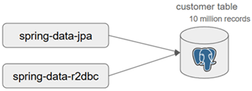
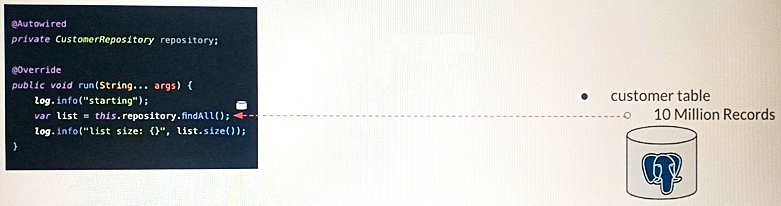
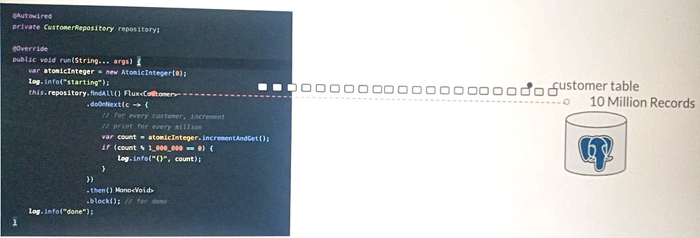
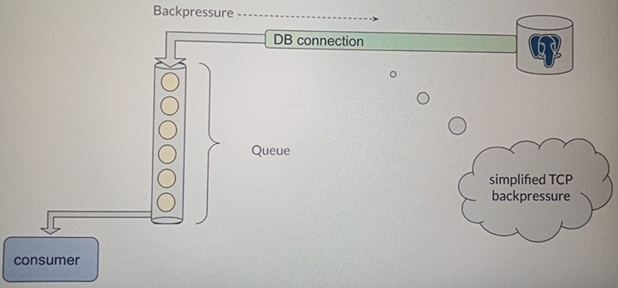
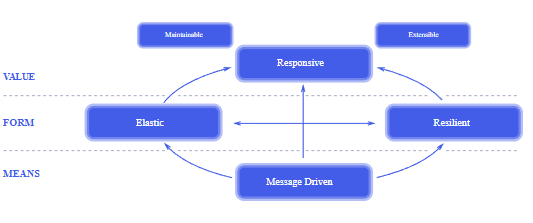

# 🆚 Sección 04: R2DBC vs JPA/JDBC

---

## 📖 Introducción

En esta sección haremos otra comparación entre lo reactivo y lo tradicional. Esta vez vamos a comparar a
`Spring Data R2DBC` con el módulo `Spring Data JPA`.

### 🎯 Objetivo

El objetivo es demostrar las diferencias en `rendimiento` y `eficiencia` de estos módulos:

- `Rendimiento`: número de tareas ejecutadas por unidad de tiempo.  
  👉 Ejemplo: emitir X cantidad de solicitudes y medir cuánto tiempo tardan en completarse.


- `Eficiencia`: cantidad de recursos del sistema utilizados.  
  👉 Ejemplo: consumo de memoria y uso de CPU durante la ejecución.

### 📌 Escenario

Las pruebas se enfocan en realizar las mismas operaciones tanto en una aplicación tradicional con `Spring Data JPA`
como en una aplicación reactiva con `Spring Data R2DBC`.



### 📝 Nota

> El código fuente de las pruebas no está incluido en este repositorio.  
> Tampoco se documentan en detalle los resultados obtenidos, ya que el tutor recomendó simplemente revisar los videos de
> este apartado.  
> El video correspondiente se encuentra en:  
> [Sección 04: R2DBC vs JPA/JDBC | Performance Test - Throughput/Efficiency](https://www.udemy.com/course/spring-webflux/learn/lecture/44197216#overview).

### 🧪 Prueba de eficiencia de rendimiento en Windows 11

**Equipo de pruebas:**  
Intel® Core™ i9-12900H de 12.ª generación a 2,90 GHz y 32 GB de RAM

Los resultados que se muestran a continuación corresponden a un comentario del video  
[Sección 04: R2DBC vs JPA/JDBC | Performance Test - Throughput/Efficiency](https://www.udemy.com/course/spring-webflux/learn/lecture/44197216#overview).  
Los valores obtenidos son similares a los mostrados por el tutor, por lo que se consideró útil agregarlos a esta
documentación.

### 1️⃣ Prueba de rendimiento

Se realizaron dos pruebas: una sin el uso de `Virtual Threads` y otra con ellos.  
En Windows 11 no se observó mejora al usar Virtual Threads en la aplicación tradicional; incluso hubo una ligera
reducción en el rendimiento.

````bash
is virtual thread executor?: false
test: 1 - took: 12673 ms, throughput: 7890.791446382072 / sec
test: 2 - took: 11757 ms, throughput: 8505.571149102663 / sec
test: 3 - took: 11520 ms, throughput: 8680.555555555555 / sec
test: 4 - took: 11925 ms, throughput: 8385.744234800839 / sec
test: 5 - took: 12315 ms, throughput: 8120.178643930167 / sec
test: 6 - took: 11983 ms, throughput: 8345.155637152633 / sec
test: 7 - took: 12151 ms, throughput: 8229.77532713357 / sec
test: 8 - took: 12317 ms, throughput: 8118.86011204027 / sec
test: 9 - took: 12310 ms, throughput: 8123.4768480909825 / sec
test: 10 - took: 12455 ms, throughput: 8028.904054596548 / sec
is virtual thread executor?: true
test: 1 - took: 20192 ms, throughput: 4952.456418383518 / sec
test: 2 - took: 13270 ms, throughput: 7535.795026375283 / sec
test: 3 - took: 13086 ms, throughput: 7641.754546843956 / sec
test: 4 - took: 13579 ms, throughput: 7364.312541424259 / sec
test: 5 - took: 13646 ms, throughput: 7328.154770628756 / sec
test: 6 - took: 13317 ms, throughput: 7509.198768491402 / sec
test: 7 - took: 13258 ms, throughput: 7542.61577915221 / sec
test: 8 - took: 13480 ms, throughput: 7418.397626112759 / sec
test: 9 - took: 13687 ms, throughput: 7306.202966318405 / sec
test: 10 - took: 13498 ms, throughput: 7408.504963698325 / sec
````

### 2️⃣ Prueba de eficiencia

- `Aplicación tradicional (JPA/JDBC)`:  
  Se necesitaron `6 GB de heap` en la JVM para recuperar `10 millones` de registros.
  Con 4 GB se produjo un error `OutOfMemoryError`: `Java heap space`.
  ````bash
  $ java -Xmx6000m -jar ./traditional/target/traditional-0.0.1-SNAPSHOT.jar  --efficiency.test=true
  com.vinsguru.TraditionalApp              : Started TraditionalApp in 3.153 seconds (process running for 3.708)
  c.vinsguru.runner.EfficiencyTestRunner   : starting
  c.vinsguru.runner.EfficiencyTestRunner   : list size: 10000000
  j.LocalContainerEntityManagerFactoryBean : Closing JPA EntityManagerFactory for persistence unit 'default'
  com.zaxxer.hikari.HikariDataSource       : HikariPool-1 - Shutdown initiated...
  com.zaxxer.hikari.HikariDataSource       : HikariPool-1 - Shutdown completed.
  ````
- `Aplicación reactiva (R2DBC)`:  
  Pudo obtener los mismos 10 millones de registros con tan solo `15 MB de heap` asignado.
  Durante la ejecución, el consumo real se mantuvo por debajo de `200 MB`.
  ````bash
  $ java -Xmx15m -jar ./reactive/target/reactive-0.0.1-SNAPSHOT.jar --efficiency.test=true
  [           main] com.vinsguru.ReactiveApp                 : Started ReactiveApp in 1.47 seconds (process running for 1.948)
  [           main] c.vinsguru.runner.EfficiencyTestRunner   : starting
  [actor-tcp-nio-1] c.vinsguru.runner.EfficiencyTestRunner   : 1000000
  [actor-tcp-nio-1] c.vinsguru.runner.EfficiencyTestRunner   : 2000000
  [actor-tcp-nio-1] c.vinsguru.runner.EfficiencyTestRunner   : 3000000
  [actor-tcp-nio-1] c.vinsguru.runner.EfficiencyTestRunner   : 4000000
  [actor-tcp-nio-1] c.vinsguru.runner.EfficiencyTestRunner   : 5000000
  [actor-tcp-nio-1] c.vinsguru.runner.EfficiencyTestRunner   : 6000000
  [actor-tcp-nio-1] c.vinsguru.runner.EfficiencyTestRunner   : 7000000
  [actor-tcp-nio-1] c.vinsguru.runner.EfficiencyTestRunner   : 8000000
  [actor-tcp-nio-1] c.vinsguru.runner.EfficiencyTestRunner   : 9000000
  [actor-tcp-nio-1] c.vinsguru.runner.EfficiencyTestRunner   : 10000000
  [           main] c.vinsguru.runner.EfficiencyTestRunner   : done
  ````

### ✅ Conclusión

- La aplicación `reactiva` tuvo mayor rendimiento y eficiencia que la aplicación tradicional.
- El uso de `Virtual Threads` en la aplicación tradicional no mejoró el rendimiento en Windows 11.
- `R2DBC` utiliza menos conexiones a la base de datos en comparación con `JDBC`.
- La aplicación tradicional requirió `6 GB de memoria` para procesar 10 millones de registros.
- La aplicación reactiva logró procesar los mismos registros usando menos de `200 MB de memoria`.

## ⚡ Cómo trabaja R2DBC

### 🏛️ Enfoque Tradicional (JPA/JDBC)

Imaginemos una base de datos con una tabla que contiene **10 millones de registros**. Cuando invocamos:

````bash
this.repository.findAll();
````

Básicamente, se ejecuta una consulta como:

````sql
SELECT *
FROM customer
````

Esto significa que queremos recuperar **todos los registros** como una lista en memoria.

#### 📌 Ejemplo ilustrativo:



#### 🔎 ¿Qué ocurre en este enfoque?

- El método `findAll()` retorna una `List<Customer>` con todos los registros.
- El controlador/servicio intentará cargar los `10 millones de registros en memoria`.
- Esto puede tardar varios segundos (10–15 segundos, dependiendo del hardware y la base de datos).
- Se construye una lista enorme en memoria, lo que puede provocar un `OutOfMemoryError` si la JVM no tiene suficiente
  espacio asignado.

#### 👉 Ejemplo conceptual:

Si después de ejecutar `findAll()` imprimes el tamaño de la lista y obtienes 5, pensarías que algo está mal, porque lo
lógico sería esperar `10,000,000`.

> En el enfoque tradicional, `traer todos los registros es la regla`, no una opción.

### 🌐 Enfoque Reactivo (R2DBC)

Para entender cómo funciona el enfoque reactivo, es fundamental recordar el concepto de `contrapresión (backpressure)`,
ya explicado en el curso anterior.

#### 🔎 Diferencia clave con el enfoque tradicional

- En el **enfoque tradicional**, `findAll()` retorna una lista con todos los registros en memoria.
- En el **enfoque reactivo**, `findAll()` retorna un `Flux<Customer>`, que no es una estructura de datos como una
  lista, sino una `tubería de datos`: un flujo por el que los elementos van pasando de forma asíncrona.

📌 Esto significa que:

- El `Flux` **no contiene todos los datos al mismo tiempo**.
- Los registros se van **emitiendo gradualmente** conforme llegan desde la base de datos.

#### ⚙️ Cómo funciona internamente

1. El driver reactivo ejecuta la misma consulta SQL:
   ```sql
   SELECT * FROM customer;
   ```
2. La base de datos responde con los resultados en forma de **flujo de bytes**.
3. Estos bytes se decodifican y se transforman en objetos `Customer`.
4. El `Flux` mantiene una `cola interna limitada` (por ejemplo, 256 elementos) para gestionar los datos en memoria.



Es importante recordar que, en ambos enfoques, los datos viajan como un flujo de bytes. Sin embargo, la diferencia está
en cómo se procesan:

- En el `enfoque tradicional`, todos los datos son leídos y almacenados en memoria, construyendo una lista completa
  antes de seguir procesando.
- En el `enfoque reactivo`, los datos se van recibiendo de forma gradual. A medida que llegan, se decodifican y se
  transforman en objetos del tipo `Customer` (o el que corresponda). Esto permite que el procesamiento comience
  inmediatamente, sin necesidad de esperar a que todos los datos estén disponibles.

Además, gracias a la `contrapresión`, el sistema puede adaptar el ritmo del flujo de datos a la velocidad de
procesamiento del consumidor, evitando así una sobrecarga de memoria o saturación del sistema.

Como ya sabes, un `Flux` `tiene una cola interna`. Esta cola intenta mantener una cantidad limitada de elementos en
memoria, por ejemplo, `256`. No es necesario memorizar el número exacto —puede variar entre `32`, `64`, `256`, etc.—
lo importante es que se trata de una cantidad pequeña y finita de elementos que se mantienen en cola para su
procesamiento.



Cuando se ejecuta la consulta `SELECT * FROM customer`, la base de datos comienza a enviar los resultados. Estos
resultados se decodifican y se agregan gradualmente a la cola del `Flux` en forma de objetos de tipo `Customer`.
Luego, los `consumidores` (es decir, la lógica que procesa los datos) van tomando los elementos de esta cola para su
procesamiento.

Todo esto sucede de forma interna y automática dentro del flujo (`Flux`). Ahora bien, imaginemos que el consumidor
es muy lento. Es decir, la velocidad de procesamiento de los datos es baja. En ese caso, como la cola solo puede
mantener un número limitado de elementos (por ejemplo, `256`), se llenará rápidamente.

Dado que la conexión con la base de datos es una `conexión TCP`, se aprovecha una característica de este protocolo:
cuando el búfer del receptor (en este caso, la cola del `Flux`) está lleno, se envía un `acuse de recibo TCP`
informando que no puede recibir más datos.
`Este mecanismo se conoce como contrapresión a nivel de TCP (TCP backpressure)`.

> Un `acuse de recibo TCP` es un mensaje que una computadora envía para confirmar que ha recibido correctamente datos a
> través de una conexión TCP. Sirve para coordinar el envío y evitar pérdida o saturación de datos.

De esta forma, la base de datos detecta que el consumidor está procesando los datos lentamente y deja de enviar más
resultados, aunque se haya ejecutado una consulta que retorna `10 millones de registros`. Esta es una manera eficiente
de controlar el flujo sin saturar el sistema.

Muchas bases de datos modernas como `Oracle`, `SQL Server`, `MongoDB` y `PostgreSQL` saben cómo manejar la contrapresión
a nivel de TCP. Por ejemplo, si alguna vez has usado herramientas como `SQL Developer` para ejecutar una consulta que
retorna millones de registros, notarás que no los ves todos de inmediato. Generalmente primero se muestran
500 registros, y a medida que te desplazas hacia abajo, el resto va cargándose progresivamente. Este es exactamente
el mismo principio.

Gracias a esta técnica, el `enfoque reactivo` permite manejar grandes volúmenes de datos de forma eficiente,
`sin necesidad de cargar todo en memoria`. Solo requiere espacio para mantener una pequeña cantidad de elementos en la
cola, independientemente de cuántos registros existan en la base de datos.

### 📝 Resumen

- El `enfoque tradicional` intenta cargar todos los datos en memoria (ej. 10 millones de registros), lo que requiere
  grandes cantidades de memoria y puede fallar.
- El `enfoque reactivo` es `no bloqueante`, `eficiente en memoria` y aplica `contrapresión automática` según la
  capacidad del consumidor.
- Aunque también usa memoria, solo necesita una `pequeña cantidad` para mantener elementos en la cola interna (ej. 256).
- Gracias a este mecanismo, procesa los datos como un flujo continuo, adaptándose dinámicamente al ritmo del consumidor.

## ❓ ¿Podemos usar Spring Data JPA con WebFlux?

### ✅ Respuesta corta

Sí, es posible utilizar `Spring Data JPA` dentro de una aplicación `WebFlux`.  
Sin embargo, hay que tener en cuenta que:

- `JPA es bloqueante` → ejecuta operaciones que detienen el hilo hasta que la consulta termina.
- `WebFlux es no bloqueante y reactivo` → está diseñado para que los hilos nunca se queden esperando.

Por lo tanto, si mezclamos ambos, debemos hacerlo con cuidado para no comprometer la naturaleza reactiva de `WebFlux`.

### ⚙️ Cómo integrarlo correctamente

Para evitar que las operaciones bloqueantes de JPA afecten el `event loop` de `WebFlux`, se deben ejecutar en un
`scheduler especializado`.

El más común es `Schedulers.boundedElastic()`, que es un `grupo de hilos con tamaño limitado`, diseñado
específicamente para `operaciones bloqueantes` como llamadas a JPA, acceso a archivos o integraciones con librerías no
reactivas.

#### 📌 Ejemplo:

````bash
Mono.fromSupplier(() -> this.jpaRepository.findById(...))
        .subscribeOn(Schedulers.boundedElastic())  // Ejecuta en un hilo separado
        .map(...)
    .doOnNext(...)
````

Con esta técnica, podemos combinar repositorios JPA tradicionales dentro de un flujo reactivo sin comprometer la
naturaleza `no bloqueante` de `WebFlux`.

### 🛡️ Beneficios de esta técnica

- `Aislamiento`: las operaciones bloqueantes no afectan el flujo reactivo principal.
- `Compatibilidad`: permite combinar repositorios JPA tradicionales dentro de una aplicación WebFlux.
- `Flexibilidad`: útil en proyectos híbridos donde parte de la lógica ya está implementada con JPA.

## 📜[Manifiesto Reactivo](https://reactivemanifesto.org/)

### 🌐 Introducción

Los sistemas construidos como **reactivos** son más flexibles, están débilmente acoplados y son altamente escalables.  
Esto facilita su desarrollo, los hace más adaptables al cambio y mucho más tolerantes a fallos.

Cuando ocurre un error, los sistemas reactivos lo afrontan con elegancia en lugar de colapsar.  
Además, son altamente **responsivos**, ofreciendo a los usuarios una retroalimentación interactiva eficaz.

### 🔑 Principios del Manifiesto Reactivo

Los sistemas reactivos se caracterizan por cuatro principios fundamentales:

#### ⚡ Responsivos

- El sistema responde de manera **oportuna y consistente**.
- La capacidad de respuesta permite detectar problemas rápidamente y abordarlos eficazmente.
- Genera confianza en el usuario final y mejora la interacción.

#### 🛡️ Resilientes

- El sistema se mantiene **receptivo incluso ante fallos**.
- Se logra mediante **replicación, aislamiento, contención y delegación**.
- Los fallos se contienen dentro de cada componente, evitando que afecten al sistema completo.
- La recuperación se delega y la alta disponibilidad se garantiza con replicación.

#### 📈 Elásticos

- El sistema mantiene su capacidad de respuesta bajo **cargas variables**.
- Puede **escalar dinámicamente** aumentando o disminuyendo recursos según la demanda.
- Evita cuellos de botella mediante diseños distribuidos y fragmentación de componentes.
- Admite algoritmos de escalado predictivo y reactivo.

#### ✉️ Controlados por mensajes

- Los sistemas reactivos se basan en el **paso asincrónico de mensajes**.
- Esto garantiza un acoplamiento flexible, aislamiento y transparencia de ubicación.
- Los mensajes permiten gestionar carga, elasticidad y aplicar **contrapresión** cuando es necesario.
- La comunicación sin bloqueos reduce la sobrecarga del sistema.



Los sistemas grandes se componen de sistemas más pequeños y dependen de las propiedades reactivas de sus
constituyentes.  
Esto significa que los principios del **Manifiesto Reactivo** se aplican en todos los niveles de escala, haciéndolos *
*componibles**.

Los sistemas más grandes del mundo se basan en estas arquitecturas y atienden a miles de millones de personas cada
día.  
Es hora de aplicar estos principios conscientemente desde el inicio, en lugar de redescubrirlos cada vez.

### 📊 Manifiesto Reactivo → Sistemas Reactivos

| Principio             | Descripción                                                                                                               |
|-----------------------|---------------------------------------------------------------------------------------------------------------------------|
| ⚡ **Responsive**      | Capacidad del sistema para reaccionar y responder rápidamente, ofreciendo tiempos de respuesta consistentes.              |
| 🛡️ **Resilient**     | El sistema permanece receptivo incluso en caso de fallas, gracias a replicación, aislamiento y recuperación delegada.     |
| 📈 **Elastic**        | El sistema sigue respondiendo bajo variaciones de carga, escalando recursos dinámicamente de forma eficiente.             |
| ✉️ **Message Driven** | Comunicación mediante mensajes asincrónicos y no bloqueantes, aplicando contrapresión para evitar saturación del sistema. |

### ✅ Conclusión

El **Manifiesto Reactivo** establece los principios que permiten construir sistemas modernos:

- **Responsivos** para mejorar la experiencia del usuario.
- **Resilientes** para garantizar disponibilidad.
- **Elásticos** para adaptarse a cargas variables.
- **Controlados por mensajes** para lograr flexibilidad y eficiencia.

Estos principios hacen que los sistemas sean **componibles, escalables y preparados para el futuro**.
