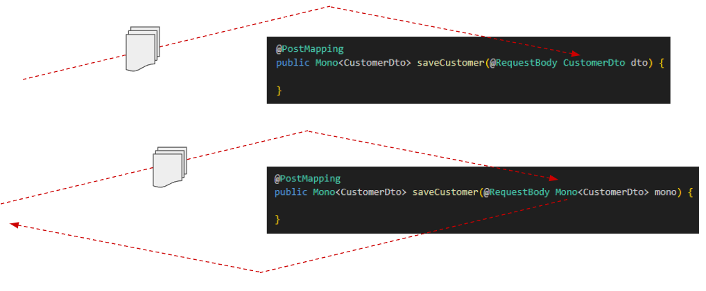

# 🚀 Sección 05: Reactive CRUD APIs

---

## ⚙️ Configuración inicial

- Creamos el directorio correspondiente a la sección `/sec05` en `webflux-playground`.
- En el archivo `application.yml` definimos la sección activa:
  ````yml
  section: sec05
  ````

---

## 🌐 Introducción

En esta sección construiremos un `CRUD Reactivo` utilizando `Spring WebFlux` y `R2DBC`, aplicando los principios
que hemos aprendido hasta ahora.

Trabajaremos con la tabla `customers` de la base de datos `PostgreSQL`, previamente creada en secciones anteriores.
A partir de esta tabla, implementaremos un conjunto de `APIs CRUD (Create, Read, Update, Delete)`, diseñando endpoints
que utilizarán los métodos HTTP:

- **GET** → Lectura de datos.
- **POST** → Creación de nuevos registros.
- **PUT** → Actualización de registros existentes.
- **DELETE** → Eliminación de registros.

### 🎯 Objetivos

- Construir endpoints `reactivos y no bloqueantes` para operaciones CRUD.
- Manejar adecuadamente las respuestas HTTP, devolviendo códigos de estado correctos:
    - `200 OK` → Operación exitosa.
    - `201 CREATED` → Registro creado.
    - `404 NOT FOUND` → Cliente no encontrado en la base de datos.
    - `400 BAD REQUEST` → Datos inválidos.
- Aplicar los principios de la programación reactiva en la gestión eficiente de datos.
- Demostrar cómo `WebFlux` permite construir APIs asíncronas y escalables.

## 🧩 DTO / Mapper / Entity / Repository

En esta sección definimos las piezas fundamentales para nuestro CRUD reactivo: la **entidad**, el **repositorio**,
los **DTOs** y el **mapper**.

### 🏛️ Entidad `Customer`

````java

@ToString
@AllArgsConstructor
@NoArgsConstructor
@Builder
@Setter
@Getter
@Table(name = "customers")
public class Customer {
    @Id
    private Long id;
    private String name;
    private String email;
}
````

#### 📌 Notas:

- La anotación `@Table` vincula la clase con la tabla `customers` en PostgreSQL.
- Se usan Lombok annotations (`@Builder`, `@Getter`, `@Setter`, etc.) para reducir código repetitivo.
- `@Id` marca la clave primaria.

### 📂 Repositorio Reactivo

````java
public interface CustomerRepository extends ReactiveCrudRepository<Customer, Long> {
}
````

#### 📌 Este repositorio:

- Extiende `ReactiveCrudRepository`, lo que nos da métodos CRUD reactivas (`findAll()`, `findById()`, `save()`,
  `deleteById()`).
- Retorna `Flux` y `Mono` en lugar de colecciones bloqueantes.

### 📦 DTOs de Request/Response

````java
public record CustomerRequest(String name,
                              String email) {
}
````

````java
public record CustomerResponse(Long id,
                               String name,
                               String email) {
}
````

#### 📌 Notas:

- `CustomerRequest` → usado para recibir datos de entrada (ej. en un POST).
- `CustomerResponse` → usado para devolver datos al cliente en las respuestas HTTP.
- Se usan `records de Java 17`, que son inmutables y más expresivos que los clásicos POJOs.

### 🔄 Mapper DTO ↔ Entidad

````java

@Component
public class CustomerMapper {

    public Customer toCustomer(CustomerRequest request) {
        return Customer.builder()
                .name(request.name())
                .email(request.email())
                .build();
    }

    public Customer toCustomerUpdate(Customer customer, CustomerRequest request) {
        customer.setName(request.name());
        customer.setEmail(request.email());
        return customer;
    }

    public CustomerResponse toCustomerResponse(Customer customer) {
        return new CustomerResponse(
                customer.getId(),
                customer.getName(),
                customer.getEmail()
        );
    }
}
````

#### 📌 ¿Por qué usar un `@Component` en lugar de métodos estáticos?

Tu decisión de definir el mapper como componente Spring en lugar de una clase utilitaria con métodos estáticos es muy
acertada. Aquí los argumentos:

#### 🧪 Testabilidad

- Con un `@Component`, el mapper puede ser inyectado en pruebas unitarias o de integración.
- Esto permite usar mocks o reemplazos en escenarios de testing.
- Con métodos estáticos, el acoplamiento es mayor y resulta más difícil de probar o sustituir.

#### 🔧 Flexibilidad y extensibilidad

- Si en el futuro el mapeo requiere lógica adicional (ej. validaciones, conversiones de tipos, llamadas a otros
  servicios), tenerlo como componente facilita extenderlo.
- Una clase utilitaria estática se vuelve rígida y difícil de evolucionar.

#### 📐 Principio de Inversión de Dependencias (SOLID)

- Al ser un bean gestionado por Spring, el mapper sigue el principio de Inversión de Dependencias, ya que las clases
  dependen de una abstracción inyectada y no de una implementación rígida.

#### 🌱 Consistencia con el ecosistema Spring

- En Spring es una buena práctica que las clases que forman parte del flujo de negocio (como mappers, servicios,
  repositorios) sean beans gestionados por el contenedor.
- Esto permite aprovechar todo el ecosistema: inyección de dependencias, perfiles, configuración, etc.

### ✅ Conclusión

- La entidad Customer, el repositorio reactivo, los DTOs y el mapper forman la base de nuestro CRUD.
- Definir el mapper como componente Spring en lugar de una clase utilitaria estática:
    - Mejora la testabilidad.
    - Aporta flexibilidad para futuras extensiones.
    - Se alinea con los principios de diseño y las buenas prácticas de Spring.

## 🛠️ Implementación de la clase de servicio

En esta capa definimos la lógica de negocio que conecta el **repositorio reactivo** con los **DTOs** y el **mapper**.  
El servicio expone métodos que retornan `Flux` y `Mono`, aplicando los principios de la programación reactiva.

### 📑 Interfaz `CustomerService`

````java
public interface CustomerService {
    Flux<CustomerResponse> getAllCustomers();

    Mono<CustomerResponse> getCustomer(Long customerId);

    Mono<CustomerResponse> saveCustomer(CustomerRequest customerRequest);

    Mono<CustomerResponse> updateCustomer(Long customerId, CustomerRequest customerRequest);

    Mono<Void> deleteCustomer(Long customerId);
}
````

#### 📌 Notas:

- Define las operaciones CRUD de manera reactiva.
- `Flux<CustomerResponse>` → para múltiples resultados.
- `Mono<CustomerResponse>` → para un único resultado.
- `Mono<Void>` → para operaciones que no retornan datos (ej. delete).

### ⚙️ Implementación `CustomerServiceImpl`

````java

@Slf4j
@RequiredArgsConstructor
@Service
public class CustomerServiceImpl implements CustomerService {

    private final CustomerRepository customerRepository;
    private final CustomerMapper customerMapper;

    @Override
    public Flux<CustomerResponse> getAllCustomers() {
        return this.customerRepository.findAll()
                .map(this.customerMapper::toCustomerResponse);
    }

    @Override
    public Mono<CustomerResponse> getCustomer(Long customerId) {
        return this.customerRepository.findById(customerId)
                .map(this.customerMapper::toCustomerResponse);
    }

    @Override
    public Mono<CustomerResponse> saveCustomer(CustomerRequest customerRequest) {
        return Mono.just(customerRequest)
                .map(this.customerMapper::toCustomer)
                .flatMap(this.customerRepository::save)
                .map(this.customerMapper::toCustomerResponse);
    }

    @Override
    public Mono<CustomerResponse> updateCustomer(Long customerId, CustomerRequest customerRequest) {
        return this.customerRepository.findById(customerId)
                .map(customer -> this.customerMapper.toCustomerUpdate(customer, customerRequest))
                .flatMap(this.customerRepository::save)
                .map(this.customerMapper::toCustomerResponse);
    }

    @Override
    public Mono<Void> deleteCustomer(Long customerId) {
        return this.customerRepository.deleteById(customerId);
    }
}
````

## 🎮 Implementación del Controlador

El controlador expone los **endpoints REST reactivas** que permiten interactuar con el servicio `CustomerService`.  
Aquí aplicamos los métodos HTTP estándar (`GET`, `POST`, `PUT`, `DELETE`) y aprovechamos la naturaleza **no bloqueante**
de WebFlux.

````java

@Slf4j
@RequiredArgsConstructor
@RestController
@RequestMapping(path = "/api/{version}/customers", version = "1")
public class CustomerController {

    private final CustomerService customerService;

    @GetMapping
    public Mono<ResponseEntity<Flux<CustomerResponse>>> allCustomers() {
        Flux<CustomerResponse> customerResponseFlux = this.customerService.getAllCustomers()
                .doOnNext(customer -> log.info(customer.toString()));
        return Mono.fromSupplier(() -> ResponseEntity.ok(customerResponseFlux));
    }

    @GetMapping(path = "/{customerId}")
    public Mono<ResponseEntity<CustomerResponse>> getCustomer(@PathVariable Long customerId) {
        return this.customerService.getCustomer(customerId)
                .map(ResponseEntity::ok);
    }

    @PostMapping
    public Mono<ResponseEntity<CustomerResponse>> saveCustomer(@RequestBody Mono<CustomerRequest> requestMono) {
        return requestMono
                .flatMap(this.customerService::saveCustomer)
                .map(customerResponse -> ResponseEntity
                        .status(HttpStatus.CREATED)
                        .body(customerResponse)
                );
    }

    @PutMapping(path = "/{customerId}")
    public Mono<ResponseEntity<CustomerResponse>> updateCustomer(@PathVariable Long customerId,
                                                                 @RequestBody Mono<CustomerRequest> requestMono) {
        return requestMono
                .flatMap(request -> this.customerService.updateCustomer(customerId, request))
                .map(ResponseEntity::ok);
    }

    @DeleteMapping(path = "/{customerId}")
    public Mono<ResponseEntity<Void>> deleteCustomer(@PathVariable Long customerId) {
        return this.customerService.deleteCustomer(customerId)
                .thenReturn(ResponseEntity.noContent().build());
    }
}
````

## ❓ Pregunta frecuente: `@RequestBody T` vs `@RequestBody Mono<T>`

En un controlador de `Spring WebFlux`, podemos definir el parámetro del cuerpo de la petición de dos maneras:

````java
// Enfoque 1: Objeto directo
@PostMapping
public Mono<ResponseEntity<CustomerResponse>> saveCustomer(@RequestBody CustomerRequest request) {
    /*code*/
}

// Enfoque 2: Objeto envuelto en Mono
@PostMapping
public Mono<ResponseEntity<CustomerResponse>> saveCustomer(@RequestBody Mono<CustomerRequest> requestMono) {
    /*code*/
}
````

En la imagen vemos gráficamente el mismo ejemplo:



Ambos enfoques funcionan, pero `sí existe una diferencia importante`.

### 🚧 Enfoque 1: `@RequestBody CustomerDto dto`

Cuando usamos directamente un objeto `(T)`:

1. Spring lee todo el cuerpo de la solicitud en bytes.
2. Lo deserializa completamente en un objeto `CustomerDto`.
3. Solo después de tener el objeto listo, invoca el método del controlador.

📌 Implicación:
> El método no se ejecuta hasta que el cuerpo completo de la petición haya sido recibido y deserializado.
> Esto es más parecido al comportamiento tradicional (bloqueante).

### ⚡ Enfoque 2: `@RequestBody Mono<CustomerDto>`

Cuando usamos un `Mono<T>`:

- Recibimos un `Publisher` que representa la promesa de que el objeto llegará en algún momento.
- El método del controlador puede ser invocado inmediatamente, aunque el cuerpo aún no esté completamente recibido.
- La lógica de negocio se implementa con operadores reactivos (`flatMap`, `map`, etc.), que se ejecutan
  `solo cuando el objeto es emitido por el Mono`.
- Todo el manejo del cuerpo se hace de forma `no bloqueante` y dentro del flujo reactivo.

📌 Implicación:
> Este enfoque mantiene el controlador `100% reactivo`, preparado para escenarios de streaming o procesamiento a gran
> escala.

### 📌 ¿Cuál usar?

- Para casos simples (ej. un POST con un JSON pequeño), ambos enfoques funcionan igual de bien.
- Para escenarios más complejos (streaming, grandes volúmenes de datos, integración con otros Publishers),
  es mejor usar `Mono<T>` o `Flux<T>`.

### 👉 Recomendación:

En aplicaciones `WebFlux`, se recomienda usar `@RequestBody Mono<T>` porque:

- Mantiene el flujo completamente reactivo.
- Evita bloqueos innecesarios.
- Escala mejor en aplicaciones con alto tráfico o grandes cargas de datos.
- Facilita el manejo de errores dentro del pipeline reactivo.

### ✅ Conclusión

- `@RequestBody T` → más simple, pero espera a que el cuerpo completo esté deserializado antes de invocar el método.
- `@RequestBody Mono<T>` → más reactivo, permite que el método se ejecute inmediatamente y que la lógica se procese
  de forma no bloqueante.
- En `WebFlux`, usar `Mono<T>` es la mejor práctica para mantener la naturaleza reactiva y preparar la aplicación para
  escenarios más exigentes.

## 🧪 CRUD APIs Demo

Las pruebas que realizamos a continuación se basan en lo que implementamos en la sección anterior.  
👉 Nota: aún falta manejar las respuestas cuando un cliente no existe (`404 NOT FOUND`), lo veremos más adelante.  
Por ahora, estos son los resultados obtenidos al consumir nuestros endpoints.

### 📋 1. Listar todos los clientes

````bash
$ curl -v http://localhost:8080/api/v1/customers | jq
>
< HTTP/1.1 200 OK
< transfer-encoding: chunked
< Content-Type: application/json
<
[
  {
    "id": 1,
    "name": "sam",
    "email": "sam@gmail.com"
  },
  {...}
]
````

✅ Devuelve un `Flux<CustomerResponse>` con todos los clientes en formato JSON.

### 🔎 2. Obtener detalle de un cliente

````bash
$ curl -v http://localhost:8080/api/v1/customers/5 | jq
>
< HTTP/1.1 200 OK
< Content-Type: application/json
< Content-Length: 53
<
{
  "id": 5,
  "name": "sophia",
  "email": "sophia@example.com"
}
````

✅ Devuelve un `Mono<CustomerResponse>` con el cliente solicitado.

### ➕ 3. Guardar un cliente

````bash
$ curl -v -X POST -H "Content-Type: application/json" -d "{\"name\": \"Lesly\", \"email\": \"lesly@gmail.com\"}" http://localhost:8080/api/v1/customers | jq
>
< HTTP/1.1 201 Created
< Content-Type: application/json
< Content-Length: 50
<
{
  "id": 11,
  "name": "Lesly",
  "email": "lesly@gmail.com"
}
````

✅ Devuelve el cliente creado con estado `201 CREATED`.

### ✏️ 4. Actualizar un cliente

````bash
$ curl -v -X PUT -H "Content-Type: application/json" -d "{\"name\": \"Milagros\", \"email\": \"milagros@gmail.com\"}" http://localhost:8080/api/v1/customers/11 | jq
>
< HTTP/1.1 200 OK
< Content-Type: application/json
< Content-Length: 56
<
{
  "id": 11,
  "name": "Milagros",
  "email": "milagros@gmail.com"
}
````

✅ Devuelve el cliente actualizado con estado `200 OK`.

### 🗑️ 5. Eliminar un cliente

````bash
$ curl -v -X DELETE http://localhost:8080/api/v1/customers/11 | jq
>
< HTTP/1.1 204 No Content
<
````

✅ Devuelve estado `204 NO CONTENT`, indicando que el cliente fue eliminado correctamente.

### 📌 Conclusión

- Los endpoints CRUD funcionan correctamente con `Spring WebFlux` + `R2DBC`.
- Se manejan los códigos de estado HTTP adecuados (`200`, `201`, `204`).
- Próximamente, agregaremos el manejo de casos donde el cliente no existe `(404 NOT FOUND)` para completar la robustez
  del CRUD.

## ⚡ [Mono/Flux + ResponseEntity](https://docs.spring.io/spring-framework/reference/web/webflux/controller/ann-methods/responseentity.html)

En `Spring WebFlux`, los controladores pueden retornar tipos reactivos como `Mono<T>` o `Flux<T>`, lo que representa:

- `Mono<T>` → una sola respuesta asíncrona (0 o 1 elemento).
- `Flux<T>` → un flujo de múltiples elementos emitidos de manera asíncrona.

### 📌 Uso de `Mono<T>` en endpoints

````java

@GetMapping(path = "/{customerId}")
public Mono<CustomerResponse> getCustomer(@PathVariable Long customerId) {
    // lógica para obtener un cliente
}
````

- Si se `retorna un objeto` o `Mono.empty()`, el cliente recibe `HTTP 200 OK`.
- Si ocurre un error, por defecto se retorna `HTTP 500 Internal Server Error`.

### ⚠️ Problema: ¿Cómo enviar otros códigos de estado (204, 400, 404)?

Para manejar códigos de estado `HTTP` personalizados (por ejemplo, `404 Not Found`, `204 No Content`,
`400 Bad Request`), se recomienda retornar:

````bash
Mono<ResponseEntity<T>>
````

✅ Ejemplo:

````java

@GetMapping(path = "/{customerId}")
public Mono<ResponseEntity<CustomerResponse>> getCustomer(@PathVariable Long customerId) {
    return this.customerService.getCustomer(customerId)
            .map(ResponseEntity::ok);
}
````

📘 Esto permite que el desarrollador controle explícitamente el `status code` y los `headers` de la respuesta.

### 🚫 ¿Por qué `Flux<ResponseEntity<T>>` no es recomendable?

`Flux<T>` representa un flujo de múltiples elementos emitidos de manera asíncrona. Es útil para streaming de datos
(por ejemplo, `SSE`, `WebSocket`, etc.).

Sin embargo, retornar `Flux<ResponseEntity<T>>` no tiene sentido práctico porque:

- El `código de estado HTTP` se establece `una sola vez al inicio de la respuesta`.
- No puedes cambiar el status a mitad de una respuesta streaming.
- Por ejemplo, no puedes emitir un `200 OK`, luego un `400 Bad Request` dentro del mismo stream.
- Ejemplo inválido:

````java

@GetMapping("/stream")
public Flux<ResponseEntity<CustomerResponse>> streamCustomers() {
    // ❌ Incorrecto conceptualmente
}
````

✅ Alternativa válida:

````java

@GetMapping(value = "/stream", produces = MediaType.TEXT_EVENT_STREAM_VALUE)
public Flux<CustomerResponse> streamCustomers() {
    return customerService.streamAll(); // Emitir datos, sin ResponseEntity
}
````

👉 El código de estado HTTP se establecerá una vez (usualmente `200 OK`), y luego los elementos se enviarán uno
por uno como parte del cuerpo de la respuesta.

## 📘 [Formas de retornar ResponseEntity en WebFlux](https://docs.spring.io/spring-framework/reference/web/webflux/controller/ann-methods/responseentity.html)

Primero, recordemos algo `esencial del protocolo HTTP`:

> 💡 Los `headers` y el `status code` se envían al cliente `solo una vez`, al inicio de la respuesta.

`WebFlux` admite el uso de tipos reactivos de un solo valor para producir `ResponseEntity` de forma asíncrona y/o tipos
reactivos de uno o varios valores para el cuerpo de la respuesta. Esto permite diversas combinaciones de respuestas
asíncronas con `ResponseEntity`, de la siguiente manera:

### ✅ `ResponseEntity<Mono<T>>` o `ResponseEntity<Flux<T>>`

- El estado y los headers se envían inmediatamente.
- El cuerpo se transmite de forma asíncrona después.
- Usar Mono si el cuerpo tiene 0–1 valores, Flux si son múltiples.

### ✅ `Mono<ResponseEntity<T>>`

- El estado, headers y cuerpo se construyen de forma asíncrona.
- Permite que el estado y los encabezados de la respuesta varíen según el resultado del procesamiento asíncrono de la
  solicitud.
  > 📌 Importante:
  >
  >  - El cliente recibe una sola respuesta HTTP.
  >  - El `ResponseEntity<T>` se construye cuando el `Mono` se resuelve, y en ese momento `Spring WebFlux` elige qué
       estado y headers usar.
  >  - Por eso se dice que el `status` y `headers` pueden “variar” según el resultado del flujo reactivo, aunque solo se
       envíe uno.

### ✅ `Mono<ResponseEntity<Mono<T>>>` o `Mono<ResponseEntity<Flux<T>>>`

- Menos común, pero posible.
- Primero se envían estado y headers de forma asíncrona.
- Luego el cuerpo también se transmite de forma asíncrona.

### 🎯 Conclusión

- Usar `Mono<ResponseEntity<T>>` es la forma más flexible y recomendada en `WebFlux`, porque permite controlar
  el código de estado según el resultado (`200`, `404`, `400`, etc.).
- `Flux<ResponseEntity<T>>` no tiene sentido práctico, ya que el status HTTP solo se puede enviar una vez al
  inicio de la respuesta.
- `Mono<ResponseEntity<Flux<T>>>` aunque menos común, es totalmente válido.
    - Se usa cuando queremos **envolver un flujo completo (`Flux<T>`) dentro de un ResponseEntity**.
    - Esto permite enviar el status y los headers de forma asíncrona, y luego transmitir el cuerpo como un flujo
      reactivo.
    - Ejemplo real de nuestra implementación:
      ```java
      @GetMapping
      public Mono<ResponseEntity<Flux<CustomerResponse>>> allCustomers() {
          Flux<CustomerResponse> customerResponseFlux = this.customerService.getAllCustomers()
                  .doOnNext(customer -> log.info(customer.toString()));
          return Mono.fromSupplier(() -> ResponseEntity.ok(customerResponseFlux));
      }
      ```
      👉 En este caso, el cliente recibe un `200 OK` junto con los headers, y luego el cuerpo se transmite como un
      `Flux<CustomerResponse>` de manera no bloqueante.

## Manejo del 4XX mediante ResponseEntity

Modificamos el controlador `CustomerController` para retornar un `ResponseEntity` con código de estado
`HttpStatus.NOT_FOUND` cuando un cliente no es encontrado en la base de datos. Esto lo podemos hacer con el operador
`defaultIfEmpty`.

## 🚦 Manejo de errores 4XX mediante ResponseEntity

Hemos modificado el controlador `CustomerController` para retornar un `ResponseEntity` con código de estado
`HttpStatus.NOT_FOUND` (`404`) cuando un cliente no es encontrado en la base de datos.  
Esto se logra con el operador **`defaultIfEmpty`**, que permite emitir un valor alternativo si el `Mono` está vacío.

### 📑 Ejemplo en el controlador

````java

@Slf4j
@RequiredArgsConstructor
@RestController
@RequestMapping(path = "/api/{version}/customers", version = "1")
public class CustomerController {

    private final CustomerService customerService;

    /* other methods */

    @GetMapping(path = "/{customerId}")
    public Mono<ResponseEntity<CustomerResponse>> getCustomer(@PathVariable Long customerId) {
        return this.customerService.getCustomer(customerId)
                .map(ResponseEntity::ok)
                .defaultIfEmpty(ResponseEntity.notFound().build());
    }

    @PutMapping(path = "/{customerId}")
    public Mono<ResponseEntity<CustomerResponse>> updateCustomer(@PathVariable Long customerId,
                                                                 @RequestBody Mono<CustomerRequest> requestMono) {
        return requestMono
                .flatMap(request -> this.customerService.updateCustomer(customerId, request))
                .map(ResponseEntity::ok)
                .defaultIfEmpty(ResponseEntity.notFound().build());
    }
}
````

### 🔎 Explicación

- `map(ResponseEntity::ok)` → si el cliente existe, se retorna `200 OK` con el objeto en el cuerpo.
- `defaultIfEmpty(ResponseEntity.notFound().build())` → si el flujo está vacío (cliente no encontrado),
  se retorna `404 NOT FOUND`.

De esta forma, el `status code depende del resultado del flujo reactivo`.

### ⚠️ Importante

En este ejemplo mostramos cómo un controlador puede emitir distintos códigos de estado según el resultado del flujo.
Sin embargo, en un `código real de producción`:

- El controlador debería retornar siempre el status “feliz” (`200 OK`, `201 CREATED`, etc.).
- Los errores deberían lanzarse como `excepciones desde la capa de servicio`.
- Se recomienda usar un `@RestControllerAdvice` para capturar esas excepciones y retornar una respuesta HTTP
  con el status adecuado (`404`, `400`, `500`, etc.), además de un cuerpo unificado para todas las excepciones.

### ✅ Conclusión

- Este ejemplo demuestra cómo `Mono<ResponseEntity<T>>` puede emitir distintos códigos de estado según el resultado
  del flujo reactivo.
- Es útil para entender el comportamiento de `WebFlux` y cómo manejar casos como `404 NOT FOUND`.
- En aplicaciones reales, el manejo de errores debe centralizarse en un controlador global de excepciones para
  mantener consistencia y claridad en las respuestas.

## 🛠️ Manejo de eliminación con [@Modifying Query](https://docs.spring.io/spring-data/relational/reference/r2dbc/query-methods.html#r2dbc.repositories.modifying)

Hasta este punto, nuestro endpoint que elimina un cliente siempre retornaba `HttpStatus.NO_CONTENT` (`204`), incluso si
el cliente no existía.  
Ahora lo modificamos para que devuelva el **código de estado correcto** en función de si se eliminó o no.

### 📑 Repositorio con consulta personalizada

Creamos un método personalizado con la anotación `@Query` para eliminar un cliente. Es importante notar que
esta consulta personalizada utiliza la anotación `@Modifying`.

````java
public interface CustomerRepository extends ReactiveCrudRepository<Customer, Long> {
    @Modifying
    @Query("DELETE FROM customers WHERE id = :customerId")
    Mono<Boolean> deleteCustomerById(Long customerId);
}
````

#### 📌 Notas:

- La anotación `@Modifying` es necesaria cuando definimos manualmente una consulta de modificación
  (`INSERT`, `UPDATE`, `DELETE`) con `@Query`.
- Métodos derivados por convención `(deleteById)` no requieren `@Modifying`.
- El resultado puede ser:
    - `Void` para descartar el recuento de actualizaciones y esperar a que se complete.
    - `Integer` u otro tipo numérico que emite el recuento de filas afectadas.
    - `Booleano` para indicar si se actualizó al menos una fila.

> La anotación `@Modifying` solo es necesaria cuando usamos `@Query` para definir manualmente una consulta de
> modificación (como `INSERT`, `UPDATE` o `DELETE`). En cambio, los métodos derivados por convención de nombres,
> como `deleteById`, no requieren esta anotación, ya que `Spring` los interpreta automáticamente.

### ⚙️ Servicio

````java
public interface CustomerService {
    /* other methods */
    Mono<Boolean> deleteCustomer(Long customerId);
}
````

````java

@Slf4j
@RequiredArgsConstructor
@Service
public class CustomerServiceImpl implements CustomerService {

    private final CustomerRepository customerRepository;
    private final CustomerMapper customerMapper;

    /* other methods */

    @Override
    public Mono<Boolean> deleteCustomer(Long customerId) {
        return this.customerRepository.deleteCustomerById(customerId);
    }
}
````

### 🎮 Controlador

En el controlador `CustomerController` modificamos el endpoint `deleteCustomer(...)` para retornar el estado apropiado
según el resultado de la operación.

````java

@Slf4j
@RequiredArgsConstructor
@RestController
@RequestMapping(path = "/api/{version}/customers", version = "1")
public class CustomerController {

    private final CustomerService customerService;

    /* other methods */

    @DeleteMapping(path = "/{customerId}")
    public Mono<ResponseEntity<Void>> deleteCustomer(@PathVariable Long customerId) {
        return this.customerService.deleteCustomer(customerId)
                .filter(wasDeleted -> wasDeleted)
                .map(wasDeleted -> ResponseEntity.noContent().<Void>build())
                .defaultIfEmpty(ResponseEntity.notFound().build());
    }
}
````

#### 🔎 Explicación

- `filter(wasDeleted -> wasDeleted)` → solo deja pasar el flujo si el resultado es `true`.
- `map(...)` → si se eliminó, retorna `204 No Content`.
- `defaultIfEmpty(...)` → si no se eliminó nada, retorna `404 Not Found`.

De esta forma, el endpoint responde correctamente según el resultado de la operación.

### ✅ Conclusión

- Con `@Modifying` + `@Query` podemos definir consultas personalizadas de modificación en `Spring Data R2DBC`.
- Retornar un `Mono<Boolean>` es práctico para saber si realmente se afectó alguna fila.
- El controlador ahora responde con:
    - `204 No Content` → si el cliente fue eliminado.
    - `404 Not Found` → si el cliente no existía.

Esto mejora la semántica del CRUD y hace que la API sea más precisa y confiable.

## 📑 Paginación simple

El método `findBy(Pageable pageable)` permite recuperar todos los registros de la entidad `Customer`, aplicando los
parámetros de **paginación** y **orden** definidos en el objeto `Pageable`.

Aunque no se indica ningún criterio de búsqueda específico en el nombre del método (no hay condiciones como
`findByStatus` o `findByName`), `Spring Data` interpreta el nombre del método `findBy` a secas como una consulta
general, pero paginada.

### 🔎 ¿Por qué funciona?

Esto aprovecha una característica de **Spring Data**:

- Genera consultas automáticamente basadas en la convención del nombre del método (**Query Method**).
- En este caso, `findBy(Pageable)` significa: *“traer todos los registros, pero aplicando paginación y orden”*.
- Es útil cuando no necesitamos filtrar por ningún campo, pero sí limitar y organizar los resultados.

### 📂 Repositorio

````java
public interface CustomerRepository extends ReactiveCrudRepository<Customer, Long> {
    /* other methods */

    Flux<Customer> findBy(Pageable pageable);
}
````

### ⚙️ Servicio

````java
public interface CustomerService {
    /* other methods */
    Flux<CustomerResponse> getAllCustomers(int pageNumber, int pageSize);
}
````

````java

@Slf4j
@RequiredArgsConstructor
@Service
public class CustomerServiceImpl implements CustomerService {

    private final CustomerRepository customerRepository;
    private final CustomerMapper customerMapper;

    /* other methods */

    @Override
    public Flux<CustomerResponse> getAllCustomers(int pageNumber, int pageSize) {
        return this.customerRepository.findBy(PageRequest.of(pageNumber, pageSize))
                .map(this.customerMapper::toCustomerResponse);
    }
}
````

### 🎮 Controlador

````java

@Slf4j
@RequiredArgsConstructor
@RestController
@RequestMapping(path = "/api/{version}/customers", version = "1")
public class CustomerController {

    private final CustomerService customerService;

    /* other methods */

    @GetMapping(path = "/simple-pagination")
    public Mono<ResponseEntity<List<CustomerResponse>>> getSimplePaginationCustomers(
            @RequestParam(name = "page", required = false, defaultValue = "0") int pageNumber,
            @RequestParam(name = "size", required = false, defaultValue = "5") int pageSize) {
        return this.customerService.getAllCustomers(pageNumber, pageSize)
                .collectList()
                .map(ResponseEntity::ok);
    }
}
````

#### 📌 Explicación del endpoint

- Ruta: `/api/v1/customers/simple-pagination`
- Parámetros:
    - `page` → número de página (por defecto 0).
    - `size` → tamaño de página (por defecto 5).
- Respuesta:
    - Devuelve una lista `(List<CustomerResponse>)` con los clientes de la página solicitada.
    - El status HTTP será `200 OK`.

### ✅ Conclusión

- `findBy(Pageable)` es una forma sencilla de implementar paginación reactiva sin necesidad de filtros adicionales.
- El servicio transforma los resultados en `CustomerResponse` para mantener consistencia en las respuestas.
- El controlador expone un endpoint claro y configurable mediante parámetros `page` y `size`.
- Esto mejora la eficiencia y la usabilidad de la API, evitando devolver todos los registros de golpe.

## 📊 [Paginación avanzada](https://www.vinsguru.com/r2dbc-pagination/)

Este método implementa una paginación más completa que incluye no solo la página actual de datos, sino también el
`total de elementos` en la tabla. De esta forma podemos construir un objeto `Page` con toda la información necesaria
para un frontend que requiera controles de paginación completos.

### 📂 Servicio

````java
public interface CustomerService {
    /* other methods */
    Mono<Page<CustomerResponse>> getAllCustomers(Pageable pageable);
}
````

````java

@Slf4j
@RequiredArgsConstructor
@Service
public class CustomerServiceImpl implements CustomerService {

    private final CustomerRepository customerRepository;
    private final CustomerMapper customerMapper;

    /* other methods */

    @Override
    public Mono<Page<CustomerResponse>> getAllCustomers(Pageable pageable) {
        return this.customerRepository.findBy(pageable)
                .map(this.customerMapper::toCustomerResponse)
                .collectList() // Mono<List<CustomerResponse>>
                .zipWith(
                        this.customerRepository.count(), // Mono<Long>
                        (customerResponseList, total) -> new PageImpl<>(customerResponseList, pageable, total)
                );
    }
}
````

#### 🧩 Descripción breve del flujo

1. Se obtiene un `Flux<Customer>` paginado desde el repositorio.
2. Se transforma cada entidad `Customer` en un DTO `CustomerResponse`.
3. Se recopilan los resultados en una lista `(collectList())`.
4. Se consulta el total de registros con `count()`.
5. Se combinan ambos resultados con `zipWith(...)`.
6. Se construye un `PageImpl<>(lista, pageable, total)` que contiene:
    - Los datos de la página actual.
    - El objeto `Pageable` con la configuración de paginación.
    - El número total de registros.

### 🎮 Controlador

````java

@Slf4j
@RequiredArgsConstructor
@RestController
@RequestMapping(path = "/api/{version}/customers", version = "1")
public class CustomerController {

    private final CustomerService customerService;

    /* other methods */

    @GetMapping(path = "/advanced-pagination")
    public Mono<ResponseEntity<Page<CustomerResponse>>> getAdvancedPaginationCustomers(
            @RequestParam(name = "page", required = false, defaultValue = "0") int pageNumber,
            @RequestParam(name = "size", required = false, defaultValue = "5") int pageSize) {
        return this.customerService.getAllCustomers(PageRequest.of(pageNumber, pageSize))
                .map(ResponseEntity::ok);
    }
}
````

#### 📌 Explicación del endpoint

- Ruta: `/api/v1/customers/advanced-pagination`
- Parámetros:
    - `page` → número de página (por defecto 0).
    - `size` → tamaño de página (por defecto 5).
- Respuesta:
    - Devuelve un objeto `Page<CustomerResponse>` que incluye:
        - Lista de clientes de la página solicitada.
        - Información de paginación (`pageNumber`, `pageSize`).
        - Total de registros (`totalElements`).

### ✅ Conclusión

- La `paginación avanzada` devuelve no solo los datos, sino también metadatos como el total de registros y páginas.
- Esto es esencial para que el frontend pueda construir controles de paginación completos
  (botones de siguiente, anterior, total de páginas, etc.).
- La combinación de `collectList()` + `count()` + `zipWith()` permite mantener el flujo reactivo y eficiente.

## 🧪 CRUD APIs Demo - Paginación

Las pruebas que realizamos a continuación se basan en los **endpoints de paginación** implementados.  
👉 No repetimos las pruebas de los otros endpoints CRUD, ya que esas se documentaron en apartados anteriores.

### 1️⃣ Paginación Simple

````bash
$ curl -v -G --data "page=0&size=3" http://localhost:8080/api/v1/customers/simple-pagination | jq
>
< HTTP/1.1 200 OK
< Content-Type: application/json
< Content-Length: 143
<
[
  {
    "id": 1,
    "name": "sam",
    "email": "sam@gmail.com"
  },
  {
    "id": 2,
    "name": "mike",
    "email": "mike@gmail.com"
  },
  {
    "id": 3,
    "name": "jake",
    "email": "jake@gmail.com"
  }
]
````

✅ Devuelve únicamente la lista de clientes solicitada, limitada por los parámetros `page` y `size`.

- `page=0` → primera página.
- `size=3` → tres registros por página.

### 2️⃣ Paginación Avanzada

````bash
$ curl -v -G --data "page=0&size=3" http://localhost:8080/api/v1/customers/advanced-pagination | jq
>
< HTTP/1.1 200 OK
< Content-Type: application/json
< Content-Length: 457
<
{
  "content": [
    {
      "id": 1,
      "name": "sam",
      "email": "sam@gmail.com"
    },
    {
      "id": 2,
      "name": "mike",
      "email": "mike@gmail.com"
    },
    {
      "id": 3,
      "name": "jake",
      "email": "jake@gmail.com"
    }
  ],
  "empty": false,
  "first": true,
  "last": false,
  "number": 0,
  "numberOfElements": 3,
  "pageable": {
    "offset": 0,
    "pageNumber": 0,
    "pageSize": 3,
    "paged": true,
    "sort": {
      "empty": true,
      "sorted": false,
      "unsorted": true
    },
    "unpaged": false
  },
  "size": 3,
  "sort": {
    "empty": true,
    "sorted": false,
    "unsorted": true
  },
  "totalElements": 10,
  "totalPages": 4
}
````

✅ Devuelve un objeto `Page<CustomerResponse>` con:

- `content` → lista de clientes de la página solicitada.
- `pageable` → metadatos de la paginación (`pageNumber`, `pageSize`, `offset`).
- `totalElements` → número total de registros en la tabla.
- `totalPages` → cantidad de páginas calculada según `size`.
- `first / last` → indicadores de si estamos en la primera o última página.

### 📌 Conclusión

- La `paginación simple` devuelve únicamente los datos solicitados, útil para casos básicos.
- La `paginación avanzada` devuelve además metadatos completos (`totalElements`, `totalPages`, etc.), lo que permite
  al frontend construir controles de paginación más ricos y precisos.
- Ambas implementaciones son `reactivas` y `eficientes`, aprovechando `Flux` y `Mono` en `WebFlux`.

## 🧪 WebTestClient - Introducción

En aplicaciones reactivas desarrolladas con `Spring WebFlux`, las `pruebas de integración` se realizan comúnmente
utilizando `WebTestClient`. Este cliente está diseñado específicamente para testear endpoints reactivos expuestos
por controladores `@RestController`, de forma **declarativa y fluida**.

### 📌 ¿Qué es WebTestClient?

- Es un **cliente HTTP** diseñado para probar aplicaciones de servidor.
- Encapsula internamente el `WebClient` de Spring, pero expone una **interfaz de prueba** para verificar las respuestas.
- Permite realizar pruebas HTTP **end-to-end** (de extremo a extremo).
- También puede probar aplicaciones **Spring MVC** y **Spring WebFlux** sin necesidad de levantar un servidor completo,
  gracias a objetos simulados de solicitud y respuesta.

### 🎯 Beneficios principales

- **Enviar peticiones HTTP** a rutas reales o directamente a controladores.
- **Verificar fácilmente** el `cuerpo`, `headers` y `estado` de la respuesta.
- **Encadenar validaciones** de forma fluida y legible, manteniendo el estilo reactivo.
- Garantizar que los endpoints expuestos funcionan correctamente en escenarios reales.

Esto lo convierte en una herramienta poderosa para garantizar que los endpoints expuestos funcionen correctamente, con
el beneficio adicional de mantener una sintaxis coherente con el estilo reactivo de la aplicación.

## 🧪 Pruebas de integración - Parte 1

En esta primera parte realizamos tres pruebas de integración sobre el controlador `CustomerController`.

### 📌 Anotaciones utilizadas

- `@AutoConfigureWebTestClient`. Habilita un `WebTestClient` vinculado directamente a la aplicación. Las pruebas no
  dependen de un servidor HTTP real, sino que utilizan solicitudes y respuestas simuladas. Actualmente, solo se admiten
  aplicaciones `WebFlux`.


- `@SpringBootTest(properties = "section=sec05", webEnvironment = SpringBootTest.WebEnvironment.MOCK)` Inicia el
  contexto completo de Spring Boot para pruebas.
    - `properties = "section=sec05"` → propiedad personalizada que puede usarse en `application.yml` para activar
      configuraciones específicas (ej. ejecutar solo el paquete de la `sección 05` del curso).
    - `webEnvironment = MOCK` → indica que se usará un entorno web simulado.
        - Este valor `es el predeterminado`, pero lo establecemos explícitamente para mayor claridad.
        - Es suficiente cuando se prueba con `WebTestClient`.

### ✅ ¿Qué hace `WebTestClient` en este contexto?

Cuando usamos `WebTestClient` con `webEnvironment = MOCK`:

- No se realiza una solicitud HTTP real por red (no va a `localhost:8080`).
- En su lugar, **invoca directamente el controlador dentro del contexto de Spring**, simulando el flujo de una solicitud
  HTTP.
- `La respuesta es real en cuanto al contenido` (se ejecuta la lógica del controlador), pero no pasa por un stack
  HTTP real (Netty/Tomcat).
- Esto permite pruebas rápidas, sin sobrecarga, y aún podemos verificar status, headers y body como si fuera una
  llamada HTTP real.

🧠 **Resumen**
> Con `webEnvironment = MOCK`, el contexto de la aplicación se carga completamente, pero no se inicia un servidor HTTP
> real. Las peticiones se simulan internamente y son manejadas directamente por los controladores.  
> `WebTestClient` interactúa con este entorno simulado para realizar pruebas de integración en aplicaciones WebFlux.

### 📑 Código de prueba

````java

@Slf4j
@AutoConfigureWebTestClient
@SpringBootTest(properties = "section=sec05", webEnvironment = SpringBootTest.WebEnvironment.MOCK)
class CustomerControllerTest {

    @Autowired
    private WebTestClient client;

    @Test
    void allCustomers() {
        // given & when
        WebTestClient.ResponseSpec response = this.client.get()
                // No necesitamos http://localhost:8080 porque usamos WebEnvironment.MOCK
                .uri("/api/v1/customers")
                .exchange();

        // then
        response.expectStatus().is2xxSuccessful()
                .expectHeader().contentType(MediaType.APPLICATION_JSON)
                .expectBodyList(CustomerResponse.class)
                .value(customerResponseList -> {
                    log.info("{}", customerResponseList);
                    assertThat(customerResponseList).isNotEmpty();
                })
                .hasSize(10);
    }

    @Test
    void getSimplePaginationCustomers() {
        // given & when
        WebTestClient.ResponseSpec response = this.client.get()
                .uri(uriBuilder -> uriBuilder
                        .path("/api/v1/customers/simple-pagination")
                        .queryParam("page", 2)
                        .queryParam("size", 2)
                        .build()
                )
                .exchange();

        // then
        response.expectStatus().is2xxSuccessful()
                .expectHeader().contentType(MediaType.APPLICATION_JSON)
                .expectBody()
                .consumeWith(result -> log.info("{}", new String(Objects.requireNonNull(result.getResponseBody()))))
                .jsonPath("$.length()").isEqualTo(2)
                .jsonPath("$[0].id").isEqualTo(5)
                .jsonPath("$[1].id").isEqualTo(6);
    }

    @Test
    void getAdvancedPaginationCustomers() {
        // given & when
        WebTestClient.ResponseSpec response = this.client.get()
                .uri(uriBuilder -> uriBuilder
                        .path("/api/v1/customers/advanced-pagination")
                        .queryParam("page", 0)
                        .queryParam("size", 3)
                        .build()
                )
                .exchange();

        // then
        response.expectStatus().is2xxSuccessful()
                .expectHeader().contentType(MediaType.APPLICATION_JSON)
                .expectBody()
                .consumeWith(result -> log.info("{}", new String(Objects.requireNonNull(result.getResponseBody()))))
                .jsonPath("$.content.length()").isEqualTo(3)        // Verificamos que la página tenga 3 elementos
                .jsonPath("$.content[0].id").isEqualTo(1)           // Primer cliente esperado
                .jsonPath("$.content[1].id").isEqualTo(2)           // Segundo cliente esperado
                .jsonPath("$.content[2].id").isEqualTo(3)           // Tercer cliente esperado
                .jsonPath("$.totalElements").isEqualTo(10)          // Total de registros en la tabla
                .jsonPath("$.totalPages").isEqualTo(4)              // Total de páginas calculadas
                .jsonPath("$.first").isEqualTo(true)                // Indicador de primera página
                .jsonPath("$.last").isEqualTo(false);               // No es la última página
    }
}
````

### 🧪 Pruebas realizadas

1. `allCustomers()`

- Verifica que el endpoint `/api/v1/customers` devuelva una lista de clientes.
- Se espera una respuesta exitosa (2xx).
- Se valida que el contenido sea JSON.
- Se comprueba que el cuerpo contiene una lista de `CustomerResponse` no vacía y de tamaño 10.
- Se imprime el resultado en los logs para revisión manual.

2. `getSimplePaginationCustomers()`

- Verifica el comportamiento del endpoint paginado `/api/v1/customers/simple-pagination`.
- Se espera una respuesta exitosa (2xx).
- Se valida el tipo de contenido.
- Se comprueba que el cuerpo contenga exactamente 2 elementos.
- Se usan expresiones JSONPath para verificar los IDs esperados (5 y 6).
- Se imprime el cuerpo de la respuesta en consola para revisión.

3. `getAdvancedPaginationCustomers()`

- Verifica el comportamiento del endpoint `/api/v1/customers/advanced-pagination`.
- Se espera una respuesta exitosa (2xx).
- Se valida el tipo de contenido (application/json).
- Se comprueba que el cuerpo contenga exactamente 3 elementos en content.
- Se usan expresiones JSONPath para validar los IDs esperados (1, 2, 3).
- Se valida que los metadatos de paginación (totalElements, totalPages, first, last) sean correctos.
- Se imprime el cuerpo de la respuesta en consola para revisión manual.

### ✅ Conclusión

- Con `WebTestClient` y `webEnvironment = MOCK` podemos probar endpoints de forma realista sin levantar un servidor
  HTTP.
- Las pruebas permiten validar status, headers y body de manera fluida y declarativa.
- En esta primera parte confirmamos que los endpoints de listado y paginación simple funcionan correctamente.

## 🧪 Pruebas de integración - Parte 2

Continuamos con la implementación de nuevos test para otros endpoints del `CustomerController`.

### 📑 Código de prueba

````java

@Slf4j
@AutoConfigureWebTestClient
@SpringBootTest(properties = "section=sec05", webEnvironment = SpringBootTest.WebEnvironment.MOCK)
class CustomerControllerTest {

    @Autowired
    private WebTestClient client;

    /* other methods */

    @Test
    void customerById() {
        // given
        Long customerId = 1L;

        // when
        WebTestClient.ResponseSpec response = this.client.get()
                .uri("/api/v1/customers/{customerId}", customerId)
                .exchange();

        // then
        response.expectStatus().is2xxSuccessful()
                .expectHeader().contentType(MediaType.APPLICATION_JSON)
                .expectBody()
                .consumeWith(result -> log.info("{}", new String(Objects.requireNonNull(result.getResponseBody()))))
                .jsonPath("$.id").isEqualTo(customerId)
                .jsonPath("$.name").isEqualTo("sam")
                .jsonPath("$.email").isEqualTo("sam@gmail.com");
    }

    @Test
    void customerById2() {
        // given
        Long customerId = 1L;

        // when
        WebTestClient.ResponseSpec response = this.client.get()
                .uri("/api/v1/customers/{customerId}", customerId)
                .exchange();

        // then
        response.expectStatus().is2xxSuccessful()
                .expectHeader().contentType(MediaType.APPLICATION_JSON)
                .expectBody(CustomerResponse.class)
                .consumeWith(result -> {
                    CustomerResponse customerResponse = result.getResponseBody();
                    log.info("{}", customerResponse);
                    assertThat(customerResponse)
                            .isNotNull()
                            .extracting(CustomerResponse::id, CustomerResponse::name, CustomerResponse::email)
                            .containsExactly(customerId, "sam", "sam@gmail.com");
                });
    }

    @Test
    void createAndDeleteCustomer() {
        // given
        CustomerRequest request = new CustomerRequest("Karen", "kasari@gmail.com");

        // when
        WebTestClient.ResponseSpec response = this.client.post()
                .uri("/api/v1/customers")
                .contentType(MediaType.APPLICATION_JSON)      //<-- Request
                .accept(MediaType.APPLICATION_JSON)  //<-- Response
                .bodyValue(request)
                .exchange();

        // then
        CustomerResponse customerResponse = response.expectStatus().isCreated()
                .expectHeader().contentType(MediaType.APPLICATION_JSON)
                .expectBody(CustomerResponse.class)
                .returnResult()
                .getResponseBody();
        log.info("{}", customerResponse);

        assertThat(customerResponse)
                .isNotNull()
                .extracting(CustomerResponse::name, CustomerResponse::email)
                .containsExactly("Karen", "kasari@gmail.com");
        assertThat(customerResponse.id()).isNotNull();

        // cleanup
        this.client.delete()
                .uri("/api/v1/customers/{customerId}", customerResponse.id())
                .exchange()
                .expectStatus().isNoContent()
                .expectBody().isEmpty();
    }

    @Test
    void updateCustomer() {
        // given
        CustomerRequest request = new CustomerRequest("Noel", "noel@gmail.com");
        Long customerId = 10L;

        // when
        WebTestClient.ResponseSpec exchangeCreate = this.client.put()
                .uri("/api/v1/customers/{id}", customerId)
                .bodyValue(request)
                .exchange();

        // then
        exchangeCreate.expectStatus().is2xxSuccessful()
                .expectHeader().contentType(MediaType.APPLICATION_JSON)
                .expectBody()
                .consumeWith(result -> log.info("{}", new String(Objects.requireNonNull(result.getResponseBody()))))
                .jsonPath("$.id").isEqualTo(customerId)
                .jsonPath("$.name").isEqualTo("Noel")
                .jsonPath("$.email").isEqualTo("noel@gmail.com");
    }
}
````

### ✅ Conclusión

- Con estas pruebas cubrimos los endpoints de lectura, creación, actualización y eliminación.
- Validamos tanto los status codes (200, 201, 204) como el contenido JSON de las respuestas.
- El uso de WebTestClient permite probar de forma fluida y declarativa todo el ciclo CRUD de la API.

## 🧪 Pruebas de integración - Parte 3

En este método de prueba verificamos el comportamiento de la API cuando un cliente **no existe** en la base de datos.  
Se cubren los tres casos principales: **GET**, **DELETE** y **PUT**.

### 📑 Código de prueba

````java

@Slf4j
@AutoConfigureWebTestClient
@SpringBootTest(properties = "section=sec05", webEnvironment = SpringBootTest.WebEnvironment.MOCK)
class CustomerControllerTest {

    @Autowired
    private WebTestClient client;

    /* other methods */

    @Test
    void customerNotFound() {
        // get
        this.client.get()
                .uri("/api/v1/customers/{id}", 11)
                .exchange()
                .expectStatus().isNotFound()
                .expectBody().isEmpty();

        // delete
        this.client.delete()
                .uri("/api/v1/customers/{id}", 11)
                .exchange()
                .expectStatus().isNotFound()
                .expectBody().isEmpty();

        // put
        CustomerRequest request = new CustomerRequest("Noel", "noel@gmail.com");
        this.client.put()
                .uri("/api/v1/customers/{id}", 11)
                .bodyValue(request)
                .exchange()
                .expectStatus().isNotFound()
                .expectBody().isEmpty();
    }
}
````

### ✅ Conclusión

- Con esta prueba validamos que la API responde correctamente con 404 Not Found cuando se intenta acceder, eliminar o
  actualizar un cliente inexistente.
- Esto asegura que el comportamiento del controlador es consistente y que los endpoints no devuelven falsos positivos
  (204 No Content o 200 OK) en casos de error.
- De esta forma, el ciclo CRUD queda completo: probamos tanto los casos exitosos como los casos de error.

## 🧪 Ejecutando test de la `sec05` desde cmd

Para ejecutar únicamente los test de la `sección 05`, nos posicionamos en la raíz del proyecto `webflux-playground` y
ejecutamos el siguiente comando:

````bash
D:\programming\spring\01.udemy\03.vinoth_selvaraj\spring-webflux-masterclass\projects\webflux-playground (feature/section-5)
$ mvn test -Dtest="*/sec05/*"
[INFO] Scanning for projects...
[INFO]
[INFO] ------------------< dev.magadiflo:webflux-playground >------------------
[INFO] Building webflux-playground 0.0.1-SNAPSHOT
[INFO]   from pom.xml
[INFO] --------------------------------[ jar ]---------------------------------
...
2026-03-24T12:40:47.714-05:00 DEBUG 13244 --- [webflux-playground] [actor-tcp-nio-1] io.r2dbc.postgresql.QUERY                : Executing query: SELECT "customers".* FROM "customers" WHERE "customers"."id" = $1 LIMIT 2
2026-03-24T12:40:47.725-05:00 DEBUG 13244 --- [webflux-playground] [actor-tcp-nio-1] io.r2dbc.postgresql.PARAM                : Bind parameter [0] to: 1
2026-03-24T12:40:47.725-05:00 DEBUG 13244 --- [webflux-playground] [actor-tcp-nio-1] io.r2dbc.postgresql.QUERY                : Executing query: SELECT "customers".* FROM "customers" WHERE "customers"."id" = $1 LIMIT 2
2026-03-24T12:40:47.729-05:00  INFO 13244 --- [webflux-playground] [           main] d.m.app.sec05.CustomerControllerTest     : CustomerResponse[id=1, name=sam, email=sam@gmail.com]
[INFO] Tests run: 8, Failures: 0, Errors: 0, Skipped: 0, Time elapsed: 4.010 s -- in dev.magadiflo.app.sec05.CustomerControllerTest
[INFO]
[INFO] Results:
[INFO]
[INFO] Tests run: 8, Failures: 0, Errors: 0, Skipped: 0
[INFO]
[INFO] ------------------------------------------------------------------------
[INFO] BUILD SUCCESS
[INFO] ------------------------------------------------------------------------
[INFO] Total time:  10.598 s
[INFO] Finished at: 2026-03-24T12:40:48-05:00
[INFO] ------------------------------------------------------------------------
````

### 📌 Explicación del comando

- `mvn test` → ejecuta las pruebas configuradas en el proyecto `Maven`.
- `-Dtest="*/sec05/*"` → bandera que indica a Maven que solo ejecute los test que se encuentran en el paquete o
  directorio `sec05`.
    - El patrón `*/sec05/*` permite filtrar las clases de prueba por ubicación.
    - Esto es útil cuando queremos correr únicamente los test de una sección específica del curso o módulo del proyecto.

### ✅ Conclusión

- Con este comando podemos ejecutar de forma selectiva los test de la `sección 05` sin necesidad de correr todo el
  proyecto.
- La salida confirma que se ejecutaron 8 pruebas en total, todas exitosas (Failures: 0, Errors: 0).
- Esto garantiza que los endpoints de la `sección 05` (CRUD + paginación + casos de error) funcionan correctamente y
  están validados con pruebas de integración.
