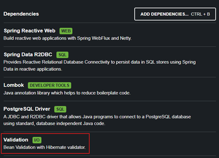
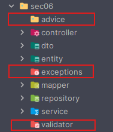

# 🛡️ Sección 06: Input Validation / Error Handling

---

## ⚙️ Configuración inicial

- Creamos el directorio correspondiente a la sección `/sec06` en `webflux-playground`.
- En el archivo `application.yml` definimos la sección activa:
  ````yml
  section: sec06
  ````

---

## 📑 Problem Detail

El `Problem Detail` es un formato estandarizado para comunicar detalles de errores al cliente que realiza la llamada.

- Este formato está basado en los estándares [RFC 7807](https://datatracker.ietf.org/doc/html/rfc7807)
  y [RFC 9457](https://datatracker.ietf.org/doc/html/rfc9457).


- Proporciona una `estructura común` para las `respuestas de error`, lo que facilita su comprensión y
  procesamiento por parte de las aplicaciones cliente, independientemente de la API con la que interactúen.


- El formato de respuesta está diseñado para ser comprensible tanto para `humanos` como para `sistemas automatizados`,
  brindando al cliente información clara sobre el problema y, cuando sea posible, una guía sobre cómo resolverlo.

### 📌 Propiedades sugeridas por la especificación

La especificación de `Problem Detail` sugiere que las respuestas de error incluyan los siguientes campos:

| Propiedades | Descripción                                                                                                        |
|-------------|--------------------------------------------------------------------------------------------------------------------|
| Type        | Un enlace (URI) a la documentación que describe el tipo de problema. Si no se proporciona, se asume `about:blank`. |
| Title       | Un resumen corto y legible para humanos del problema.                                                              |
| Status      | El código de estado HTTP correspondiente al error.                                                                 | 
| Detail      | Una descripción más detallada y específica del problema.                                                           |
| Instance    | La URI de la instancia específica donde ocurrió el error.                                                          |

### ✅ Conclusión

- El formato `Problem Detail` permite estandarizar las respuestas de error en nuestras APIs.
- Facilita la integración con clientes externos, ya que todos reciben errores con la misma estructura.
- Es un paso clave para implementar un `manejo de errores consistente y profesional` en aplicaciones reactivas con
  Spring WebFlux.

## ❓ ¿Qué pasa con el Bean Validation?

Si ya has utilizado `Spring Bean Validation`, te alegrará saber que `Spring WebFlux también la admite`.
Es muy fácil y directo añadir la dependencia necesaria:



````xml

<dependency>
    <groupId>org.springframework.boot</groupId>
    <artifactId>spring-boot-starter-validation</artifactId>
</dependency>
````

### 📌 Ejemplo de uso

Basta con añadir algunas anotaciones aquí y allá para que todo funcione. Por ejemplo:

````java

@Data
@ToString
public class UserDto {

    private String firstName;

    @NotNull(message = "Last name can not be empty")
    private String lastName;

    @Min(value = 10, message = "Required min age is 10")
    @Max(value = 50, message = "Required max age is 50")
    private int age;

    @Pattern(regexp = "([a-z])+@([a-z])+\\.com", message = "Email should match the pattern a-z @ a-z .com")
    private String email;
}
````

> ✅ Sí, `Spring WebFlux admite validaciones usando Bean Validation`. De hecho, puedes implementarlo sin problemas.

### ⚠️ ¿Por qué no lo usaremos en este curso?

En este curso `no vamos a utilizar Bean Validation`. Queremos implementar nuestras propias validaciones sin
depender de esta librería.

#### Motivos principales:

- Al construir la validación desde cero, aprenderemos conceptos clave sobre el `manejo de errores` y la
  `validación en aplicaciones reactivas`.
- En escenarios reales podrías necesitar reglas de validación mucho más complejas que no pueden resolverse únicamente
  con anotaciones estándar.

👉 Por lo tanto, `el objetivo de este apartado` es:
> ⚠️ `Entender cómo implementar validaciones manuales` en un entorno reactivo con `Spring WebFlux`.

### 📚 Recursos adicionales

Si aun así estás interesado en usar `Bean Validation` en `WebFlux`, puedes encontrar más detalles en:<br>
👉 [vinsguru.com/spring-webflux-validation](https://www.vinsguru.com/spring-webflux-validation/)

### ✅ Conclusión

- `Spring WebFlux soporta Bean Validation`, lo que permite aplicar anotaciones estándar como `@NotNull`, `@Min`, `@Max`,
  `@Pattern`.
- Sin embargo, en este curso construiremos validaciones manuales para comprender mejor el flujo de errores en
  aplicaciones reactivas.
- Esto nos dará mayor control y flexibilidad para implementar reglas personalizadas en escenarios reales.

## ⚙️ Configuración del proyecto

Para ahorrar tiempo en desarrollo, en esta nueva sección copiamos todo lo que hicimos en la sección  
`dev/magadiflo/app/sec05` y lo pegamos en nuestro nuevo directorio `dev/magadiflo/app/sec06`.

### 📂 Nuevos paquetes creados

Además, añadimos tres paquetes adicionales que serán implementados en apartados siguientes:

- `advice` → contendrá las clases de manejo global de excepciones (`@RestControllerAdvice`).
- `exception` → definirá nuestras excepciones personalizadas.
- `validator` → incluirá las validaciones manuales que construiremos para los DTOs y requests.



## ⚠️ Excepciones de aplicación

En nuestro directorio `exception` creamos las siguientes excepciones personalizadas:

### 📌 `CustomerNotFoundException`

````java
public class CustomerNotFoundException extends RuntimeException {
    private static final String MESSAGE = "Cliente con id [%d] no se encuentra";

    public CustomerNotFoundException(Long customerId) {
        super(MESSAGE.formatted(customerId));
    }
}
````

👉 Se lanza cuando se intenta acceder a un cliente que no existe en la base de datos.

### 📌 `InvalidInputException`

````java
public class InvalidInputException extends RuntimeException {
    public InvalidInputException(String message) {
        super(message);
    }
}
````

👉 Se utiliza para representar errores de validación en los datos de entrada (ej. nombre vacío, email inválido).

### 🏭 Fábrica de excepciones: `CustomerErrors`

Además, creamos la siguiente clase que actuará como una fábrica de excepciones.

````java

@UtilityClass
public class CustomerErrors {
    public static <T> Mono<T> customerNotFound(Long customerId) {
        return Mono.error(() -> new CustomerNotFoundException(customerId));
    }

    public static <T> Mono<T> missingName() {
        return Mono.error(() -> new InvalidInputException("El nombre es requerido"));
    }

    public static <T> Mono<T> missingValidEmail() {
        return Mono.error(() -> new InvalidInputException("Se requiere un correo electrónico válido"));
    }
}
````

👉 Esta clase actúa como una fábrica de errores:

- Expone métodos estáticos que devuelven un `Mono.error(...)` con la excepción correspondiente.
- Facilita la reutilización y mantiene el código más limpio en los controladores y validadores.
- Permite expresar de forma declarativa los errores en el flujo reactivo.

### ✅ Conclusión

- Definimos dos excepciones personalizadas: `CustomerNotFoundException` y `InvalidInputException`.
- Creamos la clase `CustomerErrors` como fábrica de errores, lo que simplifica la generación de excepciones en el flujo
  reactivo.
- Con esta base, podremos manejar los errores de forma consistente y luego mapearlos a respuestas estandarizadas usando
  `Problem Detail` en el paquete advice.

## 🧩 Request Validator

En el directorio `validator` creamos la clase `CustomerValidator`, la cual integra los métodos definidos previamente en
la clase `CustomerErrors`. Su objetivo es validar de forma manual los datos de entrada (`CustomerRequest`) antes de
procesarlos en el flujo reactivo.

### 📑 Código de la clase `CustomerValidator`

````java

@UtilityClass
public class CustomerValidator {
    private static final Pattern EMAIL_PATTERN = Pattern.compile("^[A-Za-z0-9+_.-]+@[A-Za-z0-9.-]+$");

    public static UnaryOperator<Mono<CustomerRequest>> validate() {
        return customerRequestMono -> customerRequestMono
                .filter(hasName())
                .switchIfEmpty(CustomerErrors.missingName())
                .filter(hasValidEmail())
                .switchIfEmpty(CustomerErrors.missingValidEmail());
    }

    private static Predicate<CustomerRequest> hasName() {
        return customerRequest -> hasText(customerRequest.name());
    }

    private static Predicate<CustomerRequest> hasValidEmail() {
        return customerRequest -> hasText(customerRequest.email())
                                  && EMAIL_PATTERN.matcher(customerRequest.email()).matches();
    }

    private static boolean hasText(String value) {
        return Objects.nonNull(value) && !value.isBlank();
    }
}
````

### 📌 Explicación

#### `validate()`

- Devuelve un `UnaryOperator<Mono<CustomerRequest>>` que aplica las validaciones sobre el DTO.
- Si el nombre está vacío → lanza `CustomerErrors.missingName()`.
- Si el email no es válido → lanza `CustomerErrors.missingValidEmail()`.

#### `hasName()`

- Verifica que el campo `name` no sea nulo ni esté en blanco.

#### `hasValidEmail()`

- Comprueba que el campo `email` tenga texto y cumpla con el patrón definido en `EMAIL_PATTERN`.

#### `hasText()`

- Método auxiliar para validar que un String no sea nulo ni vacío.

### 🎯 Beneficios de este enfoque

- Permite validaciones manuales sin depender de Bean Validation.
- Se integra de forma natural en el flujo reactivo `(Mono<CustomerRequest>)`.
- Centraliza las reglas de validación en una clase dedicada `(CustomerValidator)`.
- Utiliza la fábrica de errores `(CustomerErrors)` para devolver excepciones consistentes.

### ✅ Conclusión

- Con `CustomerValidator` tenemos un mecanismo claro y reutilizable para validar requests en un entorno reactivo.
- Las validaciones fallidas se transforman en excepciones personalizadas `(InvalidInputException)`, que luego serán
  manejadas globalmente en el paquete `advice`.
- Este enfoque nos da control total sobre las reglas de validación y el formato de los errores devueltos.

## 🧩 Validación - Emitiendo señal de error

En el controlador `CustomerController` realizamos la **validación manual** del objeto `CustomerRequest` recibido en las
solicitudes.

Normalmente, si utilizáramos **Bean Validation**, el objeto llevaría anotaciones de validación y usaríamos `@Valid`
para validar automáticamente. Pero como lo dijimos al inicio, en este curso implementamos
**nuestras propias validaciones manuales**.

### 📑 Validación en la capa del controlador

````java

@Slf4j
@RequiredArgsConstructor
@RestController
@RequestMapping(path = "/api/{version}/customers", version = "1")
public class CustomerController {

    private final CustomerService customerService;

    @GetMapping(path = "/{customerId}")
    public Mono<ResponseEntity<CustomerResponse>> getCustomer(@PathVariable Long customerId) {
        return this.customerService.getCustomer(customerId)
                .map(ResponseEntity::ok);
        // La excepción de negocio (NotFound) se maneja en el service
    }

    @PostMapping
    public Mono<ResponseEntity<CustomerResponse>> saveCustomer(@RequestBody Mono<CustomerRequest> requestMono) {
        return requestMono
                .transform(CustomerValidator.validate())        // <-- Validación de datos de entrada
                .flatMap(this.customerService::saveCustomer)
                .map(customerResponse -> ResponseEntity
                        .status(HttpStatus.CREATED)
                        .body(customerResponse)
                );
    }

    @PutMapping(path = "/{customerId}")
    public Mono<ResponseEntity<CustomerResponse>> updateCustomer(@PathVariable Long customerId,
                                                                 @RequestBody Mono<CustomerRequest> requestMono) {
        return requestMono
                .transform(CustomerValidator.validate())        // <-- Validación de datos de entrada
                .flatMap(request -> this.customerService.updateCustomer(customerId, request))
                .map(ResponseEntity::ok);
        // La excepción de negocio (NotFound) se maneja en el service
    }

    @DeleteMapping(path = "/{customerId}")
    public Mono<ResponseEntity<Void>> deleteCustomer(@PathVariable Long customerId) {
        return this.customerService.deleteCustomer(customerId)
                .thenReturn(ResponseEntity.noContent().build());
        // La excepción de negocio (NotFound) se maneja en el service
    }
}
````

#### 🐦‍🔥 Operador `transform(...)` en Project Reactor

- El operador `transform(...)` permite aplicar una función que recibe el Publisher original (en este caso un
  `Mono<CustomerRequest>`) y retorna un nuevo Publisher (otro `Mono<CustomerRequest>` modificado).
- Es útil cuando quieres aplicar una transformación genérica o reutilizable al flujo.
- En nuestro caso:
  ````bash
  requestMono.transform(CustomerValidator.validate()) 
  ````

Aquí, `CustomerValidator.validate()` retorna una función del tipo `UnaryOperator<Mono<CustomerRequest>>`, es decir:

- Una función que toma un `Mono<CustomerRequest>` y retorna otro `Mono<CustomerRequest>` validado.
- Este patrón encapsula la lógica de validación y permite reutilizarla en distintos endpoints.

### ✅ Conclusión

- En esta etapa del controlador validamos `datos de entrada`: formato, campos obligatorios y estructura del request.
- Cuando se detectan propiedades inválidas, se emiten `señales de error` (`Mono.error(...)`) que luego serán manejadas
  globalmente en el advice.
- El uso de `transform(...)` nos permite aplicar validaciones de forma declarativa y reutilizable en el flujo reactivo.

### 📑 Validación en la capa de servicio

En la capa de servicio validamos las `reglas de negocio`:

- Existencia en base de datos.
- Reglas de dominio.
- Decisiones del sistema.

Aquí es donde lanzamos señales de error relacionadas con la lógica de negocio.

#### 📌 Cambio en la interfaz del servicio

Anteriormente, el método `deleteCustomer(...)` retornaba un `Mono<Boolean>`.  
Ahora lo modificamos para retornar un `Mono<Void>`, ya que no necesitamos devolver un valor booleano:

````java
public interface CustomerService {
    /* other methods */
    Mono<Void> deleteCustomer(Long customerId);
}
````

Implementación del servicio:

````java

@Slf4j
@RequiredArgsConstructor
@Service
public class CustomerServiceImpl implements CustomerService {

    private final CustomerRepository customerRepository;
    private final CustomerMapper customerMapper;

    /* other methods */

    @Override
    public Mono<CustomerResponse> getCustomer(Long customerId) {
        return this.findCustomerOrThrow(customerId)
                .map(this.customerMapper::toCustomerResponse);
    }

    @Override
    public Mono<CustomerResponse> updateCustomer(Long customerId, CustomerRequest customerRequest) {
        return this.findCustomerOrThrow(customerId)
                .map(customer -> this.customerMapper.toCustomerUpdate(customer, customerRequest))
                .flatMap(this.customerRepository::save)
                .map(this.customerMapper::toCustomerResponse);
    }

    @Override
    public Mono<Void> deleteCustomer(Long customerId) {
        return this.findCustomerOrThrow(customerId)
                .flatMap(customer -> this.customerRepository.deleteById(customerId));
    }

    private Mono<Customer> findCustomerOrThrow(Long customerId) {
        return this.customerRepository.findById(customerId)
                .switchIfEmpty(CustomerErrors.customerNotFound(customerId));
    }
}
````

### 📌 Explicación

- `findCustomerOrThrow(...)`
    - Encapsula la lógica de búsqueda de un cliente en BD.
    - Si no existe, emite una señal de error con `CustomerErrors.customerNotFound(customerId)`.
    - Esto asegura que cualquier operación (`get`, `update`, `delete`) valide primero la existencia del cliente.
- `getCustomer(...)`
    - Devuelve el cliente si existe, o lanza excepción si no se encuentra.
- `updateCustomer(...)`
    - Valida la existencia del cliente antes de aplicar cambios.
    - Si no existe, se lanza la excepción `CustomerNotFoundException`.
- `deleteCustomer(...)`
    - Ahora retorna `Mono<Void>`.
    - Valida la existencia del cliente antes de eliminarlo.
    - Si no existe, se lanza la excepción correspondiente.

### ✅ Conclusión

- La capa de servicio es responsable de validar las `reglas de negocio` y emitir errores cuando estas no se cumplen.
- Centralizamos la validación de existencia en el método `findCustomerOrThrow(...)`, evitando duplicación de lógica.
- Con este enfoque, cualquier operación sobre clientes (lectura, actualización, eliminación) garantiza consistencia y
  manejo de errores uniforme.

## ⚠️ @RestControllerAdvice

Creamos la clase `ApplicationExceptionHandler`, responsable de capturar y manejar excepciones globalmente en la
aplicación.

> `@RestControllerAdvice` combina las funcionalidades de `@ControllerAdvice` con `@ResponseBody`, lo que significa que
> las respuestas de los métodos serán serializadas automáticamente en formato `JSON` (u otro formato de respuesta
> configurado).

Los métodos que capturan las excepciones devuelven un objeto `ProblemDetail`, una clase introducida por
`Spring Framework` para estructurar las respuestas de error conforme a la especificación
[RFC 7807](https://datatracker.ietf.org/doc/html/rfc7807), también conocida como `Problem Details for HTTP APIs`.

### 📑 Código de la clase `ApplicationExceptionHandler`

````java

@Slf4j
@RestControllerAdvice
public class ApplicationExceptionHandler {

    // Forma 1: usando ResponseEntity dentro de Mono
    @ExceptionHandler(CustomerNotFoundException.class)
    public Mono<ResponseEntity<ProblemDetail>> handleCustomerNotFoundException(CustomerNotFoundException ex) {
        log.error("{}", ex.getMessage());
        ProblemDetail problemDetail = ProblemDetail.forStatusAndDetail(HttpStatus.NOT_FOUND, ex.getMessage());
        problemDetail.setType(URI.create("https://example.com/problems/customer-not-found"));
        problemDetail.setTitle("Cliente no encontrado");
        return Mono.just(ResponseEntity
                .status(problemDetail.getStatus())
                .body(problemDetail)
        );
    }

    // Forma 2: retornando directamente ProblemDetail
    @ExceptionHandler(InvalidInputException.class)
    public ProblemDetail handleInvalidInputException(InvalidInputException ex) {
        log.error("{}", ex.getMessage());
        ProblemDetail problemDetail = ProblemDetail.forStatusAndDetail(HttpStatus.BAD_REQUEST, ex.getMessage());
        problemDetail.setType(URI.create("https://example.com/problems/invalid-input"));
        problemDetail.setTitle("Entrada inválida");
        return problemDetail;
    }
}
````

### 📌 Manejo de excepciones con `@RestControllerAdvice`

En este proyecto se implementaron dos formas de retornar errores estándar utilizando `ProblemDetail` (clase de Spring
Framework que sigue el `RFC 7807 - Problem Details for HTTP APIs`):

1. Usando `ResponseEntity` dentro de `Mono`
    - Permite mayor control sobre el status y los headers.
    - Útil cuando necesitas construir la respuesta de forma personalizada.
2. Retornando directamente el `ProblemDetail`
    - Más simple y directo.
    - Adecuado cuando solo necesitas devolver un error estandarizado sin lógica adicional.

### 📌 ¿Qué hace este código?

- Se capturan las excepciones específicas `CustomerNotFoundException` e `InvalidInputException`.
- Se construye un objeto `ProblemDetail` para cada una, incluyendo:
    - `status` (HTTP status code),
    - `detail` (mensaje específico del error),
    - `type` (URI que describe el tipo del problema),
    - `title` (título legible para humanos).
- El primer método envuelve la respuesta en un `ResponseEntity` con el estado `HTTP` correspondiente. Luego,
  se utiliza `Mono.just(...)` para devolver una respuesta reactiva no bloqueante.
- El segundo método retorna directamente el objeto `ProblemDetail`.

### ✅ Conclusión

- Con `@RestControllerAdvice` centralizamos el manejo de excepciones en un único punto de la aplicación.
- El uso de `ProblemDetail` nos permite devolver errores estandarizados y consistentes, siguiendo la especificación
  `RFC 7807`.
- Podemos elegir entre dos enfoques: directo con `ProblemDetail` o envolviendo en `ResponseEntity`, según el nivel de
  personalización requerido.
