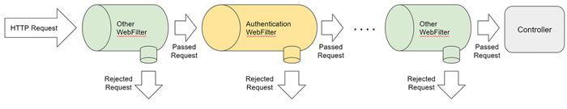
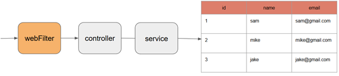
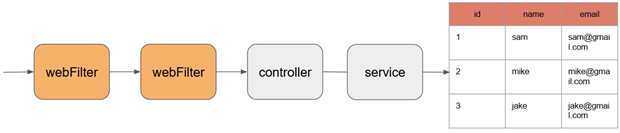
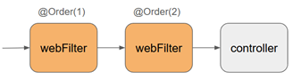
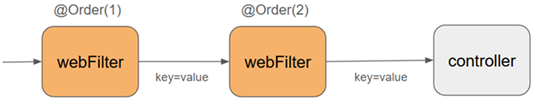

# 🔍 Sección 07: WebFilter

---

## ⚙️ Configuración inicial

- Creamos el directorio correspondiente a la sección `/sec07` en `webflux-playground`.
- En el archivo `application.yml` definimos la sección activa:
  ````yml
  section: sec07
  ````

---

## 📝 Introducción

Un `WebFilter` en `Spring WebFlux` es un componente que actúa como `intermediario entre el cliente y el controlador`.
Tiene la capacidad de `interceptar, inspeccionar y modificar` tanto la `solicitud entrante` `(ServerHttpRequest)`
como la `respuesta saliente` `(ServerHttpResponse)`.

Esto lo hace especialmente útil para abordar `preocupaciones transversales` `(cross-cutting concerns)` como:

- 🔐 Autenticación y autorización
- 📝 Registro de logs (logging)
- 📊 Supervisión o monitoreo
- 🚦 Control de acceso o validación de cabeceras
- ⏳ Limitación de tasa (rate limiting)
- ✏️ Modificación de respuestas antes de enviarlas al cliente

Cuando agregamos un `WebFilter`, este se ejecuta antes que cualquier controlador (`@RestController`, `@Controller`) y,
por tanto, todas las solicitudes pasarán primero por el filtro antes de ser manejadas por los endpoints.

### 🔄 Flujo de ejecución

````
Cliente → WebFilter → Controlador → Servicio → Respuesta → WebFilter → Cliente
````



### ✅ Ejemplo de uso

Un caso común es validar que todas las solicitudes incluyan un `token en el encabezado` (`Authorization`), o quizás una
`clave de API`. Si no se encuentra el token o no es válido, se puede rechazar la solicitud antes de que llegue al
controlador.



### 🔍 Acceso a información de la solicitud

Dentro de un `WebFilter`, se puede acceder a:

- 📑 Cabeceras (headers)
- 🌐 Parámetros de la URL
- 🍪 Cookies
- 🖥️ Dirección IP del cliente
- 📌 Ruta solicitada

Esto permite implementar lógica de validación `basada en metadatos de la solicitud`, sin necesidad de deserializar el
cuerpo.

### 🚫 ¿Debo validar el cuerpo de la solicitud en un WebFilter?

`No es recomendable`. El cuerpo de la solicitud (por ejemplo, un `JSON` con campos como `name`, `email`, etc.)
`aún no ha sido deserializado` cuando se ejecuta el `WebFilter`. Esto se debe a que:

- En `WebFlux`, la deserialización ocurre más adelante en el pipeline, cuando el método del controlador es invocado.
- Intentar leer el cuerpo manualmente en el filtro puede interrumpir el flujo reactivo si no se maneja correctamente
  (solo puede leerse una vez, y requiere suscripción explícita con `Mono` o `Flux`).

Además, si validáramos todo en el filtro, `perderíamos el propósito de los controladores y los servicios`, cuya
responsabilidad es manejar la lógica de negocio y la validación específica de cada endpoint.

### 🧠 ¿Cuándo usar un WebFilter?

`Úsalo únicamente para validaciones generales y transversales`, por ejemplo:

- Verificar que todas las solicitudes tengan una cabecera obligatoria.
- Registrar logs de todas las peticiones entrantes.
- Registrar métricas para monitoreo.
- Implementar CORS personalizado.
- Aplicar reglas de seguridad a nivel global.

### ✅ Conclusión

Un `WebFilter` en `Spring WebFlux` es un poderoso mecanismo para `interceptar solicitudes y respuestas`, pero debe
usarse con cuidado. No es el lugar adecuado para lógica de negocio o validación del cuerpo de la solicitud, sino para
`preocupaciones transversales` aplicables a todas (o muchas) rutas.

## 📂 Creando proyecto

Para esta sección:

- Copiamos los directorios de la `sec06` hacia `sec07`.
- Creamos un nuevo directorio adicional llamado `filter`.
- Configuramos en `application.yml`: `section: sec07`.

## 🔗 WebFilter Chain – Cómo funciona la cadena de filtros en Spring WebFlux

### 🧠 ¿Qué es una "cadena de filtros" (filter chain)?

En `Spring WebFlux`, cuando tenemos múltiples filtros registrados `(WebFilter)`, estos se organizan en una cadena de
ejecución conocida como `WebFilterChain`.

Cada filtro puede:

- ⚡ Ejecutar lógica antes de pasar la solicitud.
- ✏️ Modificar la solicitud o el contexto `(ServerWebExchange)`.
- 🚦 Decidir si continuar o detener la ejecución de la cadena.
- 🔄 Ejecutar lógica después de que el siguiente filtro haya sido invocado `(post-processing)`.



### 🔁 Flujo de ejecución con múltiples WebFilters

Cuando se recibe una solicitud:

````
Cliente -> Filtro A -> Filtro B -> Filtro C -> Controlador
````

Y en el camino de regreso:

````
Cliente <- Filtro A <- Filtro B <- Filtro C <- Controlador
````

Esto se debe a que los filtros se comportan como una `estructura en forma de pila` `(stack)`: primero entran y luego
salen en orden inverso. Puedes aprovechar esto para aplicar lógica después de que la solicitud haya sido procesada.

### 🧩 ¿Cómo definir el orden de los filtros?

Por defecto, los filtros se ejecutan en el orden en que son detectados por `Spring`, lo cual puede no ser
determinístico. Para forzar un orden específico de ejecución, puedes usar la anotación `@Order` o implementar la
`interfaz Ordered`:



````java

@Component
@Order(1)
public class AuthFilter implements WebFilter {
    // Este filtro se ejecuta antes de los que tengan @Order(2), @Order(3), etc.
}
````

- Un número más bajo indica mayor prioridad (se ejecuta antes).
- Puedes usar `@Order(-1)`, `@Order(0)`, etc., según tu necesidad.

### 🛠️ ¿Cómo funciona la cadena internamente?

Cada `WebFilter` recibe dos argumentos:

- 📦 `ServerWebExchange exchange` → contiene la solicitud y la respuesta.
- 🔗 `WebFilterChain chain` → representa la cadena de los siguientes filtros a ejecutar.

Para pasar la solicitud al siguiente filtro, se invoca:

````http
return chain.filter(exchange);
````

Y puedes agregar lógica antes y después de este llamado:

````java

@Override
public Mono<Void> filter(ServerWebExchange exchange, WebFilterChain chain) {
    System.out.println("Antes del siguiente filtro");

    return chain.filter(exchange)
            .doOnSuccess(aVoid -> System.out.println("Después del siguiente filtro"));
}
````

### ✅ Conclusión

- Puedes tener múltiples WebFilter en tu aplicación.
- Todos se ejecutan como parte de una cadena `(WebFilterChain)`.
- Puedes definir el orden con `@Order`.
- Cada filtro decide si continuar con la cadena o detenerla.
- Esta estructura es útil para lógica compartida como `autenticación`, `logging`, `auditoría`,
  `métricas de seguridad global`, etc.

## 🔐 Proyecto: Definiendo requisitos de autenticación y autorización

Vamos a añadir algunos requisitos en nuestra aplicación y a utilizar `WebFilter` para implementarlos.  
Los requisitos serán simples, relacionados con **autenticación** y **autorización**.

### 📌 Requisitos de seguridad

- Existen **2 tipos de usuarios** que realizan solicitudes:
    - 👤 `STANDARD`
    - ⭐ `PRIME`
- Todas las solicitudes deben incluir un **encabezado de seguridad**: `auth-token`.
- El valor debería ser:
    - `secret123` → Usuario `STANDARD`
    - `secret456` → Usuario `PRIME`
- Reglas de acceso:
    - 🚫 Si no se envía el token o es inválido → **401 Unauthorized**
    - ⭐ Usuarios `PRIME` → pueden realizar **cualquier tipo de llamadas**.
    - 👤 Usuarios `STANDARD` → solo pueden realizar solicitudes **GET**.
        - Si intentan otro método → **403 Forbidden**

### 🔄 Flujo esperado

1. 📥 El cliente envía la solicitud con el encabezado `auth-token`.
2. 🔗 El `WebFilter` intercepta la solicitud.
3. ✅ Si el token es válido:
    - `STANDARD` → solo se permite `GET`.
    - `PRIME` → acceso completo.
4. 🚫 Si el token es inválido o falta → se devuelve un error `401 Unauthorized`.
5. 🚫 Si un `STANDARD` intenta un método distinto de `GET` → se devuelve `403 Forbidden`.

## 🎯 Conclusión

Con estos requisitos definidos:

- El `WebFilter` se convierte en el **primer punto de control de seguridad** en nuestra aplicación.
- Garantizamos que **todas las solicitudes** pasen por validación antes de llegar al controlador.
- La lógica de negocio queda protegida y aislada, ya que las solicitudes inválidas nunca alcanzan el servicio.

## 🔐 Implementación WebFilter - Autenticación

### 📑 Enumeración de categorías

Creamos una clase `enum` que contendrá los tipos de categorías de usuarios:

````java
public enum Category {
    STANDARD,
    PRIME
}
````

### 📌 Clase AuthenticationWebFilter

Implementamos un `WebFilter` que valida la presencia y el valor del encabezado `auth-token`.

````java

@Slf4j
@Order(1)
@Component
public class AuthenticationWebFilter implements WebFilter {

    private static final Map<String, Category> TOKEN_CATEGORY_MAP = Map.of(
            "secret123", Category.STANDARD,
            "secret456", Category.PRIME
    );

    @Override
    public Mono<Void> filter(ServerWebExchange exchange, WebFilterChain chain) {
        log.info("Inicia la ejecución del filtro de autenticación");
        ServerHttpRequest request = exchange.getRequest();
        String token = request.getHeaders().getFirst("auth-token");

        log.info("Token a autenticar: {}", token);

        if (Objects.nonNull(token) && TOKEN_CATEGORY_MAP.containsKey(token)) {
            return chain.filter(exchange);
        }

        return Mono.fromRunnable(() -> exchange.getResponse().setStatusCode(HttpStatus.UNAUTHORIZED));
    }
}
````

### 🔍 Explicación

- 📥 **Lectura del encabezado:** se obtiene el valor de `auth-token` desde los headers de la solicitud.
- 🔑 **Validación del token:** se compara contra el mapa `TOKEN_CATEGORY_MAP`.
- ✅ **Token válido:** se continúa con la cadena de filtros `(chain.filter(exchange))`.
- 🚫 **Token inválido o ausente:** se devuelve un `401 Unauthorized`.
- 🧩 **Orden de ejecución:** la anotación `@Order(1)` asegura que este filtro se ejecute antes que otros con mayor
  número.

### 🎯 Conclusión

- Este filtro garantiza que `todas las solicitudes` incluyan un token válido antes de llegar al controlador.
- Si el token no existe o no es válido, la solicitud se rechaza inmediatamente con un `401 Unauthorized`.
- Es el primer paso de nuestra lógica de seguridad: `autenticación global`.

## 🔐 Implementación WebFilter | Attributes - Autorización

### 📌 ¿Qué son los `attributes`?

Los `attributes` en `ServerWebExchange` son simplemente un **mapa** `clave-valor`.  
Un filtro puede establecer información adicional sobre la solicitud y pasarla a lo largo de la cadena de filtros.  
De esta manera:

- 🔗 Un filtro puede **proporcionar datos** a otro filtro.
- 📦 Incluso los controladores pueden acceder a esos atributos si es necesario.



### 🧩 Modificación del filtro de autenticación

En el filtro `AuthenticationWebFilter` agregamos el atributo `category` para que el filtro de autorización lo utilice:

````java

@Slf4j
@Order(1)
@Component
public class AuthenticationWebFilter implements WebFilter {

    private static final Map<String, Category> TOKEN_CATEGORY_MAP = Map.of(
            "secret123", Category.STANDARD,
            "secret456", Category.PRIME
    );

    @Override
    public Mono<Void> filter(ServerWebExchange exchange, WebFilterChain chain) {
        log.info("Inicia la ejecución del filtro de autenticación");
        ServerHttpRequest request = exchange.getRequest();
        String token = request.getHeaders().getFirst("auth-token");

        log.info("Token a autenticar: {}", token);

        if (Objects.nonNull(token) && TOKEN_CATEGORY_MAP.containsKey(token)) {
            exchange.getAttributes().put("category", TOKEN_CATEGORY_MAP.get(token)); //<-- Asignando atributo 'category'
            return chain.filter(exchange);
        }

        return Mono.fromRunnable(() -> exchange.getResponse().setStatusCode(HttpStatus.UNAUTHORIZED));
    }
}
````

### 📌 Filtro de autorización

El filtro `AuthorizationWebFilter` utiliza el atributo `category` para determinar qué métodos HTTP están permitidos:

````java

@Slf4j
@Order(2)
@Component
public class AuthorizationWebFilter implements WebFilter {
    @Override
    public Mono<Void> filter(ServerWebExchange exchange, WebFilterChain chain) {
        log.info("Inicia la ejecución del filtro de autorización");
        Category category = exchange.getAttributeOrDefault("category", Category.STANDARD);
        log.info("Categoría identificada: {}", category);

        return switch (category) {
            case PRIME -> this.prime(exchange, chain);
            case STANDARD -> this.standard(exchange, chain);
        };
    }

    private Mono<Void> prime(ServerWebExchange exchange, WebFilterChain chain) {
        return chain.filter(exchange);
    }

    private Mono<Void> standard(ServerWebExchange exchange, WebFilterChain chain) {
        log.info("Intentando ejecutar método http: {}", exchange.getRequest().getMethod());
        boolean isGet = HttpMethod.GET.equals(exchange.getRequest().getMethod());
        return isGet
                ? chain.filter(exchange)
                : Mono.fromRunnable(() -> exchange.getResponse().setStatusCode(HttpStatus.FORBIDDEN));
    }
}
````

### ⚠️ Nota importante

Ambos filtros tienen la anotación `@Order(...)` para garantizar el orden de ejecución:

- 1️⃣ Primero la **autenticación.**
- 2️⃣ Luego la **autorización.**

### ✅ Conclusión

- Los `attributes` permiten **compartir información entre filtros.**
- El filtro de autenticación asigna la categoría (`STANDARD` o `PRIME`).
- El filtro de autorización aplica las reglas:
    - ⭐ `PRIME` → acceso completo.
    - 👤 `STANDARD` → solo solicitudes GET.
- Si se incumplen las reglas, se devuelven los códigos adecuados:
    - `401 Unauthorized` → token inválido o ausente.
    - `403 Forbidden` → método no permitido para `STANDARD`.

## 🧪 Probando los filtros WebFilter

### 🚫 Solicitud sin cabecera `auth-token`

````bash
$ curl -v http://localhost:8080/api/v1/customers/10 | jq
>
< HTTP/1.1 401 Unauthorized
< content-length: 0
<
````

### 👤 Usuario `STANDARD` – Solicitud `GET`

````bash
$ curl -v -H "auth-token: secret123" http://localhost:8080/api/v1/customers/10 | jq
>
< HTTP/1.1 200 OK
< Content-Type: application/json
< Content-Length: 52
<
{
  "id": 10,
  "name": "ethan",
  "email": "ethan@example.com"
}
````

✅ Permitido: los usuarios `STANDARD` pueden realizar solicitudes `GET`.

### 👤 Usuario `STANDARD` – Solicitud `POST`

````bash
$ curl -v -X POST -H "auth-token: secret123" -H "Content-Type: application/json" -d "{\"name\": \"Yrma\", \"email\": \"yrma@gmail.com\"}" http://localhost:8080/api/v1/customers | jq
>
< HTTP/1.1 403 Forbidden
< content-length: 0
<
````

🚫 Rechazado: los usuarios `STANDARD` no pueden realizar solicitudes distintas de `GET`.

### ⭐ Usuario `PRIME` – Solicitud `POST`

````bash
$ curl -v -X POST -H "auth-token: secret456" -H "Content-Type: application/json" -d "{\"name\": \"Yrma\", \"email\": \"yrma@gmail.com\"}" http://localhost:8080/api/v1/customers | jq
>
< HTTP/1.1 201 Created
< Content-Type: application/json
< Content-Length: 48
<
{
  "id": 11,
  "name": "Yrma",
  "email": "yrma@gmail.com"
}
````

✅ Permitido: los usuarios `PRIME` tienen acceso completo a cualquier tipo de solicitud.

### 🎯 Conclusión

- 🔐 Autenticación: todas las solicitudes deben incluir el encabezado `auth-token`.
- 🚦 Autorización:
    - `STANDARD` → solo `GET`.
    - `PRIME` → acceso completo.
- 🛡️ Los filtros `AuthenticationWebFilter` y `AuthorizationWebFilter` trabajan en conjunto para garantizar seguridad
  global en la aplicación.
- ✅ Las pruebas confirman que los códigos de estado (`401 Unauthorized`, `403 Forbidden`, `200 OK`, `201 Created`)
  se devuelven correctamente según las reglas definidas.

## 📌 @RequestAttribute en Spring WebFlux

En `Spring WebFlux`, la anotación `@RequestAttribute` se utiliza para acceder a atributos que han sido añadidos
manualmente al `ServerWebExchange` antes de que la solicitud llegue al controlador, comúnmente desde un `WebFilter`.

Esto es útil cuando necesitas pasar información calculada o verificada durante las etapas iniciales del procesamiento de
la solicitud, como por ejemplo:

- 🔑 Un identificador de usuario extraído de un token JWT.
- 🛡️ Un rol o permiso evaluado previamente.
- 📦 Un valor derivado de un encabezado o cookie, procesado por un filtro.

⚠️ Importante: `@RequestAttribute` `NO` se usa para acceder a:

- Datos del cuerpo (`@RequestBody`).
- Parámetros de URL (`@RequestParam`).
- Cabeceras (`@RequestHeader`).

Su propósito es acceder a atributos explícitamente insertados mediante:

````http
exchange.getAttributes().put("clave", valor);
````

### 📌 Ejemplo: Usando category en el controlador

En el filtro `AuthenticationWebFilter` agregamos el atributo `category`. Podemos acceder a ese valor directamente en el
controlador:

````java

@Slf4j
@RequiredArgsConstructor
@RestController
@RequestMapping(path = "/api/{version}/customers", version = "1")
public class CustomerController {

    private final CustomerService customerService;

    @GetMapping
    public Mono<ResponseEntity<Flux<CustomerResponse>>> allCustomers(@RequestAttribute Category category) {
        log.info("Obteniendo categoría agregada en el AuthenticationWebFilter: {}", category);

        Flux<CustomerResponse> customerResponseFlux = this.customerService.getAllCustomers()
                .doOnNext(customer -> log.info(customer.toString()));
        return Mono.fromSupplier(() -> ResponseEntity.ok(customerResponseFlux));
    }
    /* other methods */
}
````

👉 En este ejemplo, `category` no viene como `queryParam`, ni en el `body`, sino que fue
`inyectado internamente por un filtro previo`.

### 🧠 ¿Cuándo usar `@RequestAttribute` en WebFlux?

- ✅ Cuando necesitas pasar datos calculados o extraídos en el WebFilter hacia el controlador.
- ✅ Cuando quieres mantener el cuerpo de la petición intacto (ya que en WebFlux no es buena práctica leer el body
  dentro del filtro).
- ✅ Cuando implementas lógica transversal como autenticación, trazabilidad, auditoría, etc.

## 🧪 Probando el @RequestAttribute

Ejecutamos la aplicación y realizamos una petición al endpoint `/api/v1/customers` con un usuario `STANDARD`:

````bash
$ curl -v -H "auth-token: secret123" http://localhost:8080/api/v1/customers | jq
>
< HTTP/1.1 200 OK
< transfer-encoding: chunked
< Content-Type: application/json
<
[
  {
    "id": 1,
    "name": "sam",
    "email": "sam@gmail.com"
  },
  {...},
  {
    "id": 10,
    "name": "ethan",
    "email": "ethan@example.com"
  }
]
````

En la consola del IDE se observa que el controlador recibe el atributo `category` con valor: `STANDARD`.

````bash
...playground] [ctor-http-nio-2] d.m.a.s.filter.AuthenticationWebFilter   : Inicia la ejecución del filtro de autenticación
...playground] [ctor-http-nio-2] d.m.a.s.filter.AuthenticationWebFilter   : Token a autenticar: secret123
...playground] [ctor-http-nio-2] d.m.a.s.filter.AuthorizationWebFilter    : Inicia la ejecución del filtro de autorización
...playground] [ctor-http-nio-2] d.m.a.s.filter.AuthorizationWebFilter    : Categoría identificada: STANDARD
...playground] [ctor-http-nio-2] d.m.a.s.filter.AuthorizationWebFilter    : Intentando ejecutar método http: GET
...playground] [ctor-http-nio-2] d.m.a.s.controller.CustomerController    : Obteniendo categoría agregada en el AuthenticationWebFilter: STANDARD
...playground] [actor-tcp-nio-3] io.r2dbc.postgresql.QUERY                : Executing query: SELECT "customers".* FROM "customers"
...playground] [actor-tcp-nio-3] d.m.a.s.controller.CustomerController    : CustomerResponse[id=1, name=sam, email=sam@gmail.com]
...playground] [ctor-http-nio-2] d.m.a.s.controller.CustomerController    : CustomerResponse[id=2, name=mike, email=mike@gmail.com]
...playground] [ctor-http-nio-2] d.m.a.s.controller.CustomerController    : CustomerResponse[id=3, name=jake, email=jake@gmail.com]
...playground] [ctor-http-nio-2] d.m.a.s.controller.CustomerController    : CustomerResponse[id=4, name=emily, email=emily@example.com]
...playground] [ctor-http-nio-2] d.m.a.s.controller.CustomerController    : CustomerResponse[id=5, name=sophia, email=sophia@example.com]
...playground] [ctor-http-nio-2] d.m.a.s.controller.CustomerController    : CustomerResponse[id=6, name=liam, email=liam@example.com]
...playground] [ctor-http-nio-2] d.m.a.s.controller.CustomerController    : CustomerResponse[id=7, name=olivia, email=olivia@example.com]
...playground] [ctor-http-nio-2] d.m.a.s.controller.CustomerController    : CustomerResponse[id=8, name=noah, email=noah@example.com]
...playground] [ctor-http-nio-2] d.m.a.s.controller.CustomerController    : CustomerResponse[id=9, name=ava, email=ava@example.com]
...playground] [ctor-http-nio-2] d.m.a.s.controller.CustomerController    : CustomerResponse[id=10, name=ethan, email=ethan@example.com] 
````

### 🎯 Conclusión

- `@RequestAttribute` permite inyectar atributos definidos en filtros directamente en los controladores.
- Es ideal para pasar información transversal como roles, permisos o trazabilidad.
- En nuestro caso, el atributo `category` fluye desde el filtro de autenticación hasta el controlador, demostrando cómo
  los filtros y controladores pueden trabajar juntos de forma elegante.

## ⚠️ Manejo de errores en WebFilter con ProblemDetail

En ciertas situaciones, dentro de nuestro `WebFilter`, es necesario hacer validaciones como verificar un token, y si
falla, devolver una respuesta adecuada al cliente. Funciona bien establecer un código `HTTP` como `401 Unauthorized`
directamente, pero ¿qué pasa si queremos enviar un cuerpo de respuesta estructurado, como un `ProblemDetail`, tal como
lo hacemos en los controladores con `@RestControllerAdvice`?

### ❓¿Podemos lanzar una excepción en el filtro y atraparla en `@RestControllerAdvice`?

Esta sería la manera más elegante y alineada con la arquitectura de `Spring`: lanzar una excepción en el filtro y
manejarla de forma centralizada con `@RestControllerAdvice`. Sin embargo:

> ❌ `En Spring WebFlux esto no es posible actualmente`.

El controlador de excepciones `(ExceptionHandler)` no intercepta errores lanzados desde un `WebFilter` porque esos
filtros se ejecutan antes del flujo de invocación del `@Controller`.

> Esto podría cambiar en futuras versiones de Spring, pero al momento de este curso,
> `Spring no propaga esas excepciones al manejador global`.

### ✅ Alternativa funcional: crear un manejador de errores personalizado

Dado que no podemos usar `@RestControllerAdvice`, una solución efectiva es crear una clase encargada de generar
respuestas personalizadas desde el `WebFilter`.

### 🧱 Clase: `FilterExceptionHandler`

Como se mencionó anteriormente, los `WebFilter` se ejecutan antes del ciclo de vida del controlador, por lo que
`@RestControllerAdvice` no puede interceptar sus excepciones. Esta clase resuelve ese problema permitiendo devolver
respuestas estructuradas en formato `ProblemDetail` directamente desde un filtro.

````java

@Slf4j
@RequiredArgsConstructor
@Component
public class FilterExceptionHandler {

    private final ServerCodecConfigurer codecConfigurer;
    private ServerResponse.Context context;

    @PostConstruct
    private void init() {
        this.context = new ContextImpl(this.codecConfigurer);
    }

    public Mono<Void> sendProblemDetail(ServerWebExchange exchange, HttpStatus status, String message) {
        ProblemDetail problemDetail = ProblemDetail.forStatusAndDetail(status, message);
        return ServerResponse
                .status(status)
                .header(HttpHeaders.CONTENT_TYPE, MediaType.APPLICATION_PROBLEM_JSON_VALUE)
                .bodyValue(problemDetail)
                .flatMap(serverResponse -> serverResponse.writeTo(exchange, this.context));
    }

    private record ContextImpl(ServerCodecConfigurer serverCodecConfigurer) implements ServerResponse.Context {

        @Override
        public List<HttpMessageWriter<?>> messageWriters() {
            return this.serverCodecConfigurer.getWriters();
        }

        @Override
        public List<ViewResolver> viewResolvers() {
            return List.of();
        }
    }
}
````

### Explicación del código anterior

#### Dependencias inyectadas

```java
private final ServerCodecConfigurer codecConfigurer;
private ServerResponse.Context context;
```

- **`ServerCodecConfigurer`** — Provee los `HttpMessageWriter` que Spring WebFlux necesita para serializar objetos
  Java (como `ProblemDetail`) a JSON. Spring lo inyecta automáticamente por ser un bean registrado en el contexto.
- **`ServerResponse.Context`** — Interfaz que agrupa los `HttpMessageWriter` y `ViewResolver` requeridos para
  escribir una `ServerResponse` en el intercambio HTTP. No tiene un bean directo en Spring, por eso se construye
  manualmente.

#### Inicialización del contexto

```java

@PostConstruct
private void init() {
    this.context = new ContextImpl(this.codecConfigurer);
}
```

- **`@PostConstruct`** — Garantiza que este método se ejecute una sola vez, justo después de que Spring haya
  inyectado todas las dependencias. Es el momento seguro para construir `context`, ya que en ese punto
  `codecConfigurer` ya está disponible.
- Se instancia `ContextImpl` pasándole el `codecConfigurer`, creando así el contexto que será reutilizado en cada
  llamada a `sendProblemDetail`.

#### Método principal

```java
public Mono sendProblemDetail(ServerWebExchange exchange, HttpStatus status, String message) {
    ProblemDetail problemDetail = ProblemDetail.forStatusAndDetail(status, message);
    return ServerResponse
            .status(status)
            .header(HttpHeaders.CONTENT_TYPE, MediaType.APPLICATION_PROBLEM_JSON_VALUE)
            .bodyValue(problemDetail)
            .flatMap(serverResponse -> serverResponse.writeTo(exchange, this.context));
}
```

- **`ServerWebExchange exchange`** — Representa el ciclo completo de la petición/respuesta HTTP actual. Se pasa
  desde el filtro para que la respuesta sea escrita sobre esa misma conexión.
- **`HttpStatus status`** — Código HTTP que se enviará en la respuesta, por ejemplo `HttpStatus.UNAUTHORIZED`.
- **`String message`** — Mensaje descriptivo del error que se incluirá en el cuerpo del `ProblemDetail`.
- **`ProblemDetail.forStatusAndDetail(...)`** — Crea un objeto `ProblemDetail` siguiendo el estándar
  [RFC 7807](https://datatracker.ietf.org/doc/html/rfc7807), con el estado HTTP y el mensaje de detalle.
- **`.status(status)`** — Establece el código de estado HTTP en la `ServerResponse`.
- **`.header(HttpHeaders.CONTENT_TYPE, MediaType.APPLICATION_PROBLEM_JSON_VALUE)`** — Define el `Content-Type`
  como `application/problem+json`, que es el tipo MIME estándar para respuestas `ProblemDetail`.
- **`.bodyValue(problemDetail)`** — Asigna el objeto `ProblemDetail` como cuerpo de la respuesta. Spring lo
  serializará a JSON usando los writers del `ServerCodecConfigurer`.
- **`.flatMap(serverResponse -> serverResponse.writeTo(exchange, this.context))`** — Una vez construida la
  `ServerResponse`, la escribe en el `ServerWebExchange` usando el contexto inicializado en `@PostConstruct`.

#### Record interno `ContextImpl`

```java
private record ContextImpl(ServerCodecConfigurer serverCodecConfigurer) implements ServerResponse.Context {

    @Override
    public List<HttpMessageWriter> messageWriters() {
        return this.serverCodecConfigurer.getWriters();
    }

    @Override
    public List viewResolvers() {
        return List.of();
    }
}
```

- **`record`** — Estructura de datos inmutable de Java (disponible desde Java 16). Es ideal aquí porque
  `ContextImpl` solo necesita transportar el `serverCodecConfigurer` sin lógica adicional.
- **`implements ServerResponse.Context`** — Contrato que exige implementar dos métodos: `messageWriters()` y
  `viewResolvers()`, necesarios para que `writeTo(...)` sepa cómo serializar la respuesta.
- **`messageWriters()`** — Retorna la lista de escritores HTTP del `ServerCodecConfigurer`, que incluye el
  serializer de JSON. Estos son los que convierten el `ProblemDetail` a bytes JSON en la respuesta.
- **`viewResolvers()`** — Requerido por el contrato de la interfaz, pero al trabajar con una API REST no se
  utilizan vistas, por lo que se retorna una lista vacía.

### 🛡️ Aplicando en el filtro de autenticación

````java

@Slf4j
@RequiredArgsConstructor
@Order(1)
@Component
public class AuthenticationWebFilter implements WebFilter {

    private final FilterExceptionHandler filterExceptionHandler;

    private static final Map<String, Category> TOKEN_CATEGORY_MAP = Map.of(
            "secret123", Category.STANDARD,
            "secret456", Category.PRIME
    );

    @Override
    public Mono<Void> filter(ServerWebExchange exchange, WebFilterChain chain) {
        log.info("Inicia la ejecución del filtro de autenticación");
        ServerHttpRequest request = exchange.getRequest();
        String token = request.getHeaders().getFirst("auth-token");

        log.info("Token a autenticar: {}", token);

        if (Objects.nonNull(token) && TOKEN_CATEGORY_MAP.containsKey(token)) {
            exchange.getAttributes().put("category", TOKEN_CATEGORY_MAP.get(token));
            return chain.filter(exchange);
        }

        log.error("Retornando un ProblemDetail...");
        return this.filterExceptionHandler
                .sendProblemDetail(exchange, HttpStatus.UNAUTHORIZED, "Error al autenticar");
    }
}
````

Aquí estamos validando que el `auth-token` esté presente y sea válido. Si no lo es, devolvemos una respuesta
personalizada con `ProblemDetail`.

### 🧪 Resultado esperado usando curl

Si hacemos una petición sin enviar el header `auth-token`:

````bash
$ curl -v http://localhost:8080/api/v1/customers/10 | jq
>
< HTTP/1.1 401 Unauthorized
< Content-Type: application/problem+json
< Content-Length: 68
<
{
  "detail": "Error al autenticar",
  "status": 401,
  "title": "Unauthorized"
}
````

### 🧠 Conclusión y buenas prácticas

- `Spring WebFlux` aún no soporta manejo de excepciones desde filtros con `@RestControllerAdvice`.
- Si necesitas enviar errores estructurados desde un `WebFilter`, esta es una solución limpia y no invasiva.
- `ProblemDetail` es la mejor opción para respuestas de error estándar y fácilmente consumibles por clientes HTTP.
- Añadir el encabezado `application/problem+json` mantiene la coherencia con el estándar `RFC 7807`.
- Evita lógica compleja de negocio en los filtros; úsalos solo para validaciones transversales como autenticación,
  logging o auditoría.

## 🧪 Pruebas de Integración

Se han implementado pruebas de integración para verificar los `status HTTP` que retornan los endpoints de la API bajo
distintas condiciones de autenticación y autorización. Estas pruebas simulan llamadas reales usando el cliente reactivo
`WebTestClient`.

### 📌 Objetivo

Validar únicamente el **código de estado HTTP** de la respuesta:

- 🚫 **Unauthorized** → No token
- 🚫 **Unauthorized** → Token inválido
- 👤 **Standard category** → `GET` permitido, otros métodos prohibidos
- ⭐ **Prime category** → Todos los métodos permitidos

### 🧱 Clase de prueba: `CustomerControllerTest`

En las pruebas de integración usamos `@SpringBootTest`. Por defecto, cuando no especificamos el atributo
`webEnvironment`, Spring Boot utiliza el valor **`SpringBootTest.WebEnvironment.MOCK`**, que levanta un contexto de
aplicación simulado sin iniciar un servidor real.

Con el `MOCK` lo que ocurre es lo siguiente:

- 🖥️ `Servidor web simulado`: Spring Boot no levanta un servidor real en un puerto, sino que crea un entorno simulado
  donde las peticiones se procesan internamente.
- 🌐 `Peticiones HTTP simuladas`: Cuando usas `WebTestClient`, las llamadas se comportan como si fueran peticiones HTTP,
  pero en realidad se ejecutan dentro del mismo contexto de la aplicación, sin salir a la red.
- 🗄️ `Datos reales`: Aunque el servidor sea simulado, todo lo demás es real:
    - Se cargan los beans de Spring.
    - Se ejecutan los filtros `(WebFilter)`.
    - Se invocan los controladores.
    - Se conecta a la base de datos configurada (por ejemplo, R2DBC o JDBC).

En otras palabras: `la capa web está simulada, pero la lógica y los datos son reales`. Por eso tus pruebas con `MOCK`
sí validan el comportamiento completo de la aplicación, incluyendo acceso a la base de datos, solo que sin necesidad de
levantar un servidor en un puerto físico.

> 📌 Si en algún momento quisieras probar con un servidor real escuchando en un puerto, ahí usarías
> `RANDOM_PORT` o `DEFINED_PORT`. Pero para la mayoría de pruebas de integración, `MOCK` es suficiente y más rápido.

👉 Esto es ideal para pruebas con `WebTestClient`, ya que podemos simular llamadas HTTP sin necesidad de levantar el
servidor en un puerto. Por esa razón, a partir de aquí omitimos el parámetro explícito y dejamos que se use el valor por
defecto.

````java

@Slf4j
@AutoConfigureWebTestClient
@SpringBootTest(properties = "section=sec07") //webEnvironment = SpringBootTest.WebEnvironment.MOCK. A partir de ahora lo omitimos, porque es el valor por defecto
class CustomerControllerTest {

    @Autowired
    private WebTestClient client;


    @Test
    void unauthorized() {
        // No token
        this.client.get()
                .uri("/api/v1/customers")
                .exchange()
                .expectStatus().isUnauthorized()
                .expectHeader().contentType(MediaType.APPLICATION_PROBLEM_JSON)
                .expectBody()
                .jsonPath("$.status").isEqualTo(HttpStatus.UNAUTHORIZED.value())
                .jsonPath("$.title").isEqualTo(HttpStatus.UNAUTHORIZED.getReasonPhrase())
                .jsonPath("$.detail").isEqualTo("Error al autenticar");

        // Invalid Token
        this.validateGet("badtoken123", HttpStatus.UNAUTHORIZED);
    }

    @Test
    void standardCategory() {
        this.validateGet("secret123", HttpStatus.OK);
        this.validatePost("secret123", HttpStatus.FORBIDDEN);
    }

    @Test
    void primeCategory() {
        this.validateGet("secret456", HttpStatus.OK);
        this.validatePost("secret456", HttpStatus.CREATED);
    }

    private void validateGet(String token, HttpStatus expectedStatus) {
        this.client.get()
                .uri("/api/v1/customers")
                .header("auth-token", token)
                .exchange()
                .expectStatus().isEqualTo(expectedStatus);
    }

    private void validatePost(String token, HttpStatus expectedStatus) {
        this.client.post()
                .uri("/api/v1/customers")
                .header("auth-token", token)
                .bodyValue(new CustomerRequest("Lesly", "lesly@gmail.com"))
                .exchange()
                .expectStatus().isEqualTo(expectedStatus);
    }
}
````

#### 🔍 Explicación breve

- Se usa `WebTestClient` para simular llamadas HTTP reales contra la API.
- Cada prueba valida únicamente el `status code` esperado.
- En el caso de `Unauthorized`, también se valida que el cuerpo de la respuesta tenga el formato
  `ProblemDetail (application/problem+json)`.
- Los métodos auxiliares `validateGet(...)` y `validatePost(...)` evitan duplicar código y hacen las pruebas más
  limpias.

### 🎯 Conclusión

- Las pruebas confirman que los filtros de autenticación y autorización funcionan correctamente.
- Se valida tanto el status code como el formato de error estructurado (ProblemDetail).
- Los escenarios de STANDARD y PRIME se comportan según las reglas definidas:
    - 👤 STANDARD → solo GET.
    - ⭐ PRIME → acceso completo.
- Con estas pruebas de integración, aseguramos que la seguridad transversal implementada en los filtros se mantiene
  estable y confiable.

````bash
$ 
````

### 📌 Ejecución de pruebas desde cmd

````bash
D:\programming\spring\01.udemy\03.vinoth_selvaraj\spring-webflux-masterclass\projects\webflux-playground (feature/section-7)
$ mvn test -Dtest="*/sec07/*"
[INFO] Scanning for projects...
[INFO]
[INFO] ------------------< dev.magadiflo:webflux-playground >------------------
[INFO] Building webflux-playground 0.0.1-SNAPSHOT
[INFO]   from pom.xml
[INFO] --------------------------------[ jar ]---------------------------------
[INFO]
...
2026-03-31T10:40:23.689-05:00  INFO 16516 --- [webflux-playground] [     parallel-2] d.m.a.s.filter.AuthenticationWebFilter   : Inicia la ejecución del filtro de autenticación
2026-03-31T10:40:23.690-05:00  INFO 16516 --- [webflux-playground] [     parallel-2] d.m.a.s.filter.AuthenticationWebFilter   : Token a autenticar: null
2026-03-31T10:40:23.690-05:00 ERROR 16516 --- [webflux-playground] [     parallel-2] d.m.a.s.filter.AuthenticationWebFilter   : Retornando un ProblemDetail...
2026-03-31T10:40:23.816-05:00  INFO 16516 --- [webflux-playground] [     parallel-3] d.m.a.s.filter.AuthenticationWebFilter   : Inicia la ejecución del filtro de autenticación
2026-03-31T10:40:23.816-05:00  INFO 16516 --- [webflux-playground] [     parallel-3] d.m.a.s.filter.AuthenticationWebFilter   : Token a autenticar: badtoken123
2026-03-31T10:40:23.816-05:00 ERROR 16516 --- [webflux-playground] [     parallel-3] d.m.a.s.filter.AuthenticationWebFilter   : Retornando un ProblemDetail...
2026-03-31T10:40:23.839-05:00  INFO 16516 --- [webflux-playground] [     parallel-4] d.m.a.s.filter.AuthenticationWebFilter   : Inicia la ejecución del filtro de autenticación
2026-03-31T10:40:23.839-05:00  INFO 16516 --- [webflux-playground] [     parallel-4] d.m.a.s.filter.AuthenticationWebFilter   : Token a autenticar: secret123
2026-03-31T10:40:23.839-05:00  INFO 16516 --- [webflux-playground] [     parallel-4] d.m.a.s.filter.AuthorizationWebFilter    : Inicia la ejecución del filtro de autorización
2026-03-31T10:40:23.839-05:00  INFO 16516 --- [webflux-playground] [     parallel-4] d.m.a.s.filter.AuthorizationWebFilter    : Categoría identificada: STANDARD
2026-03-31T10:40:23.840-05:00  INFO 16516 --- [webflux-playground] [     parallel-4] d.m.a.s.filter.AuthorizationWebFilter    : Intentando ejecutar método http: GET
2026-03-31T10:40:23.868-05:00  INFO 16516 --- [webflux-playground] [     parallel-4] d.m.a.s.controller.CustomerController    : Obteniendo categoría agregada en el AuthenticationWebFilter: STANDARD
2026-03-31T10:40:23.926-05:00 DEBUG 16516 --- [webflux-playground] [actor-tcp-nio-3] io.r2dbc.postgresql.QUERY                : Executing query: SELECT "customers".* FROM "customers"
2026-03-31T10:40:23.942-05:00  INFO 16516 --- [webflux-playground] [actor-tcp-nio-3] d.m.a.s.controller.CustomerController    : CustomerResponse[id=1, name=sam, email=sam@gmail.com]
2026-03-31T10:40:23.948-05:00  INFO 16516 --- [webflux-playground] [     parallel-5] d.m.a.s.filter.AuthenticationWebFilter   : Inicia la ejecución del filtro de autenticación
2026-03-31T10:40:23.948-05:00  INFO 16516 --- [webflux-playground] [     parallel-5] d.m.a.s.filter.AuthenticationWebFilter   : Token a autenticar: secret123
2026-03-31T10:40:23.948-05:00  INFO 16516 --- [webflux-playground] [     parallel-5] d.m.a.s.filter.AuthorizationWebFilter    : Inicia la ejecución del filtro de autorización
2026-03-31T10:40:23.948-05:00  INFO 16516 --- [webflux-playground] [     parallel-5] d.m.a.s.filter.AuthorizationWebFilter    : Categoría identificada: STANDARD
2026-03-31T10:40:23.948-05:00  INFO 16516 --- [webflux-playground] [     parallel-5] d.m.a.s.filter.AuthorizationWebFilter    : Intentando ejecutar método http: POST
2026-03-31T10:40:23.961-05:00  INFO 16516 --- [webflux-playground] [     parallel-6] d.m.a.s.filter.AuthenticationWebFilter   : Inicia la ejecución del filtro de autenticación
2026-03-31T10:40:23.962-05:00  INFO 16516 --- [webflux-playground] [     parallel-6] d.m.a.s.filter.AuthenticationWebFilter   : Token a autenticar: secret456
2026-03-31T10:40:23.963-05:00  INFO 16516 --- [webflux-playground] [     parallel-6] d.m.a.s.filter.AuthorizationWebFilter    : Inicia la ejecución del filtro de autorización
2026-03-31T10:40:23.964-05:00  INFO 16516 --- [webflux-playground] [     parallel-6] d.m.a.s.filter.AuthorizationWebFilter    : Categoría identificada: PRIME
2026-03-31T10:40:23.966-05:00  INFO 16516 --- [webflux-playground] [     parallel-6] d.m.a.s.controller.CustomerController    : Obteniendo categoría agregada en el AuthenticationWebFilter: PRIME
2026-03-31T10:40:23.967-05:00 DEBUG 16516 --- [webflux-playground] [actor-tcp-nio-1] io.r2dbc.postgresql.QUERY                : Executing query: SELECT "customers".* FROM "customers"
2026-03-31T10:40:23.969-05:00  INFO 16516 --- [webflux-playground] [actor-tcp-nio-1] d.m.a.s.controller.CustomerController    : CustomerResponse[id=1, name=sam, email=sam@gmail.com]
2026-03-31T10:40:23.970-05:00  INFO 16516 --- [webflux-playground] [     parallel-7] d.m.a.s.filter.AuthenticationWebFilter   : Inicia la ejecución del filtro de autenticación
2026-03-31T10:40:23.971-05:00  INFO 16516 --- [webflux-playground] [     parallel-7] d.m.a.s.filter.AuthenticationWebFilter   : Token a autenticar: secret456
2026-03-31T10:40:23.971-05:00  INFO 16516 --- [webflux-playground] [     parallel-7] d.m.a.s.filter.AuthorizationWebFilter    : Inicia la ejecución del filtro de autorización
2026-03-31T10:40:23.971-05:00  INFO 16516 --- [webflux-playground] [     parallel-7] d.m.a.s.filter.AuthorizationWebFilter    : Categoría identificada: PRIME
2026-03-31T10:40:24.049-05:00 DEBUG 16516 --- [webflux-playground] [actor-tcp-nio-7] io.r2dbc.postgresql.PARAM                : Bind parameter [0] to: Lesly
2026-03-31T10:40:24.050-05:00 DEBUG 16516 --- [webflux-playground] [actor-tcp-nio-7] io.r2dbc.postgresql.PARAM                : Bind parameter [1] to: lesly@gmail.com
2026-03-31T10:40:24.062-05:00 DEBUG 16516 --- [webflux-playground] [actor-tcp-nio-7] io.r2dbc.postgresql.QUERY                : Executing query: INSERT INTO "customers" ("name", "email") VALUES ($1, $2) RETURNING "id"
[INFO] Tests run: 3, Failures: 0, Errors: 0, Skipped: 0, Time elapsed: 5.020 s -- in dev.magadiflo.app.sec07.CustomerControllerTest
[INFO]
[INFO] Results:
[INFO]
[INFO] Tests run: 3, Failures: 0, Errors: 0, Skipped: 0
[INFO]
[INFO] ------------------------------------------------------------------------
[INFO] BUILD SUCCESS
[INFO] ------------------------------------------------------------------------
[INFO] Total time:  15.840 s
[INFO] Finished at: 2026-03-31T10:40:24-05:00
[INFO] ------------------------------------------------------------------------
````
