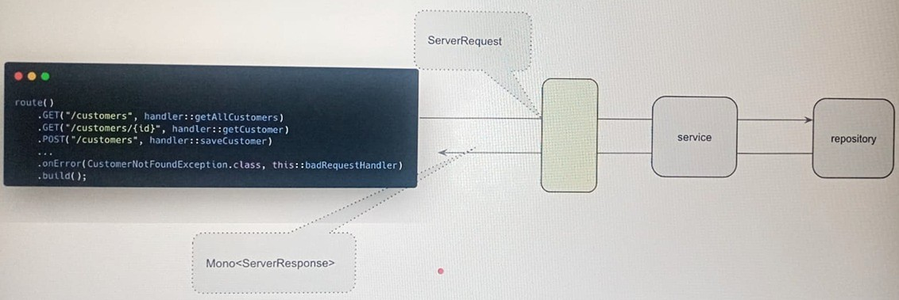
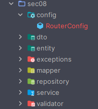

# 🛣️ Sección 08: Functional Endpoints

---

## ⚙️ Configuración inicial

- Creamos el directorio correspondiente a la sección `/sec08` en `webflux-playground`.
- En el archivo `application.yml` definimos la sección activa:
  ````yml
  section: sec08
  ````

---

## 📖 Introducción

Tradicionalmente, hemos expuesto nuestras APIs utilizando controladores anotados, una aproximación que nos resulta
familiar y funciona muy bien. Por ejemplo, este es un controlador típico con anotaciones como `@GetMapping`:

````java

@GetMapping(path = "/{customerId}")
public Mono<ResponseEntity<CustomerResponse>> getCustomer(@PathVariable Long customerId) {
    return this.customerService.getCustomer(customerId)
            .map(ResponseEntity::ok);
}
````

### 🚀 Functional Endpoints en Spring WebFlux

Sin embargo, `Spring WebFlux` también ofrece una alternativa basada en `programación funcional`:
`los Functional Endpoints`.

Con este enfoque:

- La lógica de enrutamiento se define mediante `funciones puras`, declaradas como beans.
- Los endpoints se configuran explícitamente y se asocian a funciones que manejan la solicitud.
- Podemos incluso definir manejadores de errores dentro del mismo flujo funcional.

Ejemplo de definición de rutas:

````bash
route()
  .GET("/api/v1/customers", handler::getAllCustomers)
  .GET("/api/v1/customers/{customerId}", handler::getCustomer)
  .POST("/api/v1/customers", handler::saveCustomer)
  ...
  .onError(CustomerNotFoundException.class, this::badRequestHandler)
  .build();
````



### 📌 Diferencias clave

Al usar `Functional Endpoints`:

- Definimos rutas que redirigen a funciones `(HandlerFunction)` que procesan la solicitud.
- Estas funciones extraen datos, invocan la capa de servicio y retornan respuestas.
- El enrutamiento y la lógica de negocio quedan `separados y más explícitos`.

### ⚠️ Nota importante

> El uso de `Functional Endpoints es completamente opcional`.  
> Podemos seguir utilizando controladores anotados `(@RestController)` si ese enfoque se adapta mejor a nuestras
> necesidades.

### 🌟 Ventajas de los Functional Endpoints

- Mayor flexibilidad: control granular del flujo de solicitudes.
- Apropiado para aplicaciones pequeñas o personalizadas, donde las rutas se definen de forma explícita.
- Separación clara entre enrutamiento y lógica de negocio, lo que facilita el mantenimiento.

## 🛠️ Router Configuration

En el paquete `sec08` copiamos el contenido del paquete `sec06`, pero **sin incluir** los directorios `advice` ni el
`controller`. Además, creamos un nuevo directorio llamado `router` y dentro de él definimos la clase de configuración
`CustomerRouter`.



### 📌 Clase de configuración `CustomerRouter`

Nuestra clase expone un bean del tipo `RouterFunction`, el cual será implementado en el siguiente apartado.

Equivalente a una clase anotada con `@RestController`, aquí **solo se definen las rutas**.  
La diferencia es que en lugar de usar anotaciones como `@GetMapping` o `@PostMapping`, declaramos las rutas de forma
funcional y explícita.

Por ahora retornamos `null` y dejamos la estructura preparada; más adelante realizaremos la implementación.

````java

@Configuration
public class CustomerRouter {
    @Bean
    public RouterFunction<ServerResponse> customerRoutes() {
        return null;
    }
}
````

#### 🔍 Explicación

- `CustomerRouter`. Es la clase de configuración que contendrá todas las rutas funcionales relacionadas con `Customer`.
- `RouterFunction<ServerResponse>`. Define cómo las solicitudes HTTP se enrutan hacia funciones que generan una
  respuesta `(ServerResponse)`.
- `Bean de configuración`. Al exponerlo como un `@Bean`, Spring lo registra en el contexto y lo utiliza para manejar
  las rutas de la aplicación.
- `Estructura inicial`. En este punto el método retorna `null`, pero en el siguiente paso implementaremos las rutas
  reales (`GET`, `POST`, etc.) que apuntarán a nuestros handlers.

## 🧩 Request Handler: `CustomerHandler`

Aquí vive la lógica equivalente a los métodos del controlador: `recibir la request`, `validar datos de entrada` y
`delegar al servicio`. En otras palabras, el `CustomerHandler` cumple el mismo rol que un `@RestController`, pero en el
mundo de los **functional endpoints**.

### 🔄 El operador `.as()`

El método `allCustomers()` utiliza el operador `.as()`. Este operador es básicamente una **transformación de nivel
superior**. Su firma para un publisher del tipo flux es:

````bash
public final <P> P as(Function<? super Flux<T>, P> transformer)
````

- Recibe el `Flux<T>` como argumento de una función transformadora, permitiéndote operar sobre él de forma directa.
- Retorna lo que esa función devuelva, que puede ser cualquier tipo `P`, no necesariamente otro `Flux` o `Mono`.
- El `P` se `infiere automáticamente` por el compilador según lo que retorne la función lambda que le pasemos.

Ejemplo en nuestro caso:

````bash
.as(customerResponseFlux ->
    ServerResponse.ok().body(customerResponseFlux, CustomerResponse.class))
//  ^^^^^^^^^^^^^^^^^^^^^^^^^^^^^^^^^^^^^^^^^^^^^^^^^^^^^^^^^^^^^^^^^^^^^^^^^^
//  Esto retorna Mono<ServerResponse>, entonces P = Mono<ServerResponse>
````

👉 Como `ServerResponse.ok().body(...)` retorna `Mono<ServerResponse>`, el compilador infiere que
`P = Mono<ServerResponse>`. De esta forma, el método `allCustomers()` puede retornar directamente
`Mono<ServerResponse>`.

### 📌 Equivalente sin `.as()`

El mismo código podría escribirse sin `.as()`:

````java
public Mono<ServerResponse> allCustomers(ServerRequest request) {
    Flux<CustomerResponse> flux = this.customerService.getAllCustomers();
    return ServerResponse.ok().body(flux, CustomerResponse.class);
}
````

- `.as()` simplemente permite mantener un estilo fluent/encadenado sin romper la cadena de operadores reactivos.
- Tanto `Flux` como `Mono` tienen su propio `.as()` con el mismo principio.

### 🧱 Código completo del `CustomerHandler`

````java

@Slf4j
@RequiredArgsConstructor
@Component
public class CustomerHandler {

    private final CustomerService customerService;

    public Mono<ServerResponse> allCustomers(ServerRequest request) {
        return this.customerService.getAllCustomers()
                .doOnNext(customerResponse -> log.info("{}", customerResponse))
                .as(customerResponseFlux ->
                        ServerResponse.ok().body(customerResponseFlux, CustomerResponse.class));
    }

    public Mono<ServerResponse> getCustomer(ServerRequest request) {
        return this.customerService.getCustomer(this.customerId(request))
                .flatMap(customerResponse ->
                        ServerResponse.ok().bodyValue(customerResponse));
    }

    public Mono<ServerResponse> saveCustomer(ServerRequest request) {
        return request.bodyToMono(CustomerRequest.class)
                .transform(CustomerValidator.validate())
                .flatMap(this.customerService::saveCustomer)
                .flatMap(customerResponse ->
                        ServerResponse.status(HttpStatus.CREATED).bodyValue(customerResponse));
    }

    public Mono<ServerResponse> updateCustomer(ServerRequest request) {
        return request.bodyToMono(CustomerRequest.class)
                .transform(CustomerValidator.validate())
                .flatMap(customerRequest ->
                        this.customerService.updateCustomer(this.customerId(request), customerRequest))
                .flatMap(customerResponse ->
                        ServerResponse.ok().bodyValue(customerResponse));
    }

    public Mono<ServerResponse> deleteCustomer(ServerRequest request) {
        return this.customerService.deleteCustomer(this.customerId(request))
                .then(ServerResponse.noContent().build());
    }

    private long customerId(ServerRequest request) {
        return Long.parseLong(request.pathVariable("customerId"));
    }
}
````

### 🔍 Helper privado `customerId(...)`

El método `customerId(...)` centraliza la extracción del path variable para no repetir:

````bash
Long.parseLong(request.pathVariable("customerId"))
````

> ⚠️ **Nota:**
> - El `RouterFunction` garantiza que el path variable `{customerId}` **existe** (si no existiera, el router retorna un
    `404` antes de llegar al handler).
> - Pero `no garantiza` que sea un valor numérico válido.
> - Una petición como `PUT /api/v1/customers/abc` llegaría al handler y lanzaría un `NumberFormatException`, que debe
    ser manejado por un `WebExceptionHandler` global.

