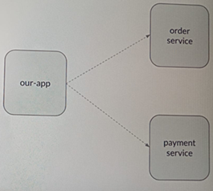
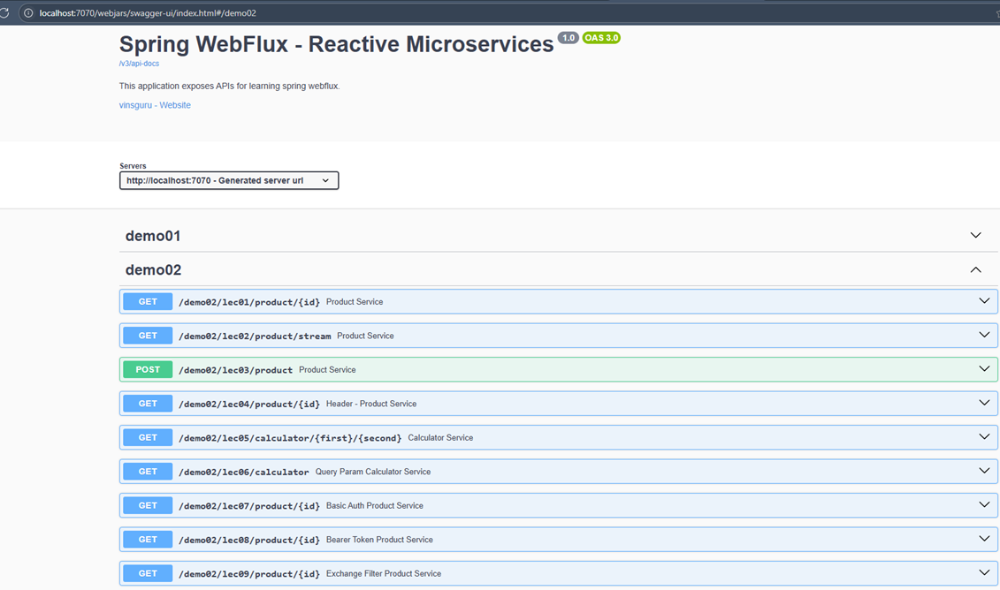

# 🌐 Sección 09: WebClient - Non-Blocking HTTP Client

---

## ⚙️ Configuración inicial

En esta sección continuamos trabajando sobre el proyecto **`webflux-playground`**, pero con una diferencia importante
respecto a las secciones anteriores:

- 📂 **Directorio de trabajo**:
    - No utilizaremos el código fuente ubicado en `src/main/java/dev/magadiflo/app`.
    - En su lugar, trabajaremos netamente sobre el directorio de **tests**: `src/test/java/dev/magadiflo/app`.

- 🗂️ **Nueva carpeta de pruebas**:
    - Dentro del directorio de test creamos un subdirectorio llamado **`/sec09`**, donde organizaremos todos los casos
      de prueba relacionados con esta sección.

- ⚡ **Configuración mínima**:
    - No es necesario realizar cambios adicionales en el archivo `application.yml`, ya que las pruebas se ejecutarán
      directamente sobre el entorno de test y no requieren configuración extra.

---

## 🧠 Introducción

`Spring WebFlux` incluye un `cliente HTTP no bloqueante` llamado `WebClient`, el cual forma parte de su stack reactivo.
Este cliente proporciona una **API fluida y funcional**, construida sobre el motor `Reactor`, permitiendo componer
lógica asíncrona de manera declarativa sin gestionar explícitamente subprocesos o sincronización.

`WebClient` es:

- Completamente `no bloqueante`.
- Compatible con `streaming` de datos.
- Utiliza los mismos códecs que el lado del servidor (por ejemplo, `Jackson`, `JAXB`, etc.) para `codificar/decodificar`
  el contenido de las `solicitudes` y `respuestas`.

Para funcionar, `WebClient` necesita una `biblioteca cliente HTTP` subyacente. `Spring` ofrece soporte integrado para
varios conectores:

- `Reactor Netty` (por defecto)
- JDK HttpClient
- Jetty Reactive HttpClient
- Apache HttpComponents
- Además, es posible registrar otros conectores mediante un `ClientHttpConnector` personalizado.

### 🔍 Características clave de WebClient

- API fluida, basada en Reactor.
- Cliente `no bloqueante` para enviar solicitudes y procesar respuestas HTTP.
- Construido sobre `reactor-netty`, aunque puedes sustituirlo por otros conectores.
- Una vez creado, el `WebClient` es `inmutable` y `seguro` para su uso en `múltiples hilos` (`thread-safe`).
- Permite la personalización de encabezados, autenticación, codificadores, interceptores, etc.
- Ideal para arquitecturas de **microservicios** y escenarios de **alta concurrencia**.

### 📊 Comparación rápida: RestTemplate vs WebClient

| Aspecto                | RestTemplate (clásico) | WebClient (reactivo)     |
|------------------------|------------------------|--------------------------|
| Naturaleza             | Bloqueante             | No bloqueante            |
| Modelo de programación | Imperativo             | Declarativo (Reactor)    |
| Concurrencia           | Limitada por hilos     | Escalable con event-loop |
| Streaming              | No soportado           | Soportado                |
| Estado                 | Mutable                | Inmutable, thread-safe   |

### 🧩 Caso de uso en nuestra aplicación

Supongamos que tenemos una aplicación principal llamada `our-app`, la cual necesita interactuar con dos servicios
externos:

- `order-service`
- `payment-service`

En una arquitectura de microservicios es común que un servicio consuma datos o desencadene acciones en otros.  
Para ello, definimos dos beans de `WebClient`, cada uno con una **URL base** para comunicarse con los servicios
externos.

📷 Código y diagrama referencial:

````java
// Create once, expose as a bean
@Bean
public WebClient orderClient() {
    return WebClient.builder()
            .baseUrl("http://order-service.com")
            .build();
}

@Bean
public WebClient paymentClient() {
    return WebClient.builder()
            .baseUrl("http://payment-service.com")
            .build();
}
````

````java
// Use  it everywhere
@Autowired
private WebClient orderClient;
````



📌 Observaciones:

- Configurar `baseUrl` evita repetir host y puerto en cada solicitud.
- El diagrama muestra la comunicación entre `our-app` y los servicios externos.

### 🔁 Mutabilidad controlada

Aunque un `WebClient` `es inmutable una vez construido`, si necesitamos modificar algún aspecto de su configuración
(por ejemplo, agregar un `header`, cambiar el `timeout`, etc.), podemos hacerlo utilizando el método `.mutate()`. Esto
permite crear una copia modificada del `WebClient` original sin afectar su configuración base.

````java
WebClient originalClient = WebClient.builder()
        .baseUrl("http://order-service.com")
        .build();

WebClient modifiedClient = originalClient
        .mutate()
        .defaultHeader("Authorization", "Bearer token")
        .build();
````

### 🧠 Conclusión

- **WebClient** es el reemplazo moderno y reactivo de **RestTemplate.**
- Es **no bloqueante, thread-safe** e ideal para arquitecturas de microservicios.
- Permite configurar clientes con **baseUrl**, personalizar headers y mutar configuraciones sin perder inmutabilidad.
- Su integración con Reactor lo convierte en una herramienta poderosa para construir APIs escalables y eficientes.

## 🌐 Servicios externos

En esta sección nos apoyaremos en un **servicio externo** cuyo `jar` se encuentra en la ruta de nuestro proyecto:  
`servers/external-services.jar`. Este servicio nos proporcionará una serie de endpoints que estaremos consumiendo con
`WebClient`.

### ▶️ Ejecución del servicio externo

Desde la raíz del proyecto, ejecutamos el siguiente comando:

````bash
D:\programming\spring\01.udemy\03.vinoth_selvaraj\spring-webflux-masterclass (feature/section-9)                                                                                                                                              
$ java -jar .\servers\external-services.jar                                                                                                                                                                                                   
                                                                                                                                                                                                                                              
  .   ____          _            __ _ _                                                                                                                                                                                                       
 /\\ / ___'_ __ _ _(_)_ __  __ _ \ \ \ \                                                                                                                                                                                                      
( ( )\___ | '_ | '_| | '_ \/ _` | \ \ \ \                                                                                                                                                                                                     
 \\/  ___)| |_)| | | | | || (_| |  ) ) ) )                                                                                                                                                                                                    
  '  |____| .__|_| |_|_| |_\__, | / / / /                                                                                                                                                                                                     
 =========|_|==============|___/=/_/_/_/                                                                                                                                                                                                      
 :: Spring Boot ::                (v3.2.0)                                                                                                                                                                                                    
                                                                                                                                                                                                                                              
2026-04-08T11:01:49.415-05:00  INFO 20052 --- [           main] c.v.e.ExternalServicesApplication        : Starting ExternalServicesApplication v0.0.1-SNAPSHOT using Java 25.0.2 with PID 20052 (D:\programming\spring\01.udemy\03.vinoth_sel
varaj\spring-webflux-masterclass\servers\external-services.jar started by magadiflo in D:\programming\spring\01.udemy\03.vinoth_selvaraj\spring-webflux-masterclass)                                                                          
2026-04-08T11:01:49.420-05:00  INFO 20052 --- [           main] c.v.e.ExternalServicesApplication        : No active profile set, falling back to 1 default profile: "default"                                                                
WARNING: A terminally deprecated method in sun.misc.Unsafe has been called                                                                                                                                                                    
WARNING: sun.misc.Unsafe::objectFieldOffset has been called by io.netty.util.internal.PlatformDependent0$4 (jar:nested:/D:/programming/spring/01.udemy/03.vinoth_selvaraj/spring-webflux-masterclass/servers/external-services.jar/!BOOT-INF/l
ib/netty-common-4.1.101.Final.jar!/)                                                                                                                                                                                                          
WARNING: Please consider reporting this to the maintainers of class io.netty.util.internal.PlatformDependent0$4                                                                                                                               
WARNING: sun.misc.Unsafe::objectFieldOffset will be removed in a future release                                                                                                                                                               
2026-04-08T11:01:51.496-05:00  INFO 20052 --- [           main] o.s.b.web.embedded.netty.NettyWebServer  : Netty started on port 7070                                                                                                         
2026-04-08T11:01:51.529-05:00  INFO 20052 --- [           main] c.v.e.ExternalServicesApplication        : Started ExternalServicesApplication in 2.614 seconds (process running for 3.347)                                                   
````

#### 📌 Observaciones:

- El servicio se levanta en el `puerto 7070` usando `Netty` como servidor embebido.
- No requiere configuración adicional de perfiles, ya que arranca con el perfil `default`.

### 🌍 Acceso a SwaggerUI

Una vez iniciado, accedemos a la URL: http://localhost:7070.

Allí veremos la interfaz de `SwaggerUI`, que expone los endpoints disponibles. En particular, la sección `demo02`
contiene `9 endpoints` que utilizaremos para nuestros ejemplos de consumo con `WebClient`.



## ⚙️ Configuración del proyecto

En esta sección no vamos a escribir pruebas unitarias ni de integración en el sentido tradicional.  
Nuestro objetivo principal será **experimentar con el uso de `WebClient` en Spring WebFlux**, observar su
comportamiento y analizar cómo recibimos las respuestas de los servicios externos.

### 🗂️ Organización del código de prueba

- 📂 Directorio de trabajo: `src/test/java/dev/magadiflo/app/sec09`
- En este directorio crearemos una **clase base abstracta** que contendrá utilitarios comunes.
- Esta clase nos permitirá **reutilizar configuración** y simplificar la creación de clientes `WebClient` en diferentes
  pruebas.

### 🧩 Clase base: `AbstractWebClient`

````java

@Slf4j
abstract class AbstractWebClient {

    // Method genérico para imprimir cada item recibido en el flujo
    protected <T> Consumer<T> print() {
        return item -> log.info("recibido: {}", item);
    }

    // WebClient con configuración por defecto
    protected WebClient createWebClient() {
        return this.createWebClient(builder -> {
        });
    }

    // WebClient con posibilidad de personalización a través del consumidor
    protected WebClient createWebClient(Consumer<WebClient.Builder> consumer) {
        WebClient.Builder builder = WebClient.builder().baseUrl("http://localhost:7070/demo02");
        consumer.accept(builder);
        return builder.build();
    }
}
````

#### 📌 Explicación del código

- Método `print()`:
    - Utilitario genérico que imprime en logs cada elemento recibido en el flujo reactivo.
    - Útil para depurar y observar cómo llegan los datos desde el servicio externo.

- Método `createWebClient()` (por defecto):
    - Crea un `WebClient` con configuración básica y la URL base apuntando al servicio externo en
      `http://localhost:7070/demo02`.

- Método `createWebClient(Consumer<WebClient.Builder>)`:
    - Permite personalizar el cliente antes de construirlo (ej. agregar headers, configurar timeouts, etc.).
    - Esto nos da flexibilidad sin perder la simplicidad de tener una configuración común.

## 🌐 Solicitud simple con GET

Antes de comenzar con la llamada HTTP, necesitamos levantar el servicio externo que actuará como **backend de prueba**:

```bash
D:\programming\spring\01.udemy\03.vinoth_selvaraj\spring-webflux-masterclass (feature/section-9)
$ java -jar .\servers\external-services.jar
````

### 🗂️ Preparación del DTO

Creamos el directorio `/dto` y dentro de él definimos el record `Product`, que modelará la información recibida desde
los endpoints:

````java
// src/test/java/dev/magadiflo/app/sec09/dto/Product.java
public record Product(Integer id,
                      String description,
                      Integer price) {
}
````

### 📡 Primera solicitud con WebClient

Vamos a realizar una solicitud simple de tipo `GET` utilizando `WebClient`.

> ⚠️ **Importante:**  
> No estamos escribiendo pruebas unitarias en sentido estricto. Estas clases de prueba son simplemente una manera
> rápida y práctica de experimentar con `WebClient`, observar su comportamiento y evitar crear controladores o
> servicios solo para pruebas.

````java
class Lec01MonoTest extends AbstractWebClient {

    private final WebClient client = this.createWebClient();

    @Test
    void simpleGet() throws InterruptedException {
        this.client.get()
                .uri("/lec01/product/{id}", 1)
                .retrieve()
                .bodyToMono(Product.class)
                .doOnNext(this.print())
                .subscribe();

        // Permite que la suscripción finalice antes de que termine el test
        Thread.sleep(Duration.ofSeconds(2));
    }
}
````

### Explicación

- `retrieve()` inicia la ejecución de la solicitud y espera una respuesta con cuerpo.
- `bodyToMono(Product.class)` indica que esperamos un solo objeto `Product` como resultado (por eso usamos `Mono`).
- `doOnNext(this.print())` imprime el resultado cuando llega la respuesta.
- `subscribe()` dispara la ejecución de la llamada asíncrona.
- `Thread.sleep(...)` se utiliza aquí como una manera simple (aunque no recomendable para producción) de evitar que el
  método termine antes de recibir la respuesta.
    - En un contexto real, usaríamos algo como `StepVerifier`, `block()` (solo en pruebas) o pruebas con
      `@SpringBootTest` para manejar este escenario correctamente.

## ⚡ Solicitudes concurrentes sin bloqueo

En este apartado vamos a demostrar cómo realizar **múltiples solicitudes concurrentes y no bloqueantes** utilizando
`WebClient`, una de las principales herramientas reactivas de **Spring WebFlux**.

### 🧠 Recordando algunos conceptos

- **WebClient** está basado en **Reactor Netty**, el cliente HTTP reactivo por defecto.
- **Reactor Netty**:
    - Utiliza un **modelo de un hilo por núcleo** (`1 hilo/CPU`).
    - Está diseñado para ser **no bloqueante**, es decir, no espera activamente por una respuesta, liberando recursos
      mientras tanto.

### 📡 Escenario de prueba

El endpoint externo `/lec01/product/{id}` tiene la siguiente descripción:

> "Proporcione los detalles del producto para el ID de producto indicado. Se admiten ID de producto entre 1 y 100.
> `Cada llamada tarda aproximadamente 1 segundo`."

📌 Esto significa que:

- Si ejecutáramos **100 solicitudes secuenciales y bloqueantes**, el tiempo total sería de ~100 segundos.
- Usando `WebClient` con suscripciones reactivas, todas las solicitudes se ejecutan **en paralelo**, y la respuesta
  total se obtiene en **1 a 2 segundos**.

### 🧩 Código de prueba

````java

class Lec01MonoTest extends AbstractWebClient {

    private final WebClient client = this.createWebClient();

    @Test
    void concurrentRequests() throws InterruptedException {
        for (int i = 1; i <= 100; i++) {
            this.client.get()
                    .uri("/lec01/product/{id}", i)
                    .retrieve()
                    .bodyToMono(Product.class)
                    .doOnNext(this.print())
                    .subscribe();
        }

        Thread.sleep(Duration.ofSeconds(2));
    }
}
````

### 📊 Resultados observados

En la consola del IDE, las 100 solicitudes llegan prácticamente al mismo tiempo `(~2.8 segundos)`, confirmando la
naturaleza concurrente y no bloqueante del flujo:

````bash
12:21:51.828 [reactor-http-nio-4] INFO dev.magadiflo.app.sec09.AbstractWebClient -- recibido: Product[id=30, description=product-30, price=142]
12:21:51.828 [reactor-http-nio-6] INFO dev.magadiflo.app.sec09.AbstractWebClient -- recibido: Product[id=3, description=product-3, price=412]
12:21:51.828 [reactor-http-nio-5] INFO dev.magadiflo.app.sec09.AbstractWebClient -- recibido: Product[id=38, description=product-38, price=742]
...
12:21:51.914 [reactor-http-nio-1] INFO dev.magadiflo.app.sec09.AbstractWebClient -- recibido: Product[id=90, description=product-90, price=997]
12:21:51.916 [reactor-http-nio-7] INFO dev.magadiflo.app.sec09.AbstractWebClient -- recibido: Product[id=97, description=product-97, price=635]
12:21:51.918 [reactor-http-nio-5] INFO dev.magadiflo.app.sec09.AbstractWebClient -- recibido: Product[id=100, description=product-100, price=123]
12:21:51.920 [reactor-http-nio-1] INFO dev.magadiflo.app.sec09.AbstractWebClient -- recibido: Product[id=94, description=product-94, price=971]
````

### 📌 ¿Qué estamos demostrando?

En un modelo tradicional y bloqueante (ej. `RestTemplate`):

- Cada solicitud ocupa un hilo hasta recibir la respuesta.
- Los recursos quedan bloqueados, limitando la escalabilidad.

Con `WebClient` y `Reactor Netty`:

- ✅ Un solo hilo puede iniciar múltiples solicitudes concurrentemente.
- ✅ Mientras espera las respuestas, el hilo no se bloquea.
- ✅ Las respuestas llegan en paralelo y se manejan de forma asíncrona.
- ✅ Se logra alta escalabilidad con mínimo uso de recursos.

