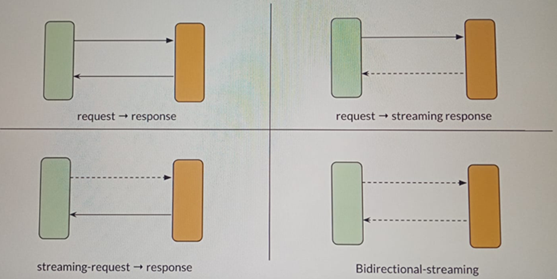

# 🌊 Sección 10: Streaming

---

## ⚙️ Configuración inicial

- Creamos el directorio correspondiente a la sección `/sec10` en `webflux-playground`.
- En el archivo `application.yml` definimos la sección activa:
  ````yml
  section: sec10
  ````

---

## 📖 Introducción: Patrones de comunicación

En la siguiente imagen podemos observar los distintos patrones de comunicación entre un `cliente-servidor`:

- request ➝ response
- request ➝ streaming response
- streaming-request ➝ response
- Bidirectional-streaming



El concepto de `streaming` en sistemas `cliente-servidor` se refiere a la capacidad de **enviar y recibir datos
de manera continua**, en lugar de limitarse al modelo tradicional de *request-response*.

En el contexto de `Spring WebFlux` y `Reactive Streams`, esto se logra gracias a los tipos `Mono` y `Flux`:

- `Mono<T>` → representa **0 o 1 elemento** (ideal para request-response clásico).
- `Flux<T>` → representa **0..N elementos** (ideal para flujos continuos de datos).

Estos tipos permiten implementar patrones de comunicación más avanzados, que hacen que las aplicaciones sean
interactivas, eficientes y escalables, especialmente en escenarios de tiempo real o alto volumen de datos.

### 🔑 Los cuatro patrones principales

### ↔️ 1. Request-Response (clásico)

Tradicionalmente, los sistemas han utilizado un modelo de comunicación `request-response`.
En este patrón, el cliente envía una solicitud al servidor backend y este responde con un único resultado. La mayoría
de nuestras aplicaciones web y `APIs REST` siguen este enfoque.

Sin embargo, gracias al tipo de Publisher `Flux`, en `WebFlux` podemos implementar patrones de comunicación más
avanzados y eficientes, especialmente útiles cuando trabajamos con flujos de datos en tiempo real.

### 🔄 2. Request-Stream Response

En este modelo, el cliente realiza una solicitud única al servidor, pero el servidor responde con múltiples elementos
emitidos como un flujo continuo de datos (stream).

Ejemplos de uso:

- Descarga de archivos en fragmentos (chunks).
- Aplicaciones como Uber: al reservar un viaje, podrías recibir actualizaciones periódicas como "el conductor está a 8
  km", "a 5 km", etc.
- Notificaciones en tiempo real desde el servidor.

Este patrón evita que el cliente tenga que hacer múltiples peticiones para recibir actualizaciones, ya que es el
`servidor quien envía los datos de forma proactiva`.

### 🔄 3. Streaming Request–Single Response

En este patrón, el cliente envía un flujo de datos al servidor, pero el servidor responde con una sola respuesta final,
una vez que ha recibido toda la información.

Ejemplos de uso:

- Carga de archivos divididos en bloques.
- Envío continuo de datos desde sensores (por ejemplo, frecuencia cardíaca desde un Apple Watch), donde el servidor
  puede dar una respuesta procesada tras recibir todos los datos.

### 🔄 4. Bidirectional Streaming

Este patrón combina los dos anteriores: tanto el cliente como el servidor envían y reciben flujos de datos
simultáneamente.

Ejemplos de uso:

- Aplicaciones de chat en tiempo real.
- Juegos multijugador en línea.
- Herramientas colaborativas como pizarras compartidas o editores de texto en tiempo real.

## 📚 JSON Array

El `JSON Array` es un formato ampliamente utilizado en el diseño de `APIs REST`.
Por ejemplo:

- En una petición `POST` para crear múltiples productos.
- En una petición `GET` para recuperar una lista de productos.

En ambos casos, es común emplear un `JSON Array`.

### ⚠️ Problema con grandes volúmenes de datos

El inconveniente surge cuando realizamos una petición `GET` para obtener, por ejemplo, los primeros mil productos.
La respuesta comienza con un corchete de apertura (`[`), seguido de objetos JSON `{...}` separados por comas,
y finaliza con un corchete de cierre (`]`).

Ejemplo:

````bash
[
  {"id": 123, "name": "Product A", ...},
  {"id": 234, "name": "Product B", ...},
  {"id": 345, "name": "Product C", ...},
  ...
]
````

### 🚨 Escenario de falla

Imaginemos que el servidor envía los datos uno por uno y justo en el producto `1000` ocurre una falla, impidiendo el
envío del corchete de cierre (`]`).

- El cliente no podrá analizar la respuesta correctamente.
- La estructura del `JSON Array` se rompe.
- Aunque el servidor haya entregado casi todos los productos, los datos se vuelven inutilizables.

Este es un caso de **todo o nada**: sin el cierre correcto, el procesamiento de los datos no es viable.

### 📉 Limitaciones del JSON Array

- Adecuado para conjuntos de datos **pequeños o bien estructurados.**
- Poco eficiente cuando se manejan **grandes volúmenes de información.**
- Vulnerable a fallas de transmisión: basta un error para invalidar toda la respuesta.

### ✅ Conclusión

El formato `JSON Array` funciona bien en escenarios simples, pero **no escala de manera eficiente** cuando se trata
de grandes cantidades de datos o transmisión en tiempo real.

Es aquí donde entra en juego `JSON Lines`, un formato más robusto y tolerante a fallos, ideal para streaming de datos.

## 📜 JSON Lines (NDJSON: Newline Delimited JSON)

El formato `JSON Lines` conocido también como `(NDJSON) Newline Delimited JSON o JSON delimitado por nueva línea`, se
estructura de la siguiente manera:

````bash
{"id": 123, "name": "Product A", ...}
{"id": 234, "name": "Product B", ...}
{"id": 345, "name": "Product C", ...}
...
````

### 📌 Características principales

- Cada línea representa un **objeto JSON autónomo.**
- No requiere un corchete de apertura/cierre como en `JSON Array`.
- Los datos pueden ser **leídos y procesados línea por línea,** lo que facilita el streaming.
- Es tolerante a fallos: si la transmisión se interrumpe, las líneas recibidas hasta ese momento siguen siendo válidas.

### 🚀 Ventajas frente a JSON Array

- **Procesamiento incremental:** el cliente puede consumir datos sin esperar a que se complete toda la respuesta.
- **Menor uso de memoria:** ideal para grandes volúmenes de información, ya que no es necesario cargar todo el
  conjunto en memoria.
- **Compatibilidad con streaming:** se integra naturalmente con `Flux` en `WebFlux`, permitiendo transmitir datos
  en tiempo real.

**💡 Ejemplo práctico:**  
Si un servidor transmite productos usando `JSON Lines`, el cliente puede empezar a mostrar resultados inmediatamente,
sin esperar a que se envíen los miles de productos completos.

### 📊 Comparación con JSON Array

| Aspecto                 | JSON Array                          | JSON Lines (NDJSON)                     |
|-------------------------|-------------------------------------|-----------------------------------------|
| **Estructura**          | Corchetes ``[`` ``]`` y comas       | Cada línea es un objeto JSON            |
| **Procesamiento**       | Todo o nada (requiere cierre)       | Incremental, línea por línea            |
| **Tolerancia a fallos** | Baja: un error invalida todo        | Alta: las líneas previas siguen válidas |
| **Uso de memoria**      | Elevado en grandes volúmenes        | Bajo, procesamiento en streaming        |
| **Escenarios ideales**  | Datos pequeños y bien estructurados | Datos masivos, tiempo real, IoT         |

### ✅ Conclusión

- `JSON Array` sigue siendo útil en escenarios donde los datos tienen una relación estrecha
  (ej. un producto con su lista de reseñas).
- Sin embargo, para **millones de registros** o transmisión en tiempo real, `JSON Lines` es una alternativa más
  eficiente y robusta.
- En aplicaciones reactivas con **Spring WebFlux**, `JSON Lines` se convierte en el formato ideal para implementar
  patrones de streaming.

## 🏗️ Construcción del proyecto de ejemplo

En este apartado vamos a construir nuestro proyecto creando el paquete `sec10` para poder jugar con el `streaming`.
La idea es simular escenarios con **millones de productos**, explorando operaciones de carga, descarga y transmisión de
datos en tiempo real.

Como lo mencioné anteriormente, en esta sección estaremos trabajando sobre el paquete `sec10` de nuestro proyecto
`webflux-playground`.

### 📦 Entidad `Product`

Creamos la entidad `Product` mapeada a la tabla `products`:

````java

@ToString
@AllArgsConstructor
@NoArgsConstructor
@Builder
@Setter
@Getter
@Table(name = "products")
public class Product {
    @Id
    private Long id;
    private String description;
    private Integer price;
}
````

### 📂 Repositorio `ProductRepository`

Definimos el repositorio reactivo para la entidad:

````java
public interface ProductRepository extends ReactiveCrudRepository<Product, Long> {
}
````

Este repositorio nos permitirá realizar operaciones CRUD de manera reactiva, aprovechando `Flux` y `Mono`.

### 📑 DTOs de producto

Es fundamental separar la entidad de los objetos que exponemos en la API. Creamos los DTOs para solicitudes y
respuestas:

````java
public record ProductRequest(String description,
                             Integer price) {
}

public record ProductResponse(Long id,
                              String description,
                              Integer price) {
}
````

### 🔄 Clase mapeadora `ProductMapper`

Creamos un componente para convertir entre entidad y DTO:

````java

@Component
public class ProductMapper {
    public Product toProduct(ProductRequest request) {
        return Product.builder()
                .description(request.description())
                .price(request.price())
                .build();
    }

    public ProductResponse toProductResponse(Product product) {
        return new ProductResponse(
                product.getId(),
                product.getDescription(),
                product.getPrice()
        );
    }
}
````

### ✅ Conclusión

Con estas clases iniciales (`Product`, `ProductRepository`, `DTOs` y `ProductMapper`) ya tenemos la base del modelo de
datos para la sección de `streaming`.
Esto nos permitirá simular escenarios de alta carga y transmisión continua, manteniendo una arquitectura limpia y
preparada para trabajar con `Flux` y `Mono`.

## 🗄️ Product Service

Creamos el servicio con dos métodos:

- Uno para guardar un `Flux` de productos.
- Otro para recuperar la cantidad de productos que tiene la base de datos.

````java
public interface ProductService {
    Flux<ProductResponse> saveProducts(Flux<ProductRequest> productRequestFlux);

    Mono<Long> countProducts();
}
````

````java

@RequiredArgsConstructor
@Service
public class ProductServiceImpl implements ProductService {

    private final ProductRepository productRepository;
    private final ProductMapper productMapper;

    @Override
    public Flux<ProductResponse> saveProducts(Flux<ProductRequest> productRequestFlux) {
        return productRequestFlux
                .map(this.productMapper::toProduct)
                .as(this.productRepository::saveAll)
                .map(this.productMapper::toProductResponse);
    }

    @Override
    public Mono<Long> countProducts() {
        return this.productRepository.count();
    }
}
````

### 📌 Explicación

- `saveProducts(Flux<ProductRequest>)`
    - Recibe un flujo de solicitudes `(Flux<ProductRequest)`.
    - Cada solicitud se transforma en entidad `Product` mediante el `ProductMapper`.
    - Se guarda de forma reactiva con `saveAll`.
    - Finalmente, se convierte en `ProductResponse` para devolver al cliente.
    - 👉 Este método demuestra cómo procesar y persistir datos en streaming.
- `countProducts()`
    - Devuelve un `Mono<Long>` con el total de productos en la base de datos.
    - Útil para verificar la cantidad de registros y validar escenarios de carga masiva.

### ✅ Conclusión

El `ProductService` abstrae la lógica de negocio y permite:

- Guardar productos en streaming de manera eficiente.
- Consultar el volumen de datos en la base de forma reactiva.

Esto nos prepara para los siguientes pasos, donde expondremos endpoints que aprovechen estos métodos para
**simular escenarios de streaming con millones de productos.**

## 📤 Product Streaming Upload API

Anteriormente, creamos dos DTOs:

- `ProductRequest`: para mapear los datos del request.
- `ProductResponse`: para retornar información hacia el cliente.

En este caso, como vamos a procesar un flujo de `ProductRequest`, a nuestro negocio le interesa **emitir un solo
resultado** luego de todo el procesamiento.

Normalmente, podríamos emitir un `Flux<ProductResponse>`, pero aquí buscamos emitir una sola respuesta en un `Mono`,
que informe al cliente la **cantidad de productos** que existen en la base de datos, acompañado de un identificador
único para simular una confirmación de carga.

````java
public record UploadResponse(UUID confirmationId,
                             Long productCount) {
}
````

### ⚙️ Controlador REST

Este código define un controlador REST en Spring Boot para manejar la carga de productos usando programación reactiva
con `Spring WebFlux`:

````java

@Slf4j
@RequiredArgsConstructor
@RestController
@RequestMapping(path = "/api/v1/products")
public class ProductController {

    private final ProductService productService;

    @PostMapping(path = "/upload", consumes = MediaType.APPLICATION_NDJSON_VALUE)
    public Mono<UploadResponse> uploadProducts(@RequestBody Flux<ProductRequest> productRequestFlux) {
        log.info("Iniciando el proceso de upload de products");

        return this.productService.saveProducts(productRequestFlux.doOnNext(productRequest -> log.info("ProductRequest: {}", productRequest)))
                .then(this.productService.countProducts())
                .map(count -> new UploadResponse(UUID.randomUUID(), count));
    }
}
````

#### 📌 Explicación

- `@PostMapping` con `consumes = MediaType.APPLICATION_NDJSON_VALUE`
    - Indica que el endpoint `/upload` acepta datos en formato `NDJSON` `(application/x-ndjson)`.
    - Cada objeto JSON está en una línea independiente, lo que facilita el procesamiento en **streaming.**
- **Flujo de trabajo del método** `uploadProducts`:
    1. Recibe un `Flux<ProductRequest>` desde el cuerpo de la petición.
    2. Cada request se procesa y se guarda en la base de datos.
    3. Una vez completado el flujo, se obtiene el conteo total de productos `(Mono<Long>)`.
    4. Se construye un `UploadResponse` con un `UUID` aleatorio y el conteo de productos.
- **Beneficio:** el cliente recibe una confirmación única, incluso si se enviaron miles de productos en streaming.

#### 🧪 Ejemplo de NDJSON

````bash
{"id": 123, "name": "Product A", ...}
{"id": 234, "name": "Product B", ...}
{"id": 345, "name": "Product C", ...}
````

Cada línea representa un objeto JSON autónomo, lo que permite leer y procesar cada uno de manera independiente.

### ✅ Conclusión

Este endpoint demuestra cómo `Spring WebFlux` puede manejar cargas masivas de datos en formato `NDJSON`,
procesándolos en streaming y devolviendo una **respuesta única y compacta** al cliente.
