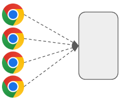
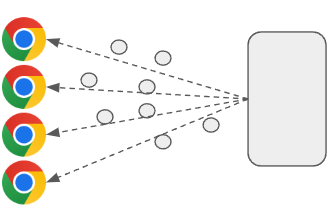
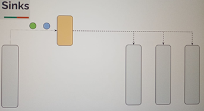
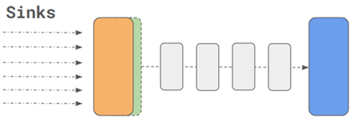
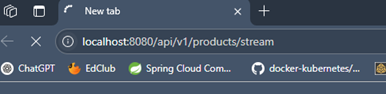
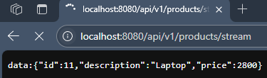
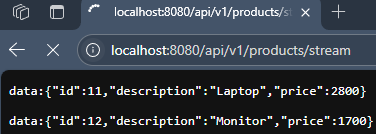
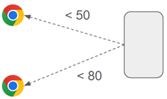

# 🌊 Sección 11: Server-Sent Events (SSE)

---

## ⚙️ Configuración inicial

- Creamos el directorio correspondiente a la sección `/sec11` en `webflux-playground`.
- En el archivo `application.yml` definimos la sección activa:
  ````yml
  section: sec11
  ````

---

## 📖 Introducción

En esta sección exploraremos los **eventos enviados por el servidor,** conocidos como `Server-Sent Events (SSE)` o
también como `Event Source`.

### 📌 Conceptos clave

- `Unidireccionalidad`: los datos fluyen `del servidor hacia el cliente`, no al revés.
- `Tiempo real`: ideal para enviar actualizaciones continuas como notificaciones, métricas, precios de mercado o
  mensajes de estado.
- `Formato estándar`: los eventos se transmiten como `texto plano` con el tipo `MIME` `text/event-stream`.
- `Compatibilidad`: los navegadores modernos soportan `SSE` a través de la API `EventSource`.

### 🚀 Diferencias con otras tecnologías

| Tecnología     | Dirección          | Uso típico                                        | Complejidad |
|----------------|--------------------|---------------------------------------------------|-------------|
| **SSE**        | Servidor ➝ Cliente | Notificaciones, actualizaciones en tiempo real    | Simple      |
| **WebSockets** | Bidireccional      | Chats, juegos online, colaboración en tiempo real | Mayor       |
| **Polling**    | Cliente ➝ Servidor | Consultas periódicas                              | Ineficiente |

👉 Con `SSE`, el servidor mantiene una conexión abierta y envía datos al cliente conforme estén disponibles, sin
necesidad de que el cliente haga múltiples solicitudes.

### ✅ Conclusión

- `SSE` es una solución ligera y eficiente para escenarios donde el servidor necesita **empujar datos en tiempo real**
  hacia el cliente.
- A diferencia de WebSockets, no requiere comunicación bidireccional, lo que lo hace más simple de implementar y
  mantener.
- En esta sección veremos cómo configurar endpoints SSE en **Spring WebFlux** y cómo consumirlos desde un cliente.

## 📖 Entendiendo el problema

Imaginemos los siguientes escenarios:

- Una **plataforma de noticias** que debe mostrar titulares en tiempo real.
- Un **sistema electoral en línea** que actualiza resultados conforme llegan.
- Un **sitio deportivo** que transmite los marcadores de un partido minuto a minuto.

En todos estos casos, múltiples usuarios se conectan simultáneamente desde sus navegadores para recibir información
actualizada —ya sean resultados electorales, marcadores deportivos o precios de acciones.

### 🔄 Implementación tradicional: `Polling`

En una arquitectura tradicional, el `frontend` tendría que `enviar solicitudes periódicas al backend`
(por ejemplo, cada segundo o cada 5 segundos) para verificar si hay nueva información.

Este mecanismo se conoce como `polling` y, aunque funcional, presenta varios inconvenientes:

- 📉 **Ineficiencia:** se generan muchas solicitudes innecesarias cuando no hay datos nuevos.
- ⚡ **Carga en el servidor:** el backend recibe tráfico constante, incluso sin tener nada que responder.
- 🕒 **Latencia:** la información puede tardar en llegar al cliente, ya que depende del intervalo configurado.

### 📌 Ejemplo ilustrativo

- Si configuramos el polling cada **5 segundos**, el cliente enviará 12 solicitudes por minuto.
- Si en ese minuto solo hay **1 actualización real**, las otras 11 solicitudes fueron innecesarias.
- Esto escala de forma negativa cuando miles de usuarios están conectados al mismo tiempo.



### ✅ Conclusión

El `polling` es una técnica simple pero poco eficiente para escenarios de tiempo real.
Necesitamos un mecanismo que:

- Mantenga la conexión abierta.
- Permita al servidor **empujar datos al cliente solo cuando haya novedades.**
- Reduzca el tráfico innecesario y mejore la experiencia del usuario.

> 👉 Aquí es donde entran en juego los `Server-Sent Events (SSE),` que veremos en detalle en los siguientes
> apartados.

## 📡 Solución con Server-Sent Events (SSE)

Aquí es donde entran en juego los `Server-Sent Events (SSE)`.
Este mecanismo permite al **servidor enviar mensajes automáticamente al cliente** (navegador) cuando hay nueva
información disponible.

En otras palabras:

- El cliente establece una conexión con el servidor.
- Esa conexión se mantiene abierta.
- El servidor **empuja los datos** al navegador únicamente cuando hay algo nuevo que notificar.

De esta forma, el cliente se mantiene a la espera de actualizaciones sin necesidad de realizar solicitudes repetidas.

### 🔄 Características principales de SSE

- **Unidireccionalidad:** la comunicación va del `servidor ➝ cliente`.
- **Formato estándar:** los mensajes se transmiten como `text/event-stream`.
- **Conexión persistente:** el servidor mantiene la conexión abierta y envía datos conforme estén disponibles.
- **Simplicidad:** más fácil de implementar que `WebSockets`, ya que no requiere comunicación bidireccional.
- **Compatibilidad:** soportado por la mayoría de navegadores modernos mediante la `API EventSource`.



### 📌 Ejemplo ilustrativo

- En un sistema electoral, el servidor envía automáticamente los resultados conforme se procesan.
- En un sitio deportivo, el marcador se actualiza en el navegador sin que el cliente tenga que preguntar cada pocos
  segundos.
- En una aplicación financiera, los precios de acciones se transmiten en tiempo real al cliente.

### ✅ Conclusión

- Los `Server-Sent Events (SSE)` ofrecen una solución eficiente y ligera para escenarios donde el servidor necesita
  **empujar datos en tiempo real** hacia el cliente.
- Elimina la necesidad de polling, reduce el tráfico innecesario y mejora la experiencia del usuario al recibir
  actualizaciones inmediatas.

## 🌐 WebFlux y `text/event-stream`

La implementación de `Server-Sent Events (SSE)` en `Spring WebFlux` es bastante sencilla.
Como debemos **transmitir datos de forma reactiva,** utilizamos un objeto `Flux<T>` y especificamos el tipo de
contenido como `text/event-stream`, mediante la constante:

````bash
MediaType.TEXT_EVENT_STREAM_VALUE;
````

### 📌 ¿Qué significa `text/event-stream`?

- Es el **MIME type estándar** para transmitir eventos `SSE`.
- Indica al navegador que los datos llegarán en un **flujo continuo**, en lugar de una respuesta única.
- Cada evento se envía como texto plano, separado por saltos de línea, siguiendo el protocolo `SSE`.

Ejemplo de evento SSE transmitido:

````bash
data: {"id":1,"description":"iphone 20","price":1000}
data: {"id":2,"description":"ipad","price":800} 
````

### ✅ Conclusión

- Con `text/event-stream`, `Spring WebFlux` nos permite implementar `SSE` de manera natural usando `Flux<T>`.
- El navegador interpreta automáticamente los datos como eventos en tiempo real.
- Esto habilita escenarios como notificaciones, métricas en vivo, resultados electorales o marcadores deportivos, sin
  necesidad de polling.

## 🔀 `Event Stream` vs `NDJSON`

En el ecosistema de `Spring WebFlux` existen dos tipos de `MediaType` que se utilizan para transmitir datos en
streaming:

### `MediaType.APPLICATION_NDJSON_VALUE`

- Se usa comúnmente para la `comunicación entre servicios` (por ejemplo, **de backend a backend**).
- Permite transmitir datos en formato `NDJSON (Newline Delimited JSON)`, donde cada objeto JSON se envía en una
  línea independiente.
- Es eficiente para flujos reactivos entre APIs, pero **no es compatible con navegadores para SSE.**

### `MediaType.TEXT_EVENT_STREAM_VALUE`

- Es el formato estándar para `Server-Sent Events (SSE)`.
- Los `navegadores esperan este tipo de contenido` para interpretar correctamente los eventos.
- Cada evento debe incluir encabezados como `data:`, `id:`, `event:` y estar separado por saltos de línea.

### 🚀 Comparación de formatos de streaming

El tipo de `MediaType` a usar depende del escenario:

- `Backend ➝ Backend`: cuando queremos transmitir datos entre servicios, lo más eficiente es usar `NDJSON`.
- `Backend ➝ Navegador`: cuando queremos enviar eventos `SSE` al cliente web, debemos usar `text/event-stream`.

### 📊 Cuadro comparativo

| Escenario                              | MediaType recomendado                | Mime type              |
|----------------------------------------|--------------------------------------|------------------------|
| Backend a backend (API JSON por línea) | `MediaType.APPLICATION_NDJSON_VALUE` | `application/x-ndjson` |
| Cliente web (navegador + SSE)          | `MediaType.TEXT_EVENT_STREAM_VALUE`  | `text/event-stream`    |

### ✅ Conclusión

- `NDJSON` es ideal para flujos de datos entre servicios, donde el cliente es otra API o microservicio.
- `SSE` con `text/event-stream` es la opción correcta para navegadores, ya que cumple con el protocolo esperado por la
  `API EventSource`.
- Elegir el `MediaType` adecuado garantiza que los datos se transmitan de forma eficiente y que el cliente pueda
  interpretarlos correctamente.

## 📢 Caso de uso: Notificación de nuevos productos

Supongamos que estamos desarrollando un **servicio de productos** y queremos que nuestros usuarios reciban una
**notificación automática** cada vez que se agrega un nuevo producto.

En una implementación tradicional, el cliente tendría que **consultar periódicamente** al servidor para verificar
si hay novedades. Sin embargo, esto genera tráfico innecesario y latencia en la entrega de la información.

Con `Server-Sent Events (SSE)`, el servidor puede **informar directamente al cliente** cuando ocurre un evento
relevante, como la inserción de un nuevo producto. De esta manera:

- El cliente mantiene una conexión abierta.
- El servidor envía la actualización **solo cuando hay algo nuevo que notificar.**
- El usuario recibe la información en tiempo real, sin necesidad de polling.

### 📌 Escenario ilustrativo

- Un usuario está navegando en la tienda online.
- Se agrega un nuevo producto al catálogo (ejemplo: *“Laptop Gamer”*).
- El servidor detecta la inserción y **emite un evento SSE** hacia todos los clientes conectados.
- El navegador recibe la notificación y actualiza la interfaz automáticamente.

### 🔑 Pregunta clave

La parte más importante de esta implementación es:
`¿Cómo detectamos cuándo se ha añadido un nuevo producto y cómo lo notificamos a los suscriptores?`

> 💡Aquí es donde entra en juego un concepto muy útil en **programación reactiva** llamado `Sinks`.

### ✅ Conclusión

- Este caso de uso demuestra cómo `SSE` puede mejorar la experiencia del usuario al recibir notificaciones en tiempo
  real.
- El servidor se convierte en el responsable de `empujar los datos` hacia el cliente, eliminando la necesidad de
  consultas repetitivas.
- En el siguiente bloque veremos cómo aprovechar `Sinks` para implementar esta lógica de detección y notificación de
  Publisher nuevos productos.

## [🌀 ¿Qué es un Sink?](https://github.com/magadiflo/java-reactive-programming/blob/main/12.sinks.md)

Los `Sinks` en Reactor pueden actuar tanto como `productores` como `consumidores` de datos.  
Esto significa que:

- Pueden **recibir datos** (como un `Subscriber`).
- Pueden **emitir datos** (como un `Publisher`).

### 📌 Enfoque tradicional vs enfoque reactivo

- En un enfoque tradicional, una clase suele invocar directamente los métodos de otra para realizar alguna acción.

- Con `Sinks`, cambiamos ese paradigma:
    - Una clase emite un evento a través del Sink.
    - Otras clases que estén suscritas al flujo reaccionan automáticamente.
    - No existe acoplamiento directo entre productor y consumidor.

Este patrón favorece un diseño más **reactivo, desacoplado y escalable.**



### 🔎 Tipos de Sink

A continuación se presenta una tabla con los principales tipos de `Sink` que ofrece Reactor.  
Para profundizar más sobre los `Sinks`, visitar mi repositorio 👉
[java-reactive-programming](https://github.com/magadiflo/java-reactive-programming/blob/main/12.sinks.md).

| Sink Type            | Publisher Type | # de Subscribers | Comportamiento                                                                                        |
|----------------------|----------------|------------------|-------------------------------------------------------------------------------------------------------|
| `one`                | Mono           | N                | Emite solo un valor (o vacío/error). Todos los suscriptores reciben la misma señal.                   |
| `many().unicast()`   | Flux           | 1                | Solo permite un suscriptor. Almacena en memoria los mensajes hasta que ese suscriptor se conecte.     |
| `many().multicast()` | Flux           | N                | Emite a múltiples suscriptores, pero solo recibirán los elementos emitidos después de su suscripción. |
| `many().replay()`    | Flux           | N                | Emite a múltiples suscriptores y reenvía todos los valores pasados a los nuevos suscriptores.         |

### 📖 Concepto clave

Un `Sink` actúa como un **punto de emisión de eventos:**

- Desde un extremo, diferentes componentes o hilos pueden `emitir datos`.
- Desde el otro extremo, se expone un `Flux` que los consumidores `(suscriptores)` pueden **observar y procesar.**



### 📢 Caso aplicado a productos

En nuestro caso:

- El `Sink` nos permitirá **emitir un nuevo producto** cada vez que se agregue.
- Todos los clientes que estén suscritos al **SSE** recibirán este evento en tiempo real.
- Esto asegura que la notificación sea inmediata y que múltiples usuarios puedan reaccionar simultáneamente.

### ✅ Conclusión

- Los `Sinks` son una herramienta poderosa en Reactor para implementar flujos de datos reactivos.
- Permiten desacoplar productores y consumidores, favoreciendo un diseño más flexible.
- En el contexto de `SSE`, son la pieza clave para `emitir eventos en tiempo real` hacia los clientes conectados.

## ⚙️ Creación del proyecto y configuración del Sink

En este apartado utilizaremos como base el mismo código fuente que trabajamos en la `sec10` del proyecto
`webflux-playground`. Por ello, en el directorio `/sec11` copiaremos todo el contenido del directorio `/sec10`.

Obviamente, algunas partes del código las iremos modificando y adaptando para ajustarlas al nuevo ejemplo que
desarrollaremos en esta sección. La **estructura general del proyecto** se mantiene, pero iremos introduciendo cambios
específicos para soportar la lógica de `Server-Sent Events (SSE)` y la integración con `Sinks`.

### 🔧 Configuración del Sink

Para implementar `Server-Sent Events (SSE)` en `Spring WebFlux`, necesitamos un mecanismo que nos permita
`emitir eventos de forma reactiva` desde el servidor cada vez que se agrega un nuevo producto.  
Ese mecanismo es precisamente el `Sink`.

````java

@Configuration
public class ApplicationConfig {
    @Bean
    public Sinks.Many<ProductResponse> productStateSink() {
        return Sinks.many().replay().limit(1);
    }
}
````

#### 📌 ¿Qué hace este código?

- Se define una clase de configuración `(@Configuration)` que registra un bean de tipo `Sinks.Many<ProductResponse>`.
- Se utiliza el tipo de sink `Sinks.many().replay().limit(1)` para crear un `Sink` que:
    - 📂 **Retiene el último elemento emitido** `(buffer de 1)`.
    - 🔄 Lo **reenvía automáticamente a los nuevos suscriptores,** incluso si se suscriben más tarde.
    - 👥 Permite que múltiples productores emitan nuevos productos.

#### 🤔 ¿Por qué `replay().limit(1)`?

Este tipo de `Sink` es útil cuando queremos que un **nuevo suscriptor reciba inmediatamente
el último producto emitido** tan pronto como se conecte, sin necesidad de esperar a que se emita uno nuevo.

Es ideal para casos en los que la **actualización más reciente sigue siendo relevante,** como:

- Último producto agregado a un catálogo.
- Última métrica registrada en un sistema de monitoreo.
- Último resultado parcial en un conteo electoral.

### ✅ Conclusión

- El `Sink` se convierte en el **punto central de emisión de eventos** en nuestra aplicación.
- Con `replay().limit(1)` aseguramos que **todos los clientes `SSE` reciban la última actualización** al conectarse.
- Esto garantiza una experiencia consistente y evita que un cliente nuevo se quede esperando hasta que ocurra
  el próximo evento.

## 📡 Emisión de elementos a través del Sink

Una vez configurado nuestro `Sink`, el siguiente paso es integrarlo en la lógica de negocio para **emitir elementos**
cada vez que ocurra un evento relevante, como la creación de un nuevo producto. Esto permite que la aplicación
reaccione y distribuya datos de forma inmediata.

### 📝 Interfaz `ProductService`

La interfaz define el contrato para la persistencia y la exposición del flujo de datos.

````java
public interface ProductService {
    Mono<ProductResponse> saveProduct(ProductRequest productRequest);

    Flux<ProductResponse> getProductStream();
}
````

- `saveProduct(...)`: Recibe la solicitud de creación y retorna un `Mono<ProductResponse>`. Representa la operación
  asíncrona de persistencia.
- `getProductStream()`: Retorna un `Flux<ProductResponse>`. Este es el **canal de salida** al que los clientes
  de `Server-Sent Events (SSE)` se suscribirán para recibir actualizaciones en tiempo real.

### ⚙️ Implementación `ProductServiceImpl`

En la implementación, el `Sink` actúa como un intermediario que permite desacoplar la lógica de persistencia
de la lógica de notificación, transformando cada evento de guardado en una señal dentro de un flujo compartido.

````java

@RequiredArgsConstructor
@Service
public class ProductServiceImpl implements ProductService {

    private final Sinks.Many<ProductResponse> productSink; // El emisor de eventos
    private final ProductRepository productRepository;
    private final ProductMapper productMapper;

    @Override
    public Mono<ProductResponse> saveProduct(ProductRequest productRequest) {
        return Mono.just(productRequest)
                .map(this.productMapper::toProduct)
                .flatMap(this.productRepository::save)
                .map(this.productMapper::toProductResponse)
                .doOnNext(this.productSink::tryEmitNext);   // Emisión al flujo
    }

    @Override
    public Flux<ProductResponse> getProductStream() {
        return this.productSink.asFlux(); // Exponemos solo la vista de lectura
    }
}
````

- `Sinks.Many<ProductResponse> productSink`: el `Sink` que emitirá los productos.
- `.doOnNext(this.productSink::tryEmitNext)`: cada vez que se guarda un producto, se `emite al Sink` para notificar
  a los suscriptores `SSE`.
- El método `saveProduct(...)` cumple dos funciones: **persistir el producto** y **emitirlo en tiempo real.**
- El método `getProductStream()` expone el `Flux` asociado al `Sink`. Los clientes `SSE` se suscribirán a este flujo
  para recibir los productos emitidos.

### ⚠️ Consideraciones de Producción: `Thread-Safety`

En el ejemplo anterior, utilizamos `tryEmitNext()` con fines de **aprendizaje**, centrándonos en la mecánica de los
`Server-Sent Events (SSE)`. En escenarios de bajo tráfico o aplicaciones administrativas sencillas,
este método funciona correctamente.

Sin embargo, en entornos reales de alta concurrencia, `tryEmitNext()` **no es seguro para hilos (thread-safe)**
por sí solo. Si múltiples hilos intentan emitir datos simultáneamente, algunos eventos podrían perderse
silenciosamente (error `FAIL_NON_SERIALIZED`).

### 🛠️ Alternativas Profesionales

Si necesitas garantizar que **ningún registro se pierda** bajo una carga masiva de peticiones, tenemos estas opciones:

1. **Uso de `emitNext` con `FAIL_FAST` (Más común):** Es la forma más directa de decirle a Reactor que maneje la
   contienda de hilos por nosotros, reintentando la emisión si hay una colisión rápida.
    ````bash
    .doOnNext(response -> {
        productSink.emitNext(response, Sinks.EmitFailureHandler.FAIL_FAST);
    });
    ````

2. **Manejo Manual y validación de resultados:** Si necesitas un control total o registrar logs específicos cuando la
   concurrencia sea un problema:
    ````bash
    .doOnNext(response -> {
        productSink.emitNext(response, (signalType, emitResult) -> {
            // Retornar true indica que Reactor debe reintentar si el fallo fue por falta de serialización
            return emitResult.equals(Sinks.EmitResult.FAIL_NON_SERIALIZED);
        });
    });
    ````

## 🌐 Exponiendo Streaming API

En este apartado definimos un controlador REST con dos endpoints:

1. `GET /api/v1/products/stream` → emite eventos en tiempo real a través de una ruta de tipo streaming.
2. `POST /api/v1/products` → guarda nuevos productos y, gracias al `Sink`, emite el producto guardado a todos los
   suscriptores conectados.

### 🔄 Flujo de funcionamiento

- El cliente hace una solicitud `POST /api/v1/products`.
- El producto se guarda en la base de datos.
- El servicio emite el producto guardado mediante el `Sink`.
- Todos los clientes conectados al endpoint `GET /api/v1/products/stream` reciben automáticamente el nuevo producto como
  evento `SSE`.

### 📌 Código del controlador

````java

@Slf4j
@RequiredArgsConstructor
@RestController
@RequestMapping(path = "/api/v1/products")
public class ProductController {

    private final ProductService productService;

    @GetMapping(path = "/stream", produces = MediaType.TEXT_EVENT_STREAM_VALUE)
    public Mono<ResponseEntity<Flux<ProductResponse>>> productStream() {
        return Mono.fromSupplier(() -> ResponseEntity.ok(this.productService.getProductStream()));
    }

    @PostMapping
    public Mono<ResponseEntity<ProductResponse>> saveProduct(@RequestBody Mono<ProductRequest> productRequestMono) {
        return productRequestMono
                .flatMap(this.productService::saveProduct)
                .map(productResponse -> ResponseEntity
                        .status(HttpStatus.CREATED)
                        .body(productResponse)
                );
    }
}
````

#### 🔎 Explicación de `@GetMapping(path = "/stream", produces = MediaType.TEXT_EVENT_STREAM_VALUE)`

- Expone un endpoint de tipo `SSE (text/event-stream)`, ideal para navegadores y clientes que desean recibir eventos en
  tiempo real.
- El método retorna un `Mono<ResponseEntity<Flux<ProductResponse>>>`, lo cual significa:
    - `Mono`: un contenedor reactivo que emite una sola respuesta.
    - `Flux<ProductResponse>`: un flujo de productos que se emiten en el tiempo (`streaming`).
    - `ResponseEntity`: envoltorio `HTTP` que permite controlar `cabeceras`, `estado` y `cuerpo` de la respuesta.

> 📌 **Importante:**  
> Aunque podrías retornar directamente un `Flux<ProductResponse>`, envolverlo con `ResponseEntity` da más control si
> necesitas modificar `headers HTTP`, `status codes` o manejar casos especiales más adelante.

#### 🔎 Explicación de `@PostMapping`

- `@RequestBody Mono<ProductRequest>` recibe el producto en formato reactivo, de forma no bloqueante.
- `flatMap(this.productService::saveProduct)` guarda el producto en la base de datos y lo emite al `Sink`.
- Respuesta: retorna un `ResponseEntity` con estado `201 CREATED` y el producto guardado en el cuerpo.

### ✅ Conclusión

- El **controlador REST** conecta la lógica de negocio `(ProductService)` con los clientes `SSE`.
- `GET /stream` expone el flujo de productos en tiempo real.
- `POST /products` guarda un producto y lo emite automáticamente a todos los suscriptores.
- Con esta arquitectura, cualquier cliente conectado recibe **notificaciones inmediatas** de nuevos productos sin
  necesidad de polling.

## 🧪 Probando Server-Sent Events (SSE)

Levantamos nuestra aplicación ejecutando la clase principal `WebfluxPlaygroundApplication`.
Luego, desde el navegador apuntamos al endpoint `/stream`.

📌 **Observamos que la página queda “cargando” sin mostrar nada.**
Eso es correcto: **la conexión SSE está abierta**, pero aún no se ha emitido ningún producto.



### 🔎 Insertando un producto con curl

Ahora realizamos una petición para insertar un producto:

````bash
$ curl -v -X POST -H "Content-Type: application/json" -d "{\"description\": \"Laptop\", \"price\": 2800}" http://localhost:8080/api/v1/products | jq
>
< HTTP/1.1 201 Created
< Content-Type: application/json
< Content-Length: 45
<
{
  "id": 11,
  "description": "Laptop",
  "price": 2800
}
````

#### 📌 Resultado

- El producto se guarda en la base de datos.
- El servicio lo emite mediante el `Sink`.
- El navegador, que estaba conectado al endpoint `/stream`, recibe automáticamente el evento `SSE` con el producto
  insertado.



### 🔎 Insertando otro producto

````bash
$ curl -v -X POST -H "Content-Type: application/json" -d "{\"description\": \"Monitor\", \"price\": 1700}" http://localhost:8080/api/v1/products | jq
>
< HTTP/1.1 201 Created
< Content-Type: application/json
< Content-Length: 46
<
{
  "id": 12,
  "description": "Monitor",
  "price": 1700
}
````

#### 📌 Resultado

- El navegador recibe automáticamente el nuevo producto.
- Ahora se muestran los dos productos insertados en tiempo real.



### ✅ Conclusión

- El endpoint `/stream` mantiene una conexión abierta con el cliente.
- Cada vez que se inserta un producto vía `POST /api/v1/products`, el `Sink` emite el evento.
- Todos los clientes conectados reciben la actualización **en tiempo real**, sin necesidad de polling.

## 📢 Caso de uso: Implementación de Filtro de Precios

En este apartado incorporamos nuevos requisitos funcionales a nuestra aplicación:

1. **Registro automático de productos:** en lugar de insertar productos manualmente con Postman o curl,
   el backend simulará la adición de un producto cada segundo.
2. **Filtro dinámico de producto según precio:** cada usuario podrá personalizar la información que recibe según el
   precio del producto.

- Ejemplo:
    - Usuario A → solo productos con precio < 50.
    - Usuario B → solo productos con precio < 80.

3. **Visualización en tiempo real:** los usuarios verán los productos en una tabla dentro del navegador,
   actualizada automáticamente gracias a SSE.

👉 Estos cambios hacen que la experiencia sea **más eficiente y relevante**, ya que cada cliente recibe únicamente los
datos que le interesan.



> **Nota:** Para la interfaz de usuario, el tutor compartió un html simple con vanilla js.

### 1️⃣ Registro automático de productos

El primer requisito consiste en simular el registro automático de productos. Para ello, se implementa la clase
`DataSetupService`, que genera y guarda un nuevo producto cada segundo utilizando `Flux` y `delayElements`.
Es importante tener en cuenta que estamos usando el servicio `ProductService` y no el repositorio, esto es porque
la implementación del servicio `ProductServiceImpl` es el que ya usa el repositorio y además emite la señal del nuevo
producto usando el `Sink`.

````java

@Slf4j
@RequiredArgsConstructor
@Service
public class DataSetupService implements CommandLineRunner {

    private final ProductService productService;

    @Override
    public void run(String... args) throws Exception {
        Flux.range(1, 1000)
                .delayElements(Duration.ofSeconds(1))
                .map(i -> new ProductRequest("product-" + i, ThreadLocalRandom.current().nextInt(1, 100)))
                .flatMap(this.productService::saveProduct)
                .doOnNext(productResponse -> log.info("product saved: {}", productResponse))
                .subscribe();
    }
}
````

#### 🔎 Explicación línea a línea

- El método `run(...)` se ejecuta automáticamente al iniciar la aplicación, porque la clase implementa
  `CommandLineRunner`.
- `Flux.range(1, 1000)`: genera una secuencia de números del 1 al 1000.
- `.delayElements(Duration.ofSeconds(1))`: emite cada número con un retraso de 1 segundo → simula la llegada periódica
  de productos.
- `.map(i -> new ProductRequest(...))`: crea un `ProductRequest` con nombre dinámico `(product-i)` y un precio
  aleatorio entre 1 y 100.
- `flatMap(this.productService::saveProduct)`
    - Ahora cada producto pasa por el flujo completo del servicio:
        - Se convierte con el mapper.
        - Se guarda en la base de datos.
        - Se emite al `Sink`.
    - Así garantizamos que los clientes `SSE` reciban los eventos en tiempo real.
- `.doOnNext(productResponse -> log.info(...))`: imprime en logs cada producto guardado.
- `.subscribe()`: activa el flujo, ya que sin suscripción no se ejecuta nada en Reactor.

#### 🧠 ¿Por qué usar `ThreadLocalRandom` y no `new Random()`?

`ThreadLocalRandom.current().nextInt(1, 100)` se prefiere sobre `new Random()` en contextos concurrentes por:

1. `Rendimiento en ambientes multihilo`: `ThreadLocalRandom` fue diseñado para evitar contención de hilos, ya que
   mantiene una instancia separada de generador aleatorio por hilo. En cambio, `new Random()` usa un generador
   compartido que puede provocar bloqueos por sincronización interna.
2. `Mayor eficiencia en aplicaciones reactivas`: Como `Flux` y `Mono` usan un modelo asincrónico y no bloqueante, hay
   más posibilidad de ejecución concurrente. Usar `ThreadLocalRandom` evita posibles conflictos sin necesidad de
   sincronización.
3. `No se recomienda instanciar Random repetidamente`: Cada vez que se hace `new Random()`, se reinicia la semilla y
   puede producir valores similares si las llamadas son muy rápidas. `ThreadLocalRandom` maneja internamente estas
   semillas de forma más robusta.

> 📌 **Recomendación práctica:**  
> Usa `ThreadLocalRandom` siempre que necesites generar valores aleatorios en aplicaciones `multihilo` o `reactivas`.

#### ✅ Conclusión

- Con esta clase, la aplicación **simula la inserción automática de productos** cada segundo.
- Esto permite probar el flujo SSE sin necesidad de usar Postman o curl.
- En el siguiente paso, veremos cómo aplicar el **filtro de precios** para que cada cliente reciba solo los productos
  que cumplen sus criterios.

### 2️⃣ Filtro dinámico de producto según precio

El segundo requisito permite a los clientes suscribirse a un flujo de productos, pero aplicando un
**filtro personalizado por precio.**
De esta forma, cada cliente recibe únicamente los productos cuyo precio sea menor o igual al valor indicado en la URL.

````java

@Slf4j
@RequiredArgsConstructor
@RestController
@RequestMapping(path = "/api/v1/products")
public class ProductController {

    private final ProductService productService;

    @GetMapping(path = "/stream/{maxPrice}", produces = MediaType.TEXT_EVENT_STREAM_VALUE)
    public Mono<ResponseEntity<Flux<ProductResponse>>> productStream(@PathVariable Integer maxPrice) {
        return Mono.fromSupplier(() -> ResponseEntity.ok(this.productService.getProductStream()
                .filter(productResponse -> productResponse.price() <= maxPrice))
        );
    }

    @PostMapping
    public Mono<ResponseEntity<ProductResponse>> saveProduct(@RequestBody Mono<ProductRequest> productRequestMono) {
        return productRequestMono
                .flatMap(this.productService::saveProduct)
                .map(productResponse -> ResponseEntity
                        .status(HttpStatus.CREATED)
                        .body(productResponse)
                );
    }
}
````

#### 🔎 ¿Cómo funciona?

- El endpoint `GET /api/v1/products/stream/{maxPrice}` permite a cada cliente definir su propio filtro de precio máximo.
- El `Flux<ProductResponse>` se filtra dinámicamente antes de ser enviado al cliente vía `SSE`.
- Cada cliente recibe únicamente los productos que cumplen su criterio, sin afectar la experiencia de otros usuarios.

#### 📌 Ejemplo práctico

- Cliente A → se conecta a /stream/50 → recibe solo productos con precio ≤ 50.
- Cliente B → se conecta a /stream/80 → recibe productos con precio ≤ 80.
- Ambos clientes están conectados al mismo `Sink`, pero cada uno aplica su propio filtro en el flujo.

#### ✅ Conclusión

- Este diseño permite personalizar la experiencia de cada cliente sin duplicar lógica en el servidor.
- El `Sink` sigue siendo único y centralizado, pero cada suscriptor aplica su propio filtro.
- Es un ejemplo claro de cómo **Reactor y SSE permiten desacoplar la emisión de eventos de su consumo**, logrando
  flexibilidad y eficiencia

### 3️⃣ Visualización en tiempo real

Para visualizar en tiempo real la ejecución dinámica de nuestro endpoint necesitamos construir una vista html.
Así que, en el directorio `src/main/resources/static/index.html` agregaremos el siguiente html.
Este documento es nuestra interfaz visual desde donde interactuaremos con nuestro backend.

````html
<!doctype html>
<html lang="en">
<head>
    <!-- Required meta tags -->
    <meta charset="utf-8">
    <meta name="viewport" content="width=device-width, initial-scale=1, shrink-to-fit=no">

    <!-- Bootstrap CSS -->
    <link rel="stylesheet" href="https://stackpath.bootstrapcdn.com/bootstrap/4.3.1/css/bootstrap.min.css"
          integrity="sha384-ggOyR0iXCbMQv3Xipma34MD+dH/1fQ784/j6cY/iJTQUOhcWr7x9JvoRxT2MZw1T" crossorigin="anonymous">

    <title>Product Stream</title>
</head>
<body>
<div class="container mt-5">

    <form>
        <div class="form-row">
            <div class="col">
                <input id="max-price" type="text" class="form-control" placeholder="max price">
            </div>
            <div class="col">
                <button id="notify" type="button" class="btn btn-secondary form-control font-weight-bold">Notify me!!
                </button>
            </div>
            <div class="col">
                <button id="stop" type="button" class="btn btn-secondary form-control font-weight-bold">Stop</button>
            </div>
        </div>
    </form>


    <table class="table mt-5">
        <thead class="thead-dark">
        <tr>
            <th scope="col">Id</th>
            <th scope="col">Description</th>
            <th scope="col">Price</th>
        </tr>
        </thead>
        <tbody id="table-body">

        </tbody>
    </table>
</div>

<script>
    const observeProducts = () => {

        const price = document.getElementById('max-price').value;
        const tBody = document.getElementById('table-body');

        var source = new EventSource("/api/v1/products/stream/" + price);
        source.onmessage = (evt) => {
            let product = JSON.parse(evt.data);
            let row = `
                <th scope="row">${product.id}</th>
                <td>${product.description}</td>
                <td>${product.price}</td>
            `;
            let tr = document.createElement('tr');
            tr.innerHTML = row;
            tBody.appendChild(tr);
        };

        document.getElementById('stop').addEventListener('click', () => {
            if (source) {
                console.log('closing the connection');
                source.close();
            }
            source = null;
        });

    }
    document.getElementById('notify').addEventListener('click', observeProducts);
</script>

<!-- Optional JavaScript -->
<!-- jQuery first, then Popper.js, then Bootstrap JS -->
<script src="https://code.jquery.com/jquery-3.3.1.slim.min.js"
        integrity="sha384-q8i/X+965DzO0rT7abK41JStQIAqVgRVzpbzo5smXKp4YfRvH+8abtTE1Pi6jizo"
        crossorigin="anonymous"></script>
<script src="https://cdnjs.cloudflare.com/ajax/libs/popper.js/1.14.7/umd/popper.min.js"
        integrity="sha384-UO2eT0CpHqdSJQ6hJty5KVphtPhzWj9WO1clHTMGa3JDZwrnQq4sF86dIHNDz0W1"
        crossorigin="anonymous"></script>
<script src="https://stackpath.bootstrapcdn.com/bootstrap/4.3.1/js/bootstrap.min.js"
        integrity="sha384-JjSmVgyd0p3pXB1rRibZUAYoIIy6OrQ6VrjIEaFf/nJGzIxFDsf4x0xIM+B07jRM"
        crossorigin="anonymous"></script>
</body>
</html>
````

Del html anterior, vamos a centrarnos en el siguiente código de javaScript:

````html

<script>
    const observeProducts = () => {

        const price = document.getElementById('max-price').value;
        const tBody = document.getElementById('table-body');

        var source = new EventSource("/api/v1/products/stream/" + price);
        source.onmessage = (evt) => {
            let product = JSON.parse(evt.data);
            let row = `
                <th scope="row">${product.id}</th>
                <td>${product.description}</td>
                <td>${product.price}</td>
            `;
            let tr = document.createElement('tr');
            tr.innerHTML = row;
            tBody.appendChild(tr);
        };

        document.getElementById('stop').addEventListener('click', () => {
            if (source) {
                console.log('closing the connection');
                source.close();
            }
            source = null;
        });

    }
    document.getElementById('notify').addEventListener('click', observeProducts);

</script>
````

#### 📌 Línea a línea

- `const price = document.getElementById('max-price').value;`. Obtiene el valor ingresado por el usuario en el campo de
  texto → define el filtro de precio máximo.
- `var source = new EventSource("/api/v1/products/stream/" + price);`. Crea una conexión SSE hacia el backend, apuntando
  al endpoint con el filtro dinámico.  
  👉 Cada cliente abre su propia conexión con su criterio de precio.
- `source.onmessage = (evt) => { ... }`. Define el callback que se ejecuta cada vez que el servidor envía un evento
  `SSE`.
    - `evt.data`: contiene el producto en formato JSON.
    - `JSON.parse(evt.data)`: convierte el string en objeto JavaScript.
    - Se construye una fila HTML `(<tr>)` con los datos del producto y se agrega dinámicamente a la tabla.
- Botón `Stop`
    - `source.close()`: cierra la conexión `SSE` cuando el usuario lo solicita.
    - Esto evita seguir recibiendo productos en tiempo real.
- Botón `Notify me!!`
    - Asocia el evento `click` al método `observeProducts`.
    - Cada vez que el usuario presiona este botón, se abre una nueva conexión `SSE` con el filtro indicado.

#### 🧠 Conceptos clave

- `EventSource`: API nativa de JavaScript para consumir `SSE`.
    - Mantiene una conexión abierta y escucha eventos enviados por el servidor.
    - Es más simple que WebSockets cuando solo necesitas comunicación unidireccional `(servidor → cliente)`.
- `Personalización por cliente`: Cada navegador conectado puede aplicar su propio filtro de precio, sin afectar a otros
  usuarios.
- `Actualización automática`: La tabla se va llenando en tiempo real conforme llegan nuevos productos, sin necesidad de
  recargar la página.

#### ✅ Conclusión

Este script convierte la conexión SSE en una interfaz visual interactiva:

- El usuario define su filtro de precio.
- El navegador abre una conexión SSE al backend.
- Los productos que cumplen el criterio se muestran automáticamente en la tabla.
- El usuario puede detener la conexión cuando lo desee.
