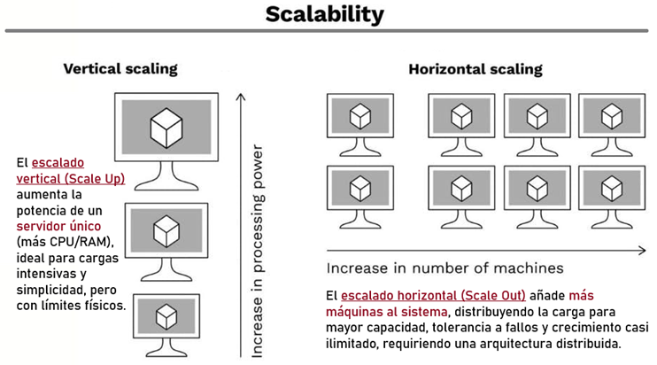

# 📦 Section 12: Optimización del Rendimiento en Spring WebFlux

---

## 🧭 Introducción

`Spring WebFlux` es una excelente herramienta para construir aplicaciones reactivas y escalables. Sin embargo,
no es una solución mágica que resolverá automáticamente todos los problemas de rendimiento simplemente por adoptarla.

En esta sección abordaremos prácticas avanzadas y recomendaciones clave que te permitirán aprovechar al máximo las
capacidades de `WebFlux`, especialmente en escenarios de alta concurrencia y carga intensiva.

## ⚖️ Escalado Vertical vs. Escalado Horizontal

Antes de lanzarnos a optimizar el código, es importante entender las dos grandes estrategias de escalado que existen,
ya que muchas decisiones de arquitectura giran en torno a ellas.

### 🔼 Escalado Vertical (Scale Up)

Consiste en **aumentar los recursos de la máquina existente**: más CPU, más RAM, más almacenamiento.
Es la solución más directa e inmediata.

#### Ventajas:

- Simple de implementar (no requiere cambios en la aplicación).
- No introduce complejidad de red ni distribución.

#### Desventajas:

- **Tiene un límite físico:** llega un punto en que no puedes seguir aumentando el hardware.
- Suele ser **más costoso** a medida que se sube de categoría.
- Si ese único servidor falla, toda la aplicación cae **(single point of failure).**

> 💡 **Ejemplo:** Tienes un servidor con 4 GB de RAM y tu aplicación empieza a lentificarse. Escalas verticalmente
> aumentando a 16 GB de RAM.

### 🔁 Escalado Horizontal (Scale Out)

Consiste en **añadir más instancias (servidores/nodos)** que ejecuten la misma aplicación, distribuyendo la carga entre
ellas mediante un **load balancer.**

#### Ventajas:

- Teóricamente sin límite de crecimiento: puedes seguir añadiendo nodos.
- Mayor **tolerancia a fallos:** si un nodo cae, los demás siguen operando.
- Es la estrategia natural para aplicaciones en la nube.

#### Desventajas:

- Requiere que la aplicación esté diseñada para ser **stateless** (sin estado en memoria local).
- Añade complejidad: necesitas gestionar balanceadores de carga, sesiones distribuidas, consistencia de datos, etc.

> 💡 **Ejemplo:** En lugar de un servidor grande, tienes 4 servidores más pequeños detrás de un
> Nginx o AWS Load Balancer, cada uno atendiendo una porción del tráfico.



### 🥊 ¿Cuál elegir?

| Criterio              | Vertical *(Scale Up)*             | Horizontal *(Scale Out)*                    |
|-----------------------|-----------------------------------|---------------------------------------------|
| Costo inicial         | Bajo                              | Medio-alto                                  |
| Límite de crecimiento | Sí tiene límite                   | Prácticamente ilimitado                     |
| Complejidad operativa | Baja                              | Alta                                        |
| Tolerancia a fallos   | Baja                              | Alta                                        |
| Ideal para            | Aplicaciones pequeñas o iniciales | Aplicaciones en producción con alto tráfico |

> ⚠️ **Regla de oro:**  
> Antes de escalar horizontalmente —lo cual implica más costos de infraestructura—, vale la pena analizar si existen
> optimizaciones internas en tu aplicación que puedan resolver el problema con los recursos actuales.
> Ese es precisamente el objetivo de esta sección.

## 🗜️ GZIP en Microservicios

En una arquitectura de microservicios, múltiples aplicaciones se comunican constantemente entre sí, a menudo
distribuidas en diferentes centros de datos o proveedores cloud. Por ejemplo, tu aplicación podría estar realizando
llamadas a servicios externos como AWS, GCP, Shopify, entre otros.

Cuando un cliente envía una solicitud a un servidor, este responde a través de la red. En redes congestionadas o con
alta latencia, el tiempo de respuesta puede verse afectado significativamente, sobre todo si la respuesta contiene una
gran cantidad de datos.

A simple vista, esto podría interpretarse como un problema de rendimiento del servidor —por ejemplo, pensar
"necesitamos más instancias"— cuando en realidad la causa principal puede ser la latencia de red y el volumen
de datos transferidos.

Aquí es donde entra en juego `GZIP`: una técnica de compresión ampliamente utilizada para
`reducir el tamaño de las respuestas HTTP` y mejorar notablemente los tiempos de transferencia.

### ❓ ¿Qué es GZIP?

`GZIP` **es un algoritmo de compresión que reduce el tamaño de los datos antes de enviarlos por la red.**
El flujo es simple:

1. El cliente indica que acepta respuestas comprimidas mediante el encabezado `HTTP`:
    ````bash
    Accept-Encoding: gzip
    ````
2. El servidor comprime la respuesta antes de enviarla.
3. El cliente recibe menos bytes y los descomprime localmente.

El resultado es una transmisión más eficiente, especialmente notable en respuestas grandes como listas de objetos JSON.

> 💡 **Ejemplo práctico:** Imagina un endpoint que devuelve una lista de 10,000 productos en JSON. Sin compresión
> podría pesar `2MB`; con `GZIP` habilitado, esa misma respuesta puede reducirse a `200–400KB`, es decir,
> hasta un 80% menos de datos viajando por la red.

### ✅ Beneficios

- **Menor tiempo de transferencia** en redes lentas o congestionadas.
- **Mejor uso del ancho de banda**, ya que se transmiten menos bytes entre cliente y servidor.
- **Mejor percepción del rendimiento** por parte del usuario final, especialmente con respuestas grandes
  (listas extensas de datos JSON, documentos HTML, etc.).

### ⚠️ Consideraciones

- **Mayor uso de CPU en el servidor**, ya que comprimir datos requiere procesamiento adicional.
- **Puede ser contraproducente con respuestas pequeñas**, donde el costo de comprimir/descomprimir
  supera el beneficio obtenido en la transferencia.
- **No uses tu máquina local para medir el impacto de GZIP.** En entorno local no existe latencia de red perceptible,
  por lo que los beneficios no serán evidentes. Siempre mide en ambientes con condiciones reales de red.

### 🏆 Buenas Prácticas

- Habilita `GZIP` **solo para tipos de contenido que realmente se benefician** de la compresión, como:
    - `application/json`
    - `text/html`
    - `application/javascript`
    - `text/css`
- Establece un `umbral mínimo de tamaño` para aplicar la compresión (por ejemplo, solo comprimir respuestas mayores
  a `1 KB`). Las respuestas muy pequeñas no justifican el overhead.
- Realiza pruebas en `ambientes de staging o producción`, o al menos con latencia de red simulada,
  para medir el impacto real.

### ⚙️ ¿Cómo se habilita `GZIP` en `Spring WebFlux`?

En `Spring Boot` con `WebFlux`, puedes habilitar la compresión fácilmente desde `application.properties` o
`application.yml`:

````yml
# application.yml
server:
  compression:
    enabled: true
    mime-types: application/json,text/html,application/javascript,text/css
    min-response-size: 1024   # Solo comprime respuestas mayores a 1 KB
````

Con esas tres líneas, Spring Boot se encarga automáticamente de comprimir las respuestas cuando el cliente lo soporta.
¡Sin código adicional!
