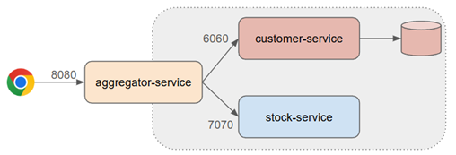

# 🚀 Sección 13: Proyecto final - Microservicios Reactivos

---

## 🧩 Plataforma de negociación (Trading platform)



En este proyecto final vamos a construir una plataforma de negociación basada en microservicios reactivos,
donde veremos la interacción entre tres aplicaciones:

1. `customer-service (port 6060)` → responsable de gestionar la cartera de clientes.
2. `aggregator-service (port 8080)` → expone los endpoints a los clientes y actúa como orquestador, redirigiendo
   solicitudes hacia los otros servicios.
3. `stock-service (port 7070)` → servicio externo ya trabajado previamente, encargado de proveer información de
   acciones/valores.

📌 En este escenario, solo desarrollaremos `customer-service` y `aggregator-service`, ya que el `stock-service` lo
consideramos como un servicio externo ya disponible.

### 🎯 Rol de cada microservicio

- `Aggregator-service`:
    - Es la puerta de entrada para los clientes.
    - Expone endpoints REST.
    - Orquesta las llamadas hacia `customer-service` y `stock-service`.

- `Customer-service`:
    - No se centra en operaciones CRUD básicas (crear/eliminar clientes).
    - Su foco está en **gestionar la cartera de clientes:** saldos y portafolio de acciones.

### 📈 Trade Action (Acción Comercial)

Las operaciones principales que soporta la plataforma son:

- `Buy (Compra)`
    - Deducir importe del saldo del cliente.
    - Añadir una entrada en la tabla de artículos de cartera (si no existe).
    - Incrementar la cantidad en la tabla de artículos de cartera (si ya existe).

- `Sell (Venta)`
    - Acreditar el importe al saldo del cliente.
    - Deducir la cantidad vendida en la tabla `portfolio_items`.

---

# 👥 Customer Service

## 📦 Dependencias

Creamos el proyecto `customer-service` desde
[Spring Initializr](https://start.spring.io/#!type=maven-project&language=java&platformVersion=4.0.6&packaging=jar&configurationFileFormat=yaml&jvmVersion=25&groupId=dev.magadiflo&artifactId=customer-service&packageName=dev.magadiflo.customer.app&dependencies=webflux,data-r2dbc,lombok,postgresql)
con las siguientes configuraciones:

````xml
<!--Spring Boot 4.0.6-->
<!--Java 25-->
<dependencies>
    <dependency>
        <groupId>org.springframework.boot</groupId>
        <artifactId>spring-boot-starter-data-r2dbc</artifactId>
    </dependency>
    <dependency>
        <groupId>org.springframework.boot</groupId>
        <artifactId>spring-boot-starter-webflux</artifactId>
    </dependency>

    <dependency>
        <groupId>org.postgresql</groupId>
        <artifactId>postgresql</artifactId>
        <scope>runtime</scope>
    </dependency>
    <dependency>
        <groupId>org.postgresql</groupId>
        <artifactId>r2dbc-postgresql</artifactId>
        <scope>runtime</scope>
    </dependency>
    <dependency>
        <groupId>org.projectlombok</groupId>
        <artifactId>lombok</artifactId>
        <optional>true</optional>
    </dependency>
    <dependency>
        <groupId>org.springframework.boot</groupId>
        <artifactId>spring-boot-starter-data-r2dbc-test</artifactId>
        <scope>test</scope>
    </dependency>
    <dependency>
        <groupId>org.springframework.boot</groupId>
        <artifactId>spring-boot-starter-webflux-test</artifactId>
        <scope>test</scope>
    </dependency>
</dependencies>
````

## 🗄️ Script para la inicialización de datos

En la ubicación `trading-platform/customer-service/src/main/resources/sql` se crean dos archivos:

- `schema.sql` → define la estructura de las tablas.
- `data.sql` → inserta datos iniciales para pruebas.

### 📑 schema.sql

````postgresql
DROP TABLE IF EXISTS portfolio_items;
DROP TABLE IF EXISTS customers;

CREATE TABLE customers
(
    id      BIGSERIAL PRIMARY KEY,
    name    VARCHAR(50),
    balance INTEGER
);

CREATE TABLE portfolio_items
(
    id          BIGSERIAL PRIMARY KEY,
    customer_id BIGINT,
    ticker      VARCHAR(10),
    quantity    INTEGER,
    foreign key (customer_id) references customers (id)
);
````

#### 🔎 Explicación

- `DROP TABLE IF EXISTS ...` → asegura que las tablas se eliminen si ya existen, evitando conflictos en reinicios.
    - `customers` → tabla principal con:
    - `id`: identificador único.
    - `name`: nombre del cliente.
    - `balance`: saldo disponible.
- `portfolio_items` → tabla secundaria que representa los ítems de la cartera:
    - `customer_id`: referencia al cliente dueño del ítem.
    - `ticker`: símbolo de la acción (ej. AAPL, MSFT).
    - `quantity`: cantidad de acciones.
    - Relación foreign key con `customers(id)`.

### 📑 data.sql

````postgresql
INSERT INTO customers(name, balance)
VALUES ('Sam', 10000),
       ('Mike', 10000),
       ('John', 10000);
````

#### 🔎 Explicación

- Se insertan tres clientes iniciales (Sam, Mike, John) cada uno con un saldo de 10,000.
- Esto permite probar inmediatamente las operaciones de compra/venta sin necesidad de crear clientes manualmente.
