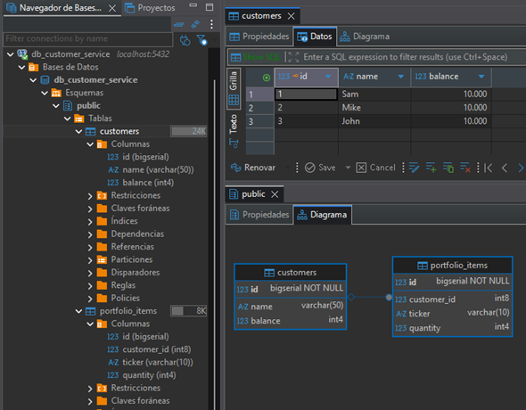
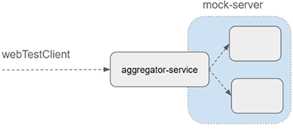

# 🚀 Sección 13: Proyecto final - Microservicios Reactivos

---

## 🧩 Plataforma de negociación (Trading platform)


En este proyecto final vamos a construir una plataforma de negociación basada en microservicios reactivos,
donde veremos la interacción entre tres aplicaciones:

1. `customer-service (port 6060)` → responsable de gestionar la cartera de clientes.
2. `aggregator-service (port 8080)` → expone los endpoints a los clientes y actúa como orquestador, redirigiendo
   solicitudes hacia los otros servicios.
3. `stock-service (port 7070)` → servicio externo ya trabajado previamente, encargado de proveer información de
   acciones/valores.

📌 En este escenario, solo desarrollaremos `customer-service` y `aggregator-service`, ya que el `stock-service` lo
consideramos como un servicio externo ya disponible.

### 🎯 Rol de cada microservicio

- `Aggregator-service`:
    - Es la puerta de entrada para los clientes.
    - Expone endpoints REST.
    - Orquesta las llamadas hacia `customer-service` y `stock-service`.

- `Customer-service`:
    - No se centra en operaciones CRUD básicas (crear/eliminar clientes).
    - Su foco está en **gestionar la cartera de clientes:** saldos y portafolio de acciones.

### 📈 Trade Action (Acción Comercial)

Las operaciones principales que soporta la plataforma son:

- `Buy (Compra)`
    - Deducir importe del saldo del cliente.
    - Añadir una entrada en la tabla de artículos de cartera (si no existe).
    - Incrementar la cantidad en la tabla de artículos de cartera (si ya existe).

- `Sell (Venta)`
    - Acreditar el importe al saldo del cliente.
    - Deducir la cantidad vendida en la tabla `portfolio_items`.

---

# 👥 Customer Service

## 📦 Dependencias

Creamos el proyecto `customer-service` desde
[Spring Initializr](https://start.spring.io/#!type=maven-project&language=java&platformVersion=4.0.6&packaging=jar&configurationFileFormat=yaml&jvmVersion=25&groupId=dev.magadiflo&artifactId=customer-service&packageName=dev.magadiflo.customer.app&dependencies=webflux,data-r2dbc,lombok,postgresql)
con las siguientes configuraciones:

````xml
<!--Spring Boot 4.0.6-->
<!--Java 25-->
<dependencies>
    <dependency>
        <groupId>org.springframework.boot</groupId>
        <artifactId>spring-boot-starter-data-r2dbc</artifactId>
    </dependency>
    <dependency>
        <groupId>org.springframework.boot</groupId>
        <artifactId>spring-boot-starter-webflux</artifactId>
    </dependency>

    <dependency>
        <groupId>org.postgresql</groupId>
        <artifactId>postgresql</artifactId>
        <scope>runtime</scope>
    </dependency>
    <dependency>
        <groupId>org.postgresql</groupId>
        <artifactId>r2dbc-postgresql</artifactId>
        <scope>runtime</scope>
    </dependency>
    <dependency>
        <groupId>org.projectlombok</groupId>
        <artifactId>lombok</artifactId>
        <optional>true</optional>
    </dependency>
    <dependency>
        <groupId>org.springframework.boot</groupId>
        <artifactId>spring-boot-starter-data-r2dbc-test</artifactId>
        <scope>test</scope>
    </dependency>
    <dependency>
        <groupId>org.springframework.boot</groupId>
        <artifactId>spring-boot-starter-webflux-test</artifactId>
        <scope>test</scope>
    </dependency>
</dependencies>
````

## 🗄️ Script para la inicialización de datos

En la ubicación `trading-platform/customer-service/src/main/resources/sql` se crean dos archivos:

- `schema.sql` → define la estructura de las tablas.
- `data.sql` → inserta datos iniciales para pruebas.

### 📑 schema.sql

````postgresql
DROP TABLE IF EXISTS portfolio_items;
DROP TABLE IF EXISTS customers;

CREATE TABLE customers
(
    id      BIGSERIAL PRIMARY KEY,
    name    VARCHAR(50),
    balance INTEGER
);

CREATE TABLE portfolio_items
(
    id          BIGSERIAL PRIMARY KEY,
    customer_id BIGINT,
    ticker      VARCHAR(10),
    quantity    INTEGER,
    foreign key (customer_id) references customers (id)
);
````

#### 🔎 Explicación

- `DROP TABLE IF EXISTS ...` → asegura que las tablas se eliminen si ya existen, evitando conflictos en reinicios.
    - `customers` → tabla principal con:
    - `id`: identificador único.
    - `name`: nombre del cliente.
    - `balance`: saldo disponible.
- `portfolio_items` → tabla secundaria que representa los ítems de la cartera:
    - `customer_id`: referencia al cliente dueño del ítem.
    - `ticker`: símbolo de la acción (ej. AAPL, MSFT).
    - `quantity`: cantidad de acciones.
    - Relación foreign key con `customers(id)`.

### 📑 data.sql

````postgresql
INSERT INTO customers(name, balance)
VALUES ('Sam', 10000),
       ('Mike', 10000),
       ('John', 10000);
````

#### 🔎 Explicación

- Se insertan tres clientes iniciales (Sam, Mike, John) cada uno con un saldo de 10,000.
- Esto permite probar inmediatamente las operaciones de compra/venta sin necesidad de crear clientes manualmente.

## ⚙️ Inicialización de la base de datos en aplicaciones Spring WebFlux con R2DBC

En aplicaciones que utilizan **Spring WebFlux con R2DBC**, los archivos `schema.sql` y `data.sql` **no se ejecutan
automáticamente**, a diferencia de las aplicaciones basadas en JDBC.
Esto significa que, aunque tengamos los scripts en `resources/sql`, la aplicación no los aplicará por sí sola
al iniciar.

👉 Para solventar esto, debemos definir manualmente una configuración que ejecute estos scripts al inicio de la
aplicación.

### 🧩 Configuración con `ConnectionFactoryInitializer`

Creamos una clase de configuración llamada `DatabaseInitConfig` que define un **bean** `ConnectionFactoryInitializer`.  
Este bean se encarga de ejecutar los archivos SQL de creación de tablas (`schema.sql`) y de inserción de datos
(`data.sql`) al iniciar la aplicación:

````java

@Configuration
public class DatabaseInitConfig {
    @Bean
    public ConnectionFactoryInitializer initializer(ConnectionFactory connectionFactory) {
        Resource shema = new ClassPathResource("sql/schema.sql");
        Resource data = new ClassPathResource("sql/data.sql");
        DatabasePopulator databasePopulator = new ResourceDatabasePopulator(shema, data);

        ConnectionFactoryInitializer initializer = new ConnectionFactoryInitializer();
        initializer.setConnectionFactory(connectionFactory);
        initializer.setDatabasePopulator(databasePopulator);

        return initializer;
    }
}
````

#### 🔎 Explicación paso a paso

- `@Configuration` → indica que esta clase define beans de configuración para Spring.
- `ConnectionFactoryInitializer` → componente que inicializa la base de datos usando scripts SQL.
- `ClassPathResource("sql/schema.sql")` → carga el archivo `schema.sql` desde el classpath.
- `ClassPathResource("sql/data.sql")` → carga el archivo `data.sql` desde el classpath.
- `ResourceDatabasePopulator` → ejecuta los scripts en orden (`schema.sql` primero, luego `data.sql`).
- `initializer.setConnectionFactory(connectionFactory)` → conecta el inicializador con la base de datos configurada en
  `application.yml`.
- `initializer.setDatabasePopulator(databasePopulator)` → asigna el ejecutor de scripts al inicializador.

## ⚙️ Configuración de propiedades `(application.yml)`

````yml
server:
  port: 6060
  error:
    include-message: always

spring:
  application:
    name: customer-service
  r2dbc:
    url: r2dbc:postgresql://localhost:5432/db_customer_service
    username: postgres
    password: magadiflo

  # API Versioning (Spring Boot 4)
  webflux:
    api-version:
      required: true
      supported: 1,2
      use:
        path-segment: 1

logging:
  level:
    io.r2dbc.postgresql.QUERY: debug
    io.r2dbc.postgresql.PARAM: debug
````

#### 🔎 Explicación de cada bloque

- `server.port: 6060`
    - Define el puerto en el que se ejecutará el `customer-service`.
- `error.include-message: always`
    - Configura que los mensajes de error se incluyan siempre en las respuestas HTTP, útil para depuración.
- `spring.application.name: customer-service`
    - Nombre de la aplicación, usado en logs y en contextos de descubrimiento de servicios.
- `spring.r2dbc.url`
    - Conexión reactiva a `PostgreSQL` usando `R2DBC`.
    - `r2dbc:postgresql://localhost:5432/db_customer_service` → URL de conexión.
    - `username: postgres` → usuario de la base de datos.
    - `password: magadiflo` → contraseña.
- `spring.webflux.api-version` (Spring Boot 4)
    - Configuración de versionado de API:
        - `required: true` → obliga a especificar versión.
        - `supported: 1,2` → versiones soportadas.
        - `use.path-segment: 1` → versión indicada en el segmento de la URL (ej. `/api/v1/...`).
- `logging.level`
    - Configura el nivel de log para el driver `R2DBC` de `PostgreSQL`:
        - `QUERY: debug` → muestra las consultas ejecutadas.
        - `PARAM: debug` → muestra los parámetros enviados.
        - Esto es muy útil para verificar qué queries se están generando y con qué valores.

## ▶️ Ejecución de la aplicación

Antes de ejecutar nuestra aplicación, debemos crear la base de datos en `PostgreSQL` llamada `db_customer_service`.

Una vez creada la base de datos, procedemos a ejecutar la aplicación `customer-service`.
Al iniciar, gracias a la configuración con `ConnectionFactoryInitializer`, los scripts `schema.sql` y `data.sql`
se ejecutan automáticamente:

- Se crean las tablas `customers` y `portfolio_items`.
- La tabla `customers` se inicializa con los registros definidos en `data.sql` (Sam, Mike, John con saldo 10,000
  cada uno).



#### 🔎 Explicación del resultado

- La base de datos queda lista para soportar las operaciones de `Trade Action (Buy/Sell)`.
- Los datos iniciales permiten probar inmediatamente la lógica de negocio sin necesidad de crear clientes manualmente.
- Validamos que la integración entre `configuración → scripts → base de datos` funciona correctamente.

### ✅ Conclusión

Con este paso, el `customer-service` ya tiene:

- Infraestructura completa (dependencias, configuración, scripts).
- Base de datos inicializada y lista para pruebas.
- Datos de clientes disponibles para validar operaciones de compra y venta.

## 🧩 Entidades

Las entidades representan las tablas definidas en `schema.sql` y permiten mapear los registros de la base de datos a
objetos Java que usaremos en el servicio.

### 👤 Customer

````java

@ToString
@AllArgsConstructor
@NoArgsConstructor
@Builder
@Setter
@Getter
@Table(name = "customers")
public class Customer {
    @Id
    private Long id;
    private String name;
    private Integer balance;
}
````

#### 🔎 Explicación

- `@Table(name = "customers")` → mapea la clase a la tabla `customers`.
- `@Id` → indica que `id` es la clave primaria.
- `name` → nombre del cliente.
- `balance` → saldo disponible del cliente.
- `Lombok (@Getter, @Setter, @Builder, etc.)` → elimina código repetitivo, generando automáticamente constructores,
  getters, setters y métodos `toString`.

### 📊 PortfolioItem

````java

@ToString
@AllArgsConstructor
@NoArgsConstructor
@Builder
@Setter
@Getter
@Table(name = "portfolio_items")
public class PortfolioItem {
    @Id
    private Long id;
    private Long customerId;
    private Ticker ticker; // Enum que construimos más adelante
    private Integer quantity;
}
````

#### 🔎 Explicación

- `@Table(name = "portfolio_items")` → mapea la clase a la tabla `portfolio_items`.
- `@Id` → indica que id es la clave primaria.
- `customerId` → referencia al cliente dueño del ítem (relación con `customers`).
- `ticker` → símbolo de la acción (ejemplo: `AAPL`, `MSFT`).
- `quantity` → cantidad de acciones que posee el cliente.
- `Lombok` → igual que en `Customer`, simplifica la implementación.

## 📂 Repositorios

Los repositorios son interfaces que extienden de `ReactiveCrudRepository`, lo que nos permite realizar operaciones
CRUD de manera reactiva sobre nuestras entidades.

### 👤 CustomerRepository

````java
public interface CustomerRepository extends ReactiveCrudRepository<Customer, Long> {
}
````

#### 🔎 Explicación

- `ReactiveCrudRepository<Customer, Long>` → provee métodos CRUD reactivos (`save`, `findById`, `findAll`, `deleteById`,
  etc.) para la entidad `Customer`.
- No se definen métodos adicionales porque las operaciones básicas son suficientes para esta entidad.

### 📊 PortfolioItemRepository

````java
public interface PortfolioItemRepository extends ReactiveCrudRepository<PortfolioItem, Long> {
    Flux<PortfolioItem> findByCustomerId(Long customerId);

    Mono<PortfolioItem> findByCustomerIdAndTicker(Long customerId, Ticker ticker);
}
````

#### 🔎 Explicación

- `ReactiveCrudRepository<PortfolioItem, Long>` → provee métodos CRUD reactivos para la entidad `PortfolioItem`.
- `findByCustomerId(Long customerId)` → retorna un `Flux<PortfolioItem>` con todos los ítems de cartera asociados a un
  cliente.
- `findByCustomerIdAndTicker(Long customerId, Ticker ticker)` → retorna un `Mono<PortfolioItem>` con el ítem específico
  de un cliente para un ticker determinado.
- Estos métodos siguen la convención de nombres de Spring Data, por lo que no requieren implementación manual:
  **Spring genera automáticamente las queries reactivas.**

## 🧩 Enums

Los `Enums` nos permiten definir un conjunto fijo de valores que representan conceptos del dominio de la aplicación.
En este caso, tenemos dos: `Ticker` y `TradeAction`.

### 💹 Ticker

````java
public enum Ticker {
    AMAZON,
    APPLE,
    GOOGLE,
    MICROSOFT
}
````

#### 🔎 Explicación

- Representa los `símbolos de acciones` disponibles en la plataforma.
- Cada valor (`AMAZON`, `APPLE`, `GOOGLE`, `MICROSOFT`) corresponde a una empresa cuyo ticker será usado en las
  operaciones de compra/venta.
- Al usar un `enum`, evitamos errores de escritura y aseguramos consistencia en el manejo de tickers.

### 🔄 TradeAction

````java
public enum TradeAction {
    BUY,
    SELL
}
````

#### 🔎 Explicación

- Define las `acciones comerciales` que puede realizar un cliente:
    - `BUY` → comprar acciones.
    - `SELL` → vender acciones.
- Este `enum` será clave en la lógica de negocio, ya que determinará cómo se modifican el saldo y la cartera de cada
  cliente.

### ✅ Conclusión

Con estos enums:

- Tenemos un modelo claro y seguro para representar `tickers` y `acciones comerciales`.
- Se reduce el riesgo de errores al trabajar con cadenas de texto.
- La lógica de negocio podrá basarse en estos valores para implementar las operaciones de `Trade Action (Buy/Sell)`
  de forma más robusta.

## 📦 DTOs (Data Transfer Objects)

Los `DTOs` encapsulan la información que se intercambia entre el cliente y el servidor, evitando exponer directamente
las entidades de la base de datos. Aquí definimos cuatro registros `(record)` en Java, que son inmutables y
muy adecuados para representar datos.

### 📊 Holding

````java
public record Holding(Ticker ticker,
                      Integer quantity) {
}
````

#### 🔎 Explicación

- Representa un ítem dentro de la cartera de un cliente.
- `ticker` → símbolo de la acción (ej. `APPLE`, `GOOGLE`).
- `quantity` → cantidad de acciones que posee el cliente de ese ticker.

### 👤 CustomerInformation

````java
public record CustomerInformation(Long id,
                                  String name,
                                  Integer balance,
                                  List<Holding> holdings) {
}
````

#### 🔎 Explicación

- DTO que agrupa la información completa de un cliente.
- `id` → identificador del cliente.
- `name` → nombre del cliente.
- `balance` → saldo disponible.
- `holdings` → lista de acciones que posee el cliente, representadas por `Holding`.

### 💹 StockTradeRequest

````java
public record StockTradeRequest(Ticker ticker,
                                Integer quantity,
                                Integer price,
                                TradeAction tradeAction) {
    public Integer totalPrice() {
        return this.quantity * this.price;
    }
}
````

#### 🔎 Explicación

DTO que representa una `solicitud de operación comercial` (compra o venta).

- `ticker` → acción sobre la que se opera.
- `quantity` → cantidad de acciones a `comprar/vender`.
- `price` → precio unitario de la acción.
- `tradeAction` → acción comercial (`BUY` o `SELL`).
- `totalPrice()` → método auxiliar que calcula el costo total de la operación `(cantidad × precio)`.

### 📈 StockTradeResponse

````java
public record StockTradeResponse(Long customerId,
                                 Ticker ticker,
                                 Integer quantity,
                                 Integer price,
                                 TradeAction tradeAction,
                                 Integer totalPrice,
                                 Integer balance) {
}
````

#### 🔎 Explicación

- DTO que representa la `respuesta de una operación comercial`.
- `customerId` → cliente que realizó la operación.
- `ticker` → acción operada.
- `quantity` → cantidad de acciones involucradas.
- `price` → precio unitario.
- `tradeAction` → tipo de operación (`BUY` o `SELL`).
- `totalPrice` → costo total de la operación.
- `balance` → saldo actualizado del cliente después de la operación.

### ✅ Conclusión

Con estos DTOs:

- Definimos claramente la información que se intercambia en las operaciones de compra/venta.
- Evitamos exponer directamente las entidades de la base de datos.
- Simplificamos la comunicación entre cliente y servidor con objetos inmutables y expresivos.

## 🔄 Mappers

Los `mappers` son componentes que convierten objetos de un tipo a otro. En este caso, transforman entidades
(`Customer`, `PortfolioItem`) en DTOs (`CustomerInformation`, `Holding`, `StockTradeResponse`) y viceversa.
Esto asegura que la lógica de negocio y la comunicación con los clientes se mantenga limpia y desacoplada.

### 👤 CustomerMapper

````java

@Component
public class CustomerMapper {

    public CustomerInformation toCustomerInformation(Customer customer, List<PortfolioItem> items) {
        return new CustomerInformation(
                customer.getId(),
                customer.getName(),
                customer.getBalance(),
                this.holdings(items)
        );
    }

    private List<Holding> holdings(List<PortfolioItem> portfolioItems) {
        return portfolioItems
                .stream()
                .map(this::toHolding)
                .toList();
    }

    private Holding toHolding(PortfolioItem portfolioItem) {
        return new Holding(portfolioItem.getTicker(), portfolioItem.getQuantity());
    }
}
````

#### 🔎 Explicación

- `toCustomerInformation(...)` → transforma un `Customer` y su lista de `PortfolioItem` en un DTO `CustomerInformation`.
- `holdings(...)` → convierte la lista de `PortfolioItem` en una lista de `Holding`.
- `toHolding(...)` → transforma un `PortfolioItem` en un `Holding`.
- Este mapper permite exponer la información del cliente junto con su cartera de acciones en un formato amigable para
  el cliente.

### 📊 PortfolioItemMapper

````java

@Component
public class PortfolioItemMapper {
    public PortfolioItem toPortfolioItem(Long customerId, Ticker ticker, Integer quantity) {
        return PortfolioItem.builder()
                .customerId(customerId)
                .ticker(ticker)
                .quantity(quantity)
                .build();
    }

    public StockTradeResponse toStockTradeResponse(StockTradeRequest request, Long customerId, Integer balance) {
        return new StockTradeResponse(
                customerId,
                request.ticker(),
                request.quantity(),
                request.price(),
                request.tradeAction(),
                request.totalPrice(),
                balance
        );
    }
}
````

#### 🔎 Explicación

- `toPortfolioItem(...)` → crea un `PortfolioItem` a partir de un `customerId`, un `Ticker` y una `cantidad`.
- `toStockTradeResponse(...)` → transforma un `StockTradeRequest` en un `StockTradeResponse`, incluyendo el
  `customerId` y el saldo actualizado.
- Este mapper es clave para la lógica de negocio de `Trade Action (Buy/Sell)`, ya que permite construir la respuesta
  que se enviará al cliente después de una operación.

### ✅ Conclusión

Con estos mappers:

- Se logra una separación clara entre `entidades` y `DTOs`.
- La lógica de negocio puede trabajar con objetos de dominio (`Customer`, `PortfolioItem`) y luego transformarlos
  en DTOs para exponerlos.
- Se simplifica el código y se evita duplicación en la conversión de datos.

## ⚠️ Excepciones y clase utilitaria

En la lógica de negocio del `customer-service` pueden ocurrir situaciones excepcionales que deben ser comunicadas
de forma explícita. Para ello definimos excepciones personalizadas y una **clase utilitaria que facilita su uso
en flujos reactivos.**

### 🚫 CustomerNotFoundException

````java
public class CustomerNotFoundException extends RuntimeException {
    private static final String MESSAGE = "Cliente con id [%d] no se encuentra";

    public CustomerNotFoundException(Long customerId) {
        super(MESSAGE.formatted(customerId));
    }
}
````

- Se lanza cuando un cliente no existe en la base de datos.
- El mensaje incluye el `id` del cliente para mayor claridad.

### 💰 InsufficientBalanceException

````java
public class InsufficientBalanceException extends RuntimeException {
    private static final String MESSAGE = "Cliente con id [%d] no tiene fondos suficientes para completar la transacción";

    public InsufficientBalanceException(Long customerId) {
        super(MESSAGE.formatted(customerId));
    }
}
````

- Se lanza cuando el cliente intenta realizar una compra sin saldo suficiente.

### 📉 InsufficientSharesException

````java
public class InsufficientSharesException extends RuntimeException {
    private static final String MESSAGE = "Cliente con id [%d] no tiene acciones suficientes para completar la transacción";

    public InsufficientSharesException(Long customerId) {
        super(MESSAGE.formatted(customerId));
    }
}
````

- Se lanza cuando el cliente intenta vender más acciones de las que posee.

### 🛠️ Clase utilitaria: `BusinessErrors`

````java

@UtilityClass
public class BusinessErrors {
    public static <T> Mono<T> customerNotFound(Long customerId) {
        return Mono.error(() -> new CustomerNotFoundException(customerId));
    }

    public static <T> Mono<T> insufficientBalance(Long customerId) {
        return Mono.error(() -> new InsufficientBalanceException(customerId));
    }

    public static <T> Mono<T> insufficientShares(Long customerId) {
        return Mono.error(() -> new InsufficientSharesException(customerId));
    }
}
````

#### 🔎 Explicación

- `@UtilityClass` → convierte la clase en utilitaria (métodos estáticos, sin necesidad de instanciarla).
- `Métodos estáticos` → cada método devuelve un `Mono.error(...)` con la excepción correspondiente.
- Esto permite integrar las excepciones directamente en flujos reactivos `(Flux/Mono)` de forma elegante y consistente.

### 📌 Nota sobre métodos genéricos `(<T>)` en `BusinessErrors`

Los métodos de la clase `BusinessErrors` se definen como genéricos `(<T>)` para que puedan integrarse en cualquier
flujo reactivo, independientemente del tipo de dato que se esté manejando.

Esto significa que el mismo error puede ser emitido en pipelines que trabajan con entidades distintas, como `Customer`
o `PortfolioItem`. **El tipo genérico es inferido automáticamente por el compilador según el contexto del flujo, y dado
que se emite un error, el tipo concreto deja de ser relevante: el error corta el flujo y se propaga correctamente.**

#### 🔎 Ejemplo 1: flujo con `Customer`

````
return customerRepository.findById(customerId)
        .switchIfEmpty(BusinessErrors.customerNotFound(customerId))
        .flatMap(customer -> {
            // lógica con Customer
        });
````

#### 🔎 Ejemplo 2: flujo con `PortfolioItem`

````
return portfolioItemRepository.findByCustomerIdAndTicker(customerId, Ticker.AMAZON)
        .switchIfEmpty(BusinessErrors.customerNotFound(customerId))
        .flatMap(portfolioItem -> {
            // lógica con PortfolioItem
        });
````

### ✅ Conclusión

Como se observa, aunque los pipelines manejan tipos de datos distintos, el mismo método
`BusinessErrors.customerNotFound(customerId)` se integra sin problemas gracias al uso de genéricos.
Esto asegura:

- `Reutilización` → un mismo método sirve para múltiples contextos.
- `Consistencia` → los errores se propagan de forma uniforme en toda la aplicación.
- `Flexibilidad` → no es necesario duplicar métodos para cada tipo de flujo.

## ⚖️ RestControllerAdvice

La clase `ApplicationExceptionHandler` captura las excepciones personalizadas definidas en la aplicación y las
transforma en respuestas HTTP con un formato estándar utilizando `ProblemDetail` (introducido en `Spring Boot 3`).

````java

@Slf4j
@RestControllerAdvice
public class ApplicationExceptionHandler {

    @ExceptionHandler(CustomerNotFoundException.class)
    public Mono<ResponseEntity<ProblemDetail>> handleCustomerNotFoundException(CustomerNotFoundException ex) {
        log.error("CustomerNotFoundException: {}", ex.getMessage());
        var problemDetailResponse = this.buildProblemDetail(HttpStatus.NOT_FOUND, ex, problemDetail -> {
            problemDetail.setTitle("Cliente no encontrado");
        });
        return Mono.just(ResponseEntity
                .status(problemDetailResponse.getStatus())
                .body(problemDetailResponse));
    }

    @ExceptionHandler(InsufficientBalanceException.class)
    public Mono<ResponseEntity<ProblemDetail>> handleInsufficientBalanceException(InsufficientBalanceException ex) {
        log.error("InsufficientBalanceException: {}", ex.getMessage());
        var problemDetailResponse = this.buildProblemDetail(HttpStatus.BAD_REQUEST, ex, problemDetail -> {
            problemDetail.setTitle("Saldo insuficiente");
        });
        return Mono.just(ResponseEntity
                .status(problemDetailResponse.getStatus())
                .body(problemDetailResponse));
    }

    @ExceptionHandler(InsufficientSharesException.class)
    public Mono<ResponseEntity<ProblemDetail>> handleInsufficientSharesException(InsufficientSharesException ex) {
        log.error("InsufficientSharesException: {}", ex.getMessage());
        var problemDetailResponse = this.buildProblemDetail(HttpStatus.BAD_REQUEST, ex, problemDetail -> {
            problemDetail.setTitle("Acciones insuficientes");
        });
        return Mono.just(ResponseEntity
                .status(problemDetailResponse.getStatus())
                .body(problemDetailResponse));
    }

    @ExceptionHandler(Exception.class)
    public Mono<ResponseEntity<ProblemDetail>> handleGenericException(Exception ex) {
        log.error("Unhandled exception: {}", ex.getMessage(), ex);
        var problemDetailResponse = this.buildProblemDetail(HttpStatus.INTERNAL_SERVER_ERROR, ex, problemDetail -> {
            problemDetail.setTitle("Error interno del servidor");
        });
        return Mono.just(ResponseEntity
                .status(problemDetailResponse.getStatus())
                .body(problemDetailResponse));
    }

    private ProblemDetail buildProblemDetail(HttpStatus status, Exception ex, Consumer<ProblemDetail> problemDetailConsumer) {
        ProblemDetail problemDetail = ProblemDetail.forStatusAndDetail(status, ex.getMessage());
        problemDetailConsumer.accept(problemDetail);
        return problemDetail;
    }
}
````

#### 🔎 Explicación

- `@RestControllerAdvice` → intercepta excepciones lanzadas en controladores REST y permite definir un manejo
  centralizado.
- `@ExceptionHandler` → cada método maneja una excepción específica (`CustomerNotFoundException`,
  `InsufficientBalanceException`, `InsufficientSharesException`). Adicionalmente, se define un handler genérico
  para `Exception.class` que actúa como red de seguridad, capturando cualquier excepción no contemplada y
  retornando un `500 Internal Server Error` con el mismo formato estándar, garantizando la homogeneidad
  de las respuestas de error en toda la aplicación.
- `ProblemDetail` → objeto estándar para representar errores HTTP, incluye:
    - `status` → código HTTP.
    - `detail` → mensaje de error.
    - `title` → título descriptivo del problema.
- `Mono<ResponseEntity<ProblemDetail>>` → respuesta reactiva que envuelve el detalle del error.
- `log.error(...)` → registra el error en logs para auditoría y depuración.
- `buildProblemDetail(...)` → método auxiliar que construye el objeto `ProblemDetail` y permite personalizar el título.

## 🛠️ Servicios

### 👤 CustomerService (Interfaz)

````java
public interface CustomerService {
    Mono<CustomerInformation> getCustomerInformation(Long customerId);
}
````

#### 🔎 Explicación

- Define el contrato del servicio.
- Expone el método `getCustomerInformation(Long customerId)`, que retorna un `Mono<CustomerInformation>` con los datos
  del cliente y su portafolio.
- Al ser una interfaz, permite desacoplar la definición de la lógica de negocio de su implementación concreta.

### ⚙️ CustomerServiceImpl (Implementación)

````java

@RequiredArgsConstructor
@Service
public class CustomerServiceImpl implements CustomerService {

    private final CustomerRepository customerRepository;
    private final PortfolioItemRepository portfolioItemRepository;
    private final CustomerMapper customerMapper;

    @Override
    public Mono<CustomerInformation> getCustomerInformation(Long customerId) {
        return this.customerRepository.findById(customerId)
                .switchIfEmpty(BusinessErrors.customerNotFound(customerId))
                .flatMap(this::buildCustomerInformation);
    }

    private Mono<CustomerInformation> buildCustomerInformation(Customer customer) {
        return this.portfolioItemRepository.findByCustomerId(customer.getId())
                .collectList()
                .map(portfolioItemList ->
                        this.customerMapper.toCustomerInformation(customer, portfolioItemList));
    }
}
````

#### 🔎 Explicación

- `@Service` → marca la clase como componente de servicio dentro del contexto de Spring.
- `@RequiredArgsConstructor` → genera automáticamente el constructor con los repositorios y el mapper inyectados.
- `getCustomerInformation(...)`:
    - Busca el cliente por id en el repositorio.
    - Si no existe, emite un error con `BusinessErrors.customerNotFound(customerId)`.
    - Si existe, construye el DTO `CustomerInformation` con los datos del cliente y su portafolio.
- `buildCustomerInformation(...)`:
    - Obtiene todos los `PortfolioItem` asociados al cliente.
    - Los transforma en una lista de `Holding` usando el `CustomerMapper`.
    - Devuelve un `CustomerInformation` completo con saldo, nombre y portafolio.

### ✅ Conclusión

Con este servicio:

- Se encapsula la lógica de negocio para obtener la información de un cliente.
- Se integran repositorios, mappers y validaciones de negocio.
- Se asegura que los errores se propaguen correctamente mediante `BusinessErrors`.
- El resultado final es un DTO `CustomerInformation` listo para ser expuesto en un controlador REST.

### 🔑 TradeService (Interfaz)

````java
public interface TradeService {
    Mono<StockTradeResponse> trade(Long customerId, StockTradeRequest stockTradeRequest);
}
````

#### 🔎 Explicación

- Define el contrato del servicio de trading.
- Expone el método `trade`, que recibe el `customerId` y la solicitud `(StockTradeRequest)` y devuelve un
  `Mono<StockTradeResponse>` con el resultado de la operación.

### ⚙️ TradeServiceImpl (Implementación)

````java

@RequiredArgsConstructor
@Service
public class TradeServiceImpl implements TradeService {

    private final CustomerRepository customerRepository;
    private final PortfolioItemRepository portfolioItemRepository;
    private final PortfolioItemMapper portfolioItemMapper;

    @Override
    @Transactional
    public Mono<StockTradeResponse> trade(Long customerId, StockTradeRequest stockTradeRequest) {
        return switch (stockTradeRequest.tradeAction()) {
            case BUY -> this.buyStock(customerId, stockTradeRequest);
            case SELL -> this.sellStock(customerId, stockTradeRequest);
        };
    }

    private Mono<StockTradeResponse> buyStock(Long customerId, StockTradeRequest stockTradeRequest) {
        Mono<Customer> customerMono = this.customerRepository.findById(customerId)
                .switchIfEmpty(BusinessErrors.customerNotFound(customerId))
                .filter(customer -> customer.getBalance() >= stockTradeRequest.totalPrice())
                .switchIfEmpty(BusinessErrors.insufficientBalance(customerId));

        Mono<PortfolioItem> portfolioItemMono = this.portfolioItemRepository.findByCustomerIdAndTicker(customerId, stockTradeRequest.ticker())
                .defaultIfEmpty(this.portfolioItemMapper.toPortfolioItem(customerId, stockTradeRequest.ticker(), 0));

        //zipWhen te permite ejecutar un segundo Mono basándonos en el valor del primero, y luego combina ambos resultados.
        //Es como una combinación de flatMap + zip.
        //Aquí queremos que primero se ejecute el customerMono, si existe y está bien ese flujo, recién ejecutamos el siguiente portfolioItemMono.
        return customerMono.zipWhen(customer -> portfolioItemMono)
                .flatMap(tuple ->
                        this.executeBuy(tuple.getT1(), tuple.getT2(), stockTradeRequest));
    }

    private Mono<StockTradeResponse> sellStock(Long customerId, StockTradeRequest stockTradeRequest) {
        Mono<Customer> customerMono = this.customerRepository.findById(customerId)
                .switchIfEmpty(BusinessErrors.customerNotFound(customerId));

        Mono<PortfolioItem> portfolioItemMono = this.portfolioItemRepository.findByCustomerIdAndTicker(customerId, stockTradeRequest.ticker())
                .filter(portfolioItem -> portfolioItem.getQuantity() >= stockTradeRequest.quantity())
                .switchIfEmpty(BusinessErrors.insufficientShares(customerId)); // Aquí sí importa que el switchIfEmpty esté al final para asegurarnos de que nunca el portfolioItemMono vaya al zipWhen como un Mono.empty()

        return customerMono.zipWhen(customer -> portfolioItemMono)
                .flatMap(tuple ->
                        this.executeSell(tuple.getT1(), tuple.getT2(), stockTradeRequest));
    }

    private Mono<StockTradeResponse> executeBuy(Customer customer, PortfolioItem portfolioItem, StockTradeRequest stockTradeRequest) {
        customer.setBalance(customer.getBalance() - stockTradeRequest.totalPrice());
        portfolioItem.setQuantity(portfolioItem.getQuantity() + stockTradeRequest.quantity());
        return this.saveAndBuildResponse(customer, portfolioItem, stockTradeRequest);
    }

    private Mono<StockTradeResponse> executeSell(Customer customer, PortfolioItem portfolioItem, StockTradeRequest stockTradeRequest) {
        customer.setBalance(customer.getBalance() + stockTradeRequest.totalPrice());
        portfolioItem.setQuantity(portfolioItem.getQuantity() - stockTradeRequest.quantity());
        return this.saveAndBuildResponse(customer, portfolioItem, stockTradeRequest);
    }

    private Mono<StockTradeResponse> saveAndBuildResponse(Customer customer, PortfolioItem portfolioItem, StockTradeRequest stockTradeRequest) {
        StockTradeResponse stockTradeResponse =
                this.portfolioItemMapper.toStockTradeResponse(stockTradeRequest, customer.getId(), customer.getBalance());
        /**
         * (No emite valores Mono<Void>) Mono.when: Agrupe los publishers proporcionados en un nuevo Mono
         * que se completará cuando todas las fuentes especificadas hayan finalizado. Un error provocará la
         * cancelación de los resultados pendientes y la emisión inmediata de un error al Mono resultante.
         */
        return Mono.when(
                this.customerRepository.save(customer),
                this.portfolioItemRepository.save(portfolioItem)
        ).thenReturn(stockTradeResponse);
    }
}
````

#### 🔎 Explicación general

- `@Service` → marca la clase como componente de servicio.
- `@Transactional` → asegura que las operaciones de compra/venta se ejecuten de forma transaccional.
- `switch` → delega la lógica según el tipo de acción (`BUY` o `SELL`).

#### 🟢 Lógica de compra `buyStock(...)`

- Valida que el cliente exista y tenga saldo suficiente.
- Obtiene el `PortfolioItem` correspondiente al ticker, o crea uno nuevo si no existe.
- Usa `zipWhen` para `combinar ambos flujos de manera dependiente`.
- Ejecuta la lógica de compra `executeBuy(...)`.

#### 🔴 Lógica de venta `sellStock(...)`

- Valida que el cliente exista.
- Verifica que el cliente tenga suficientes acciones para vender.
- Usa `zipWhen` para combinar cliente y portafolio `de manera dependiente`.
- Ejecuta la lógica de venta `executeSell(...)`.

#### ⚙️ Ejecución y persistencia `executeBuy(...)`, `executeSell(...)` y `saveAndBuildResponse(...)`

- `executeBuy(...)` / `executeSell(...)` → actualizan saldo y cantidad de acciones.
- `saveAndBuildResponse(...)` → persiste cambios en cliente y portafolio `en paralelo` con `Mono.when`,
  y devuelve el DTO `StockTradeResponse`.

### ✅ Conclusión

Con este servicio:

- Se encapsula toda la lógica de `Trade Action (Buy/Sell)`.
- Se validan condiciones de negocio con `BusinessErrors`.
- Se aprovechan operadores de Reactor (`zipWhen`, `when`) para mantener la semántica reactiva clara.
- Se asegura persistencia transaccional y respuesta consistente (`StockTradeResponse`).

## 🔄 Operadores de combinación en Reactor (zip, zipWhen, when)

En la implementación de nuestros servicios hemos utilizado distintos `operadores de combinación de Reactor`.
Estos operadores son fundamentales para controlar cómo se relacionan y sincronizan los flujos reactivos entre sí.

En este apartado los explicamos de manera breve y práctica, con ejemplos sencillos, para despejar cualquier
duda sobre su uso y entender mejor por qué los aplicamos en nuestra lógica de negocio.

#### ✔️ `zip` / `zipWith`:

- `zip` y `zipWith` hacen lo mismo conceptualmente
- No hay dependencia entre flujos
- Pueden ejecutarse en paralelo
- Combinan resultados

#### ✔️ `zipWhen`:

- Flujo dependiente
- Ejecuta el segundo Mono después del primero
- Combina resultados

#### ✔️ `when`:

- Sincroniza múltiples publishers
- Solo espera que todos terminen
- Devuelve `Mono<Void>`
- NO combina datos

#### 💡 Ejemplo práctico

````java
// 🔵 zip → combinación en paralelo (forma estática)
Mono<String> mono1 = Mono.just("A");
Mono<String> mono2 = Mono.just("B");
Mono<String> resultZip = Mono.zip(mono1, mono2, (a, b) -> a + b);   // Resultado: "AB"

// 🔵 zipWith → combinación en paralelo (forma encadenada)
Mono<String> resultZipWith = mono1.zipWith(mono2, (a, b) -> a + b); // Resultado: "AB"

//======================================================================================

// 🟣 zipWhen → flujo dependiente
Mono<String> resultZipWhen = mono1.zipWhen(a -> Mono.just(a + "B"))
        .map(tuple -> tuple.getT1() + tuple.getT2());               // Resultado: "AAB"


// ⚫ when → solo sincronización (sin datos)
Mono<Void> resultWhen = Mono.when(
        Mono.fromRunnable(() -> System.out.println("Tarea 1")),
        Mono.fromRunnable(() -> System.out.println("Tarea 2"))
); // Resultado: ejecuta ambas tareas y completa (sin emitir valor)
````

## 🌐 Controlador: CustomerController

````java

@RequiredArgsConstructor
@RestController
@RequestMapping(path = "/api/{version}/customers", version = "1")
public class CustomerController {

    private final CustomerService customerService;
    private final TradeService tradeService;

    @GetMapping(path = "/{customerId}")
    public Mono<ResponseEntity<CustomerInformation>> getCustomerInformation(@PathVariable Long customerId) {
        return this.customerService.getCustomerInformation(customerId)
                .map(ResponseEntity::ok);
    }

    @PostMapping(path = "/{customerId}/trade")
    public Mono<ResponseEntity<StockTradeResponse>> trade(@PathVariable Long customerId,
                                                          @RequestBody Mono<StockTradeRequest> requestMono) {
        return requestMono
                .flatMap(stockTradeRequest ->
                        this.tradeService.trade(customerId, stockTradeRequest))
                .map(stockTradeResponse ->
                        ResponseEntity.status(HttpStatus.CREATED).body(stockTradeResponse));
    }
}
````

### 🔎 Explicación

- `@RestController` → define el controlador REST.
- `@RequestMapping(path = "/api/{version}/customers", version = "1")` → expone los endpoints bajo la ruta
  `/api/v1/customers`.
- `@RequiredArgsConstructor` → inyecta automáticamente los servicios (`CustomerService`, `TradeService`).

#### 📘 Endpoint: `GET /api/v1/customers/{customerId}`

- Invoca `customerService.getCustomerInformation(customerId)`.
- Devuelve un `Mono<ResponseEntity<CustomerInformation>>`.
- Responde con los datos del cliente y su portafolio.

#### 📘 Endpoint: `POST /api/v1/customers/{customerId}/trade`

- Recibe un `StockTradeRequest` en el cuerpo de la petición.
- Invoca `tradeService.trade(customerId, stockTradeRequest)`.
- Devuelve un `Mono<ResponseEntity<StockTradeResponse>>`.
- Responde con el resultado de la operación de compra/venta y código `201 CREATED`.

### ✅ Conclusión

Con este controlador:

- Se exponen los servicios de negocio como endpoints REST.
- Se mantiene la semántica reactiva `(Mono)` en las respuestas.
- Se asegura que las operaciones de consulta y trading estén disponibles para los clientes externos.
- Se integra de forma limpia con el `RestControllerAdvice`, que manejará cualquier excepción lanzada por los servicios.

## 🧪 Test de Integración al Controlador

Este bloque corresponde a un `test de integración`, porque no se limita a probar métodos aislados, sino que valida el
comportamiento completo del microservicio en ejecución.
Se levanta el contexto real de Spring Boot `(@SpringBootTest)`, se exponen los endpoints del `CustomerController` y se
realizan llamadas HTTP con `WebTestClient`, verificando la interacción entre:

- Controlador REST `(CustomerController)`
- Servicios (`CustomerService`, `TradeService`)
- Repositorios (`CustomerRepository`, `PortfolioItemRepository`)
- Base de datos reactiva (R2DBC/PostgreSQL)
- Manejo centralizado de excepciones `(RestControllerAdvice)`

De esta forma, se asegura que el sistema funcione como un todo, simulando el consumo real de la API por parte de un
cliente externo.

````java

@Slf4j
@AutoConfigureWebTestClient
@SpringBootTest
class CustomerControllerTest {

    @Autowired
    private WebTestClient client;

    @Test
    void customerInformation() {
        this.getBodyContentSpecCustomer(1L, HttpStatus.OK)
                .jsonPath("$.name").isEqualTo("Sam")
                .jsonPath("$.balance").isEqualTo(10_000)
                .jsonPath("$.holdings").isEmpty();
    }

    @Test
    void buyAndSell() {
        // buy
        StockTradeRequest buyRequest1 = new StockTradeRequest(Ticker.GOOGLE, 5, 100, TradeAction.BUY);
        this.getBodyContentSpecTrade(2L, buyRequest1, HttpStatus.CREATED)
                .jsonPath("$.balance").isEqualTo(9500)
                .jsonPath("$.totalPrice").isEqualTo(500);

        StockTradeRequest buyRequest2 = new StockTradeRequest(Ticker.GOOGLE, 10, 100, TradeAction.BUY);
        this.getBodyContentSpecTrade(2L, buyRequest2, HttpStatus.CREATED)
                .jsonPath("$.balance").isEqualTo(8500)
                .jsonPath("$.totalPrice").isEqualTo(1000);

        // check the holdings
        this.getBodyContentSpecCustomer(2L, HttpStatus.OK)
                .jsonPath("$.holdings").isNotEmpty()
                .jsonPath("$.holdings").isArray()
                .jsonPath("$.holdings.length()").isEqualTo(1)
                .jsonPath("$.holdings[0].ticker").isEqualTo("GOOGLE")
                .jsonPath("$.holdings[0].quantity").isEqualTo(15);

        // sell
        StockTradeRequest sellRequest1 = new StockTradeRequest(Ticker.GOOGLE, 5, 110, TradeAction.SELL);
        this.getBodyContentSpecTrade(2L, sellRequest1, HttpStatus.CREATED)
                .jsonPath("$.balance").isEqualTo(9050)
                .jsonPath("$.totalPrice").isEqualTo(550);

        StockTradeRequest sellRequest2 = new StockTradeRequest(Ticker.GOOGLE, 10, 110, TradeAction.SELL);
        this.getBodyContentSpecTrade(2L, sellRequest2, HttpStatus.CREATED)
                .jsonPath("$.balance").isEqualTo(10150)
                .jsonPath("$.totalPrice").isEqualTo(1100);

        // check the holdings
        this.getBodyContentSpecCustomer(2L, HttpStatus.OK)
                .jsonPath("$.holdings").isNotEmpty()
                .jsonPath("$.holdings").isArray()
                .jsonPath("$.holdings.length()").isEqualTo(1)
                .jsonPath("$.holdings[0].ticker").isEqualTo("GOOGLE")
                .jsonPath("$.holdings[0].quantity").isEqualTo(0);
    }

    @Test
    void customerNotFound() {
        this.getBodyContentSpecCustomer(5L, HttpStatus.NOT_FOUND)
                .jsonPath("$.title").isEqualTo("Cliente no encontrado")
                .jsonPath("$.detail").isEqualTo("Cliente con id [5] no se encuentra");

        // sell
        StockTradeRequest sellRequest1 = new StockTradeRequest(Ticker.GOOGLE, 5, 110, TradeAction.SELL);
        this.getBodyContentSpecTrade(5L, sellRequest1, HttpStatus.NOT_FOUND)
                .jsonPath("$.title").isEqualTo("Cliente no encontrado")
                .jsonPath("$.detail").isEqualTo("Cliente con id [5] no se encuentra");
    }

    @Test
    void insufficientBalance() {
        StockTradeRequest buyRequest = new StockTradeRequest(Ticker.GOOGLE, 500, 100, TradeAction.BUY);
        this.getBodyContentSpecTrade(2L, buyRequest, HttpStatus.BAD_REQUEST)
                .jsonPath("$.title").isEqualTo("Saldo insuficiente")
                .jsonPath("$.detail").isEqualTo("Cliente con id [2] no tiene fondos suficientes para completar la transacción");
    }

    @Test
    void insufficientShares() {
        StockTradeRequest buyRequest = new StockTradeRequest(Ticker.GOOGLE, 1, 100, TradeAction.SELL);
        this.getBodyContentSpecTrade(2L, buyRequest, HttpStatus.BAD_REQUEST)
                .jsonPath("$.title").isEqualTo("Acciones insuficientes")
                .jsonPath("$.detail").isEqualTo("Cliente con id [2] no tiene acciones suficientes para completar la transacción");
    }

    private WebTestClient.BodyContentSpec getBodyContentSpecCustomer(Long customerId, HttpStatus expectedStatus) {
        return this.client.get()
                .uri("/api/v1/customers/{customerId}", customerId)
                .exchange()
                .expectStatus().isEqualTo(expectedStatus)
                .expectBody()
                .consumeWith(result ->
                        log.info("{}", new String(Objects.requireNonNull(result.getResponseBody()))));
    }

    private WebTestClient.BodyContentSpec getBodyContentSpecTrade(Long customerId, StockTradeRequest request, HttpStatus expectedStatus) {
        return this.client.post()
                .uri("/api/v1/customers/{customerId}/trade", customerId)
                .bodyValue(request)
                .exchange()
                .expectStatus().isEqualTo(expectedStatus)
                .expectBody()
                .consumeWith(result ->
                        log.info("{}", new String(Objects.requireNonNull(result.getResponseBody()))));
    }
}
````

### ▶️ Ejecución de los tests

Para validar el correcto funcionamiento de nuestro `CustomerController` y confirmar que los casos de negocio
se integran adecuadamente con la base de datos y el manejo de excepciones, ejecutamos los `tests de integración`
directamente desde la raíz del microservicio `customer-service`.

El siguiente comando compila el proyecto, limpia artefactos previos y corre todas las pruebas definidas en la clase
`CustomerControllerTest`:

````bash
D:\programming\spring\01.udemy\03.vinoth_selvaraj\spring-webflux-masterclass\trading-platform\customer-service (feature/section-13)
$ mvn clean test
[INFO] Scanning for projects...
[INFO]
[INFO] -------------------< dev.magadiflo:customer-service >-------------------
[INFO] Building customer-service 0.0.1-SNAPSHOT
[INFO]   from pom.xml
[INFO] --------------------------------[ jar ]---------------------------------
[INFO]
[INFO] --- clean:3.5.0:clean (default-clean) @ customer-service ---
[INFO] Deleting D:\programming\spring\01.udemy\03.vinoth_selvaraj\spring-webflux-masterclass\trading-platform\customer-service\target
[INFO]
[INFO] --- resources:3.3.1:resources (default-resources) @ customer-service ---
[INFO] Copying 1 resource from src\main\resources to target\classes
[INFO] Copying 2 resources from src\main\resources to target\classes
[INFO]
[INFO] --- compiler:3.14.1:compile (default-compile) @ customer-service ---
[INFO] Recompiling the module because of changed source code.
[INFO] Compiling 24 source files with javac [debug parameters release 25] to target\classes
[INFO]
[INFO] --- resources:3.3.1:testResources (default-testResources) @ customer-service ---
[INFO] skip non existing resourceDirectory D:\programming\spring\01.udemy\03.vinoth_selvaraj\spring-webflux-masterclass\trading-platform\customer-service\src\test\resources
[INFO]
...
2026-04-29T11:32:44.220-05:00 ERROR 1960 --- [customer-service] [actor-tcp-nio-3] d.m.c.a.a.ApplicationExceptionHandler    : InsufficientSharesException: Cliente con id [2] no tiene acciones suficientes para completar la transacción
2026-04-29T11:32:44.222-05:00  INFO 1960 --- [customer-service] [           main] d.m.c.a.c.CustomerControllerTest         : {"detail":"Cliente con id [2] no tiene acciones suficientes para completar la transacción","instance":"/api/v1/customers/2/trade","status":400,"title":"Acciones insuficientes"}
2026-04-29T11:32:44.231-05:00 DEBUG 1960 --- [customer-service] [actor-tcp-nio-3] io.r2dbc.postgresql.PARAM                : Bind parameter [0] to: 1
2026-04-29T11:32:44.232-05:00 DEBUG 1960 --- [customer-service] [actor-tcp-nio-3] io.r2dbc.postgresql.QUERY                : Executing query: SELECT "customers".* FROM "customers" WHERE "customers"."id" = $1 LIMIT 2
2026-04-29T11:32:44.234-05:00 DEBUG 1960 --- [customer-service] [actor-tcp-nio-3] io.r2dbc.postgresql.PARAM                : Bind parameter [0] to: 1
2026-04-29T11:32:44.235-05:00 DEBUG 1960 --- [customer-service] [actor-tcp-nio-3] io.r2dbc.postgresql.QUERY                : Executing query: SELECT "portfolio_items"."id", "portfolio_items"."customer_id", "portfolio_items"."ticker", "portfolio_items"."quantity" FROM "portfolio_items" WHERE "portfolio_items"."customer_id" = $1
2026-04-29T11:32:44.237-05:00  INFO 1960 --- [customer-service] [           main] d.m.c.a.c.CustomerControllerTest         : {"id":1,"name":"Sam","balance":10000,"holdings":[]}
2026-04-29T11:32:44.245-05:00 DEBUG 1960 --- [customer-service] [actor-tcp-nio-3] io.r2dbc.postgresql.PARAM                : Bind parameter [0] to: 5
2026-04-29T11:32:44.245-05:00 DEBUG 1960 --- [customer-service] [actor-tcp-nio-3] io.r2dbc.postgresql.QUERY                : Executing query: SELECT "customers".* FROM "customers" WHERE "customers"."id" = $1 LIMIT 2
2026-04-29T11:32:44.248-05:00 ERROR 1960 --- [customer-service] [actor-tcp-nio-3] d.m.c.a.a.ApplicationExceptionHandler    : CustomerNotFoundException: Cliente con id [5] no se encuentra
2026-04-29T11:32:44.249-05:00  INFO 1960 --- [customer-service] [           main] d.m.c.a.c.CustomerControllerTest         : {"detail":"Cliente con id [5] no se encuentra","instance":"/api/v1/customers/5","status":404,"title":"Cliente no encontrado"}
2026-04-29T11:32:44.252-05:00 DEBUG 1960 --- [customer-service] [actor-tcp-nio-3] io.r2dbc.postgresql.QUERY                : Executing query: BEGIN READ WRITE
2026-04-29T11:32:44.253-05:00 DEBUG 1960 --- [customer-service] [actor-tcp-nio-3] io.r2dbc.postgresql.PARAM                : Bind parameter [0] to: 5
2026-04-29T11:32:44.254-05:00 DEBUG 1960 --- [customer-service] [actor-tcp-nio-3] io.r2dbc.postgresql.QUERY                : Executing query: SELECT "customers".* FROM "customers" WHERE "customers"."id" = $1 LIMIT 2
2026-04-29T11:32:44.255-05:00 DEBUG 1960 --- [customer-service] [actor-tcp-nio-3] io.r2dbc.postgresql.QUERY                : Executing query: ROLLBACK
2026-04-29T11:32:44.256-05:00 ERROR 1960 --- [customer-service] [actor-tcp-nio-3] d.m.c.a.a.ApplicationExceptionHandler    : CustomerNotFoundException: Cliente con id [5] no se encuentra
2026-04-29T11:32:44.257-05:00  INFO 1960 --- [customer-service] [           main] d.m.c.a.c.CustomerControllerTest         : {"detail":"Cliente con id [5] no se encuentra","instance":"/api/v1/customers/5/trade","status":404,"title":"Cliente no encontrado"}
[INFO] Tests run: 5, Failures: 0, Errors: 0, Skipped: 0, Time elapsed: 4.797 s -- in dev.magadiflo.customer.app.controller.CustomerControllerTest
[INFO]
[INFO] Results:
[INFO]
[INFO] Tests run: 5, Failures: 0, Errors: 0, Skipped: 0
[INFO]
[INFO] ------------------------------------------------------------------------
[INFO] BUILD SUCCESS
[INFO] ------------------------------------------------------------------------
[INFO] Total time:  13.216 s
[INFO] Finished at: 2026-04-29T11:32:44-05:00
[INFO] ------------------------------------------------------------------------
````

### 📘 Escenarios probados

- **Consulta de cliente existente** → `GET /api/v1/customers/{id}` devuelve datos correctos.
- **Compra y venta de acciones** → `POST /api/v1/customers/{id}/trade` actualiza saldo y portafolio.
- **Cliente no encontrado** → se devuelve `404 NOT FOUND` con `ProblemDetail`.
- **Saldo insuficiente** → se devuelve `400 BAD REQUEST` con mensaje claro.
- **Acciones insuficientes** → se devuelve `400 BAD REQUEST` con mensaje claro.

### ✅ Conclusión

Este test confirma que:

- Los endpoints REST funcionan correctamente.
- Las reglas de negocio se validan y los errores se propagan de forma uniforme.
- La integración entre controlador, servicio, repositorio y base de datos es consistente.
- El sistema responde como lo haría en producción, garantizando confiabilidad y robustez.

---

# 🌐 Aggregator Service

El `aggregator-service` será el punto de entrada principal para los clientes externos. Su responsabilidad es unificar
y orquestar las llamadas hacia nuestros microservicios internos `(customer-service)` y hacia el servicio externo
`(stock-service)`.

👉 Este servicio expone únicamente `3 endpoints`, distribuidos en `2 controladores`, que internamente delegan
la lógica hacia los otros servicios. De esta manera, el `aggregator-service` actúa como un
**facilitador y coordinador**, simplificando la interacción del cliente con todo el ecosistema.

### 📊 Mapeo de Endpoints

El siguiente cuadro muestra cómo los endpoints del `aggregator-service` se conectan con los servicios internos y
externos:

| 🔗 HttpMethod | 🌐 ``aggregator-service``                                     | 👤 ``customer-service``                                       | 📈 ``stock-service`` (external-services)            |
|---------------|---------------------------------------------------------------|---------------------------------------------------------------|-----------------------------------------------------|
| GET           | ``http://localhost:8080/api/v1/stock/price-stream``           |                                                               | ``http://localhost:7070/api/v1/stock/price-stream`` |
|               |                                                               |                                                               | ``http://localhost:7070/api/v1/stock/{ticker}``     |
| GET           | ``http://localhost:8080/api/v1/customers/{customerId}``       | ``http://localhost:6060/api/v1/customers/{customerId}``       |                                                     |
| POST          | ``http://localhost:8080/api/v1/customers/{customerId}/trade`` | ``http://localhost:6060/api/v1/customers/{customerId}/trade`` |                                                     |

### 🧩 Roles de Integración

- **Customer APIs** → Los endpoints `/customers/{customerId}` y `/customers/{customerId}/trade` del `aggregator-service`
  se comunican directamente con el `customer-service`.
- **Stock APIs** → El endpoint `/stock/price-stream` se conecta con el `stock-service` (simulado por
  `external-services.jar` en el directorio `/servers`).
- **Uniformidad de paths** → Se definen los mismos paths en `aggregator-service` que en los servicios internos para
  evitar confusión y mantener consistencia.

### 📦 DTO de Entrada

El endpoint de trading `(/customers/{customerId}/trade)` recibirá un cuerpo de petición con el siguiente `DTO`:

````java
record TradeRequest(Ticker ticker, TradeAction action, Integer quantity) {
}
````

Este DTO simplifica la solicitud de compra/venta, encapsulando la acción, el ticker y la cantidad.

### ⚠️ Manejo de Excepciones

Dado que el `aggregator-service` depende de otros servicios, debemos gestionar los errores que provengan de ellos:

- **Customer Not Found** → Cuando `customer-service` devuelve `404 Not Found`.
- **Invalid Trade Request** →
    - Validación fallida en la solicitud de entrada.
    - `customer-service` devuelve `400 Bad Request` por saldo insuficiente o acciones insuficientes.
- **Respuesta uniforme** → Todos los errores se devuelven como un `ProblemDetail` con códigos `4XX`,
  asegurando consistencia en la comunicación hacia el cliente.

## ✅ Conclusión

El `aggregator-service` se convierte en la fachada central del sistema:

- Simplifica el acceso a múltiples microservicios.
- Mantiene consistencia en los paths y respuestas.
- Gestiona errores de manera uniforme.
- Proporciona una experiencia clara y confiable para los clientes externos.

## [🧪 MockServer - Introducción](https://www.mock-server.com/)

Antes de listar todas las dependencias del proyecto, es importante hablar de una herramienta clave que agregaremos
manualmente: `MockServer`.

En el microservicio `customer-service`, las pruebas de integración fueron sencillas porque no dependía de servicios
externos: solo interactuaba con su propia base de datos. En cambio, el `aggregator-service` depende de dos servicios
externos:

- 👤 `customer-service`
- 📈 `stock-service`

Esto complica las pruebas de integración, ya que en un entorno real puede que no tengamos disponibles esos servicios.
Para poder probar el `aggregator-service` de manera independiente, necesitamos simular sus dependencias.

👉 Aquí entra en juego `MockServer`, que nos permitirá emular el comportamiento de `customer-service` y `stock-service`
durante las pruebas.



### [❓ ¿Qué es MockServer?](https://www.mock-server.com/)

`MockServer` es una herramienta que permite simular servicios HTTP/HTTPS y resulta muy útil cuando necesitamos
probar un sistema que depende de otros servicios externos. Puede funcionar de tres maneras principales:

- 🎭 `Simulación (Mock)` → Configura respuestas específicas para solicitudes determinadas. Ejemplo: siempre devolver un
  JSON fijo cuando se consulta `/api/v1/customers/1`.
- 🔍 `Proxy (Delegación)` → En lugar de inventar la respuesta, `MockServer` actúa como intermediario:
  recibe la solicitud y la redirige al `servicio real` (por ejemplo, `stock-service` en `localhost:7070`). De esta
  forma, puedes registrar, analizar o incluso modificar las solicitudes y respuestas reales.
- ⚖️ `Combinación` → Algunas rutas se simulan con respuestas configuradas, mientras que otras se dejan pasar al
  servicio real mediante proxy. Esto da flexibilidad para decidir qué probar con mocks y qué validar contra servicios
  activos.

### 📌 Flujo de trabajo de MockServer

1. **Buscar expectativa configurada** → Si existe una regla definida para esa solicitud, devuelve la respuesta simulada.
2. **Delegar mediante proxy** → Si no hay expectativa, `MockServer` puede redirigir la solicitud al `servicio real` y
   devolver su respuesta.
3. **Error 404** → Si tampoco hay proxy configurado, `MockServer` devuelve un `404 Not Found`.

#### 🧩 Concepto clave: Expectativa

Una `expectativa` es la regla que define qué hacer con una solicitud.
Ejemplo: “Cuando llegue una petición `GET` a `/api/v1/customers/99`, devuelve un `404` con el mensaje
*Cliente no encontrado*”.

#### ✅ Conclusión

- `Mock` → Respuesta simulada, sin depender de servicios reales.
- `Proxy` → Redirección al servicio real, actuando como intermediario.
- `Combinación` → Uso mixto de simulaciones y delegaciones.

👉 Con esta explicación, queda claro que el proxy no es un mock, sino el puente hacia el servicio real, lo que permite
probar cualquier servicio tanto de forma aislada como en escenarios de integración completa.

### [⚙️ Ejecución con Spring TestExecutionListener](https://www.mock-server.com/mock_server/running_mock_server.html#spring_test_exec_listener)

`MockServer` puede ejecutarse fácilmente en proyectos Spring mediante la anotación `@MockServerTest`.

- La dependencia `mockserver-spring-test-listener` registra un Spring `TestExecutionListener` que inicia `MockServer`
  en un puerto libre cuando la clase de prueba está anotada con `@MockServerTest`.
- `MockServer` se reinicia después de cada prueba y se cierra automáticamente al finalizar la ejecución.
- Como la instancia de `MockServer` se comparte entre todas las clases de prueba, no se admite ejecución paralela
  a menos que cada prueba use comparadores únicos en sus solicitudes.

Para habilitar `MockServer` en pruebas, añadimos la siguiente dependencia:

````xml

<dependency>
    <groupId>org.mock-server</groupId>
    <artifactId>mockserver-spring-test-listener-no-dependencies</artifactId>
    <version>5.15.0</version>
    <scope>test</scope>
</dependency>
````

### ✅ Conclusión

Con `MockServer`:

- Simulamos los servicios externos (`customer-service` y `stock-service`) durante las pruebas de integración.
- Probamos el `aggregator-service` de manera independiente, sin necesidad de que los otros microservicios estén activos.
- Garantizamos que nuestras pruebas sean confiables y reproducibles en cualquier entorno.

## 📦 Dependencias

Creamos el proyecto `aggregator-service` desde
[Spring Initializr](https://start.spring.io/#!type=maven-project&language=java&platformVersion=4.0.6&packaging=jar&configurationFileFormat=yaml&jvmVersion=25&groupId=dev.magadiflo&artifactId=aggregator-service&packageName=dev.magadiflo.aggregator.app&dependencies=webflux,lombok)
con dependencias básicas.

👉 Además de estas dependencias básicas, agregamos manualmente la librería de `MockServer`, que será fundamental para
nuestras pruebas de integración.

````xml
<!--Spring Boot 4.0.6-->
<!--Java 25-->
<dependencies>
    <dependency>
        <groupId>org.springframework.boot</groupId>
        <artifactId>spring-boot-starter-webflux</artifactId>
    </dependency>

    <dependency>
        <groupId>org.projectlombok</groupId>
        <artifactId>lombok</artifactId>
        <optional>true</optional>
    </dependency>
    <dependency>
        <groupId>org.springframework.boot</groupId>
        <artifactId>spring-boot-starter-webflux-test</artifactId>
        <scope>test</scope>
    </dependency>

    <!--Agregado manualmente-->
    <!-- 🧪 MockServer: simula servicios externos en pruebas de integración -->
    <dependency>
        <groupId>org.mock-server</groupId>
        <artifactId>mockserver-spring-test-listener-no-dependencies</artifactId>
        <version>5.15.0</version>
        <scope>test</scope>
    </dependency>
    <!--/Agregado manualmente-->
</dependencies>
````

#### 🔎 Explicación de cada dependencia

- 🌐 **Spring WebFlux** → Permite construir controladores reactivos y manejar peticiones de manera no bloqueante. Es
  ideal para un servicio que orquesta llamadas a otros microservicios como el `aggregator-service`.
- 📝 **Lombok** → Reduce código repetitivo (constructores, getters/setters, etc.), manteniendo las clases más limpias y
  legibles.
- 🧪 **WebFlux Test** → Proporciona herramientas como `WebTestClient` para realizar pruebas de integración sobre los
  endpoints del `aggregator-service`.
- 🧪 **MockServer** → Simula los servicios externos (`customer-service` y `stock-service`) durante las pruebas de
  integración, permitiendo validar el `aggregator-service` de manera independiente y confiable.

## ⚙️ Configuración de propiedades `(application.yml)`

El archivo `application.yml` define la configuración básica del `aggregator-service`, incluyendo el
puerto del servidor, el nombre de la aplicación, la versión de la API y las URLs de los servicios externos con
los que se integra.

````yml
server:
  port: 8080
  error:
    include-message: always

spring:
  application:
    name: aggregator-service

  # API Versioning (Spring Boot 4)
  webflux:
    api-version:
      required: true
      supported: 1,2
      use:
        path-segment: 1

external:
  services:
    customer:
      base-url: http://localhost:6060
    stock:
      base-url: http://localhost:7070
````

#### 🔎 Explicación de cada bloque

- 🌐 `Server`
    - `port: 8080` → Define el puerto en el que se ejecutará el `aggregator-service`.
    - `error.include-message: always` → Configura que los mensajes de error se incluyan siempre en las respuestas HTTP,
      útil para depuración y pruebas.
- ⚙️ `Spring Application`
    - `name: aggregator-service` → Nombre de la aplicación, utilizado en logs y métricas para identificar el
      microservicio.
- 📌 `API Versioning (Spring Boot 4)`
    - `required: true` → Obliga a que todas las solicitudes incluyan versión de API.
    - `supported: 1,2` → Define las versiones soportadas.
    - `use.path-segment: 1` → La versión se especifica en el path de la URL, en nuestro caso en la **posición 1 del
      segmento del path**, ejemplo: `/api/v1/....`.
- 🔗 `External Services`
    - `customer.base-url: http://localhost:6060` → URL base del `customer-service`.
    - `stock.base-url: http://localhost:7070` → URL base del `stock-service` (simulado por `external-services.jar`).

### ✅ Conclusión

Con esta configuración:

- El `aggregator-service` queda identificado y accesible en el puerto `8080`.
- Se asegura la compatibilidad de versiones en los endpoints expuestos.
- Se definen las URLs de los servicios externos, lo que permite que el `aggregator-service` actúe como orquestador
  entre `customer-service` y `stock-service`.

## 🧩 Enums

Los `Enums` permiten definir un conjunto fijo de valores que representan `conceptos clave del dominio` de la aplicación.

En el caso del `aggregator-service`, necesitamos los mismos enums que ya usamos en el `customer-service`,
porque este microservicio también debe manejar `tickers de acciones` y `acciones de trading`.

### 💹 Ticker

````java
public enum Ticker {
    AMAZON,
    APPLE,
    GOOGLE,
    MICROSOFT
}
````

#### 🔎 Explicación

- Representa los símbolos de acciones disponibles en la plataforma.
- Cada valor (AMAZON, APPLE, GOOGLE, MICROSOFT) corresponde a una empresa cuyo ticker será usado en las operaciones de
  compra/venta.
- Al usar un enum, evitamos errores de escritura y aseguramos consistencia en el manejo de tickers.

### 🔄 TradeAction

````java
public enum TradeAction {
    BUY,
    SELL
}
````

#### 🔎 Explicación

- Define las acciones comerciales que puede realizar un cliente:
    - `BUY` → Comprar acciones.
    - `SELL` → Vender acciones.
- Este enum será clave en la lógica de negocio, ya que determinará cómo se modifican el saldo y la cartera de cada
  cliente.

### ✅ Conclusión

Con estos enums:

- Tenemos un modelo claro y seguro para representar tickers y acciones comerciales.
- Se reduce el riesgo de errores al trabajar con cadenas de texto.
- La lógica de negocio podrá basarse en estos valores para implementar las operaciones de `Trade Action (Buy/Sell)`
  de forma más robusta.

## 📦 DTOs (Data Transfer Objects)

Los DTOs son objetos diseñados para transportar datos entre capas o servicios sin exponer directamente las entidades
internas.

En el `aggregator-service`, estos DTOs cumplen un rol fundamental porque encapsulan la información que fluye entre los
endpoints y los microservicios externos (`customer-service` y `stock-service`).

👉 A continuación se detallan los DTOs utilizados:

### 📊 Holding

````java
public record Holding(Ticker ticker,
                      Integer quantity) {
}
````

- Representa una **posición en cartera** de un cliente.
- Contiene el **ticker** de la acción y la **cantidad** de acciones que posee.

### 👤 CustomerInformation

````java
public record CustomerInformation(Long id,
                                  String name,
                                  Integer balance,
                                  List<Holding> holdings) {
}
````

- Encapsula la información completa de un cliente:
    - `id` → Identificador único.
    - `name` → Nombre del cliente.
    - `balance` → Saldo disponible.
    - `holdings` → Lista de posiciones en cartera.

### 💸 StockTradeRequest

````java
public record StockTradeRequest(Ticker ticker,
                                Integer quantity,
                                Integer price,
                                TradeAction tradeAction) {
    public Integer totalPrice() {
        return this.quantity * this.price;
    }
}
````

- Representa una **solicitud de operación de trading.**
- Incluye el ticker, cantidad, precio y acción (`BUY` o `SELL`).
- Método auxiliar `totalPrice()` → Calcula el costo total de la operación.

### 📈 StockTradeResponse

````java
public record StockTradeResponse(Long customerId,
                                 Ticker ticker,
                                 Integer quantity,
                                 Integer price,
                                 TradeAction tradeAction,
                                 Integer totalPrice,
                                 Integer balance) {
}
````

- Devuelve la respuesta de una operación de trading:
    - Datos del cliente (customerId).
    - Detalles de la operación (ticker, cantidad, precio, acción).
    - Resultado financiero (totalPrice, balance actualizado).

### 🔄 TradeRequest

````java
public record TradeRequest(Ticker ticker,
                           Integer quantity,
                           TradeAction tradeAction) {
}
````

- DTO específico del `aggregator-service` para recibir solicitudes de trading.
- Similar al `StockTradeRequest`, pero sin el campo `price`, ya que el precio se obtiene del `stock-service`.

### 💹 StockPriceResponse

````java
public record StockPriceResponse(Ticker ticker,
                                 Integer price) {
}
````

- Representa la respuesta del `stock-service` con el precio actual de una acción.

### ⏱️ PriceUpdate

````java
public record PriceUpdate(Ticker ticker,
                          Integer price,
                          LocalDateTime time) {
}
````

- Encapsula una **actualización de precio en tiempo real.**
- Incluye el ticker, el precio actualizado y la marca de tiempo (time).
- Este DTO será clave en el endpoint de **streaming de precios.**

## ⚠️ Excepciones y clase utilitaria

En el `aggregator-service`, necesitamos manejar errores de manera consistente y expresiva.
Para ello definimos **excepciones específicas del dominio y excepciones remotas**, que nos permiten diferenciar
claramente entre errores locales (propios del servicio) y errores propagados desde microservicios externos
(`customer-service`, `stock-service`).

### 👤 RemoteCustomerNotFoundException

````java
public class RemoteCustomerNotFoundException extends RuntimeException {
    private static final String MESSAGE = "El cliente con id [%d] no fue encontrado en el customer-service";

    public RemoteCustomerNotFoundException(Long customerId) {
        super(MESSAGE.formatted(customerId));
    }
}
````

- Se lanza cuando el cliente solicitado no existe en el `customer-service`.
- El mensaje incluye el `customerId` para mayor claridad.

### 🔄 InvalidTradeRequestException

````java
public class InvalidTradeRequestException extends RuntimeException {
    public InvalidTradeRequestException(String message) {
        super(message);
    }
}
````

- Representa errores relacionados con **solicitudes de trading inválidas.**
- El mensaje es dinámico, permitiendo expresar distintas causas (ejemplo: cantidad inválida, ticker faltante, acción
  no especificada).

### 🌐 RemoteClientException

````java
public class RemoteClientException extends RuntimeException {
    public RemoteClientException(String message) {
        super(message);
    }
}
````

- Se lanza cuando el servicio remoto devuelve un error `4xx` distinto de `404`.
- Indica que la solicitud fue rechazada por el servicio externo, pero no por el `aggregator-service`.

### 🖥️ RemoteServerException

````java
public class RemoteServerException extends RuntimeException {
    public RemoteServerException(String message) {
        super(message);
    }
}
````

- Se lanza cuando el servicio remoto falla internamente `(5xx)`.
- El `aggregator-service` actuó correctamente, pero el servicio externo devolvió un error.

### 🚫 RemoteServiceUnavailableException

````java
public class RemoteServiceUnavailableException extends RuntimeException {
    public RemoteServiceUnavailableException(String message) {
        super(message);
    }
}
````

- Se lanza cuando el servicio remoto no está disponible (timeout, caída, DNS, etc.).
- Se traduce en un `503 Service Unavailable` para el cliente final.

### 🛠️ Clase utilitaria: BusinessErrors

La clase `BusinessErrors` centraliza la creación de errores de negocio en el `aggregator-service`, permitiendo
integrarlos de forma uniforme en flujos reactivos. Gracias a su diseño genérico `(<T>)`, puede devolver un
`Mono.error(...)` en cualquier pipeline, sin importar el tipo de dato esperado.

````java

@UtilityClass
public class BusinessErrors {
    public static <T> Mono<T> remoteCustomerNotFound(Long customerId) {
        return Mono.error(() -> new RemoteCustomerNotFoundException(customerId));
    }

    public static <T> Mono<T> remoteClient(String message) {
        return Mono.error(() -> new RemoteClientException(message));
    }

    public static <T> Mono<T> remoteServer(String message) {
        return Mono.error(() -> new RemoteServerException(message));
    }

    public static <T> Mono<T> remoteServiceUnavailable(String message) {
        return Mono.error(() -> new RemoteServiceUnavailableException(message));
    }

    public static <T> Mono<T> invalidTradeRequest(String message) {
        return Mono.error(() -> new InvalidTradeRequestException(message));
    }

    public static <T> Mono<T> missingTicker() {
        return Mono.error(() -> new InvalidTradeRequestException("El Ticker es requerido"));
    }

    public static <T> Mono<T> missingTradeAction() {
        return Mono.error(() -> new InvalidTradeRequestException("El TradeAction es requerido"));
    }

    public static <T> Mono<T> invalidQuantity() {
        return Mono.error(() -> new InvalidTradeRequestException("La cantidad debe ser > 0"));
    }
}
````

#### 🔎 Explicación

- Errores remotos
    - `remoteCustomerNotFound(...)` → Cliente inexistente en servicio remoto.
    - `remoteClient(...)` → Error 4xx distinto de 404 en servicio remoto.
    - `remoteServer(...)` → Error 5xx en servicio remoto.
    - `remoteServiceUnavailable(...)` → Servicio remoto inaccesible (timeout, caída, DNS).
- Errores locales de negocio
    - `invalidTradeRequest(...)` → Solicitud de trading inválida.
    - `missingTicker()` → Falta el ticker en la solicitud.
    - `missingTradeAction()` → Falta la acción de trading.
    - `invalidQuantity()` → Cantidad inválida (≤ 0).
- Uso de genéricos `<T>`
    - Permite que cada método devuelva un `Mono<T>` compatible con cualquier flujo reactivo, sin importar el tipo de
      dato esperado.
    - Ejemplo: puede integrarse en un `Mono<CustomerInformation>` o en un `Mono<StockTradeResponse>` sin romper la
      cadena reactiva.

## ⚖️ RestControllerAdvice

El `RestControllerAdvice` centraliza el manejo de excepciones en el `aggregator-service`, garantizando que los errores
se transformen en respuestas HTTP uniformes y claras para el cliente. De esta manera, evitamos duplicar lógica de
manejo de errores en cada controlador y aseguramos consistencia en toda la aplicación.

## ⚖️ RestControllerAdvice

El `RestControllerAdvice` centraliza el manejo de excepciones en el `aggregator-service`, garantizando que los errores
se transformen en respuestas HTTP uniformes y claras para el cliente. Esto es especialmente importante porque este
microservicio actúa como orquestador y depende de servicios externos (`customer-service`, `stock-service`).
Por ello, necesitamos distinguir entre errores locales y errores propagados desde servicios remotos.

````java

@Slf4j
@RestControllerAdvice
public class ApplicationExceptionHandler {

    /**
     * El cliente solicitó un recurso que no existe en el servicio remoto.
     * Se propaga como 404 al cliente final porque es un error de negocio claro.
     */
    @ExceptionHandler(RemoteCustomerNotFoundException.class)
    public Mono<ResponseEntity<ProblemDetail>> handleRemoteCustomerNotFoundException(RemoteCustomerNotFoundException ex) {
        log.error("RemoteCustomerNotFoundException: {}", ex.getMessage());
        var problemDetailResponse = this.buildProblemDetail(HttpStatus.NOT_FOUND, ex,
                problemDetail -> problemDetail.setTitle("Cliente no encontrado"));
        return this.getResponseEntityMono(problemDetailResponse);
    }

    /**
     * El servicio remoto rechazó la solicitud (4xx distinto al 404).
     * Se mapea como 502 Bad Gateway porque el aggregator recibió una respuesta
     * inválida de un servicio aguas abajo, no fue un error del cliente final.
     */
    @ExceptionHandler(RemoteClientException.class)
    public Mono<ResponseEntity<ProblemDetail>> handleRemoteClientException(RemoteClientException ex) {
        log.error("RemoteClientException: {}", ex.getMessage());
        var problemDetailResponse = this.buildProblemDetail(HttpStatus.BAD_GATEWAY, ex,
                problemDetail -> problemDetail.setTitle("Error en servicio remoto"));
        return this.getResponseEntityMono(problemDetailResponse);
    }

    /**
     * El servicio remoto falló internamente (5xx).
     * También se mapea como 502 Bad Gateway: el aggregator actuó correctamente
     * pero el servicio aguas abajo devolvió una respuesta de error.
     * El status original ya fue logueado en el CustomerServiceClient.
     */
    @ExceptionHandler(RemoteServerException.class)
    public Mono<ResponseEntity<ProblemDetail>> handleRemoteServerException(RemoteServerException ex) {
        log.error("RemoteServerException: {}", ex.getMessage());
        var problemDetailResponse = this.buildProblemDetail(HttpStatus.BAD_GATEWAY, ex,
                problemDetail -> problemDetail.setTitle("Error interno en servicio remoto"));
        return this.getResponseEntityMono(problemDetailResponse);
    }

    /**
     * No se pudo establecer conexión con el servicio remoto.
     * Se mapea como 503 Service Unavailable porque el servicio requerido
     * no está accesible en este momento (caída, timeout, DNS, etc.).
     */
    @ExceptionHandler(RemoteServiceUnavailableException.class)
    public Mono<ResponseEntity<ProblemDetail>> handleRemoteServiceUnavailableException(RemoteServiceUnavailableException ex) {
        log.error("RemoteServiceUnavailableException: {}", ex.getMessage());
        var problemDetailResponse = this.buildProblemDetail(HttpStatus.SERVICE_UNAVAILABLE, ex,
                problemDetail -> problemDetail.setTitle("Servicio remoto no disponible"));
        return this.getResponseEntityMono(problemDetailResponse);
    }

    /**
     * La solicitud de trade recibida no es válida.
     * Se mapea como 400 Bad Request porque el error proviene
     * de datos incorrectos enviados por el cliente final.
     */
    @ExceptionHandler(InvalidTradeRequestException.class)
    public Mono<ResponseEntity<ProblemDetail>> handleInvalidTradeRequestException(InvalidTradeRequestException ex) {
        log.error("InvalidTradeRequestException: {}", ex.getMessage());
        var problemDetailResponse = this.buildProblemDetail(HttpStatus.BAD_REQUEST, ex,
                problemDetail -> problemDetail.setTitle("Solicitud de comercio no válida"));
        return this.getResponseEntityMono(problemDetailResponse);
    }

    /**
     * Red de seguridad para cualquier excepción no contemplada.
     * Garantiza que todas las respuestas de error mantengan el formato ProblemDetail.
     */
    @ExceptionHandler(Exception.class)
    public Mono<ResponseEntity<ProblemDetail>> handleGenericException(Exception ex) {
        log.error("Excepción no contemplada: {}", ex.getMessage(), ex);
        var problemDetailResponse = this.buildProblemDetail(HttpStatus.INTERNAL_SERVER_ERROR, ex,
                problemDetail -> problemDetail.setTitle("Error interno del servidor"));
        return this.getResponseEntityMono(problemDetailResponse);
    }

    private Mono<ResponseEntity<ProblemDetail>> getResponseEntityMono(ProblemDetail problemDetailResponse) {
        return Mono.just(ResponseEntity
                .status(problemDetailResponse.getStatus())
                .body(problemDetailResponse));
    }

    private ProblemDetail buildProblemDetail(HttpStatus status, Exception ex, Consumer<ProblemDetail> problemDetailConsumer) {
        ProblemDetail problemDetail = ProblemDetail.forStatusAndDetail(status, ex.getMessage());
        problemDetailConsumer.accept(problemDetail);
        return problemDetail;
    }
}
````

#### 🔎 Explicación

- `@RestControllerAdvice` → Anotación que permite interceptar excepciones lanzadas en cualquier controlador REST.
- `@ExceptionHandler` → Define métodos específicos para manejar excepciones particulares:
    - `CustomerNotFoundException` → Devuelve un `404 Not Found` con título `Cliente no encontrado`.
    - `InvalidTradeRequestException` → Devuelve un `400 Bad Request` con título `Solicitud de comercio no válida`.
- `ProblemDetail` → Objeto estándar de `Spring Boot 3.x` para representar errores HTTP de forma estructurada
  (status, detalle, título).
- `buildProblemDetail(...)` → Método auxiliar que construye el `ProblemDetail` y permite personalizar el título según
  la excepción.
- `Logging (log.error)` → Registra el error en logs para facilitar la trazabilidad y depuración.

## 🌐 Cliente remoto: CustomerServiceClient

El `CustomerServiceClient` es el componente encargado de comunicarse con el microservicio `customer-service`.  
Su responsabilidad principal es **consultar información de clientes** y **registrar operaciones de trading,**
manejando de forma uniforme los posibles errores remotos.

> 📝 **Nota**  
> La clase `CustomerServiceClient` no está anotada con ningún estereotipo de Spring (`@Component`, `@Service`, etc.).
> Esto se debe a que el tutor decidió **definir el bean en una clase de configuración,** lo que permite mayor
> control sobre su creación y facilita la inyección de dependencias personalizadas.
>
> Ejemplo de configuración:
> ````java
> @Bean
> public CustomerServiceClient customerServiceClient(@Value("${external.services.customer.base-url}") String baseUrl) {
>     return new CustomerServiceClient(this.createWebClient(baseUrl));
> }
> ````
> De esta forma, el `CustomerServiceClient` se registra explícitamente en el contexto de Spring, utilizando el
> `WebClient` configurado con la URL base del `customer-service`.

### 📌 Características principales

- Usa `WebClient` para realizar llamadas HTTP de manera reactiva.
- Centraliza el manejo de respuestas con el método auxiliar `handleResponse(...)`.
- Traduce códigos de estado HTTP en **excepciones de negocio personalizadas** (`RemoteCustomerNotFoundException`,
  `RemoteClientException`, etc.).
- Captura fallos de infraestructura (timeout, DNS, conexión rechazada) con `addOnErrorResume()`.
- Extrae mensajes de error desde `ProblemDetail` remoto para enriquecer la trazabilidad.

````java

@Slf4j
@RequiredArgsConstructor
public class CustomerServiceClient {

    private final WebClient client;
    private static final String SERVICE_NAME = "customer-service";

    /**
     * Obtiene la información de un cliente desde el customer-service.
     * <p>
     * Se utiliza {@code exchangeToMono} para interceptar la respuesta HTTP y realizar
     * un mapeo manual de los estados de error (4xx, 5xx) hacia excepciones de negocio
     * personalizadas, extrayendo el detalle del error del {@link ProblemDetail} remoto.
     *
     * @param customerId Identificador único del cliente.
     * @return {@code Mono<CustomerInformation>} con el balance y la lista de activos (holdings) del cliente.
     * @throws RemoteCustomerNotFoundException   si el ID no corresponde a ningún cliente (404).
     * @throws RemoteClientException             si la petición es rechazada por el servicio (4xx).
     * @throws RemoteServerException             si el servicio remoto reporta una falla interna (5xx).
     * @throws RemoteServiceUnavailableException si el servicio no es alcanzable por fallos de red.
     */
    public Mono<CustomerInformation> getCustomerInformation(Long customerId) {
        log.info("[{}] Iniciando solicitud de información del cliente con id: {}",
                SERVICE_NAME, customerId);

        return this.client
                .get()
                .uri("/api/v1/customers/{customerId}", customerId)
                .exchangeToMono(handleResponse(customerId, CustomerInformation.class))
                .transform(addOnErrorResume());
    }

    /**
     * Registra una operación de trading (compra o venta) para un cliente específico.
     * <p>
     * Envía una solicitud al customer-service para procesar una transacción de acciones.
     * El servicio valida la disponibilidad de fondos (en caso de compra) o de acciones
     * (en caso de venta) y retorna el detalle de la operación ejecutada junto con el
     * saldo actualizado.
     *
     * @param customerId Identificador del cliente que realiza la operación.
     * @param request    Objeto con los detalles de la orden (Ticker, cantidad, precio y acción).
     * @return {@code Mono<StockTradeResponse>} con el detalle de la ejecución y balance actualizado.
     * @throws RemoteCustomerNotFoundException   si el ID del cliente no existe en el sistema remoto (404).
     * @throws RemoteClientException             si la solicitud es inválida o no cumple reglas de negocio (4xx).
     * @throws RemoteServerException             si ocurre un error inesperado en el procesamiento remoto (5xx).
     * @throws RemoteServiceUnavailableException si hay fallos críticos de comunicación o conectividad.
     */
    public Mono<StockTradeResponse> getStockTrade(Long customerId, StockTradeRequest request) {
        log.info("[{}] Iniciando solicitud de trade para cliente id: {} [{} {}]",
                SERVICE_NAME, customerId, request.tradeAction(), request.ticker());

        return this.client
                .post()
                .uri("/api/v1/customers/{customerId}/trade", customerId)
                .bodyValue(request)
                .exchangeToMono(handleResponse(customerId, StockTradeResponse.class))
                .transform(addOnErrorResume());
    }

    private static <T> Function<ClientResponse, Mono<T>> handleResponse(Long customerId, Class<T> responseType) {
        return clientResponse -> {
            HttpStatusCode status = clientResponse.statusCode();
            String typeName = responseType.getSimpleName();
            String method = clientResponse.request().getMethod().name();

            // 1. Éxito: deserialización directa del cuerpo
            if (status.is2xxSuccessful()) {
                log.info("[Remote: {}][Op: {}][Type: {}] Respuesta exitosa para cliente con ID: {}",
                        SERVICE_NAME, method, typeName, customerId);
                return clientResponse.bodyToMono(responseType);
            }

            // 2. Error de negocio (404): el cliente no existe
            if (status.isSameCodeAs(HttpStatus.NOT_FOUND)) {
                return clientResponse.createException()
                        .flatMap(webClientResponseException -> {
                            String message = extractMessage(webClientResponseException);
                            log.warn("[Remote: {}][Op: {}][Type: {}] Cliente no encontrado con ID: {}. Status original: {} - Detalle: {}",
                                    SERVICE_NAME, method, typeName, customerId, status, message);
                            return BusinessErrors.remoteCustomerNotFound(customerId);
                        });
            }

            // 3. Otros errores de cliente (4xx): extraemos el ProblemDetail para obtener
            // el mensaje real del servicio remoto y lo encapsulamos en RemoteClientException
            if (status.is4xxClientError()) {
                return clientResponse.createException()
                        .flatMap(webClientResponseException -> {
                            String message = extractMessage(webClientResponseException);
                            log.warn("[Remote: {}][Op: {}][Type: {}] Servicio externo respondió con error de cliente. Status original: {} - Detalle: {}",
                                    SERVICE_NAME, method, typeName, status, message);
                            return BusinessErrors.remoteClient(message);
                        });
            }

            // 4. Errores del servidor (5xx): extraemos el ProblemDetail igual que en 4xx
            // pero los clasificamos como RemoteServerException para distinguir la causa
            if (status.is5xxServerError()) {
                return clientResponse.createException()
                        .flatMap(ex -> {
                            String message = extractMessage(ex);
                            log.error("[Remote: {}][Op: {}][Type: {}] Servicio externo respondió con error de servidor. Status original: {} - Detalle: {}",
                                    SERVICE_NAME, method, typeName, status, message);
                            return BusinessErrors.remoteServer(message);
                        });
            }

            // 5. Cualquier otro status inesperado: delegamos al framework
            log.error("[Remote: {}][Op: {}][Type: {}] Servicio externo respondió con un status inesperado. Status original: {}",
                    SERVICE_NAME, method, typeName, status);
            return clientResponse.createError();
        };
    }

    // 6. Fallos de infraestructura: timeout, DNS, conexión rechazada, etc.
    // WebClientRequestException es la excepción de bajo nivel que lanza WebFlux
    // cuando ni siquiera se pudo establecer la conexión con el servicio remoto
    private static <T> UnaryOperator<Mono<T>> addOnErrorResume() {
        return mono -> mono
                .onErrorResume(WebClientRequestException.class, ex -> {
                    log.error("Fallo de conectividad al comunicarse con {}: {}", SERVICE_NAME, ex.getMessage(), ex);
                    return BusinessErrors.remoteServiceUnavailable("No se pudo establecer conexión con el %s: %s".formatted(SERVICE_NAME, ex.getMessage()));
                });
    }

    private static String extractMessage(WebClientResponseException ex) {
        ProblemDetail problemDetail = ex.getResponseBodyAs(ProblemDetail.class);
        return Objects.nonNull(problemDetail) ? problemDetail.getDetail() : ex.getMessage();
    }
}
````

> **💡 ¿Cuándo usar `private static`?**  
> Cuando el método no accede a ningún campo de instancia (`this.algo`). Es decir, trabaja únicamente con los
> parámetros que recibe. El compilador incluso te puede sugerir hacerlo `static` en esos casos.
>
> **💡 ¿Cuándo dejarlo sin static?**  
> Cuando el método accede a algún campo de instancia de la clase, como `this.client` o `this.repository`.
>
> En nuestro caso:  
> El método `extractMessage(...)` recibe un `WebClientResponseException` y retorna un `String`, no toca ningún
> campo de la clase, así que hacerlo `static` es correcto y más preciso semánticamente, porque le estás
> diciendo explícitamente "este método no depende del estado del objeto".

### 👤 Obtener información de cliente

````java
public Mono<CustomerInformation> getCustomerInformation(Long customerId) {/*code*/}
````

- Propósito → Consultar al `customer-service` los datos de un cliente: saldo y cartera de activos.
- Flujo:
    1. Realiza un `GET /api/v1/customers/{customerId}`.
    2. Si la respuesta es exitosa (2xx), deserializa el cuerpo en `CustomerInformation`.
    3. Si el cliente no existe (404), lanza `RemoteCustomerNotFoundException`.
    4. Si ocurre un error 4xx distinto de 404, lanza `RemoteClientException`.
    5. Si ocurre un error 5xx, lanza `RemoteServerException`.
    6. Si hay fallos de conectividad, lanza `RemoteServiceUnavailableException`.

### 🔄 Registrar operación de trading

````java
public Mono<StockTradeResponse> getStockTrade(Long customerId, StockTradeRequest request) {/* code */}
````

- Propósito → Registrar una operación de compra o venta de acciones para un cliente.
- Flujo:
    1. Envía un `POST /api/v1/customers/{customerId}/trade` con el `StockTradeRequest`.
    2. Si la operación es válida, devuelve un `StockTradeResponse` con el detalle y el balance actualizado.
    3. Manejo de errores igual que en `getCustomerInformation`.

### 🛠️ Métodos auxiliares

- `handleResponse(...)`
    - Interpreta el `ClientResponse` según el código HTTP.
    - Diferencia entre éxito (2xx), cliente no encontrado (404), error de cliente (4xx), error de servidor (5xx) y
      estados inesperados.
    - Extrae mensajes desde `ProblemDetail` remoto para mayor claridad.
- `addOnErrorResume()`
    - Captura excepciones de infraestructura `(WebClientRequestException)`.
    - Devuelve `RemoteServiceUnavailableException` con detalle del fallo de conectividad.
- `extractMessage(...)`
    - Intenta deserializar el cuerpo de error como `ProblemDetail`.
    - Si no está disponible, usa el mensaje genérico de la excepción.

### ✅ Conclusión

Con este cliente remoto:

- El `aggregator-service` puede interactuar con el `customer-service` de forma robusta y reactiva.
- Los errores se traducen en excepciones de negocio claras, que luego son manejadas por el `RestControllerAdvice`.
- Se garantiza trazabilidad con logs detallados y mensajes enriquecidos desde el servicio remoto.

## 🌐 Cliente remoto: StockServiceClient

`StockServiceClient` es el cliente HTTP reactivo responsable de comunicarse con el `stock-service`. Expone dos
operaciones:

1. **`getStockPrice(Ticker ticker)`** → consulta el precio actual de una acción (cold publisher, una sola emisión).
2. **`priceUpdateStream()`** → retorna un flujo continuo y compartido de actualizaciones de precios (hot publisher,
   emisión continua).

### Código

````java

@Slf4j
@RequiredArgsConstructor
public class StockServiceClient {

    private final WebClient client;

    /**
     * Instancia única del flujo de precios compartido (hot publisher).
     * Se inicializa de forma lazy (primera llamada a priceUpdateStream()) y se reutiliza
     * en todas las llamadas posteriores, garantizando que todos los consumidores compartan
     * la misma conexión HTTP con el stock-service en lugar de crear N conexiones independientes.
     */
    private Flux<PriceUpdate> priceUpdateFlux;

    /**
     * Consulta el precio actual de una acción en el stock-service.
     * <p>
     * Retorna un {@code Mono<StockPriceResponse>} que emite exactamente un elemento (el precio
     * actual) y luego completa. Es un <b>cold publisher</b>: la petición HTTP se ejecuta cada
     * vez que alguien se suscribe, sin estado compartido entre suscriptores.
     *
     * @param ticker Identificador de la acción a consultar.
     * @return {@code Mono<StockPriceResponse>} con el precio actual de la acción.
     */
    public Mono<StockPriceResponse> getStockPrice(Ticker ticker) {
        return this.client
                .get()
                .uri("/stock/{ticker}", ticker)
                .retrieve() // Modo simple de WebClient: delega el manejo de errores HTTP al framework.
                .bodyToMono(StockPriceResponse.class);
    }

    /**
     * Retorna el flujo compartido y continuo de actualizaciones de precios (hot publisher).
     * <p>
     * Implementa el patrón <b>lazy initialization</b>: la primera vez que se invoca, construye
     * el flujo llamando a {@link #getPriceUpdates()} y lo almacena en {@code priceUpdateFlux}.
     * Las llamadas posteriores retornan la misma instancia ya activa, evitando múltiples
     * conexiones HTTP al stock-service.
     * <p>
     * Este método es el que expone el controlador del aggregator-service hacia los clientes
     * finales como {@code text/event-stream} (SSE).
     *
     * @return {@code Flux<PriceUpdate>} flujo compartido de actualizaciones de precios.
     */
    public Flux<PriceUpdate> priceUpdateStream() {
        // Lazy initialization: solo se crea el flujo la primera vez que se solicita.
        // Las llamadas posteriores reutilizan la misma instancia (misma conexión HTTP).
        if (Objects.isNull(this.priceUpdateFlux)) {
            this.priceUpdateFlux = this.getPriceUpdates();
        }
        return this.priceUpdateFlux;
    }

    /**
     * Construye el flujo de precios con resiliencia y comportamiento de hot publisher.
     * <p>
     * Este método debe invocarse <b>una sola vez</b>. El resultado es un {@code Flux} compartido
     * que todos los consumidores suscriben sin generar nuevas conexiones HTTP. La razón es que
     * todos los consumidores deben recibir el mismo flujo de datos en tiempo real, y la petición
     * al stock-service debe establecerse una única vez.
     * <p>
     * <b>¿Por qué es un hot publisher?</b><br>
     * Gracias al operador {@code cache(1)}, el {@code Flux} frío devuelto por
     * {@link #remotePriceUpdateFlux()} se convierte en un hot publisher. Esto significa que:
     * <ul>
     *   <li>Todos los suscriptores comparten la misma ejecución del flujo origen.</li>
     *   <li>La conexión HTTP se establece una sola vez cuando llega el primer suscriptor.</li>
     *   <li>El flujo permanece activo aunque no haya suscriptores, listo para nuevos consumidores.</li>
     *   <li>Un nuevo suscriptor recibe inmediatamente el último precio emitido sin esperar al próximo evento.</li>
     * </ul>
     *
     * @return {@code Flux<PriceUpdate>} hot publisher con resiliencia ante fallos de conexión.
     */
    private Flux<PriceUpdate> getPriceUpdates() {
        return this.remotePriceUpdateFlux()

                // retryWhen: solo se activa cuando el flujo emite una señal de error (onError).
                // En lugar de propagar el error al suscriptor, reintenta la suscripción al origen
                // (remotePriceUpdateFlux) siguiendo la estrategia definida en retry().
                // Es fundamental para streams de larga duración donde una caída de red no debe
                // terminar el flujo permanentemente.
                .retryWhen(this.retry())

                // cache(1) es equivalente a replay(history=1).autoConnect().
                //
                // replay(1): convierte el Flux frío en un hot publisher que almacena en caché
                // los últimos N elementos emitidos (en nuestro caso N=1 parámetro del replay).
                // Todos los suscriptores comparten la misma ejecución y un nuevo suscriptor
                // recibe el último valor emitido sin volver a ejecutar la llamada HTTP.
                //
                // autoConnect() → autoConnect(1): la conexión al origen se establece cuando
                // llega el primer suscriptor. Una vez iniciado, el flujo continúa activo
                // aunque no haya suscriptores (a diferencia de refCount() que detiene el flujo
                // cuando el último suscriptor se va).
                //
                // ¿Por qué cache(1) y no otras alternativas?
                // - share()   → hot publisher sin caché, nuevos suscriptores no reciben ningún valor previo.
                // - cache()   → almacena TODOS los elementos: en un stream infinito causaría OutOfMemoryError.
                // - cache(1)  → almacena solo el ÚLTIMO elemento, perfecto para streams de precios donde
                //               solo importa el valor más reciente.
                .cache(1);
    }

    /**
     * Establece la conexión HTTP con el endpoint de streaming del stock-service.
     * <p>
     * Consume el endpoint {@code GET /stock/price-stream} que emite una actualización
     * cada vez que el precio de alguna acción cambia.
     * <p>
     * <b>¿Por qué {@code application/x-ndjson} y no {@code text/event-stream}?</b><br>
     * <ul>
     *   <li>{@code text/event-stream} (SSE) → comunicación servidor → cliente final (browser, Postman, curl).</li>
     *   <li>{@code application/x-ndjson} → comunicación backend → backend (servicio a servicio).
     *       Cada línea del stream es un objeto JSON independiente separado por {@code \n}.</li>
     * </ul>
     * Como el aggregator-service es quien consume al stock-service (backend a backend), el tipo
     * correcto es {@code application/x-ndjson}. Luego, el aggregator-service expondrá este stream
     * a los clientes finales como {@code text/event-stream} desde su propio controlador.
     *
     * @return {@code Flux<PriceUpdate>} flujo frío de actualizaciones de precios (una por cambio de precio).
     */
    private Flux<PriceUpdate> remotePriceUpdateFlux() {
        return this.client
                .get()
                .uri("/stock/price-stream")

                // Indica al stock-service que el aggregator-service acepta respuestas en formato NDJSON.
                // Cada línea del stream es un JSON independiente deserializado como un PriceUpdate.
                .accept(MediaType.APPLICATION_NDJSON)
                .retrieve()
                .bodyToFlux(PriceUpdate.class);
    }

    /**
     * Define la estrategia de reintento ante fallos en el stream de precios.
     * <p>
     * Utiliza {@code Retry.fixedDelay} que aplica siempre el mismo tiempo de espera entre
     * intentos. Una alternativa más sofisticada sería {@code Retry.backoff} (exponential backoff),
     * que incrementa progresivamente el tiempo de espera para no saturar el servicio remoto en
     * caídas prolongadas. Para un stream de precios donde la reconexión rápida es prioritaria,
     * {@code fixedDelay} es una elección razonable.
     *
     * @return {@code Retry} estrategia de reintento con pausa fija de 1 segundo hasta 100 intentos.
     */
    private Retry retry() {
        return Retry.fixedDelay(100, Duration.ofSeconds(1))   // Hasta 100 reintentos con pausa fija de 1 segundo entre cada uno.
                .doBeforeRetry(retrySignal -> {                     // Acción ejecutada antes de cada reintento.
                    // Registra el motivo del fallo antes de reintentar, útil para diagnóstico y alertas.
                    log.error("Falló la llamada a [http://localhost:7070/stock/price-stream]. Reintentando: {}",
                            retrySignal.failure().getMessage());
                });
    }
}
````

### 🧩 Campos de la clase

````java
private final WebClient client;
private Flux<PriceUpdate> priceUpdateFlux;
````

- `client` → instancia del `WebClient` configurada con la URL base del `stock-service`.
- `priceUpdateFlux` → instancia única del flujo de precios. Se inicializa **una sola vez** (lazy initialization) y
  se reutiliza en todas las llamadas posteriores a `priceUpdateStream()`. Esto es fundamental para garantizar que
  todos los consumidores compartan el mismo stream activo sin crear múltiples conexiones HTTP al `stock-service`.

### 📌 Método: `getStockPrice(Ticker ticker)`

Realiza una petición `GET` al endpoint `/stock/{ticker}` del `stock-service` y retorna el precio actual de la
acción correspondiente como un `Mono<StockPriceResponse>`.

```java
public Mono<StockPriceResponse> getStockPrice(Ticker ticker) {
    return this.client
            .get()
            .uri("/stock/{ticker}", ticker)
            .retrieve()
            .bodyToMono(StockPriceResponse.class);
}
```

#### Operadores usados

| Operador                                | Descripción                                                                                                                      |
|-----------------------------------------|----------------------------------------------------------------------------------------------------------------------------------|
| `.get()`                                | Define el método HTTP como `GET`.                                                                                                |
| `.uri("/stock/{ticker}", ticker)`       | Construye la URI con el valor del ticker como variable de ruta.                                                                  |
| `.retrieve()`                           | Modo simple de `WebClient` para obtener el cuerpo de la respuesta. Delega el manejo de errores HTTP al framework.                |
| `.bodyToMono(StockPriceResponse.class)` | Deserializa el cuerpo de la respuesta a un `Mono<StockPriceResponse>`. El `Mono` emite exactamente un elemento y luego completa. |

#### 💡 Naturaleza del publisher

Este método retorna un `cold publisher`: la petición HTTP se ejecuta **cada vez** que alguien se suscribe al
`Mono`. No hay estado compartido entre suscriptores.

### 📌 Método: `priceUpdateStream()`

Retorna el flujo compartido de actualizaciones de precios. Implementa el patrón **lazy initialization**: la primera
vez que se llama, inicializa el `Flux<PriceUpdate>` invocando `getPriceUpdates()`. Las llamadas posteriores
simplemente retornan la misma instancia ya creada.

```java

@Slf4j
@RequiredArgsConstructor
public class StockServiceClient {

    private final WebClient client;
    private Flux<PriceUpdate> priceUpdateFlux;

    /* other codes */

    public Flux<PriceUpdate> priceUpdateStream() {
        if (Objects.isNull(this.priceUpdateFlux)) {
            this.priceUpdateFlux = this.getPriceUpdates();
        }
        return this.priceUpdateFlux;
    }
}
```

#### 💡 ¿Por qué reutilizar una única instancia del Flux *priceUpdateFlux*?

El endpoint `/stock/price-stream` del `stock-service` emite un flujo continuo de datos donde
**el dato es el mismo para todos:** el precio actualizado de las acciones. No hay personalización por consumidor,
todos recibirían exactamente la misma información. Dado esto, la solución es establecer **una sola conexión HTTP**
desde el `aggregator-service` hacia el `stock-service` y, dentro del `aggregator-service`, convertir ese flujo
en un `hot publisher` con `cache(1)`. Así, cualquier suscriptor interno se engancha al mismo flujo ya activo y
recibe los mismos datos que los demás sin generar una nueva conexión.

> En resumen: una conexión hacia afuera, N suscriptores hacia adentro.

#### ⚠️ ¿Qué pasaría si cada suscriptor creara su propia conexión?

Si se creara un nuevo `Flux` en cada llamada, cada consumidor establecería su propia conexión HTTP con el
`stock-service`, lo que traería las siguientes consecuencias:

- **Consumo de recursos elevado** → cada conexión HTTP es un socket abierto y memoria asignada.
  Supongamos que tenemos 100 suscriptores, 100 conexiones abiertas simultáneas al `stock-service`.
- **Carga innecesaria en el `stock-service`** → el servidor tendría que mantener 100 streams activos, serializar
  y enviar el mismo dato 100 veces por separado, cuando podría enviarlo una sola vez.
- **Inconsistencia temporal** → aunque el dato sea el mismo, cada conexión podría recibirlo en momentos ligeramente
  distintos dependiendo de la latencia de red de cada una.
- **Escalabilidad comprometida** → si el número de consumidores crece, el `stock-service` se convierte en un cuello
  de botella innecesario.

Con la `instancia única` y el `hot publisher`, el `stock-service` emite una sola vez y el `cache(1)` se encarga
de distribuirlo a todos los suscriptores localmente. `Una conexión, N consumidores`.

````
          aggregator-service
┌─────────────────────────────────────┐
│                                     │
│   Flux<PriceUpdate> (hot publisher) │
│           cache(1)                  │
│               │                     │
│    ┌──────────┴───────────┐         │
│    │          │           │         │
│    ▼          ▼           ▼         │
│ Suscriptor Suscriptor  Suscriptor   │
│    #1         #2          #N        │
│                                     │
└──────────────┬──────────────────────┘
               │
      1 sola conexión HTTP
      GET /stock/price-stream
               │
               ▼
    ┌─────────────────────┐
    │    stock-service    │
    │  emite PriceUpdate  │
    │  (x-ndjson stream)  │
    └─────────────────────┘
````

### 📌 Método privado: `getPriceUpdates()`

Construye el flujo de precios con resiliencia y comportamiento de `hot publisher`. Es el núcleo del diseño reactivo
de esta clase.

```java
private Flux<PriceUpdate> getPriceUpdates() {
    return this.remotePriceUpdateFlux()
            .retryWhen(this.retry())
            .cache(1);
}
```

Se compone de tres piezas fundamentales:

### 🔁 `.retryWhen(this.retry())`

**¿Qué hace?**  
Solo se activa cuando el flujo emite una señal de error (`onError`), es decir, cuando la conexión con el
`stock-service` falla (timeout, caída del servicio, error de red, etc.). En ese caso, en lugar de propagar el
error al suscriptor, **reintenta la suscripción al origen** (`remotePriceUpdateFlux()`) siguiendo la estrategia
definida en el método `this.retry()`.

**¿Por qué es importante aquí?**  
El endpoint `/stock/price-stream` es un stream de larga duración. Si la conexión se interrumpe, sin `retryWhen` el
flujo simplemente terminaría con un error y ningún consumidor recibiría más actualizaciones. Con `retryWhen` el
cliente intenta restablecer la conexión automáticamente, haciendo el sistema más resiliente.

### 🔥 `.cache(1)` — El corazón del hot publisher

**¿Qué hace internamente?**  
`cache(1)` es equivalente a llamar `replay(history).autoConnect()`, donde `history = 1`. Descomponiendo cada
parte:

#### `replay(1)`

Convierte el `Flux` frío original en una fuente **activa y compartida `(hot publisher)`** que almacena en caché los
últimos `n` elementos emitidos, en este caso `n = 1`. Esto significa que:

- Todos los suscriptores comparten **la misma ejecución** del flujo origen.
- Un nuevo suscriptor que llegue tarde **recibirá inmediatamente el último precio emitido** (el que está en caché)
  sin tener que esperar al próximo evento.

#### `autoConnect()` → equivale a `autoConnect(1)`

Define **cuántos suscriptores son necesarios** para que el flujo comience a emitir datos. Con `autoConnect(1)` (el
valor por defecto), la conexión al origen se establece en cuanto llega **el primer suscriptor**.

**Comportamiento clave:** Una vez iniciado, el flujo **continúa activo aunque no haya suscriptores**. Es decir,
si todos los consumidores se desuscriben, el stream sigue corriendo internamente. Cuando llegue un nuevo
suscriptor, se reenganchará al flujo activo y recibirá el último valor en caché de inmediato.

**¿Por qué `cache(1)` y no `cache()` o `share()`?**

| Operador   | Comportamiento                                                                                                   |
|------------|------------------------------------------------------------------------------------------------------------------|
| `share()`  | Hot publisher sin caché. Un nuevo suscriptor no recibe ningún valor previo.                                      |
| `cache()`  | Almacena **todos** los elementos emitidos. En un stream infinito esto causaría un `OutOfMemoryError`.            |
| `cache(1)` | Almacena solo el **último** elemento. Perfecto para streams de precios donde solo importa el valor más reciente. |

**En resumen:** `cache(1)` convierte el `Flux` en un publisher compartido `(hot publisher)`, reutiliza la misma
suscripción HTTP y almacena únicamente el último precio emitido. Los nuevos suscriptores reciben ese valor
inmediatamente sin volver a ejecutar la llamada HTTP al `stock-service`.

### 📌 Método privado: `remotePriceUpdateFlux()`

Establece la conexión HTTP con el endpoint de streaming del `stock-service` y retorna el flujo de datos como un
`Flux<PriceUpdate>`.

```java
private Flux<PriceUpdate> remotePriceUpdateFlux() {
    return this.client
            .get()
            .uri("/stock/price-stream")
            .accept(MediaType.APPLICATION_NDJSON)
            .retrieve()
            .bodyToFlux(PriceUpdate.class);
}
```

#### Operadores usados

| Operador                                | Descripción                                                                                                                                  |
|-----------------------------------------|----------------------------------------------------------------------------------------------------------------------------------------------|
| `.get()`                                | Define el método HTTP como `GET`.                                                                                                            |
| `.uri("/stock/price-stream")`           | URI del endpoint de streaming del `stock-service`.                                                                                           |
| `.accept(MediaType.APPLICATION_NDJSON)` | Indica al servidor que el cliente acepta respuestas en formato `application/x-ndjson`.                                                       |
| `.retrieve()`                           | Modo simple de `WebClient` para obtener el cuerpo de la respuesta.                                                                           |
| `.bodyToFlux(PriceUpdate.class)`        | Deserializa el stream de respuesta como un `Flux<PriceUpdate>`, procesando cada línea JSON del stream NDJSON como un elemento independiente. |

#### ¿Por qué `application/x-ndjson` y no `text/event-stream`?

| MediaType                 | Uso típico                                                                                                                         |
|---------------------------|------------------------------------------------------------------------------------------------------------------------------------|
| `text/event-stream` (SSE) | Comunicación **servidor → cliente final** (browser, Postman, curl, etc.).                                                          |
| `application/x-ndjson`    | Comunicación **backend → backend** (servicio a servicio). Cada línea del stream es un objeto JSON independiente separado por `\n`. |

Como el `aggregator-service` es quien consume al `stock-service` (backend a backend), el tipo correcto es
`application/x-ndjson`. Luego, cuando el `aggregator-service` exponga este stream a los clientes finales, lo hará
como `text/event-stream` (SSE) desde su propio controlador.

### 📌 Método privado: `retry()`

Define la estrategia de reintento que usará el `retryWhen(...)` en caso de error.

```java
private Retry retry() {
    return Retry.fixedDelay(100, Duration.ofSeconds(1))
            .doBeforeRetry(retrySignal -> {
                log.error("Falló la llamada a [http://localhost:7070/stock/price-stream]. Reintentando: {}",
                        retrySignal.failure().getMessage());
            });
}
```

#### Componentes

| Componente                                     | Descripción                                                                                                                                                                                                                                   |
|------------------------------------------------|-----------------------------------------------------------------------------------------------------------------------------------------------------------------------------------------------------------------------------------------------|
| `Retry.fixedDelay(100, Duration.ofSeconds(1))` | Reintentará la suscripción al flujo origen hasta **100 veces**, con una pausa fija de **1 segundo** entre cada intento. Si se agotan los 100 intentos sin éxito, el error se propaga al suscriptor.                                           |
| `.doBeforeRetry(retrySignal -> {...})`         | Acción personalizada que se ejecuta **antes de cada reintento**. Aquí se usa para registrar en logs el motivo del fallo (`retrySignal.failure().getMessage()`), lo que permite rastrear cuántas veces y por qué está reintentando el cliente. |

#### ¿Por qué `fixedDelay` y no `backoff`?

`Retry.fixedDelay` aplica siempre el mismo tiempo de espera entre intentos. Una alternativa más sofisticada sería
`Retry.backoff` (exponential backoff), que incrementa progresivamente el tiempo de espera entre reintentos para
no saturar el servicio remoto en caso de una caída prolongada. Para un stream de precios donde la reconexión
rápida es prioritaria, `fixedDelay` es una elección razonable.

### 🔄 Flujo completo resumido

```
priceUpdateStream()
    └── lazy init (primera llamada)
            └── getPriceUpdates()
                    ├── remotePriceUpdateFlux()   → GET /stock/price-stream (application/x-ndjson)
                    ├── .retryWhen(retry())        → reconexión automática ante fallos
                    └── .cache(1)                  → hot publisher, último precio en caché
                                                     nuevos suscriptores reciben el último valor
                                                     sin nueva llamada HTTP
```

### ✅ Conclusión

Con este cliente remoto:

- El `aggregator-service` puede consultar precios puntuales y suscribirse a flujos continuos de forma eficiente.
- Se evita abrir múltiples conexiones HTTP innecesarias gracias al patrón `hot publisher` con `cache(1)`.
- Se garantiza resiliencia ante fallos de red con `retryWhen`.
- Se adapta el formato de consumo `(application/x-ndjson)` para comunicación entre microservicios, exponiendo luego el
  stream como SSE hacia los clientes finales.

## ⚙️ Configuración de clientes remotos

El `aggregator-service` necesita instanciar y administrar los clientes remotos
(`CustomerServiceClient` y `StockServiceClient`) dentro del contexto de Spring.
Para ello, se define una clase de configuración que expone estos clientes como beans, permitiendo su inyección
en controladores y servicios.

````java

@Slf4j
@Configuration
public class ServiceClientConfig {

    @Bean
    public CustomerServiceClient customerServiceClient(@Value("${external.services.customer.base-url}") String baseUrl) {
        return new CustomerServiceClient(this.createWebClient(baseUrl));
    }

    @Bean
    public StockServiceClient stockServiceClient(@Value("${external.services.stock.base-url}") String baseUrl) {
        return new StockServiceClient(this.createWebClient(baseUrl));
    }

    private WebClient createWebClient(String baseUrl) {
        log.info("baseUrl: {}", baseUrl);
        return WebClient.builder()
                .baseUrl(baseUrl)
                .build();
    }
}
````

#### 🔎 Explicación

- `@Configuration` → Indica que la clase define beans para el contexto de Spring.
- `@Bean` → Registra explícitamente cada cliente remoto (`CustomerServiceClient`, `StockServiceClient`) como bean.
- `@Value("${external.services.*.base-url}")` → Inyecta la URL base definida en `application.yml` para cada servicio
  externo.
- `createWebClient(...)` → Método auxiliar que construye un `WebClient` configurado con la URL base correspondiente.
- `Logging (log.info)` → Registra la URL base utilizada, útil para verificar la configuración en tiempo de arranque.

### ✅ Conclusión

Con esta configuración:

- Los clientes remotos se integran de forma controlada en el contexto de Spring.
- Se evita el uso de estereotipos (`@Component`, `@Service`) en las clases cliente, manteniendo su responsabilidad
  enfocada en la comunicación HTTP.
- Se garantiza que cada cliente use el `WebClient` configurado con la URL base correcta, definida en las propiedades
  externas.

## 🛠️ RequestValidator: Validando datos de entrada

La clase `RequestValidator` encapsula las reglas de validación para las solicitudes de trading `(TradeRequest)`.
Su objetivo es garantizar que los datos recibidos sean **completos y coherentes** antes de que el flujo reactivo
continúe con la lógica de negocio.

````java

@UtilityClass
public class RequestValidator {

    public static UnaryOperator<Mono<TradeRequest>> validate() {
        return tradeRequestMono -> tradeRequestMono
                .filter(hasTicker())
                .switchIfEmpty(BusinessErrors.missingTicker())
                .filter(hasTradeAction())
                .switchIfEmpty(BusinessErrors.missingTradeAction())
                .filter(isValidQuantity())
                .switchIfEmpty(BusinessErrors.invalidQuantity());
    }

    private static Predicate<TradeRequest> hasTicker() {
        return tradeRequest -> Objects.nonNull(tradeRequest.ticker());
    }

    private static Predicate<TradeRequest> hasTradeAction() {
        return tradeRequest -> Objects.nonNull(tradeRequest.tradeAction());
    }

    private static Predicate<TradeRequest> isValidQuantity() {
        return tradeRequest -> Objects.nonNull(tradeRequest.quantity()) && tradeRequest.quantity() > 0;
    }
}
````

#### 🔎 Explicación

- `validate()`
    - Devuelve un `UnaryOperator<Mono<TradeRequest>>` que aplica validaciones encadenadas sobre el flujo reactivo.
    - Si alguna validación falla, se retorna un error mediante `BusinessErrors`.
    - Reglas aplicadas:
        - `hasTicker()` → El ticker no puede ser null.
        - `hasTradeAction()` → La acción de trading (`BUY` o `SELL`) debe estar presente.
        - `isValidQuantity()` → La cantidad debe ser mayor que 0.
- Uso de `filter(...)` y `switchIfEmpty(...)`
    - `filter(...)` → Aplica la condición sobre el objeto `TradeRequest`.
    - `switchIfEmpty(...)` → Si la condición falla, retorna un error específico (`missingTicker`, `missingTradeAction`,
      `invalidQuantity`).
- Integración con `BusinessErrors`
    - Los errores se propagan como `Mono.error(...)`, manteniendo la semántica reactiva.
    - Esto asegura que los controladores y servicios reciban excepciones uniformes y puedan ser manejadas por el
      `RestControllerAdvice`.

### ✅ Conclusión

Con este validador:

- Se garantiza que las solicitudes de trading tengan datos válidos antes de ser procesadas.
- Se centralizan las reglas de validación, evitando duplicación en controladores o servicios.
- Se mantiene la semántica reactiva, propagando errores de forma clara y consistente.

## ⚙️ Service: CustomerPortfolioService

El `CustomerPortfolioService` encapsula la lógica de negocio relacionada con la **información de clientes** y las *
*operaciones de trading.**
Su responsabilidad es orquestar las llamadas a los clientes remotos (`CustomerServiceClient` y `StockServiceClient`) y
componer las respuestas de manera coherente.

````java

@Slf4j
@RequiredArgsConstructor
@Service
public class CustomerPortfolioService {

    private final CustomerServiceClient customerServiceClient;
    private final StockServiceClient stockServiceClient;

    public Mono<CustomerInformation> getCustomerInformation(Long customerId) {
        return this.customerServiceClient.getCustomerInformation(customerId);
    }

    public Mono<StockTradeResponse> getStockTrade(Long customerId, TradeRequest tradeRequest) {
        return this.stockServiceClient.getStockPrice(tradeRequest.ticker())
                .map(StockPriceResponse::price)
                .map(price -> toStockTradeRequest(tradeRequest, price))
                .flatMap(stockTradeRequest ->
                        this.customerServiceClient.getStockTrade(customerId, stockTradeRequest));

    }

    private static StockTradeRequest toStockTradeRequest(TradeRequest tradeRequest, Integer price) {
        return new StockTradeRequest(
                tradeRequest.ticker(),
                tradeRequest.quantity(),
                price,
                tradeRequest.tradeAction()
        );
    }
}
````

#### 🔎 Explicación

- `getCustomerInformation(Long customerId)`
    - Delegado directo al `CustomerServiceClient`.
    - Devuelve un `Mono<CustomerInformation>` con el saldo y las posiciones del cliente.
- `getStockTrade(Long customerId, TradeRequest tradeRequest)`
    - Orquesta la operación de trading:
        - Consulta el precio actual de la acción en el `StockServiceClient`.
        - Construye un `StockTradeRequest` combinando los datos del `TradeRequest` con el precio obtenido.
        - Envía la solicitud al `CustomerServiceClient` para ejecutar la operación.
        - Devuelve un `Mono<StockTradeResponse>` con el detalle de la transacción y el balance actualizado.
- `toStockTradeRequest(...)`
    - Método auxiliar que transforma un `TradeRequest` (sin precio) en un `StockTradeRequest` (con precio).
    - Garantiza que la solicitud enviada al `customer-service` esté completa.

### ✅ Conclusión

Con este servicio:

- Se centraliza la lógica de negocio del `aggregator-service`.
- Se separan responsabilidades: los clientes remotos manejan la comunicación HTTP, mientras que el servicio compone
  la lógica de orquestación.
- Se garantiza que las operaciones de trading siempre incluyan el precio actualizado antes de enviarse al
  `customer-service`.

## 🌐 Controladores

Los controladores del `aggregator-service` exponen los endpoints REST y SSE hacia los clientes finales.
Su responsabilidad es recibir las solicitudes HTTP, aplicar validaciones y delegar la lógica al servicio
correspondiente o directamente al cliente remoto.

### 👤 CustomerPortfolioController

````java

@Slf4j
@RequiredArgsConstructor
@RestController
@RequestMapping(path = "/api/{version}/customers", version = "1")
public class CustomerPortfolioController {

    private final CustomerPortfolioService customerPortfolioService;

    @GetMapping(path = "/{customerId}")
    public Mono<ResponseEntity<CustomerInformation>> getCustomerInformation(@PathVariable Long customerId) {
        return this.customerPortfolioService.getCustomerInformation(customerId)
                .map(ResponseEntity::ok);
    }

    @PostMapping(path = "/{customerId}/trade")
    public Mono<ResponseEntity<StockTradeResponse>> trade(@PathVariable Long customerId,
                                                          @RequestBody Mono<TradeRequest> tradeRequestMono) {
        return tradeRequestMono
                .transform(RequestValidator.validate())
                .flatMap(tradeRequest ->
                        this.customerPortfolioService.getStockTrade(customerId, tradeRequest))
                .map(stockTradeResponse ->
                        ResponseEntity.status(HttpStatus.CREATED).body(stockTradeResponse));
    }
}
````

#### 🔎 Explicación

- `GET /api/v1/customers/{customerId}` → Devuelve la información del cliente (saldo y cartera).
- `POST /api/v1/customers/{customerId}/trade` → Registra una operación de trading:
    - Aplica validaciones con `RequestValidator`.
    - Orquesta la operación con `CustomerPortfolioService`.
    - Devuelve un `201 CREATED` con el detalle de la transacción.

### 📈 StockPriceStreamController

````java

@Slf4j
@RequiredArgsConstructor
@RestController
@RequestMapping(path = "/api/{version}/stock", version = "1")
public class StockPriceStreamController {

    private final StockServiceClient stockServiceClient;

    @GetMapping(path = "/price-stream", produces = MediaType.TEXT_EVENT_STREAM_VALUE)
    public Mono<ResponseEntity<Flux<PriceUpdate>>> priceUpdateStream() {
        return Mono.just(ResponseEntity.ok(this.stockServiceClient.priceUpdateStream()));
    }
}
````

#### 🔎 Explicación

- `GET /api/v1/stock/price-stream` → Expone el flujo continuo de actualizaciones de precios como
  `SSE (text/event-stream)`.
- El controlador inyecta directamente el `StockServiceClient` porque la lógica es mínima (solo reenviar el stream).

> **📌 Nota importante:** si en el futuro se requiere lógica adicional (ej. combinar con otros servicios),
> lo correcto sería encapsularlo en un service en lugar de usar el cliente directamente en el controlador.

#### ✅ Conclusión

Con estos controladores:

- El `aggregator-service` expone endpoints REST y SSE hacia los clientes finales.
- Se integran validaciones `(RequestValidator)` y lógica de negocio `(CustomerPortfolioService)`.
- Se garantiza que las operaciones de consulta y trading estén disponibles de forma clara y consistente.
- Se ofrece un stream de precios en tiempo real, adaptando la comunicación `backend → frontend`.
